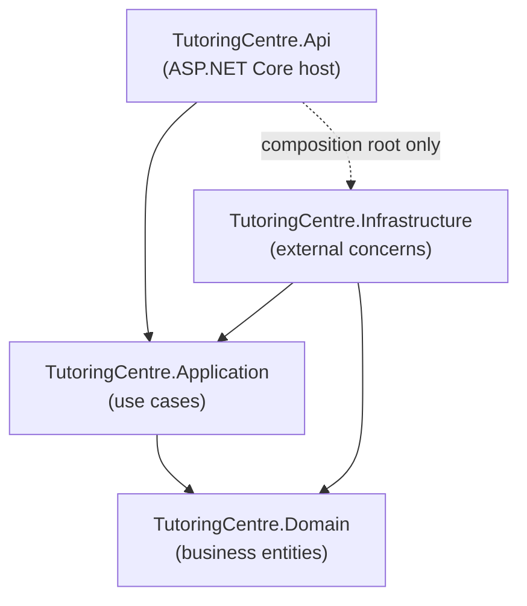
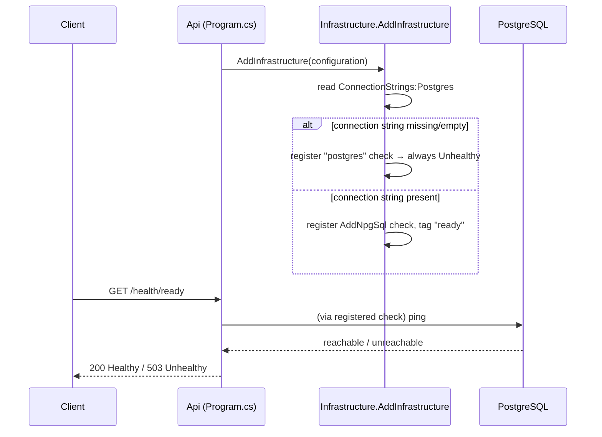

<!-- Generated by semantic-git. Do not edit manually -- regenerate with /semantic-git -->

# Architecture

The system follows Clean Architecture: four projects arranged in concentric layers, with dependencies allowed to point in only one direction — inward, toward `Domain`. This is detailed in `docs/adr/0001-clean-architecture.md`; this document shows the current, as-built shape of it.

## Why this shape

Three different front doors are expected to eventually call the same business logic: a staff web app, a WhatsApp assistant, and background jobs. If business rules lived inside a controller or a chat handler, each front door would need to reimplement (and could drift from) the same rules. Pulling that logic into `Domain`/`Application`, with no dependency on how a request arrives, lets every front door share one implementation. It also makes business rules testable without a database or an HTTP server.

## The four projects

- **Domain** — business entities and rules. Depends on nothing. Currently empty (no business features implemented yet).
- **Application** — use cases that orchestrate Domain objects. Depends only on Domain. Currently empty.
- **Infrastructure** — implementations of things Application needs but shouldn't know the details of (databases, external services). Depends on Application and Domain because it implements interfaces Application would define (Dependency Inversion Principle). Today, its one real piece of logic is the PostgreSQL readiness health check.
- **Api** — the ASP.NET Core host. This is the composition root: the one place allowed to know about Infrastructure's concrete types, purely to register them at startup (`Program.cs`). That knowledge must never leak into endpoint/controller code — endpoints should only ever talk to Application.

Nothing references Api — it's the outermost layer, the entry point, not a library anything else consumes.

## Why the Api → Infrastructure reference is dashed

`Api` needs to call `AddInfrastructure(...)` once, in `Program.cs`, to wire up Infrastructure's services into the DI container. That's the only legitimate reason for Api to reference Infrastructure. If an endpoint handler directly imported an Infrastructure type (e.g., an `NpgsqlConnection`), that would defeat the purpose of the layering — the whole point is that endpoints depend on Application abstractions, and Infrastructure is swapped in underneath without endpoints knowing.

## Enforcement: fitness functions

The dependency rules above aren't just a diagram — they're checked automatically by `TutoringCentre.Architecture.Tests` on every `dotnet test` run, using two complementary techniques:

1. **Declared-reference check** (`ProjectReferenceTests` + `ProjectFiles` helper) — reads each `.csproj` as XML and asserts the exact allowed `ProjectReference` set. Catches a forbidden reference even if no code in the project actually uses it (the C# compiler silently drops unused references from the compiled assembly, so this is the only check that sees them).
2. **Type-level check** (`DependencyRuleTests`, via the NetArchTest.Rules library) — inspects each layer's compiled IL and fails if any type in it actually uses a forbidden namespace (e.g., `Microsoft.EntityFrameworkCore`, `Npgsql`, `Microsoft.AspNetCore`, or a disallowed sibling project). Catches real usage, not just a reference sitting unused in the project file.

Together, these two tests cover both "what a project declares it can see" and "what a project's code actually touches." See `tests/.semantic.md` for the full breakdown, including which experiments proved each test actually catches what it claims to.

A third guard exists for free: MSBuild itself refuses to restore a solution with a circular project reference (e.g., `Domain → Infrastructure` when `Infrastructure → Application → Domain` already exists), so a reverse reference inside these four projects fails at `dotnet build`/`dotnet restore` before any test even runs.

## Health checks: liveness vs. readiness

The Api exposes two endpoints with different purposes:

- **`GET /health`** (liveness) — always returns `200 Healthy` as long as the process is running. It registers *zero* health checks (`Predicate = _ => false`), deliberately, so a database outage never makes an orchestrator (Kubernetes, etc.) kill a perfectly healthy process just because its database is down.
- **`GET /health/ready`** (readiness) — runs only checks tagged `"ready"`. Right now that's one check: PostgreSQL. Returns `200 Healthy` if Postgres is reachable, `503 Unhealthy` otherwise.

The Postgres check itself is registered inside `Infrastructure.AddInfrastructure(...)`, not in `Api/Program.cs` — this is Dependency Inversion in miniature. The Api only knows "there are health checks, map them to endpoints." Infrastructure is the only project that knows Postgres exists. If the connection string (`ConnectionStrings:Postgres`) is missing or empty, Infrastructure registers a check that always reports `Unhealthy` rather than letting Npgsql throw at startup — a missing database configuration degrades readiness, it never crashes the app.

## Configuration and secrets

- `ConnectionStrings:Postgres` is the one configuration key the app reads for its database. `appsettings.json` declares the key with an empty value (so it's documented and discoverable); the real local value lives in `dotnet user-secrets`, which never gets committed.
- `compose.yaml` provisions a local `postgres:17` container for development. Its credentials come from `.env` (gitignored); `.env.example` is the committed template with a blank password, so `docker compose` refuses to start until a developer picks one.
- NuGet package versions are centralized in `Directory.Packages.props` (Central Package Management) — every `.csproj`'s `PackageReference` is versionless. One file controls every package version across all nine projects.

## Technology choices

- **.NET 10**, pinned via `global.json` so CI and every developer machine build against the identical SDK line.
- **ASP.NET Core minimal hosting** (no MVC/controllers yet — just `Program.cs` and `MapHealthChecks`).
- **xUnit** for all test projects, chosen as the de facto standard .NET test framework.
- **NetArchTest.Rules** for type-level architecture tests (reads compiled IL via Mono.Cecil).
- **AspNetCore.HealthChecks.NpgSql** for the Postgres readiness probe.
- **PostgreSQL 17** as the (eventual) database, run via Docker Compose for local development.
