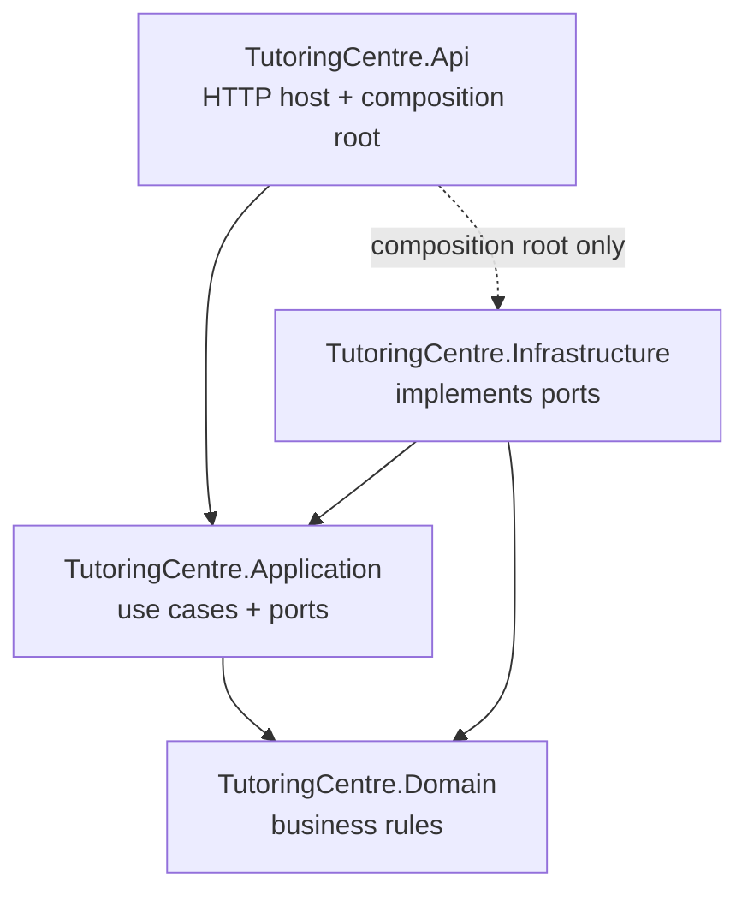

# Tutoring Centre Manager

[](https://github.com/youssef623/tutoring-centre/actions/workflows/ci.yml)

A multi-tenant management platform for Egyptian tutoring centres: students and parents, groups and schedules, attendance (manual and QR), fees and payments, and a WhatsApp assistant that answers parents' questions in Egyptian Arabic and English through the same authorized use cases as the staff web app. Built with ASP.NET Core (.NET 10) using Clean Architecture and a hand-written CQRS pipeline, PostgreSQL, and a React + TypeScript frontend.

## Quick start

### Prerequisites

- .NET 10 SDK (the exact line is pinned in `global.json`)
- Node.js LTS (22.12 or later)
- Docker Desktop (running)
- Git

### Run locally

Run commands from the repository root unless a step says otherwise. Each step shows PowerShell first and bash/zsh second where they differ.

1. **Clone**

   ```bash
   git clone https://github.com/youssef623/tutoring-centre.git
   cd tutoring-centre
   ```

2. **Start PostgreSQL.** Create your local `.env` and set all three passwords in it — `POSTGRES_PASSWORD`,
   `TUTORING_OWNER_PASSWORD` and `TUTORING_APP_PASSWORD` (no `;` or spaces in any of them). On first start,
   `db/bootstrap-roles.sh` uses the latter two to create `tutoring_owner` (migrates) and `tutoring_app`
   (the app's own runtime login) — but only against an **empty** database volume. If you already have a
   `tutoring-centre_pgdata` volume from before this step existed, remove it first: `docker compose down -v`
   (see "To reset the database completely" below).

   ```powershell
   Copy-Item .env.example .env      # PowerShell
   ```

   ```bash
   cp .env.example .env             # bash/zsh
   ```

   ```bash
   docker compose up -d
   docker compose ps                # wait for (healthy)
   ```

3. **Give the API its two connection strings** (once per machine; stored outside the repository with
   user-secrets). `Postgres` is the runtime login the app always connects as; `PostgresMigrations` is the
   owner login, used only to apply migrations. Use the passwords you chose in `.env`.

   ```bash
   dotnet user-secrets set "ConnectionStrings:Postgres" "Host=localhost;Port=5432;Database=tutoring;Username=tutoring_app;Password=<TUTORING_APP_PASSWORD>" --project src/TutoringCentre.Api
   dotnet user-secrets set "ConnectionStrings:PostgresMigrations" "Host=localhost;Port=5432;Database=tutoring;Username=tutoring_owner;Password=<TUTORING_OWNER_PASSWORD>" --project src/TutoringCentre.Api
   ```

4. **Run the API** on https://localhost:7197 (HTTPS: the session and antiforgery cookies are `Secure` + `__Host-`,
   which a real browser only stores from an HTTPS origin)

   ```bash
   dotnet dev-certs https --trust   # once per machine
   dotnet run --project src/TutoringCentre.Api --launch-profile https
   ```

   Check: https://localhost:7197/health → `Healthy`; https://localhost:7197/health/ready → `Healthy` when the database is up.

5. **Seed the development database** (once per database; safe to run again — it skips what already exists).
   Choose your own password and set it with user-secrets; it is never written to this repository.

   ```bash
   dotnet user-secrets set "Seed:Password" "<your choice>" --project src/TutoringCentre.Api
   dotnet run --project src/TutoringCentre.Api -- seed
   ```

   This creates two centres and five staff accounts, all sharing the password you just set:

   | Email | Role | Centre(s) |
   |---|---|---|
   | `owner@nile.test` | Owner | Nile Tutoring Centre |
   | `owner@maadi.test` | Owner | Maadi Learning Hub |
   | `teacher@both.test` | Teacher | Nile Tutoring Centre, Maadi Learning Hub |
   | `secretary@nile.test` | Secretary | Nile Tutoring Centre |
   | `inactive@nile.test` | Secretary (inactive membership) | Nile Tutoring Centre |

   Each centre is also seeded with its own subjects — Nile Tutoring Centre gets رياضيات، فيزياء and كيمياء;
   Maadi Learning Hub gets Mathematics and Physics — visible from the app's Subjects page (below) once signed in.

6. **Run the frontend** in a second terminal, then open http://localhost:5173 — signed out, this redirects to
   `/login`; sign in with any seeded email above and the password you chose in step 5. From the sidebar,
   **Subjects** lists, adds, renames, archives and restores a centre's subjects, in Arabic or English, scoped
   to whichever centre is currently selected. An owner also sees **Staff** (add, change role, deactivate,
   reactivate), **Settings** (centre name, default language) and **Audit log** (filterable, infinite-scroll
   history of every change above); a new staff member is forced through a password change on first sign-in.

   ```bash
   cd frontend
   npm ci
   npm run dev
   ```

7. **Run the tests**

   ```bash
   dotnet test
   cd frontend
   npm run test:ci
   ```

   End-to-end journeys (real API, real PostgreSQL, a real Chromium browser) are separate: they start their
   own copies of the API and the frontend, so stop the ones from steps 4/6 first (or leave them running —
   Playwright reuses an already-running server locally). Supply the seed password from step 5 as
   `SEED_PASSWORD`:

   ```powershell
   cd frontend
   $env:SEED_PASSWORD = "<the password you chose in step 5>"
   npm run test:e2e
   ```

   ```bash
   cd frontend
   SEED_PASSWORD="<the password you chose in step 5>" npm run test:e2e
   ```

To reset the database completely: `docker compose down -v` (deletes the `pgdata` volume).

## Architecture

Four projects; source-code dependencies point inward, enforced by architecture tests in CI.



- [ADR 0001 — Clean Architecture with four projects](docs/adr/0001-clean-architecture.md)
- [ADR 0002 — .NET backend and React frontend](docs/adr/0002-dotnet-react.md)
- [ADR 0005 — Encrypted cookie authentication over JWT](docs/adr/0005-cookie-authentication.md)
- [ADR 0006 — Tenant isolation as defense in depth (draft)](docs/adr/0006-tenant-isolation.md)
- [ADR 0007 — Code-defined permissions](docs/adr/0007-code-defined-permissions.md)
- [Authentication: login, sessions, CSRF, revocation](docs/architecture/authentication.md)
- [Tenant isolation: the role model, and layers 1–4 as they land](docs/architecture/tenancy.md)
- [Authorization: the permission matrix, the pipeline step, and what the UI does](docs/architecture/authorization.md)
- [Frontend decisions and conventions](frontend/README.md)

## Quality gates

Every pull request runs: backend build and all tests (including architecture tests), frontend lint, type-check, tests, i18n key-parity check and production build, eight Playwright end-to-end journeys against a real API and PostgreSQL, CodeQL static analysis, and gitleaks secret scanning. Dependabot proposes dependency updates weekly. `main` is protected: nothing merges unless every check is green.
