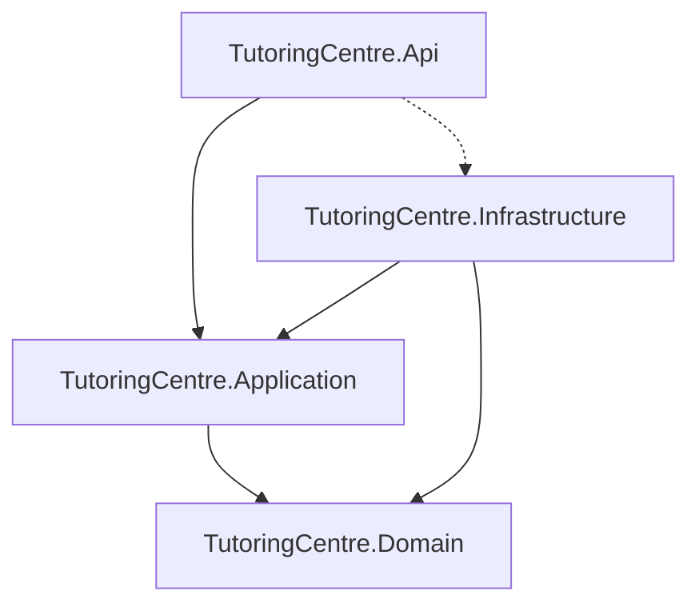

# tutoring-centre

## Architecture

Domain has no dependencies. Application depends only on Domain. Infrastructure implements Application's interfaces (Dependency Inversion Principle), so it depends on Application and Domain. Api references Infrastructure only to register it at startup in the composition root (dashed arrow) — that reference must never leak into endpoint code.