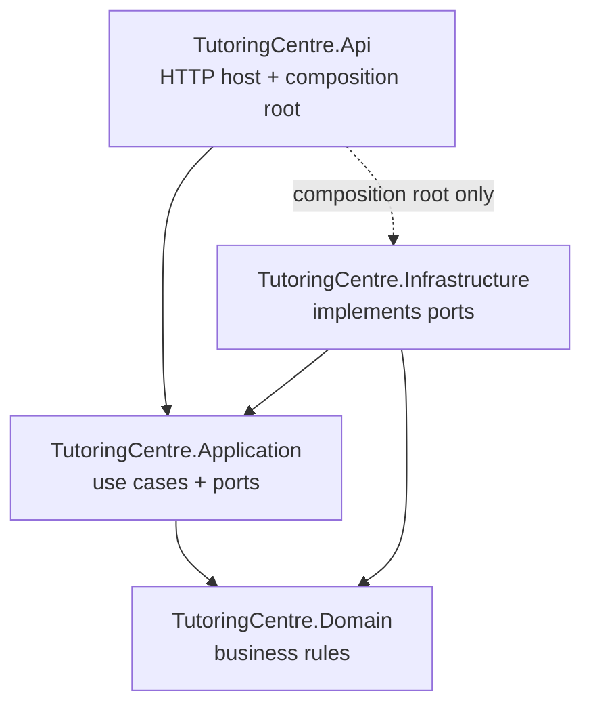

# Tutoring Centre Manager

[](https://github.com/youssef623/tutoring-centre/actions/workflows/ci.yml)

A multi-tenant management platform for Egyptian tutoring centres: students and parents, groups and schedules, attendance (manual and QR), fees and payments, and a WhatsApp assistant that answers parents' questions in Egyptian Arabic and English through the same authorized use cases as the staff web app. Built with ASP.NET Core (.NET 10) using Clean Architecture and a hand-written CQRS pipeline, PostgreSQL, and a React + TypeScript frontend.

## Quick start

### Prerequisites

- .NET 10 SDK (the exact line is pinned in `global.json`)
- Node.js LTS (22.12 or later)
- Docker Desktop (running)
- Git

### Run locally

Run commands from the repository root unless a step says otherwise. Each step shows PowerShell first and bash/zsh second where they differ.

1. **Clone**

   ```bash
   git clone https://github.com/youssef623/tutoring-centre.git
   cd tutoring-centre
   ```

2. **Start PostgreSQL.** Create your local `.env` and set `POSTGRES_PASSWORD` in it (no `;` or spaces).

   ```powershell
   Copy-Item .env.example .env      # PowerShell
   ```

   ```bash
   cp .env.example .env             # bash/zsh
   ```

   ```bash
   docker compose up -d
   docker compose ps                # wait for (healthy)
   ```

3. **Give the API its connection string** (once per machine; stored outside the repository with user-secrets). Use the same password as in `.env`.

   ```bash
   dotnet user-secrets set "ConnectionStrings:Postgres" "Host=localhost;Port=5432;Database=tutoring;Username=tutoring_dev;Password=<your password>" --project src/TutoringCentre.Api
   ```

4. **Run the API** on https://localhost:7197 (HTTPS: the session and antiforgery cookies are `Secure` + `__Host-`,
   which a real browser only stores from an HTTPS origin)

   ```bash
   dotnet dev-certs https --trust   # once per machine
   dotnet run --project src/TutoringCentre.Api --launch-profile https
   ```

   Check: https://localhost:7197/health → `Healthy`; https://localhost:7197/health/ready → `Healthy` when the database is up.

5. **Run the frontend** in a second terminal, then open http://localhost:5173

   ```bash
   cd frontend
   npm ci
   npm run dev
   ```

6. **Run the tests**

   ```bash
   dotnet test
   cd frontend
   npm run test:ci
   ```

To reset the database completely: `docker compose down -v` (deletes the `pgdata` volume).

## Architecture

Four projects; source-code dependencies point inward, enforced by architecture tests in CI.



- [ADR 0001 — Clean Architecture with four projects](docs/adr/0001-clean-architecture.md)
- [ADR 0002 — .NET backend and React frontend](docs/adr/0002-dotnet-react.md)
- [Frontend decisions and conventions](frontend/README.md)

## Quality gates

Every pull request runs: backend build and all tests (including architecture tests), frontend lint, type-check, tests and production build, CodeQL static analysis, and gitleaks secret scanning. Dependabot proposes dependency updates weekly. `main` is protected: nothing merges unless every check is green.
