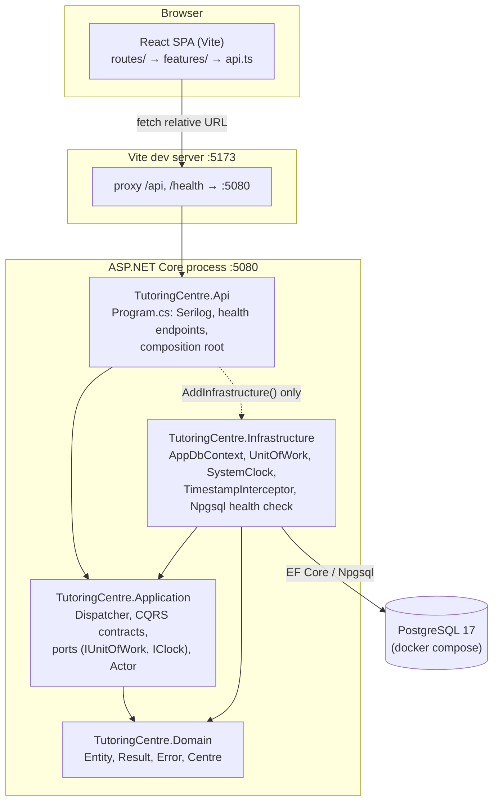
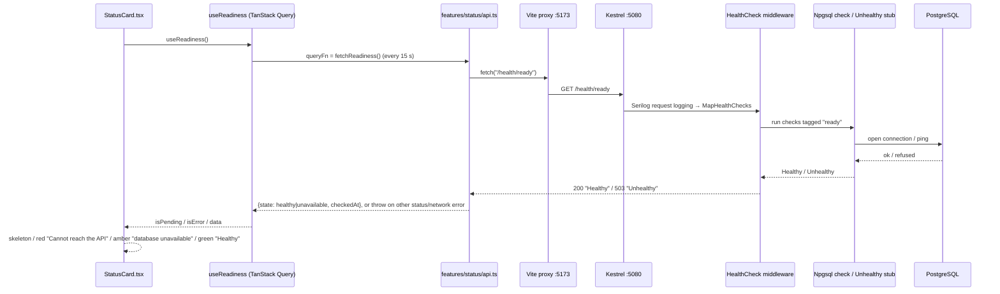

# Tutoring Centre Manager — Project Overview

> Onboarding document. Every claim below comes from a file in the repository (cited as `path:line`) or from a check run against the code on 2026-10-03 (commit `bca5820`, branch `claude-code-session`). Anything not verified is marked **Unverified**.
>
> One explanation per file is in [`docs/file-explanations/INDEX.md`](file-explanations/INDEX.md).

**How this was checked.** Beyond reading every file, the following were run:

| Check | Result |
| --- | --- |
| `npm ci && npm run lint` (frontend) | 0 errors, **2 warnings** (`react-refresh/only-export-components` in `src/routes/__root.tsx:8` and `src/routes/index.tsx:8`) |
| `npm run typecheck` | clean |
| `npm run test:ci` | **9/9 tests pass** (3 files) |
| `npm run build` | succeeds (main JS chunk 361.6 kB, 113.8 kB gzip) |
| `npx prettier --check .` (not part of CI) | **9 files not formatted** (all shadcn files, `src/index.css`, `src/lib/utils.ts`, `src/api/errors.ts`) |
| `dotnet build -c Release` + `dotnet test` | build clean (0 warnings with `TreatWarningsAsErrors`); **43/43 tests pass** (Architecture 7, Domain 19, Application 12, Api 2, Infrastructure 3). Run on SDK 10.0.112 in a scratch copy, because the container could not download the pinned 10.0.401 (`global.json`). |
| Throwaway probe test (deleted afterwards) | See §9 for the four findings it confirmed |

---

## 1. Project overview

### What it is and who it is for

`README.md:5` describes it as *"A multi-tenant management platform for Egyptian tutoring centres: students and parents, groups and schedules, attendance (manual and QR), fees and payments, and a WhatsApp assistant that answers parents' questions in Egyptian Arabic and English through the same authorized use cases as the staff web app."*

Two audiences are named in the docs:

- **Product users.** Staff of tutoring centres, who will use a single-page web app (`docs/adr/0002-dotnet-react.md:8`), and parents, who will reach the system through a WhatsApp assistant (`README.md:5`).
- **The developer's career.** `docs/adr/0001-clean-architecture.md:9` says *"This is a portfolio project aimed at .NET roles, so the architecture itself is part of what's being evaluated"*, and ADR 0002 (`:8`) names *".NET backend roles in Egypt and remote"*. Many choices, such as architecture tests and a hand-written dispatcher, are made partly to demonstrate skill.

**The problem it solves.** One body of business logic has to serve three "front doors": the staff web app, the WhatsApp assistant, and background jobs (`docs/adr/0001-clean-architecture.md:9`). Rules such as *"a payment can't be recorded against a cancelled enrollment"* must not be duplicated across them. That requirement drives the whole architecture.

### Core features and user-facing flows (as built today)

| Flow | Where | Status |
| --- | --- | --- |
| System status page: shows whether the API and database are reachable, polls every 15 s, offers Retry | `frontend/src/routes/index.tsx`, `frontend/src/features/status/*` | **Done** |
| Liveness probe `GET /health` | `src/TutoringCentre.Api/Program.cs:28-31` | **Done** |
| Readiness probe `GET /health/ready` (PostgreSQL ping) | `Program.cs:33-36`, `src/TutoringCentre.Infrastructure/DependencyInjection.cs:30-44` | **Done** |

No business feature is reachable by a user yet. There are no endpoints for centres, students, groups, attendance, payments, login or WhatsApp.

### Current state of completeness

The repo follows a day-by-day plan. Branch names show `m1-d01` through `m1-d07` (git log). Code comments refer to "Day 8", "Day 11", "Day 12", "Day 17", "Week 2", "Month 2", "Month 3" and "Month 6". The latest commits are Day 7–8 work.

| Area | State | Evidence |
| --- | --- | --- |
| Four-project Clean Architecture skeleton + architecture tests | Finished | `TutoringCentre.slnx`, `tests/TutoringCentre.Architecture.Tests/*` |
| Local PostgreSQL via Docker Compose | Finished | `compose.yaml` |
| CI (build/test/lint/typecheck), CodeQL, gitleaks, Dependabot | Finished | `.github/workflows/*`, `.github/dependabot.yml` |
| Domain primitives: `Entity`, `Result`, `Error`, `ErrorKind`, `ITenantOwned` | Finished (no `ITenantOwned` implementer yet) | `src/TutoringCentre.Domain/Common/*` |
| `Centre` aggregate with invariants | Finished in Domain; **not persisted** (no EF mapping, no migration) | `src/TutoringCentre.Domain/Centres/Centre.cs` |
| CQRS contracts + `Dispatcher` (validation, transactions, logging) | Finished and unit-tested; **not called by any endpoint** | `src/TutoringCentre.Application/Common/Cqrs/*` |
| Actor model (`SystemActor`, `AnonymousActor`) + `CurrentActorContext` | Partial: there is no authenticated user actor, and nothing in production calls `Set` | `src/TutoringCentre.Application/Common/Security/*` |
| `IClock` / `SystemClock` | Finished | `Common/Ports/IClock.cs`, `Infrastructure/Time/SystemClock.cs` |
| EF Core `AppDbContext`, `UnitOfWork`, `TimestampInterceptor`, snake_case | Plumbing finished; **model has 0 entity types** (probe-verified); no migrations | `src/TutoringCentre.Infrastructure/Persistence/*` |
| Structured logging (Serilog, compact JSON) | Finished | `Program.cs:10-13,21-26` |
| Global exception handler / Problem Details mapping | **TODO (Day 11)** | comment `Dispatcher.cs:72`; `ErrorKind.cs:4` |
| Generated OpenAPI client | **TODO (Day 12)** | `frontend/src/api/errors.ts:7`, ADR 0002 `:21` |
| i18n (i18next, Arabic/English) | **TODO (Day 17)**; placeholder dictionaries exist | `frontend/src/api/errorMessages.ts:7-8` |
| Tenant isolation, permissions, PostgreSQL RLS | **TODO (Month 2)** | `Dispatcher.cs:49-51`, `docs/architecture/overview.md:42` |
| Idempotency keys | **TODO (Month 6)** | `later.md:8`, `docs/architecture/overview.md:48` |
| Students, groups, schedules, attendance, payments, WhatsApp | **Not started** | only mentioned in `README.md:5` and the ADRs |
| Production deployment (Dockerfile, hosting, same-origin static serving) | **Not started** | no such files; ADR 0002 `:12` describes the plan |

---

## 2. Tech stack

### Languages and runtimes

| Item | Version | Source | Why (from the code/docs) |
| --- | --- | --- | --- |
| C# / .NET SDK | 10.0.401, `rollForward: latestFeature` | `global.json` | ADR 0002: career target plus static typing for money/access-control correctness |
| Target framework | `net10.0` | `Directory.Build.props:4` | set once for every project |
| TypeScript | `~6.0.2` | `frontend/package.json:50` | `strict` mode (`tsconfig.app.json:23`) |
| Node.js | README asks for "LTS (22.12 or later)"; CI uses `lts/*` | `README.md:12`, `ci.yml:51` | Vite toolchain |
| PostgreSQL | `postgres:17` image | `compose.yaml:3` | ADR 0002 `:12` |

### Backend NuGet packages (central versions: `Directory.Packages.props`)

| Package | Version | Used by | Purpose in this code |
| --- | --- | --- | --- |
| `Microsoft.EntityFrameworkCore` | 10.0.12 | Infrastructure | `AppDbContext`, `UnitOfWork`, interceptor |
| `Npgsql.EntityFrameworkCore.PostgreSQL` | 10.0.3 | Infrastructure | `UseNpgsql(...)` (`Infrastructure/DependencyInjection.cs:49`) |
| `EFCore.NamingConventions` | 10.0.1 | Infrastructure | `UseSnakeCaseNamingConvention()` (`:52`) |
| `AspNetCore.HealthChecks.NpgSql` | 9.0.0 | Infrastructure | `AddNpgSql(...)` readiness check (`:43`) |
| `Microsoft.Extensions.Configuration.Abstractions` | 10.0.12 | Infrastructure | `IConfiguration` in `AddInfrastructure` |
| `Microsoft.EntityFrameworkCore.Design` | 10.0.12 | Api (`PrivateAssets=all`) | design-time support for `dotnet-ef` (local tool `.config/dotnet-tools.json`, also 10.0.12) |
| `Serilog.AspNetCore` | 10.0.0 | Api | `UseSerilog`, request logging, compact JSON console |
| `FluentValidation` (+ `.DependencyInjectionExtensions`) | 12.1.1 | Application | request validators; `AddValidatorsFromAssembly` |
| `Microsoft.Extensions.DependencyInjection.Abstractions` | 10.0.12 | Application | `IServiceCollection` in `AddApplication` |
| `Microsoft.Extensions.Logging.Abstractions` | 10.0.12 | Application | `ILogger<Dispatcher>` |
| `Microsoft.Extensions.DependencyInjection` | 10.0.12 | Application.Tests | builds a real `ServiceProvider` in `DispatcherTests` |
| `Microsoft.Extensions.TimeProvider.Testing` | 10.10.0 | Infrastructure.Tests | `FakeTimeProvider` |
| `Microsoft.AspNetCore.Mvc.Testing` | 10.0.12 | Api.Tests | `WebApplicationFactory<Program>` |
| `NetArchTest.Rules` | 1.3.2 | Architecture.Tests | IL-level dependency rules |
| `xunit` 2.9.3, `xunit.runner.visualstudio` 4.0.0, `Microsoft.NET.Test.Sdk` 18.10.1, `coverlet.collector` 10.1.0 | — | all test projects | test framework, runner, coverage collector (no coverage report is produced anywhere) |

### Frontend npm packages (`frontend/package.json`)

| Package | Version range | Role in this code |
| --- | --- | --- |
| `react`, `react-dom` | ^19.2.8 | UI (`main.tsx`) |
| `@tanstack/react-router` + `@tanstack/router-plugin` (dev) | ^1.170.41 / ^1.168.42 | file-based routing; the plugin generates `src/routeTree.gen.ts` (`vite.config.ts:14`) |
| `@tanstack/react-query` | ^5.104.1 | server state (`app/queryClient.ts`, `features/status/useReadiness.ts`) |
| `tailwindcss`, `@tailwindcss/vite` | ^4.3.3 | styling (`index.css:1`, `vite.config.ts:16`) |
| `shadcn` | ^4.21.1 | provides `shadcn/tailwind.css` (`index.css:3`); also the CLI configured by `components.json` |
| `@base-ui/react` | ^1.8.0 | headless primitive under `components/ui/button.tsx` |
| `class-variance-authority` | ^0.7.1 | variant class maps (`button-variants.ts`, `alert.tsx`) |
| `cn` | ^0.4.0 | **shadcn's class merger** ("Drop-in replacement for clsx + tailwind-merge", from its `package.json`); imported directly by every UI component |
| `lucide-react` | ^1.49.0 | toast icons (`sonner.tsx`) |
| `sonner` | ^2.0.8 | toast notifications (`sonner.tsx`, mounted in `__root.tsx:15`) |
| `next-themes` | ^0.4.6 | `useTheme()` in `sonner.tsx` (no `ThemeProvider` is mounted) |
| `tw-animate-css` | ^1.4.0 | animation utilities (`index.css:2`) |
| `@fontsource-variable/geist` | ^5.3.0 | Geist font (`index.css:4,10`) |
| `vite` ^8.3.0, `@vitejs/plugin-react` ^6.1.1 | — | dev server, build, dev proxy |
| `vitest` ^5.0.3, `jsdom` ^30.1.1 | — | test runner + DOM |
| `@testing-library/react` / `dom` / `jest-dom` | ^16.3.3 / ^10.4.2 / ^7.0.1 | component tests and matchers |
| `msw` | ^2.15.0 | network mocking in tests |
| `eslint` ^10.10.0, `typescript-eslint` ^8.69.0, `eslint-plugin-react-hooks` ^7.1.1, `eslint-plugin-react-refresh` ^0.5.6, `@eslint/js`, `globals` | — | linting (`eslint.config.js`) |
| `prettier` ^3.9.9 | — | formatting (`npm run format`; not enforced in CI) |

### Build tools and package managers

- **MSBuild/.NET CLI** with a `.slnx` solution (`TutoringCentre.slnx`), **Central Package Management** (`Directory.Packages.props:3`) and shared properties (`Directory.Build.props`).
- **npm** with lockfile v3 (`frontend/package-lock.json`). CI uses `npm ci` (`ci.yml:56`).
- **Docker Compose** for PostgreSQL only. There is no Dockerfile for the app.

---

## 3. Architecture

### High-level shape

The system is a modular monolith: one ASP.NET Core process plus a React SPA. The backend is split into four Clean Architecture projects with inward-only references (`docs/adr/0001-clean-architecture.md:13-18`). The SPA talks to the API over relative URLs. In development, Vite proxies `/api` and `/health` to `http://localhost:5080` (`frontend/vite.config.ts:9,23-28`).



**Dependency rule** (enforced by `tests/TutoringCentre.Architecture.Tests`):

| Project | May reference projects | Must not use namespaces (IL check) |
| --- | --- | --- |
| Domain | none | `TutoringCentre.Application/.Infrastructure/.Api`, `Microsoft.EntityFrameworkCore`, `Microsoft.AspNetCore`, `Npgsql` |
| Application | Domain | `TutoringCentre.Infrastructure/.Api`, `Microsoft.EntityFrameworkCore`, `Microsoft.AspNetCore`, `Npgsql` |
| Infrastructure | Application, Domain | `TutoringCentre.Api` |
| Api | Application, Infrastructure | *(no IL rule)* |

### Folder-by-folder map

| Folder | Purpose | Connects to |
| --- | --- | --- |
| `/` (root) | solution file, shared MSBuild props, SDK pin, editor rules, Compose file, top-level docs | everything |
| `.config/` | .NET local tool manifest (`dotnet-ef` 10.0.12) | used for future migrations |
| `.github/` | CI, CodeQL, gitleaks, Dependabot | builds `TutoringCentre.slnx` and `frontend/` |
| `docs/adr/` | Architecture Decision Records 0001 (Clean Architecture), 0002 (.NET + React) | rationale for the structure |
| `docs/architecture/` | `overview.md`: results-vs-exceptions rules, dispatcher design | specifies `Result`/`Error`/`Dispatcher` |
| `docs/notes/` | `pipeline-cases.md`: cases C1–C9 for `DispatcherTests` | spec for tests |
| `src/TutoringCentre.Domain/` | business entities/rules; no dependencies | used by all other projects |
| `src/TutoringCentre.Application/` | use-case plumbing: dispatcher, contracts, ports, actor | implemented by Infrastructure, called by Api (future endpoints) |
| `src/TutoringCentre.Infrastructure/` | EF Core, PostgreSQL, clock: adapters for Application ports | registered by Api |
| `src/TutoringCentre.Api/` | HTTP host and composition root | wires Application + Infrastructure |
| `tests/*` | one test project per layer + architecture tests | reference the layer under test |
| `frontend/` | Vite React SPA | calls API via relative URLs |
| `frontend/src/app/` | app-wide singletons (`queryClient`) | `main.tsx` |
| `frontend/src/api/` | shared API error model, error-message translation, Problem Details type guard | future fetch wrapper (Day 12) |
| `frontend/src/features/status/` | the only feature: readiness status card | `routes/index.tsx` |
| `frontend/src/components/ui/` | shadcn/ui components (generated, then lightly used) | features, root layout |
| `frontend/src/routes/` | TanStack file routes (`__root.tsx`, `index.tsx`) | `routeTree.gen.ts`, `main.tsx` |
| `frontend/src/test/` | MSW server, default handlers, render helper, Vitest setup | all frontend tests |
| `frontend/public/` | static assets (Vite-template favicon and icon sprite) | `index.html` |

The per-file map, with one-line purposes, is in [`file-explanations/INDEX.md`](file-explanations/INDEX.md).

### Entry points and startup sequence

**Backend** (`src/TutoringCentre.Api/Program.cs`):

1. `WebApplication.CreateBuilder(args)` (`:8`) loads configuration: `appsettings.json`, then `appsettings.{Environment}.json`, user-secrets in Development (enabled by `UserSecretsId` in `TutoringCentre.Api.csproj:3`), then environment variables and command line. This load order is standard ASP.NET Core behaviour, not repo code.
2. `builder.Host.UseSerilog(...)` (`:10-13`) replaces the logging pipeline. Serilog reads the `Serilog` config section, enriches from `LogContext`, and writes `RenderedCompactJsonFormatter` JSON to the console.
3. `builder.Services.AddHealthChecks()` (`:15`).
4. `AddApplication()` (`Application/DependencyInjection.cs:10-22`) registers scoped `CurrentActorContext` (also exposed as `ICurrentActor`), scans the Application assembly for handlers and validators (`HandlerRegistration.AddCqrsHandlers`), and registers scoped `Dispatcher`.
5. `AddInfrastructure(configuration)` (`Infrastructure/DependencyInjection.cs:21-59`) registers singleton `TimeProvider.System` and `IClock → SystemClock`. It then reads `ConnectionStrings:Postgres`. If the value is blank it adds a check that always reports Unhealthy; otherwise it adds `AddNpgSql`. Finally it registers singleton `TimestampInterceptor`, the `AppDbContext` (Npgsql, migrations history table `platform.__ef_migrations_history`, snake_case, interceptor) and scoped `IUnitOfWork → UnitOfWork`.
6. `builder.Build()` (`:18`).
7. `UseSerilogRequestLogging` (`:21-26`) writes one log line per request: Error for exceptions or status ≥ 500, Verbose for `/health*` (below the configured Information minimum, so dropped), Information otherwise.
8. `MapHealthChecks("/health", Predicate = _ => false)` (`:28-31`) runs zero checks, so it is always Healthy while the process runs.
9. `MapHealthChecks("/health/ready", Predicate = tag "ready")` (`:33-36`).
10. `app.Run()` (`:38`). `public partial class Program;` (`:40`) exists so `WebApplicationFactory<Program>` can see the class.

```mermaid
sequenceDiagram
    participant Host as Program.cs
    participant Cfg as Configuration
    participant AppDI as AddApplication
    participant InfDI as AddInfrastructure
    Host->>Cfg: CreateBuilder(args) (appsettings, user-secrets, env)
    Host->>Host: UseSerilog(ReadFrom.Configuration, compact JSON console)
    Host->>Host: AddHealthChecks()
    Host->>AppDI: AddApplication()
    AppDI->>AppDI: scoped CurrentActorContext + ICurrentActor
    AppDI->>AppDI: AddCqrsHandlers(scan assembly) + validators
    AppDI->>AppDI: scoped Dispatcher
    Host->>InfDI: AddInfrastructure(configuration)
    InfDI->>InfDI: TimeProvider.System, IClock→SystemClock
    InfDI->>Cfg: GetConnectionString("Postgres")
    alt blank
        InfDI->>InfDI: "postgres" check = always Unhealthy
    else present
        InfDI->>InfDI: AddNpgSql(..., tags: ready)
    end
    InfDI->>InfDI: TimestampInterceptor, AddDbContext<AppDbContext>, IUnitOfWork→UnitOfWork
    Host->>Host: Build(); UseSerilogRequestLogging; Map /health, /health/ready; Run()
```

**Frontend** (`frontend/index.html` → `frontend/src/main.tsx`):

1. `index.html:11` loads `/src/main.tsx` as an ES module.
2. `main.tsx:9` runs `createRouter({ routeTree })`, using the tree generated from `src/routes/*` into `routeTree.gen.ts`.
3. `main.tsx:12-16` augments the `Register` interface so links are type-checked.
4. `main.tsx:18-21` finds `#root` or throws.
5. `main.tsx:23-29` renders `<StrictMode><QueryClientProvider client={queryClient}><RouterProvider/></…>`.
6. The root route (`routes/__root.tsx`) renders the layout, an `<Outlet/>` and the `<Toaster richColors/>`. The index route (`routes/index.tsx`) renders "System status" and `<StatusCard/>`.

### Main data flow (the one live flow: readiness)



---

## 4. Concepts and patterns used

| Concept | Plain-language explanation | Where | Why here |
| --- | --- | --- | --- |
| **Clean Architecture** | Code is arranged in rings; inner rings (business rules) know nothing about outer rings (DB, HTTP) | the four `src/` projects; ADR 0001 | Three front doors share one set of rules, and rules stay testable without a DB (ADR 0001 `:9`) |
| **Ports and adapters / Dependency Inversion** | The inner layer defines an interface (port); the outer layer implements it (adapter) | ports `IUnitOfWork`, `IClock` (`Application/Common/Ports`); adapters `UnitOfWork`, `SystemClock` (Infrastructure) | the Dispatcher controls transactions without referencing EF (`UnitOfWork.cs:7-10`); time is testable |
| **Composition root** | The single place that wires concrete implementations together | `Program.cs:16`; one `AddXxx` extension per layer | Api may reference Infrastructure *only* for this (ADR 0001 `:18`) |
| **Dependency injection with lifetimes** | The container builds objects; *scoped* = one per HTTP request/job, *singleton* = one per app | `AddScoped<Dispatcher>`, `AddScoped<IUnitOfWork,…>`, `AddSingleton<IClock,…>` | handlers, DbContext, actor and unit of work must share one request scope (`HandlerRegistration.cs:23`) |
| **CQRS** | Requests are either commands (change state) or queries (read only), handled by different pipelines | `ICommand<T>`, `IQuery<T>`, handlers, `Dispatcher.SendAsync`/`QueryAsync` | queries run in a `READ ONLY` transaction and never save; commands save exactly once (`docs/architecture/overview.md:25-48`) |
| **Mediator / pipeline** | One object receives every request, applies cross-cutting steps (validate, transaction, log), then calls the handler | `Dispatcher` | one place for future tenant/permission checks (`Dispatcher.cs:49-51`) |
| **Assembly scanning registration** | Reflection finds every handler class and registers it automatically | `HandlerRegistration.AddCqrsHandlers` | adding a use case needs no DI edits |
| **Result pattern** | Expected failures are returned as values, not thrown | `Result`, `Result<T>`, `Error`, `ErrorKind` (Domain/Common) | `docs/architecture/overview.md:3-23`: business failures are values; bugs and infrastructure faults are exceptions |
| **Error codes as public contract** | Each failure has a stable `<feature>.<reason>` code the UI translates | `Error.Code`; `frontend/src/api/errorMessages.ts` | `overview.md:19`: renaming a code is a breaking change |
| **Factory method / always-valid entity** | The constructor is private; `Create` validates and returns `Result<Centre>` | `Centre.Create` (`Centre.cs:38-69`) | an invalid `Centre` cannot exist |
| **Unit of Work** | One object owns the transaction and the save for a whole request | `IUnitOfWork`, `UnitOfWork` | a single transaction boundary across modules (`AppDbContext.cs:6`) |
| **EF Core interceptor + shadow properties** | A hook runs before `SaveChanges`; shadow properties exist in the EF model but not on the C# class | `TimestampInterceptor` | Domain entities stay free of persistence fields (`TimestampInterceptor.cs:7-10`) |
| **Ambient scoped context (set-once)** | Identity and tenant live in one scoped object; edge code sets it once, handlers only read | `CurrentActorContext` / `ICurrentActor` | handlers *"never receive identity or tenant from request data"* (`Actor.cs:4-5`) |
| **Fitness functions** | Automated tests that check architecture rules | `DependencyRuleTests`, `ProjectReferenceTests` | rules fail the build instead of relying on code review |
| **Liveness vs readiness** | Liveness answers "is the process alive?"; readiness answers "can it serve, is the DB up?" | `Program.cs:28-36` | an orchestrator should not restart a healthy process because the DB is down (`ARCHITECTURE.semantic.md:53`) |
| **Graceful degradation on missing config** | A missing connection string makes readiness report 503 instead of crashing startup | `Infrastructure/DependencyInjection.cs:33-40` | explicit design choice (comment `:35`) |
| **Structured logging** | Logs are events with named properties, written as JSON | Serilog in `Program.cs`; `Dispatcher.LogOutcome` | the request object is never logged (`Dispatcher.cs:160`) |
| **Central Package Management** | All NuGet versions live in one file | `Directory.Packages.props` | no version drift across 9 projects |
| **Feature folders** | Code is grouped by feature, not by technical type | ADR 0001 `:20` (backend, planned); `frontend/src/features/status/` | keeps one use case's files together |
| **Server-state caching** | The UI treats API data as a cache with keys, staleness and polling | TanStack Query (`queryClient.ts`, `useReadiness.ts`) | no hand-written loading/error state |
| **File-based routing with codegen** | Route files become a typed route tree | `src/routes/*` → `routeTree.gen.ts` via `tanstackRouter` plugin | typed navigation (`main.tsx:11-16`) |
| **Network-level test mocking** | Tests intercept HTTP instead of mocking modules | MSW (`src/test/msw/*`) | `frontend/README.md:41` convention |
| **RFC 9457 Problem Details** | Standard JSON error shape for HTTP APIs | `frontend/src/api/problemDetails.ts` | the API will produce it from Day 11 |
| **Variant classes (CVA)** | Map `variant`/`size` props to Tailwind classes | `button-variants.ts`, `alert.tsx` | shadcn/ui convention |

### State management

- **Backend.** Stateless per request. Per-request state lives in scoped services: `CurrentActorContext`, `AppDbContext` (change tracker), `UnitOfWork._transaction`. The only singletons are `TimeProvider`, `SystemClock` and `TimestampInterceptor`, which are stateless.
- **Frontend.** No client-side store (no Redux/Zustand). Server state lives in TanStack Query with defaults `retry: 1` and `staleTime: 30_000` (`app/queryClient.ts:7-8`). Readiness polls every 15 s (`useReadiness.ts:9`).

### Authentication and authorization

**Not implemented.** What exists is the foundation:

- `Actor` is an abstract record with `CentreId`. `SystemActor(Guid? CentreId)` stands for jobs, seed and CLI. `AnonymousActor` has no centre (`Actor.cs`).
- `CurrentActorContext` starts as `AnonymousActor` and allows exactly one `Set`. A second call throws `InvalidOperationException` (`CurrentActorContext.cs:15-26`).
- The plan, from comments: tenant and permission checks go after validation and before `BeginAsync` in both pipelines (`Dispatcher.cs:49-51,93`). A tenant-scoped request with an actor that has no centre returns `Forbidden(tenant.not_selected)`. PostgreSQL row-level security is set inside the transaction (`docs/architecture/overview.md:42`). Infrastructure filters every `ITenantOwned` entity (`ITenantOwned.cs:4-5`).
- No authentication middleware, no user actor type, and no login endpoint exist yet.

### Routing, middleware and API design

- **Backend routes.** Only `/health` and `/health/ready`, both via `MapHealthChecks`. There are no controllers or minimal-API endpoints. They return plain-text `Healthy`/`Unhealthy` (default health-check writer; contract in `frontend/README.md:28-32`).
- **Middleware.** Only Serilog request logging and the health-check endpoints. There is no exception handler, HTTPS redirection, CORS, authentication or static files.
- **API style (planned).** REST/JSON over the same origin, Problem Details errors, and an OpenAPI-generated client (ADR 0002). `ErrorKind` maps to exactly one HTTP status (`ErrorKind.cs:4`).
- **Frontend routes.** `/` only.

### Async, concurrency, caching, error handling, logging

- **Async.** Everything is `async Task` with `CancellationToken`. On failure, rollback deliberately uses `CancellationToken.None` so a cancelled request still rolls back (`Dispatcher.cs:70-71`, `UnitOfWork.cs:41`).
- **Concurrency.** One transaction per scope. Nested `BeginAsync` throws (`UnitOfWork.cs:24-28`). Comments plan `FOR UPDATE` row locks (`overview.md:42`).
- **Caching.** None on the server. TanStack Query on the client.
- **Error handling.** Expected failures are `Result`. Exceptions roll back and rethrow to a not-yet-built global handler. The frontend separates "the API answered" (503 is data) from "no trustworthy answer" (throw) (`features/status/api.ts:6-10`, `frontend/README.md:39`).
- **Logging.** One Serilog line per request, plus one line per dispatch: `"{RequestKind} {RequestType} completed with {Outcome} ({ErrorCode}) in {ElapsedMs} ms"`, at Information on success and Warning on failure (`Dispatcher.cs:153-169`). Exceptions are not logged by the Dispatcher; that is left to the global handler (`:72`).

### Validation, security and configuration management

- **Validation.** Two levels. (1) FluentValidation validators run in the Dispatcher before any transaction. All validators for a request run, failures are grouped by camelCase property path, messages are deduplicated, and the result is `Error.Validation("validation.failed", …, fields)` (`Dispatcher.cs:109-143`). (2) Domain invariants live in factories (`Centre.Create`).
- **Security.** Secrets live in user-secrets locally (`README.md:42-46`). `.env` is gitignored (`.gitignore:7,487`). gitleaks scans the full history on every PR (`secret-scan.yml`). CodeQL covers C# and JS/TS (`codeql.yml`). Workflows use least-privilege `permissions`. Error codes and messages must never contain internals (`overview.md:23`). The slug regex uses `\z` to reject a trailing newline (`Centre.cs:71`).
- **Configuration.** `appsettings.json` documents the keys with an empty `ConnectionStrings:Postgres` (`:17-19`). Real values come from user-secrets or environment variables. Compose credentials come from `.env` (`compose.yaml:5-7`), and `:?` makes Compose refuse to start without a password.

### Non-trivial logic, step by step

**A. Command pipeline: `Dispatcher.SendAsync`** (`Dispatcher.cs:33-74`)
1. Null-guard the command; take a start timestamp.
2. `ValidateAsync`. On failure: log the outcome and return the failure. No transaction is opened (case C2).
3. Resolve `ICommandHandler<TCommand,TResponse>` from the scope. If none is registered this throws, before any transaction.
4. *(Month 2: tenant/permission checks go here.)*
5. `BeginAsync(readOnly: false)`.
6. Call the handler. If it returns a failure: `RollbackAsync`, log, return it (C3).
7. On success: `SaveChangesAsync`, then `CommitAsync`, log, return (C1).
8. On any exception (handler, save or commit): `RollbackAsync(CancellationToken.None)` and rethrow (C4, C5).

**B. Query pipeline: `Dispatcher.QueryAsync`** (`:77-107`). Same as above, but it begins a read-only transaction, never saves, and **commits even when the handler returns a failure Result**. On an exception it rolls back and rethrows (C6–C8).

**C. Validation aggregation: `ValidateAsync` + `ToCamelCase`** (`:109-143`)
1. Resolve all `IValidator<TRequest>`. If there are none, the request is valid.
2. Run each validator in sequence against one `ValidationContext` and collect all failures.
3. Group by `ToCamelCase(PropertyName)`, which lowercases the first character of each dotted segment (`"Address.Street"` → `"address.street"`). Use ordinal comparison and deduplicate messages per field.
4. Return a single `validation.failed` error carrying the `fields` dictionary (C9).

**D. Read-only transaction: `UnitOfWork.BeginAsync`** (`UnitOfWork.cs:22-45`). Throw if a transaction is already active. Begin an EF transaction. If `readOnly`, execute `SET TRANSACTION READ ONLY` as the first statement, so PostgreSQL rejects writes with SQLSTATE 25006. If that statement fails, roll back and rethrow. `RollbackAsync` clears the field *before* rolling back, disposes the transaction and calls `ChangeTracker.Clear()`. That makes it idempotent and leaves no half-built entities behind.

**E. Centre invariants: `Centre.Create`** (`Centre.cs:38-69`). Checks run in order and the first failure wins:
1. name blank → `centre.name_required`;
2. trimmed name longer than 120 → `centre.name_too_long`;
3. slug null, length outside 3–60, or not matching `^[a-z0-9]+(?:-[a-z0-9]+)*\z` → `centre.slug_invalid`;
4. time zone blank or not found by `TimeZoneInfo.TryFindSystemTimeZoneById` → `centre.time_zone_invalid`.

On success it builds a `Centre` with the trimmed name; `Entity`'s constructor assigns a UUIDv7.

**F. Local-time conversion: `SystemClock.FromLocal`** (`SystemClock.cs:24-30`). Find the zone. Mark the `DateTime` as `Unspecified`. Get the zone's UTC offset for that wall-clock time. Build a `DateTimeOffset` and convert it to UTC. Probe-verified edge cases: a non-existent time in the DST gap (2027-04-30 00:30 Cairo) maps to 22:30Z and round-trips back to **01:30**, not 00:30. An ambiguous time in the DST overlap (2027-10-28 23:30) resolves to the *standard* offset (+2), so it lands on the second occurrence.

**G. Repo-root discovery: `ProjectFiles.FindRepositoryRoot`** (`tests/.../ProjectFiles.cs:26-36`). Walk up from `AppContext.BaseDirectory` until a folder contains `TutoringCentre.slnx`. Throw if none is found.

**H. Error-message fallback: `messageFor`** (`frontend/src/api/errorMessages.ts:52-54`). Try `byCode[lang][code]`, then `byKind[lang][kind]`, then `generic[lang]`.

---

## 5. Data layer

- **Database:** PostgreSQL 17 in Docker (`compose.yaml`). Data persists in the named volume `pgdata`. `docker compose down -v` resets it (`README.md:72`).
- **ORM:** EF Core 10 + Npgsql. A single `AppDbContext` serves *"one transaction boundary across all modules"* (`AppDbContext.cs:6`).
- **Conventions:**
  - snake_case table and column names (`UseSnakeCaseNamingConvention`, `Infrastructure/DependencyInjection.cs:52`).
  - One PostgreSQL schema per module: `Schemas.Platform = "platform"`, `Schemas.Identity = "identity"` (`Schemas.cs`). `Identity` is not referenced anywhere yet.
  - Migrations history in `platform.__ef_migrations_history` (`:51`).
  - No `DbSet` properties. Repositories will use `Set<T>()` (`AppDbContext.cs:8`).
  - Mapping lives in `IEntityTypeConfiguration` classes, picked up with `ApplyConfigurationsFromAssembly` (`:15`).
  - Ids are UUIDv7 created in the application (`Entity.cs:6`). They are time-ordered, which suits B-tree indexes.
  - `CreatedAt`/`UpdatedAt` are shadow properties stamped by `TimestampInterceptor` when an entity configuration declares them.
- **Schema, models, relationships, indexes:** **none in the database yet.** There are no `IEntityTypeConfiguration` classes. The probe showed `Model.GetEntityTypes().Count() == 0`, and EF logs warning 10632 *"No instantiatable types implementing IEntityTypeConfiguration were found"*. The only domain entity is `Centre` (`Id`, `Name` ≤120, `Slug` 3–60, `TimeZoneId`, `DefaultLocale` ∈ {`Ar`,`En`}). `docs/architecture/overview.md:11` plans a uniqueness conflict on slug for Day 9, which implies a unique index; **not built**.
- **Migrations:** none. The `dotnet-ef` tool is pinned (`.config/dotnet-tools.json`), and `Microsoft.EntityFrameworkCore.Design` is referenced by the Api project as the startup project.
- **Seeding:** none. `SystemActor`'s doc comment mentions "the seed command" (`Actor.cs:13`); it does not exist yet.
- **Database → UI today:** the only path is the readiness check. The `AddNpgSql` check opens a connection; health middleware returns plain text; `fetchReadiness` maps the status code; `StatusCard` renders it.
- **Database → API (designed):** endpoint → `Dispatcher` → `BeginAsync` (EF transaction, `READ ONLY` for queries) → handler (repository via `Set<T>()`) → `SaveChangesAsync` (interceptor stamps timestamps) → `CommitAsync` → `Result<T>` → HTTP mapping (Day 11).

---

## 6. Detailed code walkthroughs

### 6.1 Readiness check, end to end (the live flow)

1. **Browser.** `routes/index.tsx` (`IndexPage`) renders `StatusCard` (`features/status/StatusCard.tsx:7`).
2. `StatusCard` calls `useReadiness()` (`useReadiness.ts:5-11`), which is `useQuery({ queryKey: ["health","ready"], queryFn: fetchReadiness, refetchInterval: 15_000 })`. The `QueryClient` comes from `main.tsx:25` (`app/queryClient.ts`).
3. `fetchReadiness()` (`features/status/api.ts:11-23`) runs `fetch("/health/ready")` against the relative Vite origin.
4. **Vite dev proxy** (`vite.config.ts:24-27`) forwards `/health` to `http://localhost:5080`.
5. **Kestrel** on port 5080 (`launchSettings.json:8`) passes the request to the Serilog request-logging middleware (`Program.cs:21-26`), which will log it at Verbose (dropped) because the path starts with `/health`.
6. The **health-check endpoint** (`Program.cs:33-36`) runs registrations tagged `"ready"`. There is one, named `"postgres"`, registered in `Infrastructure/DependencyInjection.cs:33-44`. It is either the real `AddNpgSql` check or the always-Unhealthy stub.
7. The response is `200 Healthy` or `503 Unhealthy`.
8. Back in `fetchReadiness`: 200 → `{state:"healthy"}`, 503 → `{state:"unavailable"}`, anything else → `throw`. A network failure also throws, from `fetch`.
9. TanStack Query retries once (`queryClient.ts:7`) and then exposes `isError`.
10. `StatusCard` branches (`:14-64`):
    - `isPending` → skeleton with `role="status"`;
    - `isError` → destructive Alert "Cannot reach the API" with Retry;
    - `unavailable` → amber Alert with Retry;
    - otherwise → green Card with "Last checked at …".
    Retry calls `readiness.refetch()`.

### 6.2 A command through the Dispatcher (exercised only by tests today)

No endpoint dispatches anything yet, so this trace follows `DispatcherTests.SendAsync_ValidCommandHandlerSucceeds_BeginsHandlesSavesAndCommits` (`tests/TutoringCentre.Application.Tests/Cqrs/DispatcherTests.cs:14-26`):

1. `CreateSut()` (`:126-140`) builds a `ServiceCollection` with `FakeUnitOfWork`, `HandlerBehaviour`, `TestCommandHandler`, `TestQueryHandler` and the two validators (`TestRequests.cs`), then constructs `Dispatcher(provider, unitOfWork, NullLogger)`.
2. `SendAsync<TestCommand,string>(new TestCommand("Nile","nile"))` reaches `Dispatcher.cs:33`.
3. `ValidateAsync` resolves `TestCommandValidator` (`TestRequests.cs:30-38`). Name and slug are valid, so it returns null.
4. It resolves `TestCommandHandler`, then calls `FakeUnitOfWork.BeginAsync(false)`, which records `"Begin(rw)"`.
5. `TestCommandHandler.HandleAsync` records `"Handle"` and returns `Success("Nile")`.
6. `SaveChangesAsync` records `"Save"`. `CommitAsync` records `"Commit"`. `LogOutcome` writes to `NullLogger`.
7. The test asserts the recorded sequence `["Begin(rw)","Handle","Save","Commit"]`, which is case C1 in `docs/notes/pipeline-cases.md:7`.

In production the same path would use `UnitOfWork` (`BeginTransactionAsync`, `SaveChangesAsync`, which triggers `TimestampInterceptor.SavingChangesAsync`, then `transaction.CommitAsync`).

### 6.3 Creating a Centre in the domain

`Centre.Create("  Nour Academy  ", "nour-academy", "Africa/Cairo", SupportedLocale.Ar)`:
1. The name is not blank; it trims to `"Nour Academy"` (12 chars ≤ 120).
2. The slug length is 12, within 3–60, and `SlugPattern()` matches. The pattern is a source-generated regex (`[GeneratedRegex]`, `Centre.cs:72-73`).
3. `TryFindSystemTimeZoneById("Africa/Cairo")` succeeds.
4. The private constructor runs. `Entity()` sets `Id = Guid.CreateVersion7()`. The method returns `Result<Centre>.Success(...)`.

Verified by `CentreTests.Create_WithValidInput_SucceedsAndTrimsName` (`tests/.../CentreTests.cs:13-26`).

### 6.4 Turning an API error into user text (frontend, prepared for Day 12)

`ApiError { kind, code, message, status, fieldErrors?, correlationId? }` (`api/errors.ts`) goes to `messageFor(error, lang)` (`api/errorMessages.ts:52`). It returns the code-specific text, else the kind text, else the generic text. `isProblemDetails` (`api/problemDetails.ts:17`) guards raw JSON. **No code calls these yet** apart from their tests.

---

## 7. Configuration, environment and deployment

### Environment variables and settings

| Name | Where set | Read by | Meaning |
| --- | --- | --- | --- |
| `POSTGRES_DB` | `.env` (template `.env.example:3` = `tutoring`) | `compose.yaml:5,13` | database created by the container; used by the healthcheck |
| `POSTGRES_USER` | `.env` (`tutoring_dev`) | `compose.yaml:6,13` | DB superuser created by the image |
| `POSTGRES_PASSWORD` | `.env` (blank in template) | `compose.yaml:7` | required; `${…:?…}` aborts Compose if unset. README asks for no `;` or spaces (they would break the connection string) |
| `ConnectionStrings:Postgres` | user-secrets (README step 3); empty in `appsettings.json:18`; can also be given as env var `ConnectionStrings__Postgres` (standard ASP.NET convention, not repo code) | `Infrastructure/DependencyInjection.cs:30` | Npgsql connection string for EF and the health check. Blank means readiness reports 503, and any DB use throws `InvalidOperationException: The ConnectionString property has not been initialized` (probe-verified) |
| `ASPNETCORE_ENVIRONMENT` | `launchSettings.json:10,19` = `Development` | ASP.NET host | turns on user-secrets loading and `appsettings.Development.json` |
| `Serilog:MinimumLevel` | `appsettings.json:8-15` | `ReadFrom.Configuration` (`Program.cs:11`) | Information by default, Warning for `Microsoft.AspNetCore` |
| `Logging:LogLevel` | `appsettings*.json` | **ignored in practice**: Serilog replaces the default logging providers | left over from the template |
| `AllowedHosts` | `appsettings.json:16` = `*` | host filtering | accepts any Host header |
| `GITHUB_TOKEN` | GitHub Actions secret | `secret-scan.yml:27` | lets gitleaks comment on PRs |

Frontend: no env vars. The API target `http://localhost:5080` is hard-coded in `vite.config.ts:9`.

### Install, run, test, build (from `README.md:16-72`)

```bash
cp .env.example .env            # set POSTGRES_PASSWORD
docker compose up -d && docker compose ps          # wait for (healthy)
dotnet user-secrets set "ConnectionStrings:Postgres" "Host=localhost;Port=5432;Database=tutoring;Username=tutoring_dev;Password=<pw>" --project src/TutoringCentre.Api
dotnet run --project src/TutoringCentre.Api --launch-profile http   # http://localhost:5080
cd frontend && npm ci && npm run dev                                # http://localhost:5173
dotnet test                     # backend
npm run test:ci                 # frontend (also: lint, typecheck, build)
```

### Docker, CI/CD, infrastructure

- **`compose.yaml`.** A single `postgres:17` service on port `5432:5432` with the named volume `pgdata` and a `pg_isready` healthcheck (5 s interval, 5 retries).
- **`.github/workflows/ci.yml`.** Runs on every PR and on pushes to `main`. A concurrency group cancels superseded runs. Two jobs:
  - `backend`: setup-dotnet from `global.json` → restore → build Release → test.
  - `frontend`: Node `lts/*` with npm cache → `npm ci` → lint → typecheck → `test:ci` → build.
- **`codeql.yml`.** C# (manual build) and JS/TS (no build), on PRs, pushes to `main`, and weekly on Monday at 03:27 UTC.
- **`secret-scan.yml`.** gitleaks over the full history.
- **`dependabot.yml`.** Weekly updates for NuGet, npm (`/frontend`) and GitHub Actions. Minor and patch updates are grouped per ecosystem.
- **Deployment:** **none.** There is no Dockerfile, no hosting config and no release workflow. ADR 0002 `:12` plans to serve the SPA *"from the same origin as the API in production"*; `Program.cs` has no static-file middleware yet. `README.md:98` says `main` is protected. That is a GitHub setting, **unverifiable** from the repo.

---

## 8. Testing

| Suite | Framework | Tests | What is covered |
| --- | --- | --- | --- |
| `TutoringCentre.Domain.Tests` | xUnit | 19 | `Centre.Create` (valid, trimming, every invalid input, 120/121 boundary, whitespace name), `Entity` ids (distinct, version 7), `Error.Validation` with and without fields, `Result` (success, failure, `Value` on failure throws, null error throws) |
| `TutoringCentre.Application.Tests` | xUnit + real MS DI | 12 | Dispatcher cases C1–C9 using `FakeUnitOfWork` call recording; `CurrentActorContext` (default anonymous, set, set-twice throws) |
| `TutoringCentre.Infrastructure.Tests` | xUnit + `FakeTimeProvider` | 3 | `SystemClock.UtcNow`, Cairo winter (+2) and summer (+3) conversions with round-trip |
| `TutoringCentre.Api.Tests` | xUnit + `WebApplicationFactory` | 2 | `/health` → 200; `/health/ready` with an unreachable DB (`127.0.0.1:1`) → 503 |
| `TutoringCentre.Architecture.Tests` | xUnit + NetArchTest + XML | 7 | 3 IL dependency rules + 4 exact `ProjectReference` sets |
| Frontend (`vitest`, jsdom, Testing Library, MSW) | Vitest 5 | 9 | `StatusCard` healthy/503/retry; `messageFor` code, kind and generic fallbacks; `isProblemDetails` valid, string, missing status |

**Structure.** Test projects mirror `src/` one to one. Test names follow `Method_Condition_Result` (CA1707 is disabled only under `tests/**`, `.editorconfig:31-34`). Bodies use Arrange/Act/Assert comments. Frontend tests sit next to their code. `src/test/setup.ts` fails any request that has no MSW handler.

**Not covered:**
- `UnitOfWork` against a real PostgreSQL, including the `READ ONLY` behaviour.
- `TimestampInterceptor`.
- `HandlerRegistration` scanning.
- `AddInfrastructure`'s two branches individually. Only the unreachable branch is covered, through the Api test.
- The readiness *success* path (it needs a DB).
- `Dispatcher` logging output.
- DST gap and overlap behaviour of `SystemClock`.
- The UI components in isolation.
- The "Cannot reach the API" branch of `StatusCard`.

There are no integration tests with a real DB (`Infrastructure.Tests` is meant for them per the old `tests/.semantic.md:11`), no E2E tests, and no coverage report, even though `coverlet.collector` is referenced.

---

## 9. Quality assessment

### Strengths

- **Architecture is executable.** Two complementary fitness-function techniques (IL and `.csproj`) plus MSBuild's cycle detection. `Assert.NotEmpty(types.GetTypes())` guards against a vacuous pass (`DependencyRuleTests.cs:53-54`).
- **Clear, written failure model** (`docs/architecture/overview.md`), applied consistently in `Result`/`Error` and mirrored on the frontend (`errors.ts`).
- **Spec-first tests.** `docs/notes/pipeline-cases.md` lists C1–C9 and `DispatcherTests` implements exactly those.
- **Strict compilation.** `TreatWarningsAsErrors`, `AnalysisLevel latest-recommended`, nullable on. Every analyzer suppression carries a written justification.
- **Careful transaction semantics.** Validation before BEGIN, a `READ ONLY` transaction for queries, rollback with `CancellationToken.None`, idempotent rollback that clears the change tracker.
- **Secrets hygiene.** user-secrets, gitignored `.env`, Compose refuses a blank password, gitleaks and CodeQL in CI, least-privilege workflow permissions.
- **Frontend discipline.** Strict TS with `noUncheckedIndexedAccess`, type-aware ESLint (`strictTypeChecked`), MSW network mocking, and every query state rendered.
- **Small, well-commented code.** Comments explain *why* (e.g. `\z` vs `$` at `Centre.cs:71`, the static array at `Infrastructure/DependencyInjection.cs:18`).

### Bugs, risks, smells and debt (verified)

| # | Severity | Finding | Evidence |
| --- | --- | --- | --- |
| 1 | High (onboarding) | **`*.semantic.md` docs are stale.** They were generated at commit `42bdfc1`, 31 commits before HEAD. They claim Domain/Application are empty, the frontend is "not scaffolded", and there are "9 tests total"; all wrong now. Their header says not to edit them manually | `.semantic-manifest.json:3`, `OVERVIEW.semantic.md:7,37`, `tests/.semantic.md:15` |
| 2 | Medium | **Rollback can mask the original exception.** In the `catch` blocks, if `RollbackAsync` throws (e.g. connection dropped), that exception replaces the handler/save exception | `Dispatcher.cs:68-73,102-106` |
| 3 | Medium | **Missing connection string only fails at first DB use.** `AddDbContext` is configured with a null/empty string; DI resolves, then `BeginAsync` throws `InvalidOperationException` (probe-verified). This is deliberate for readiness, but once endpoints exist it becomes a 500 per request. The old docs mention planned startup validation | `Infrastructure/DependencyInjection.cs:48-53`; `src/.semantic.md:61` |
| 4 | Medium | **DST edge cases silently shift times.** A non-existent local time (DST gap) maps to a different wall-clock time on round-trip; an ambiguous time picks the standard offset. This matters for schedules and attendance in Cairo, which observes DST | probe; `SystemClock.cs:24-30` |
| 5 | Low–Medium | **`Centre.TimeZoneId` accepts Windows ids** (`"Egypt Standard Time"` passes on Linux) although it is documented as IANA. Stored values could be inconsistent | probe; `Centre.cs:33,62` |
| 6 | Low | Dispatcher needs both generic arguments spelled out (`SendAsync<TCommand,TResponse>`), because C# cannot infer `TResponse` from the constraint. This makes call sites verbose | `Dispatcher.cs:33,77`; every test call |
| 7 | Low | `HandlerRegistration` does not detect two handlers for the same request type; the last registration wins silently in `GetRequiredService`. It uses `assembly.GetTypes()`, which can throw `ReflectionTypeLoadException` | `HandlerRegistration.cs:15-26` |
| 8 | Low | After a failed `CommitAsync`, `_transaction` is nulled in `finally`, so the Dispatcher's rollback is a no-op and the change tracker is **not** cleared | `UnitOfWork.cs:49-61,63-69` |
| 9 | Low | Defined-but-unused production code: `Schemas.Identity`, `ITenantOwned`, `Unit`, `TimestampInterceptor` (no entity has the shadow properties), `CurrentActorContext.Set` (never called outside tests), `Dispatcher` (no endpoint). These are planned for later days, not dead by accident | grep results |
| 10 | Low | Frontend leftovers: `public/icons.svg` (Vite-template social icons, unreferenced), Vite favicon, `<title>frontend</title>`, `src/lib/utils.ts` (re-exports `cn`; nothing imports it), Vite boilerplate sections in `frontend/README.md:45-117` | grep; `index.html:7` |
| 11 | Low | **RTL convention violated by shadcn components:** `text-left`, `right-2`, `pr-*`, `pl-*` in `alert.tsx:6,69` and `button-variants.ts:21-24`; `components.json:14` has `"rtl": false`. `index.html` has `lang="en"` and no `dir` | `frontend/README.md:13,40` |
| 12 | Low | Lint prints 2 `react-refresh/only-export-components` warnings in route files despite the override intended for them | `eslint.config.js:28-35`; lint run |
| 13 | Low | Prettier config not enforced: 9 files are unformatted and CI has no `prettier --check` | prettier run; `ci.yml` |
| 14 | Low | `sonner.tsx` uses `next-themes`' `useTheme` but no `ThemeProvider` is mounted, so theme is always `"system"` | `sonner.tsx:6`; `__root.tsx` |
| 15 | Low | `fetchReadiness` ignores the `AbortSignal` TanStack Query provides, so in-flight polls are not cancelled on unmount | `features/status/api.ts:11-12` |
| 16 | Low | `appsettings*.json` `Logging` sections are inert under Serilog, so log levels are configured in two places | `appsettings.json:2-7`, `Program.cs:10-13` |
| 17 | Low | Compose publishes `5432:5432` on all interfaces; on a shared network the dev DB is reachable by others | `compose.yaml:8-9` |
| 18 | Low | `AspNetCore.HealthChecks.NpgSql` 9.0.0 on .NET 10; works (tests pass) but trails the framework major | `Directory.Packages.props:9` |
| 19 | Info | Frontend `ErrorKind` uses camelCase (`notFound`) while the backend enum is PascalCase (`NotFound`); the mapping is not built yet (Day 11/12) | `errors.ts:5`, `ErrorKind.cs` |
| 20 | Info | `Directory.Packages.props:5-7` has an empty `ItemGroup` with a leftover comment | — |
| 21 | Info | Architecture tests do not stop *Api endpoint code* from using Infrastructure types; only the composition-root convention does. Already acknowledged in `src/.semantic.md:60` | `DependencyRuleTests.cs` |
| 22 | Info | `launchSettings.json` `https` profile uses ports 7197/5245, which do not match the Vite proxy target (5080) | `launchSettings.json:17`, `vite.config.ts:9` |
| 23 | Info | CI uses Node `lts/*` while README asks for ≥22.12; the version floats | `ci.yml:51`, `README.md:12` |

### Prioritized suggestions

1. **Regenerate or delete the `*.semantic.md` files** (or add a CI check that the manifest commit is recent). New readers currently get wrong information.
2. **Harden Dispatcher rollback.** Wrap `RollbackAsync` in its own try/catch that logs and swallows, so the original exception propagates. Add a test where both the handler and the rollback throw.
3. **Add real-PostgreSQL integration tests** (e.g. Testcontainers) for `UnitOfWork` (`READ ONLY` rejects writes; rollback clears the tracker), `TimestampInterceptor` and readiness success, before building on this plumbing.
4. **Decide DST policy** in `IClock.FromLocal`: reject or shift invalid times explicitly, document ambiguous-time resolution, and test it. Normalize `TimeZoneId` to IANA (e.g. `TimeZoneInfo.TryConvertWindowsIdToIanaId`) or reject Windows ids.
5. **Validate configuration at startup for non-health use** (e.g. `ValidateOnStart` options), keeping the readiness-degradation behaviour, before the first endpoint ships.
6. Add a non-generic convenience overload or a typed-request API so `TResponse` is inferred. Fail fast on duplicate handler registrations.
7. Frontend clean-up: switch shadcn components to logical classes (`components.json` `"rtl": true` and re-add them), set `<html lang dir>`, remove Vite leftovers, add `prettier --check` to CI, fix the react-refresh warnings, pass `signal` to `fetch`.
8. Pin the CI Node version to match the README, bind Compose to `127.0.0.1:5432:5432`, and remove the inert `Logging` sections.

---

## 10. Glossary and learning path

### Glossary

| Term | Meaning in this project |
| --- | --- |
| **Centre** | A tutoring centre. It is *the tenant* (`Centre.cs:6`) |
| **Tenant / multi-tenant** | Each centre's data is isolated; enforcement is planned for Month 2 (`ITenantOwned`, RLS) |
| **Slug** | URL-safe centre identifier, 3–60 chars, lowercase/digits/single hyphens; the frontend calls it the "web address" (`errorMessages.ts:14-15`) |
| **SupportedLocale** | `Ar` or `En`; the centre's default language for receipts and parent messages |
| **Actor** | Who executes a use case and in which centre. `SystemActor` = jobs/seed/CLI; `AnonymousActor` = no caller |
| **Command / Query** | CQRS request that changes state / only reads |
| **Handler** | The single class that executes one command or query |
| **Dispatcher** | The pipeline every use case goes through (validate → transaction → handler → save/commit → log) |
| **Port / Adapter** | Interface defined in Application / implementation in Infrastructure |
| **Unit of Work** | The transaction-plus-save abstraction (`IUnitOfWork`) |
| **Result / Error / ErrorKind** | Value-based failure model; `Error.Code` is `<feature>.<reason>`; kinds: Validation, NotFound, Conflict, Rule, Forbidden |
| **`validation.failed`** | The Dispatcher's aggregate validation error code; `Fields` carries per-field messages |
| **`Unit`** | "No data" response type for commands |
| **Liveness / Readiness** | `/health` (process alive) / `/health/ready` (dependencies reachable) |
| **Composition root** | `Program.cs`, the one place concrete types are wired |
| **Fitness function** | A test that enforces architecture |
| **AssemblyMarker** | Empty internal class per project so tests can get `typeof(AssemblyMarker).Assembly` |
| **ADR** | Architecture Decision Record (`docs/adr/`) |
| **Day N / Week N / Month N** | Slices of the developer's 8-month build plan referenced in comments |
| **RLS** | PostgreSQL Row-Level Security, planned for tenant isolation |
| **UUIDv7** | Time-ordered GUID (`Guid.CreateVersion7()`) |
| **IANA time zone** | e.g. `Africa/Cairo`; the format expected for `TimeZoneId` |
| **Shadow property** | EF Core column with no C# property (`CreatedAt`, `UpdatedAt`) |
| **Problem Details** | RFC 9457 JSON error format the API will return |
| **MSW** | Mock Service Worker, which intercepts HTTP in tests |
| **CPM** | Central Package Management (`Directory.Packages.props`) |
| **shadcn/ui** | Copy-in component collection (`components/ui/`), here using `base-nova` style on Base UI |
| **semantic-git** | Tool that generated the (stale) `*.semantic.md` docs |
| **QR attendance / WhatsApp assistant** | Planned product features (`README.md:5`) |

### Recommended reading order

1. `README.md` → `docs/adr/0001-clean-architecture.md` → `docs/adr/0002-dotnet-react.md`
2. `docs/architecture/overview.md` (failure model + dispatcher design) → `docs/notes/pipeline-cases.md`
3. `Directory.Build.props`, `Directory.Packages.props`, `TutoringCentre.slnx`, `global.json`
4. Domain: `Common/Result.cs`, `Common/Error.cs`, `Common/ErrorKind.cs`, `Common/Entity.cs`, `Centres/Centre.cs`
5. Application: `Common/Cqrs/ICommand.cs` … `Dispatcher.cs`, `HandlerRegistration.cs`, `Common/Ports/*`, `Common/Security/*`, `DependencyInjection.cs`
6. Infrastructure: `DependencyInjection.cs`, `Persistence/UnitOfWork.cs`, `AppDbContext.cs`, `Interceptors/TimestampInterceptor.cs`, `Time/SystemClock.cs`
7. Api: `Program.cs`, `appsettings.json`, `Properties/launchSettings.json`
8. Tests: `Architecture.Tests/*`, then `Application.Tests/Cqrs/*`, then the rest
9. Frontend: `frontend/README.md`, `vite.config.ts`, `src/main.tsx`, `src/routes/*`, `src/features/status/*`, `src/api/*`, `src/test/*`
10. CI: `.github/workflows/ci.yml`, then the others
11. Skim `*.semantic.md` last, knowing they describe the Day 2 state.

### What to study

- **C#/.NET:** nullable reference types, records, primary constructors, `async`/`await` and `CancellationToken`, source-generated regex, `TimeZoneInfo`/`TimeProvider`.
- **ASP.NET Core:** hosting model, configuration providers and user-secrets, DI lifetimes, middleware, health checks, `WebApplicationFactory`.
- **EF Core:** `DbContext`, transactions, `IEntityTypeConfiguration`, shadow properties, interceptors, migrations with `dotnet-ef`, Npgsql specifics (snake_case, schemas).
- **PostgreSQL:** transactions and `READ ONLY`, `SELECT … FOR UPDATE`, Row-Level Security.
- **Architecture:** Clean Architecture, ports and adapters, CQRS, mediator, Result pattern, unit of work, multi-tenancy patterns.
- **Libraries:** FluentValidation, Serilog (structured logging, compact JSON), NetArchTest, xUnit.
- **Frontend:** React 19, TypeScript strict mode, TanStack Router (file routes, codegen) and Query (keys, staleness, refetch), Tailwind v4 (`@theme`, logical properties, RTL), shadcn/ui + Base UI + CVA, Vitest + Testing Library + MSW, RFC 9457.
- **Tooling:** GitHub Actions, CodeQL, gitleaks, Dependabot, Docker Compose.
