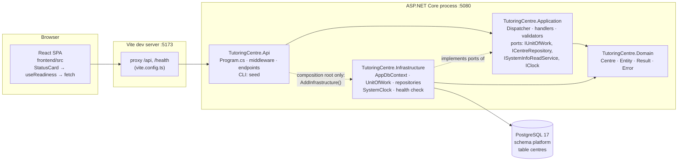
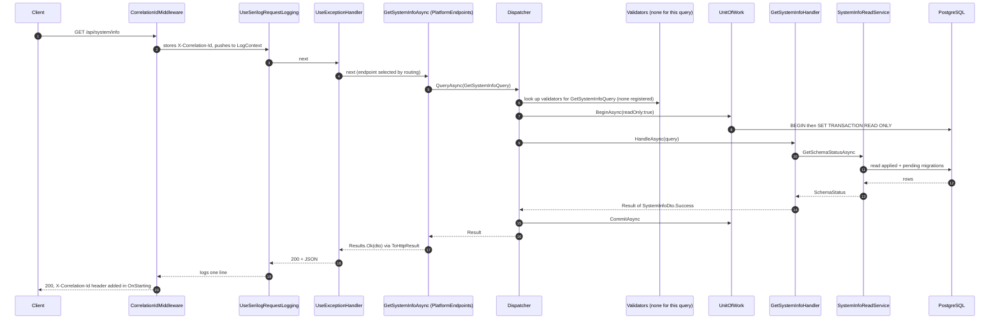
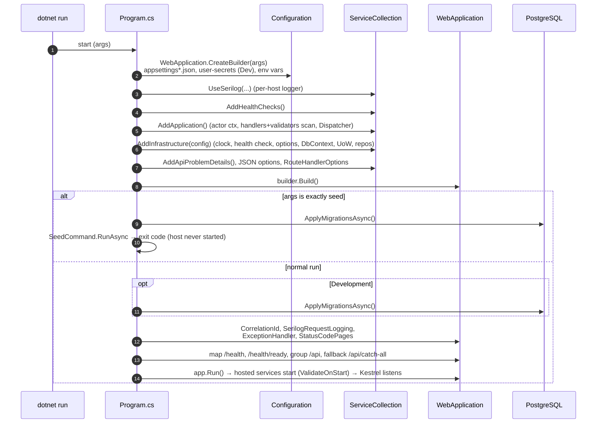
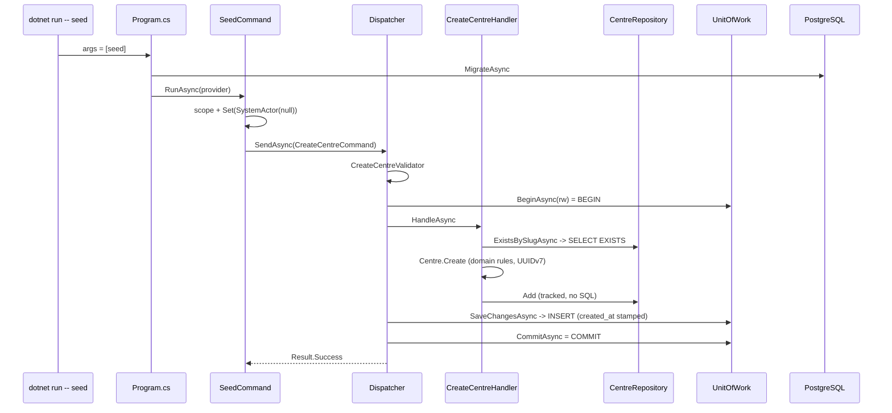
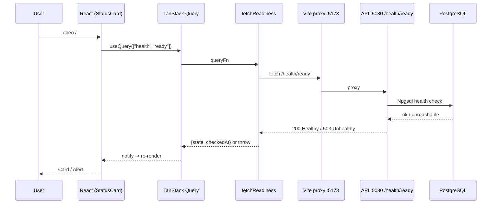

# Tutoring Centre Manager — Project Overview

> **How to read this document.** Every statement about the repository was checked against a file I opened (commit `371be5c` plus this documentation). Where the repository does not say *why* something was done, I say so and label my interpretation. Things I could **not** verify are listed explicitly (for example, I could not run the .NET test suite — see [§1.3](#13-what-i-ran-and-what-i-could-not-run)).
>
> Companion documents: [`file-explanations/INDEX.md`](file-explanations/INDEX.md) (every file, grouped by directory) and the per-file explanation files it links to; area summaries `file-explanations/01…07-*.md` also exist.
>
> **Scope.** This document follows the section list you specified (1-15). Appendix A summarises the frontend and Appendix B is a practical 'working on this repo' guide. Every source file also has its own explanation under [`file-explanations/`](file-explanations/INDEX.md) (one `.md` per file, mirroring the repository paths).

---

# 1. Project Overview

## 1.1 What the application is (and is not yet)

The README states the **intended** product: *"A multi-tenant management platform for Egyptian tutoring centres: students and parents, groups and schedules, attendance (manual and QR), fees and payments, and a WhatsApp assistant that answers parents' questions in Egyptian Arabic and English through the same authorized use cases as the staff web app."* (`README.md`). ADR 0001 adds that the same use cases must serve three "front doors": a staff web app, a WhatsApp assistant, and background jobs.

**What actually exists in code today is a foundation, not those features.** I searched `src/` and `frontend/src/`: there are no students, parents, groups, schedules, attendance, fees, payments, WhatsApp or QR code. The only business concept is a **Centre** (the tenant), and the only business operation is **create a centre**, reachable **only from a CLI command**, not over HTTP.

Intended users (from README/ADRs): tutoring-centre staff (web app), parents (WhatsApp assistant), and the platform operator (the "system" actor). The repository's ADRs state it is also a **portfolio project aimed at .NET job roles**, so the architecture itself is part of what is being demonstrated (ADR 0001, Context). That explains why there is far more architectural machinery than product.

## 1.2 Implementation state, feature by feature

| Area | State | Evidence |
| --- | --- | --- |
| Clean-Architecture project skeleton (4 projects) enforced by tests | **Complete** | `*.csproj`, `tests/TutoringCentre.Architecture.Tests` |
| Hand-written CQRS dispatcher (validate → transaction → handler → save → commit) | **Complete**, unit- and integration-tested | `Application/Common/Cqrs/Dispatcher.cs`, `DispatcherTests`, `TransactionBoundaryTests` |
| `Result`/`Error` failure model, Problem Details HTTP mapping | **Complete**, tested | `Domain/Common/Result.cs`, `Api/Http/*`, `ProblemDetailsTests` |
| Create a Centre (domain rules, validation, authorization, uniqueness, persistence) | **Complete but CLI-only** (no HTTP endpoint, on purpose) | `CreateCentreHandler`, `SeedCommand`, `docs/architecture/overview.md` ("There is no HTTP endpoint for this command — on purpose.") |
| `seed` CLI creating two demo centres | **Complete**, tested | `Api/Cli/SeedCommand.cs`, `SeedCommandTests` |
| `GET /api/system/info` (version, latest migration, up-to-date flag) | **Complete**, anonymous | `PlatformEndpoints.cs`, `SystemInfoQueryTests` |
| Health endpoints `/health` (liveness) and `/health/ready` (readiness) | **Complete**, tested | `Program.cs`, `HealthEndpointTests`, `ReadinessWithDatabaseTests` |
| Structured logging, correlation IDs, log redaction | **Complete**, tested | `CorrelationIdMiddleware`, `SensitiveDataDestructuringPolicy` |
| Database: schema `platform`, table `centres`, one migration | **Complete** (only table) | `Migrations/20261002222404_InitialPlatform.cs` |
| **Authentication** (login, tokens, sessions) | **Does not exist** | grep for `AddAuthentication`, `UseAuthentication`, `AddJwtBearer`, `AddIdentity`: no matches |
| **Authorization** (roles, policies) | **Minimal**: one handler-level `is SystemActor` check; no ASP.NET authorization middleware | `CreateCentreHandler.cs`; grep for `UseAuthorization`/`AddAuthorization`: none |
| **Multi-tenancy enforcement** (tenant filter, row-level security) | **Planned, not implemented**: `ITenantOwned` has no implementers; `Actor.CentreId` is never read | `ITenantOwned.cs`; comments in `Dispatcher.cs` ("Month 2") |
| CORS, HTTPS redirection, static-file/SPA serving, OpenAPI | **Not present** | grep: none found |
| Frontend | **Minimal**: one "System status" page polling `/health/ready` | `frontend/src/routes/index.tsx`, `StatusCard.tsx` |
| Frontend error-message dictionary (`messageFor`), `ProblemDetails` type guard, `ApiError` type | **Written and unit-tested but unused by any screen** | grep: referenced only by definitions and their tests |
| Frontend i18n (i18next), generated OpenAPI client | **Planned only** (named in `frontend/README.md`, ADR 0002); `i18next` is not in `package.json`; no `src/api/generated/` | `package.json` |
| Dockerfile / app container / deployment | **None** (Compose runs only PostgreSQL) | no Dockerfile exists |
| `IClock.ToLocal` / `FromLocal` | **Implemented and tested, unused by product code** | used only in `SystemClockTests` |
| `Unit` (Application), `Schemas.Identity` (Infrastructure) | **Unused** | grep |
| "Semantic" generated docs (`*.semantic.md`) | **Stale** — describe Domain/Application as empty, "9 tests", frontend "not scaffolded" | contradicted by the code |

Terminology in comments and docs ("Day 7", "Month 2", "Task 2.5", "discrepancy D10") refers to a build plan that is **not in the repository**. I treat those references as pointers to planned work, not as facts about the code.

## 1.3 What I ran and what I could not run

| Check | Result |
| --- | --- |
| `npm ci` in `frontend/` | succeeded |
| `npx vitest --run` | **3 files, 9 tests passed** |
| `npm run typecheck` | passed (no output) |
| `npm run lint` | **0 errors, 2 warnings** (`react-refresh/only-export-components` on `routes/__root.tsx` and `routes/index.tsx`, despite the override in `eslint.config.js`) |
| `dotnet build` / `dotnet test` | **Not run — the .NET SDK is not installed in this sandbox** (`dotnet: command not found`). Backend behaviour in this document comes from reading source and tests, not from executing them. |
| Docker-based tests (Testcontainers) | Not run (needs .NET + a Docker daemon) |

Declared test methods (counted with `grep` on `[Fact]`/`[Theory]`, not executed): Domain 16 (+4 `InlineData` cases), Application 22, Architecture 7, Infrastructure 17, Api 40 (+8 `InlineData` cases); frontend 9 executed.

---

# 2. Technology Stack

Versions come from `global.json`, `Directory.Packages.props`, `.config/dotnet-tools.json`, `compose.yaml`, `frontend/package.json` (ranges) and the installed `node_modules` (exact, which I read after `npm ci`).

## 2.1 Backend / platform

| Technology | Version | Where used | What it does in this project |
| --- | --- | --- | --- |
| C# / .NET SDK | SDK `10.0.401` (`rollForward: latestFeature`), TFM `net10.0` | `global.json`, `Directory.Build.props` | Language/runtime for all 9 .NET projects. Nullable reference types, implicit usings, warnings-as-errors and `AnalysisLevel=latest-recommended` are turned on for everything. |
| ASP.NET Core (minimal APIs, `Microsoft.NET.Sdk.Web`) | 10.0 (shared framework) | `TutoringCentre.Api` | HTTP host. `Program.cs` uses top-level statements and `MapGet` — no MVC controllers. |
| Entity Framework Core | `10.0.12` | `Infrastructure` | ORM: maps `Centre` to a table, tracks changes, generates SQL, migrations. |
| `Npgsql.EntityFrameworkCore.PostgreSQL` | `10.0.3` | `Infrastructure` | EF Core provider for PostgreSQL. |
| `EFCore.NamingConventions` | `10.0.1` | `Infrastructure` (`UseSnakeCaseNamingConvention`) | Makes columns `time_zone_id` instead of `TimeZoneId`. |
| PostgreSQL | image `postgres:17` | `compose.yaml`, test fixtures | The database (dev via Compose; tests via Testcontainers). |
| `AspNetCore.HealthChecks.NpgSql` | `9.0.0` | `Infrastructure/DependencyInjection.cs` | The `/health/ready` PostgreSQL probe (`AddNpgSql`). |
| FluentValidation (+ `DependencyInjectionExtensions`) | `12.1.1` | `Application` | Declarative shape validation of commands/queries. |
| Serilog.AspNetCore | `10.0.0` | `Api` | Structured logging (compact JSON to console), request logging, `LogContext`. |
| `Microsoft.Extensions.*` (DI, Logging, Configuration, Options.DataAnnotations abstractions) | `10.0.12` | `Application`, `Infrastructure` | DI container abstractions, `ILogger`, options validation. |
| `dotnet-ef` (local tool) | `10.0.12` | `.config/dotnet-tools.json`, CI | Creates migrations; CI uses `migrations has-pending-model-changes`. |
| `Microsoft.EntityFrameworkCore.Design` | `10.0.12` (private asset) | `Api` | Design-time services so `dotnet ef` can use the Api as startup project. |
| Central Package Management | — | `Directory.Packages.props` | One file holds every NuGet version; `.csproj` `PackageReference`s have no `Version`. |

## 2.2 Backend testing

| Technology | Version | Where | Role |
| --- | --- | --- | --- |
| xUnit (`xunit`, `xunit.runner.visualstudio`) | `2.9.3` / `4.0.0` | all 5 test projects | Test framework. |
| `Microsoft.NET.Test.Sdk` | `18.10.1` | all test projects | Test host. |
| `coverlet.collector` | `10.1.0` | all test projects | Coverage collector (referenced; no coverage step in CI). |
| `Microsoft.AspNetCore.Mvc.Testing` | `10.0.12` | `Api.Tests` | `WebApplicationFactory<Program>` — hosts the real app in-process. |
| `Testcontainers.PostgreSql` | `4.15.0` | `Api.Tests`, `Infrastructure.Tests` | Starts throw-away PostgreSQL 17 containers. |
| `Respawn` | `7.0.0` | same | Deletes rows between tests (faster than recreating the DB). |
| `NetArchTest.Rules` | `1.3.2` | `Architecture.Tests` | Type-level dependency rules. |
| `Microsoft.Extensions.TimeProvider.Testing` | `10.10.0` | `Infrastructure.Tests` | `FakeTimeProvider`. |

## 2.3 Frontend (`frontend/package.json`; exact versions from `node_modules` after `npm ci`)

| Technology | Version (range → installed) | Where | What it does here |
| --- | --- | --- | --- |
| Node.js | CI: `lts/*`; README: 22.12+; sandbox: 22.22.0 | CI, README | Runtime for tooling. |
| npm | lockfile v3 | `package-lock.json` | Package manager; CI uses `npm ci`. |
| TypeScript | `~6.0.2` → 6.0.3 | all `src` | Static typing; `strict`, `noUncheckedIndexedAccess`, `erasableSyntaxOnly`. |
| React / React DOM | `^19.2.8` → 19.3.0 | `src` | UI library. |
| Vite | `^8.3.0` → 8.3.2 | `vite.config.ts` | Dev server, bundler, dev proxy. |
| `@vitejs/plugin-react` | `^6.1.1` | `vite.config.ts` | JSX transform / fast refresh. |
| TanStack Router (+ `@tanstack/router-plugin`) | `^1.170.41` → 1.170.41 | `routes/`, `routeTree.gen.ts` | File-based routing; plugin generates the route tree. |
| TanStack Query | `^5.104.1` → 5.104.1 | `useReadiness.ts`, `queryClient.ts` | Server-state cache, polling, retry. |
| Tailwind CSS (+ `@tailwindcss/vite`) | `^4.3.3` → 4.3.3 | `index.css` | Utility CSS; no `tailwind.config` file (v4 CSS-first). |
| shadcn (CLI) + `@base-ui/react` + `class-variance-authority` + `lucide-react` + `tw-animate-css` | 4.21.1 / 1.8.0 / 0.7.1 / 1.49 / 1.4 | `components/ui/*`, `components.json` | UI components copied into the repo (`alert`, `button`, `card`, `skeleton`, `sonner`). |
| `cn` | `^0.4.0` → 0.4.0 | every `components/ui/*` file | Class-name merge helper ("drop-in replacement for clsx + tailwind-merge" per its package.json). |
| `sonner`, `next-themes` | 2.0.8 / 0.4.6 | `components/ui/sonner.tsx` | Toast component; theme hook (no `ThemeProvider` exists in the repo, so the code's `theme = "system"` default applies). |
| Vitest | `^5.0.3` → 5.0.3 | `vite.config.ts` `test` | Test runner (`jsdom` environment). |
| Testing Library (`react`, `dom`, `jest-dom`), `jsdom` 30.1.1 | 16.3.3 / 10.4.2 / 7.0.1 | tests | Render + assert on DOM. |
| MSW (Mock Service Worker) | `^2.15.0` → 2.15.0 | `src/test/msw` | Intercepts `fetch` in tests. |
| ESLint 10 + `typescript-eslint` + React hooks/refresh plugins; Prettier 3 | 10.11.0 / ^8.69 / … | `eslint.config.js`, `.prettierrc` | Lint and format. |

## 2.4 Infrastructure / CI

| Technology | Where | Role |
| --- | --- | --- |
| Docker Compose | `compose.yaml` | Local PostgreSQL only. No Dockerfile; the app is not containerised. |
| GitHub Actions | `.github/workflows/ci.yml`, `codeql.yml`, `secret-scan.yml` | Build/test both stacks, static analysis, secret scanning. |
| Dependabot | `.github/dependabot.yml` | Weekly grouped dependency PRs (NuGet, npm, Actions). |
| CodeQL, gitleaks | workflows | Security scanning. |
| `dotnet user-secrets` | `UserSecretsId` in `Api.csproj`; README step 3 | Keeps the dev connection string out of git. |

---

# 3. Architecture

## 3.1 The shape in one paragraph

A **React SPA** (`frontend/`) talks to an **ASP.NET Core API** (`src/TutoringCentre.Api`) over HTTP/JSON. The API is a thin shell: it binds the request, calls a **Dispatcher** in the **Application** layer, and turns the returned `Result` into HTTP. The Application layer holds use cases and defines **ports** (interfaces such as `IUnitOfWork`, `ICentreRepository`). The **Infrastructure** layer implements those ports with EF Core and PostgreSQL. The **Domain** layer holds business rules and depends on nothing. Source-code dependencies point inward only, and tests fail the build if that is violated.

## 3.2 Layers and what each may depend on

| Project | Role | May reference (declared in `.csproj`, asserted by `ProjectReferenceTests`) |
| --- | --- | --- |
| `TutoringCentre.Domain` | Entities, value rules, `Result`/`Error` | nothing |
| `TutoringCentre.Application` | Use cases, ports, dispatcher, validators, actor model | Domain |
| `TutoringCentre.Infrastructure` | EF Core, repositories, clock, health check, read services | Application, Domain |
| `TutoringCentre.Api` | Host, HTTP mapping, CLI, **composition root** | Application, Infrastructure (Infrastructure only to call `AddInfrastructure`) |

Frontend/backend boundary: the browser only talks to the **Vite origin** in development; `vite.config.ts` proxies `/api` and `/health` to `http://localhost:5080`. ADR 0002 says production will serve the SPA from the same origin as the API, but **no code in the repository does that yet** (no static-file middleware, no SPA fallback beyond `/api/{**path}`).

## 3.3 Diagram — high-level architecture



## 3.4 Diagram — main request/data flow (`GET /api/system/info`, the only JSON endpoint)



## 3.5 Diagram — startup / bootstrap sequence



---

# 4. Folder and File Architecture

Directories (all verified by listing; see [INDEX](file-explanations/INDEX.md) for every file):

| Path | Type | Purpose | Depends on | Used by |
| --- | --- | --- | --- | --- |
| `/` (root) | config/docs | Solution, SDK pin, central package versions, Compose, README | — | everything |
| `.github/` | CI/CD | Workflows + Dependabot | `global.json`, solution, `frontend/` | GitHub |
| `.config/` | config | Local `dotnet-ef` tool manifest | — | `dotnet tool restore`, CI |
| `docs/adr/` | docs | Architecture Decision Records 0001–0002 | — | humans |
| `docs/architecture/` | docs | API conventions; failure model + dispatcher design | — | humans, tests are derived from them |
| `docs/notes/` | docs | `pipeline-cases.md` — spec for `DispatcherTests` | — | `DispatcherTests` author |
| `src/TutoringCentre.Domain/` | source | Business rules, `Result`/`Error` | none | Application, Infrastructure, tests |
| `src/TutoringCentre.Application/` | source | Use cases, ports, dispatcher | Domain | Infrastructure, Api |
| `src/TutoringCentre.Infrastructure/` | source | EF Core, repositories, clock, health, migrations | Application, Domain | Api (registration) |
| `src/TutoringCentre.Api/` | source | Host, HTTP conventions, CLI | Application, Infrastructure | process entry, tests |
| `tests/TutoringCentre.*.Tests/` | test | One test project per layer + architecture | the layer under test | CI |
| `frontend/` | source/config | React SPA | backend over HTTP (proxy) | browser |
| `frontend/src/features/status/` | source | The only feature: API status | `components/ui`, TanStack Query | `routes/index.tsx` |
| `frontend/src/api/` | source | Error/Problem-Details types and message dictionary | — | tests only (no screen yet) |
| `frontend/src/components/ui/` | source | shadcn-generated UI primitives | Base UI, `cn` | features |
| `frontend/src/routes/` | source | File-based routes (`__root`, `index`) | features | generated `routeTree.gen.ts` |
| `frontend/src/test/` | test | MSW server/handlers, render helper, setup | — | frontend tests |

Key file map (the full per-file explanation is in the area documents):

| Path | Type | Purpose | Depends on | Used by |
| --- | --- | --- | --- | --- |
| `Api/Program.cs` | source | Composition root + pipeline | all layers' `Add*` methods | runtime, `WebApplicationFactory<Program>` |
| `Application/Common/Cqrs/Dispatcher.cs` | source | Every use case goes through it | `IUnitOfWork`, `IValidator<>`, DI | endpoints, `SeedCommand`, tests |
| `Application/DependencyInjection.cs` | source | `AddApplication` | `HandlerRegistration` | `Program.cs`, `PostgresFixture` |
| `Domain/Centres/Centre.cs` | source | The only entity | `Entity`, `Result`, `Error` | handler, EF configuration |
| `Infrastructure/DependencyInjection.cs` | source | `AddInfrastructure` | EF, Npgsql, all adapters | `Program.cs`, `PostgresFixture` |
| `Infrastructure/Persistence/UnitOfWork.cs` | source | Transaction control | `AppDbContext` | `Dispatcher` (via `IUnitOfWork`) |
| `Infrastructure/Persistence/Configurations/Centres/CentreConfiguration.cs` | source | DB mapping of `Centre` | EF | `AppDbContext.OnModelCreating` |
| `Api/Http/ResultHttpExtensions.cs` | source | `Result`/`Error` → HTTP | `ProblemResult` | endpoints, fallback |
| `Api/Http/ProblemResult.cs` | source | Writes every error body | `HttpContextKeys` | handler, mapping, enrich callback |
| `tests/…Architecture.Tests/*` | test | Executable architecture rules | `.csproj` files, compiled IL | CI |
| `frontend/src/main.tsx` | source | SPA entry | router, query client | `index.html` |

---

# 5. Startup / Bootstrapping

This traces `src/TutoringCentre.Api/Program.cs` line-by-line in execution order. Items marked *(framework)* are .NET behaviour that is **not written in this repository**; I include them because the repository's behaviour depends on them.

1. **Process starts** — `dotnet run --project src/TutoringCentre.Api --launch-profile http`. `launchSettings.json` profile `http` sets `ASPNETCORE_ENVIRONMENT=Development` and URL `http://localhost:5080`. *(framework: `dotnet run` applies launch profiles; production would set the environment otherwise.)*
2. **`WebApplication.CreateBuilder(args)`** *(framework)* creates the configuration: `appsettings.json` → `appsettings.{Environment}.json` → user-secrets (Development only) → environment variables → command-line. This is why the connection string can come from `dotnet user-secrets` (README step 3) or `ConnectionStrings__Postgres` (CI).
3. **`builder.Host.UseSerilog(...)`** — replaces the logging provider with Serilog: reads the `Serilog` section of configuration, reads sinks/enrichers from DI, enriches from `LogContext`, installs `SensitiveDataDestructuringPolicy`, writes **compact JSON** to the console. `preserveStaticLogger: true` stops each host from overwriting the global `Log.Logger`; the comment explains that several `WebApplicationFactory` hosts run concurrently in tests and the last one would otherwise win, dropping the test `InMemoryLogSink`.
4. **`AddHealthChecks()`**, then **`AddApplication().AddInfrastructure(builder.Configuration)`** — the two lines where the host assembles the layers (details in [§6.1–6.2](#61-clean-architecture-dependency-inversion-and-the-composition-root)).
5. **`AddApiProblemDetails()`** — `AddProblemDetails` with a customise callback (adds `traceId`/`correlationId` to framework-generated problem bodies) and registers `GlobalExceptionHandler` as an `IExceptionHandler`.
6. **`ConfigureHttpJsonOptions`** — unknown JSON members are rejected (`UnmappedMemberHandling.Disallow`), enums serialise as camelCase strings. **`Configure<RouteHandlerOptions>(ThrowOnBadRequest = true)`** — a bad request body throws `BadHttpRequestException` in every environment (the comment says that outside Development minimal APIs would otherwise answer with an empty 400).
7. **`builder.Build()`** creates the service provider. *(framework: in Development, `ValidateOnBuild`/`ValidateScopes` are on by default; the test factories turn them on explicitly for the `Testing` environment — `ApiFactory.ConfigureWebHost`.)*
8. **CLI branch** — `if (args is ["seed"])` (C# list pattern: argument array of exactly one element `"seed"`): apply migrations, run `SeedCommand`, **return its exit code. The web host is never started** (`app.Run()` is not reached).
9. **Development-only auto-migration** — `if (app.Environment.IsDevelopment()) await app.Services.ApplyMigrationsAsync();` The comment states production migrations must come from the deployment pipeline, not app startup (racing instances, no review, long locks). **Note:** the repository contains no deployment pipeline yet, so production migration is currently undefined.
10. **Middleware** (order matters — see [§8](#8-routing-and-middleware)): `CorrelationIdMiddleware` → `UseSerilogRequestLogging` → `UseExceptionHandler` → `UseStatusCodePages`.
11. **Endpoints**: `/health` (no checks run → always 200 while alive), `/health/ready` (checks tagged `ready`), `MapGroup("/api")` + `MapPlatformEndpoints()`, and `MapFallback("/api/{**path}")` returning Problem Details 404 `route.not_found`, hidden from API descriptions.
12. **`app.Run()`** blocks. *(framework)* Hosted services start; the `ValidateOnStart` registration for `DatabaseOptions` runs now. **If `ConnectionStrings:Postgres` is empty, startup throws `OptionsValidationException`.** (This is why the earlier-described "missing connection string degrades readiness instead of crashing" in `ARCHITECTURE.semantic.md` is stale: `DatabaseOptions` is `[Required]` and `ValidateOnStart` was added later. The "not configured" `Unhealthy` health-check branch in `AddInfrastructure` is therefore effectively unreachable when the app runs normally.) Kestrel then listens on `http://localhost:5080`.
13. `public partial class Program;` at the bottom exposes the compiler-generated `Program` class so `WebApplicationFactory<Program>` can reference it.

---

# 6. Concepts and Patterns

Each concept below follows the same shape: **what it means → the problem → how it works → how this repo implements it → a traced example → why it matters here → alternatives → what to know before changing it.** Where the repo does not state its reasons I say so.

Contents: [6.1 Clean Architecture / DI inversion](#61-clean-architecture-dependency-inversion-and-the-composition-root) · [6.2 Dependency Injection](#62-dependency-injection-lifetimes-and-scanning) · [6.3 CQRS and the Dispatcher](#63-cqrs-and-the-hand-written-dispatcher) · [6.4 Result pattern](#64-the-result-pattern-failures-as-values) · [6.5 Validation (two tiers)](#65-validation-two-tiers) · [6.6 Entities & factories](#66-entities-encapsulation-and-factory-methods) · [6.7 Unit of Work / transactions](#67-unit-of-work-and-transactions) · [6.8 Repository & read services](#68-repository-pattern-and-read-services) · [6.9 EF Core mechanics](#69-ef-core-how-the-orm-actually-works-here) · [6.10 Races & unique indexes](#610-concurrency-the-slug-race-and-why-the-unique-index-is-the-real-guarantee) · [6.11 Actor / tenancy](#611-the-actor-model-and-the-tenancy-groundwork) · [6.12 HTTP error handling](#612-http-problem-details-and-error-handling) · [6.13 Logging](#613-structured-logging-correlation-ids-and-redaction) · [6.14 Options & health](#614-options-validation-and-health-checks) · [6.15 Architecture tests](#615-architecture-tests-fitness-functions) · [6.16 Test strategy](#616-test-doubles-vs-real-database-tests) · [6.17 Frontend concepts](#617-frontend-concepts-react-server-state-and-routing)

---

## 6.1 Clean Architecture, dependency inversion and the composition root

### What it means
A *dependency* between two pieces of code means one cannot compile (or work) without the other. In "layered" code the high-level rules (what a centre is, how it is created) often end up depending on low-level details (SQL, HTTP). **Dependency inversion** flips that: the high-level code owns an *interface* (a **port**) describing what it needs; the low-level code *implements* it (an **adapter**). The compiled dependency arrow then points from detail → policy, not policy → detail. **Clean Architecture** arranges projects in rings so that all arrows point inward. A **composition root** is the single place where the concrete adapters are chosen and wired to the ports.

### The problem it solves
Without it, `CreateCentreHandler` would call `new AppDbContext(...)` and `DateTime.UtcNow` directly. You could not test the handler without a database, could not reuse it from a WhatsApp bot, and a change in how data is stored would ripple through business code. ADR 0001 names exactly these motivations: testability without a database, and three front doors (web, WhatsApp, jobs) sharing one set of rules.

### How it works
1. Application declares `ICentreRepository` (`Application/Centres/ICentreRepository.cs`).
2. The handler's constructor asks for `ICentreRepository` — it never names a class.
3. Infrastructure defines `CentreRepository : ICentreRepository` (`Infrastructure/Repositories/CentreRepository.cs`).
4. Infrastructure's `AddInfrastructure` registers the pair: `services.AddScoped<ICentreRepository, CentreRepository>()`.
5. At runtime the DI container builds `CentreRepository` and passes it in.

### How THIS project implements it
- **Ports (in Application):** `IUnitOfWork`, `IClock`, `ICentreRepository`, `ISystemInfoReadService`, `ICurrentActor`. **Adapters (in Infrastructure):** `UnitOfWork`, `SystemClock`, `CentreRepository`, `SystemInfoReadService`. (`CurrentActorContext` lives in Application itself.)
- **Reference graph** is declared in the four `.csproj` files and asserted by `ProjectReferenceTests`; usage is asserted by `DependencyRuleTests` ([§6.15](#615-architecture-tests-fitness-functions)).
- **Composition root:** `Api/Program.cs` line `builder.Services.AddApplication().AddInfrastructure(builder.Configuration);`. This is the only reason `Api.csproj` references Infrastructure (README diagram: dashed arrow "composition root only").
- **Each layer owns one `AddXxx` extension method** so `Program.cs` need not know any layer's internals.

### Execution example
`CreateCentreHandler` (Application) receives `ICentreRepository`. Who built it? `Program.cs` → `AddInfrastructure` registered `CentreRepository`. In unit tests (`CreateCentreHandlerTests`) the same constructor receives `FakeCentreRepository` instead — same handler code, different adapter.

### Why this project needs it
Verified by tests: 22 Application tests run with in-memory fakes and no database; 17 Infrastructure tests run the *same* handlers against real PostgreSQL. Both are possible only because of the ports.

### Alternatives
- **Classic N-tier (UI → BLL → DAL):** compile dependency points downward to the DAL; business code knows EF. Simpler, less indirection. ADR 0001 rejected "layered monolith without enforced boundaries" because boundaries then rely on discipline.
- **One assembly per module** (the "original v1 plan" in ADR 0001): stronger isolation per feature but ×N projects; rejected as too much for one developer.
- **Microservices:** rejected in ADR 0001 (no need for independent deployment).
- The repository **does** state its reasons here (ADR 0001), so this is documented fact rather than my inference.

### Before you modify it
Put new interfaces in **Application**, implementations in **Infrastructure**, and register them in `Infrastructure/DependencyInjection.cs`. Do not add EF/ASP.NET types to Domain or Application — `DependencyRuleTests` will fail. A new project reference must also update `ProjectReferenceTests`.

---

## 6.2 Dependency Injection: lifetimes and scanning

### What it means
**Dependency Injection (DI)** is the practice of a class *receiving* its collaborators (usually through its constructor) instead of creating them. A **DI container** (`IServiceCollection` → `IServiceProvider` in .NET) holds **registrations** (a map "when someone asks for type X, build type Y") and performs **resolution** (building the object graph by recursively satisfying constructor parameters). **Lifetime** says how long a built instance lives: **singleton** (one for the whole app), **scoped** (one per scope — in ASP.NET one per HTTP request), **transient** (new each time). **Inversion of control**: the class no longer controls what it depends on; the container does.

### The problem it solves
`new CentreRepository(new AppDbContext(...))` inside a handler hard-wires the choice, repeats construction everywhere, and cannot swap fakes. DI centralises it.

### How it works (mechanism)
1. `ServiceCollection` stores `ServiceDescriptor`s (service type, implementation or factory, lifetime).
2. `BuildServiceProvider` (done by `builder.Build()`) freezes them. With **`ValidateOnBuild`** it walks every registration and fails early if a constructor parameter has no registration; with **`ValidateScopes`** it fails if a singleton captures a scoped service ("captive dependency").
3. `GetRequiredService<T>()` finds the descriptor, picks the constructor, resolves each parameter recursively, constructs, caches according to lifetime. A missing registration throws `InvalidOperationException`.
4. `CreateAsyncScope()` makes a child provider whose scoped services live until the scope is disposed.

### How THIS project implements it

| Registration | File | Lifetime | Why (from code comments / structure) |
| --- | --- | --- | --- |
| `TimeProvider.System`, `IClock → SystemClock` | `Infrastructure/DependencyInjection.cs` | Singleton | Comment: "stateless and thread-safe". |
| `TimestampInterceptor` | same | Singleton | Comment: stateless, needs only the singleton clock. |
| `DatabaseOptions` (options pattern) | same | options (singleton-like) | validated at start. |
| `AppDbContext` (`AddDbContext`) | same | **Scoped** (the `AddDbContext` default) | one unit of change-tracking per request/job. |
| `IUnitOfWork → UnitOfWork` | same | Scoped | wraps the scoped `AppDbContext`. |
| `ICentreRepository → CentreRepository`, `ISystemInfoReadService → SystemInfoReadService` | same | Scoped | depend on scoped `AppDbContext`. |
| `CurrentActorContext`, `ICurrentActor` (factory returning the same `CurrentActorContext`), `Dispatcher` | `Application/DependencyInjection.cs` | Scoped | "One actor context per scope… `ICurrentActor` resolves to the SAME instance, read-only." |
| Every `ICommandHandler<,>` / `IQueryHandler<,>` | `Application/Common/Cqrs/HandlerRegistration.cs` | Scoped | Comment: "matching the scoped DbContext and actor." |
| FluentValidation validators | same (`AddValidatorsFromAssembly(..., includeInternalTypes: true)`) | library default (scoped unless specified; I did not inspect the library's default — **unverified**) | |

**Two registrations for one object (`ICurrentActor`).** `AddScoped<ICurrentActor>(provider => provider.GetRequiredService<CurrentActorContext>())` is a *factory registration*: when something asks for `ICurrentActor`, the container *resolves the concrete `CurrentActorContext`* and returns that same scoped instance. Result: edge code (seed, tests) asks for `CurrentActorContext` and calls `Set(...)`; handlers ask for `ICurrentActor` and can only read. One object, two views, enforced by interface segregation.

**Assembly scanning (`HandlerRegistration.AddCqrsHandlers`).** It calls `assembly.GetTypes()`, keeps concrete non-generic classes, and for each implemented interface that is a closed `ICommandHandler<,>` or `IQueryHandler<,>` registers `AddScoped(handlerInterface, implementation)`. So `CreateCentreHandler` (an `internal` class) becomes the answer to `ICommandHandler<CreateCentreCommand, CreateCentreResult>`. Adding a new handler class requires **no registration code** — the scan finds it (verified: no explicit registration of `CreateCentreHandler` exists anywhere).

### Execution example — what happens on `dispatcher.SendAsync<CreateCentreCommand, CreateCentreResult>`
1. `SeedCommand` creates a scope; asks for `Dispatcher`. The container sees `Dispatcher(IServiceProvider, IUnitOfWork, ILogger<Dispatcher>)`; `IServiceProvider` resolves to the *scope's* provider, `IUnitOfWork` → new `UnitOfWork` needing `AppDbContext` → built via the `AddDbContext` factory (which in turn resolves `IOptions<DatabaseOptions>` and the singleton `TimestampInterceptor`).
2. Dispatcher calls `_services.GetRequiredService<ICommandHandler<CreateCentreCommand, CreateCentreResult>>()` → container builds `CreateCentreHandler(ICurrentActor, ICentreRepository)`: the `ICurrentActor` is the scope's `CurrentActorContext` (already `Set`), `ICentreRepository` → `CentreRepository(AppDbContext)` — **the same `AppDbContext` instance** the `UnitOfWork` holds, because both are scoped in one scope. That sharing is what makes "handler tracks entity, UoW saves it" work.

### Why this project needs it
The shared scoped `AppDbContext` is the mechanism behind the transaction design ([§6.7](#67-unit-of-work-and-transactions)). Singletons for stateless services avoid needless allocation. `ValidateOnBuild`/`ValidateScopes` in the test factories (`ApiFactory`, `PostgresFixture`) turn "forgot to register" or "captive dependency" into a failing test.

### Alternatives
Manual `new` (no container), service locator (the Dispatcher itself uses `IServiceProvider.GetRequiredService` — a *deliberate, contained* use of the locator pattern because handler types are only known at runtime), source-generated DI, third-party containers (Autofac), MediatR-style assembly scanning libraries (this repo hand-wrote its own).

### Before you modify it
- A new scoped service that depends on `AppDbContext` must be scoped, not singleton — `ValidateScopes` fails otherwise (in tests).
- Do **not** resolve handlers from the root provider; they need a scope (the actor and DbContext are scoped). Always `CreateAsyncScope()` first (see `DispatchExtensions`, `SeedCommand`).
- A handler must be a concrete class implementing a closed generic handler interface, or the scan will not register it.

---

## 6.3 CQRS and the hand-written Dispatcher

### What it means
**CQRS** (Command Query Responsibility Segregation) separates operations that **change state** (*commands*) from operations that **read** (*queries*), giving each its own model and pipeline. A **command** is an intent ("create this centre"); a **handler** executes one command. A **dispatcher/mediator** is a single entry point that looks up the handler and runs shared cross-cutting steps (validation, transactions, logging) around it — the **pipeline**.

### The problem it solves
If each endpoint handled its own validation/transaction/logging, they would drift. A single entry point makes "every use case is validated, transactional and logged" true by construction, and lets a CLI, a web endpoint and (later) a WhatsApp bot call identical code.

### How THIS project implements it
- Marker interfaces: `ICommand<TResponse>`, `IQuery<TResponse>`; handler interfaces `ICommandHandler<in TCommand, TResponse>` / `IQueryHandler<in TQuery, TResponse>` (the `in` makes them *contravariant*, a C# generics feature letting a handler for a base type serve derived types; not exploited today).
- `Dispatcher` has two generic methods. The pipelines (from `Dispatcher.cs`):

```
SendAsync (command):
  validate ──fail──► return failure (no transaction opened)
  resolve handler (GetRequiredService)
  BeginAsync(readOnly:false)
  try:
    handler.HandleAsync
      failure → RollbackAsync → return failure
      success → SaveChangesAsync (once) → CommitAsync → return success
  catch (anything): RollbackAsync(CancellationToken.None) → rethrow

QueryAsync (query):
  validate ──fail──► return failure
  resolve handler
  BeginAsync(readOnly:true)        // SET TRANSACTION READ ONLY
  try: handler.HandleAsync → CommitAsync (no save ever) → return
  catch: RollbackAsync(CancellationToken.None) → rethrow
```
- **Validation** (`ValidateAsync`): `GetServices<IValidator<TRequest>>()` returns *all* validators (possibly none). Failures are grouped by **camelCased property name** into `Error.Validation("validation.failed", "One or more fields are invalid.", fields)`. Dotted names (`Address.Street`) camel-case each segment.
- **Outcome logging** (`LogOutcome`): one structured line per dispatch: `{RequestKind} {RequestType} completed with {Outcome} ({ErrorCode}) in {ElapsedMs} ms`; `Information` on success, `Warning` on failure. **The request object is never logged** (comment: avoid logging data).
- **Why `CancellationToken.None` on rollback:** if the request was cancelled, the rollback must still happen.
- **Why handler resolution happens before `BeginAsync`:** a missing handler throws before any transaction exists.
- **Reserved extension points:** comments in both methods mark "Month 2: tenant and permission steps go HERE — after validation, before BeginAsync, so a forbidden request never opens a transaction." These steps **do not exist yet**.

### Execution example (command, success) — `seed` creating "Nile Tutoring Centre"
`SeedCommand` → `Dispatcher.SendAsync<CreateCentreCommand,CreateCentreResult>` → `CreateCentreValidator` passes → handler resolved → `UnitOfWork.BeginAsync(false)` (`BEGIN`) → `CreateCentreHandler.HandleAsync` (authorise → `ExistsBySlugAsync` → `Centre.Create` → `Add`) → success → `SaveChangesAsync` (`TimestampInterceptor` stamps `CreatedAt`; `INSERT INTO platform.centres`) → `CommitAsync` → `Result.Success` → `LogOutcome` (Information).

### Why this project needs it
Provable from tests: `DispatcherTests` pins nine pipeline cases using a call-recording fake (`["Begin(rw)","Handle","Save","Commit"]`, etc.), derived from `docs/notes/pipeline-cases.md`; `TransactionBoundaryTests` proves against real PostgreSQL that a row written *inside* the handler vanishes on failure or exception.

### Alternatives
- **MediatR** (popular library) with pipeline behaviours — same idea, third-party. The repo does not say why it hand-wrote it. *Interpretation:* ADR 0002 calls it "a hand-written CQRS pipeline" and the project is a portfolio piece demonstrating the mechanics; I found no explicit statement of reasons.
- **Plain service classes** (`CentreService.CreateAsync`) with transactions in each — less ceremony, more duplication.
- **Full CQRS with separate read DB** — this repo only separates the *code paths* (and uses a read-only transaction), not databases.

### Before you modify it
- The dispatcher is the **only** caller of `IUnitOfWork`; handlers must not call Save/Commit (comment in `CreateCentreHandler`: "NO SaveChanges here — the dispatcher saves once and commits").
- **Handlers must not dispatch other commands:** `UnitOfWork.BeginAsync` throws "Nested units of work are not supported" if a transaction is already open in the scope.
- Changing the order of validate/begin/handle/save/commit invalidates `pipeline-cases.md` and `DispatcherTests`.

---

## 6.4 The Result pattern: failures as values

### What it means
Two kinds of "something went wrong": **expected** business outcomes (invalid slug, name taken, not allowed) and **unexpected** faults (bug, database down). The **Result pattern** returns expected outcomes as ordinary return values (`Result<T>` holding either a value or an `Error`) and reserves **exceptions** for unexpected faults.

### The problem it solves
Exceptions for control flow are slow, invisible in method signatures, and easy to forget to catch. A `Result` makes the failure possibility part of the type, forcing callers to look.

### How it works here (`Domain/Common/Result.cs`)
- `Result` base: constructor allows only two states — success with no error, or failure with an error; anything else throws (`ArgumentException`/`ArgumentNullException`). So an invalid `Result` cannot exist.
- `Result<T>` adds `Value`. **Reading `Value` of a failure throws `InvalidOperationException`** — treated as a *bug* ("reading it is a bug"), consistent with the rule table in `docs/architecture/overview.md`.
- `Error` is an immutable `record` `(Code, Message, Kind, Fields?)`. `Code` is `<feature>.<reason>` (e.g. `centre.slug_invalid`) and is a **public contract** the frontend translates; `Message` is for developers/logs only. `ErrorKind` is a closed enum (Validation, NotFound, Conflict, Rule, Forbidden); each maps to exactly one HTTP status (§6.12).
- Failures never carry internals (rule in `overview.md`: "no stack traces, SQL, file paths or secrets").

### Where each category is used
| Situation | Mechanism | Example in code |
| --- | --- | --- |
| Invalid input | `Result` failure `Validation` | `Centre.Create` → `centre.slug_invalid`; `Dispatcher.ValidateAsync` → `validation.failed` |
| Duplicate | `Conflict` | `CreateCentreHandler` → `centre.slug_taken` |
| Not permitted | `Forbidden` | `centre.create_forbidden` |
| `NotFound`, `Rule` | defined and mapped; **no product code returns them yet** (`route.not_found` in `Program.cs` is a `NotFound` error used for the fallback) | — |
| Bug / infrastructure fault | exception | dispatcher rolls back and rethrows; `GlobalExceptionHandler` → 500 |

### Execution example
`Centre.Create("Nile", "Bad Slug", …)` → regex fails → `Result<Centre>.Failure(Error.Validation("centre.slug_invalid", …))` → handler returns `Result<CreateCentreResult>.Failure(created.Error!)` → dispatcher sees `IsFailure`, **rolls back**, returns it unchanged → (if an HTTP endpoint existed) `ToHttpResult` → 400 problem+json with `code`.

### Alternatives
Throw custom exceptions per case; `OneOf<…>`/discriminated-union libraries (C# has none built in); nullable returns (lose the reason). The repo documents its choice in `docs/architecture/overview.md` ("Failures: results vs exceptions").

### Before you modify it
Adding an `ErrorKind` is an **API-contract change**: `ResultHttpExtensions.ToProblemResult` has a `_ => throw` default and the frontend's `ErrorKind` type (`frontend/src/api/errors.ts`) must be updated by hand — there is no generated link yet. Never put exception text in `Error.Message`.

---

## 6.5 Validation: two tiers

### What it means
**Validation** checks that data is acceptable. This repo splits it:
- **Shape validation** (cheap, no business knowledge, no I/O): required, max length, enum defined. Done by **FluentValidation** in `CreateCentreValidator`, run by the dispatcher *before* any transaction.
- **Business rules / invariants**: slug format, time-zone existence. Done in the **Domain** (`Centre.Create`), which is "the single source of truth" (comment in `CreateCentreValidator`).
- **Database constraints** as a third safety net: `ux_centres_slug` unique index, `ck_centres_default_locale` CHECK ("defence against rows written outside the app" — comment in `CentreConfiguration`).

### The problem it solves
Rules duplicated in many places drift. The validator deliberately checks **only** lengths/emptiness, reading limits from domain constants (`Centre.NameMaxLength`, `Centre.SlugMaxLength`) so the numbers cannot diverge. Domain limits are also reused by `CentreConfiguration` (`HasMaxLength`).

### Execution example
`CreateCentreCommand("", "nile-centre", …)` → validator `Name` `NotEmpty` fails → dispatcher builds `Error.Validation("validation.failed", …, {"name":["'Name' must not be empty."]})` (message text is FluentValidation's default; the tests assert only the keys) → **no transaction opened**, handler not called (`DispatcherTests`, case C2).
`CreateCentreCommand("X", "Bad Slug", …)` passes shape validation (length ok) → reaches the Domain → `centre.slug_invalid`. This split explains why one bad input gives `validation.failed` and another gives `centre.slug_invalid` — both are HTTP 400 but with different `code`.

### Alternatives
Data annotations on DTOs; validating only in the domain; validating inside controllers/filters. The repo documents the two-tier choice in code comments, not in an ADR.

### Before you modify it
A new rule belongs in the Domain if it is a business invariant, in the validator if it is a pure shape check. Mirror new lengths in `CentreConfiguration` *and* create a migration (CI fails otherwise, §11).

---

## 6.6 Entities, encapsulation and factory methods

### What it means
An **entity** is an object with an identity that persists as its attributes change (`Centre`, identified by `Id`). **Encapsulation** hides state behind rules. A **factory method** (`Centre.Create`) is the only public way to construct a valid object, so an *invalid* `Centre` is unrepresentable.

### How THIS project implements it
- `Entity` base class: `Id` is `Guid.CreateVersion7()` assigned **in the constructor**, with a `private set`. A **UUIDv7** is a UUID whose leading bits are a timestamp, so ids are roughly time-ordered (friendlier to B-tree indexes than random v4). The repo asserts "version 7" in `EntityTests`; it does not state *why* v7 — **interpretation:** index locality/ordering.
- `Centre` has a **private** constructor taking values, plus a **private parameterless** constructor "for EF Core materialisation": when EF reads a row it needs to create an object without going through `Create`; it uses the private constructor and sets properties (private setters are reachable by EF via reflection).
- `Centre.Create` trims the name, checks lengths, matches the slug against a source-generated regex (`[GeneratedRegex(@"^[a-z0-9]+(?:-[a-z0-9]+)*\z")]` — `\z` rather than `$` because `$` also matches before a trailing newline; comment in code), and checks `TimeZoneInfo.TryFindSystemTimeZoneById`.
- `Centre` is `sealed partial` (partial is required by `[GeneratedRegex]`).
- **No mutation methods exist yet**: every property has a private setter and nothing changes them after creation. Consequently `UpdatedAt` (§6.9) is never stamped in practice.

### Execution example
`Centre.Create("  Nour Academy  ", "nour-academy", "Africa/Cairo", Ar)` → name trimmed to `"Nour Academy"` (`CentreTests`) → `Result<Centre>.Success`.

### Alternatives
Public setters + validation attributes (anemic model); constructor that throws; value objects for `Slug`/`TimeZoneId` (not used here — plain `string`s).

### Before you modify it
Time-zone validation depends on the **host OS time-zone database** (`TimeZoneInfo`), so `centre.time_zone_invalid` results can differ across machines that lack ICU/tzdata. Tests use `Africa/Cairo` and `Mars/Base`.

---

## 6.7 Unit of Work and transactions

### What it means
A **transaction** makes a group of database operations all-or-nothing (atomic) and isolated from concurrent work. A **Unit of Work** groups changes made during one business operation and commits them together. EF Core's `DbContext` already *is* a unit of work (it tracks changes and writes them in `SaveChanges`); this project adds a thin port so the dispatcher can control the transaction without referencing EF.

### The problem it solves
Where does the transaction start and end? If only `SaveChanges` were wrapped, repository reads inside the handler would be outside it. `docs/architecture/overview.md` explains the choice: row locks (`FOR UPDATE`) and (Month 2) PostgreSQL row-level-security tenant settings must cover **the whole handler**, so the transaction begins **before** the handler.

### How THIS project implements it
`IUnitOfWork` (Application): `BeginAsync(bool readOnly)`, `SaveChangesAsync`, `CommitAsync`, `RollbackAsync`. `UnitOfWork` (Infrastructure, `internal sealed`, scoped):
- `BeginAsync`: throws if `_transaction` already exists ("Nested units of work are not supported"); else `_db.Database.BeginTransactionAsync`. For queries it immediately runs **`SET TRANSACTION READ ONLY`** — which "must be the first statement in the transaction"; PostgreSQL then rejects any write with SQLSTATE `25006`. If that statement fails the transaction is rolled back and the exception rethrown.
- `SaveChangesAsync`: `_db.SaveChangesAsync(ct)` — EF writes tracked changes inside the explicit transaction.
- `CommitAsync`: commits and **always disposes** and nulls the transaction (in `finally`).
- `RollbackAsync`: no-op if there is no transaction (so double-rollback is safe), otherwise rolls back, disposes, and calls **`ChangeTracker.Clear()`** so "nothing half-built lingers in the scope".

### Execution example (failure path, proven by `TransactionBoundaryTests`)
`WriteThenFailHandler` calls `centres.Add(...)` then `db.SaveChangesAsync()` itself (so the `INSERT` physically happens inside the dispatcher's transaction), then throws. Dispatcher `catch` → `RollbackAsync` → PostgreSQL discards the insert → `CountCentresAsync() == 0`. The control test `HandlerSucceedsAfterRowWasWritten_PersistsTheRow` shows the row *does* survive on success, proving the other two tests are meaningful. `ReadOnlyQueryTests` proves a query handler issuing a raw `INSERT` gets `PostgresException` `25006` and leaves zero rows.

### Why this project needs it
Read-only transactions are a defence-in-depth guarantee that a query can never mutate data, enforced by the database rather than by convention.

### Alternatives
`TransactionScope`; `SaveChanges` only (EF's implicit per-save transaction); MediatR pipeline behaviour with transaction; an explicit `IUnitOfWork` exposing repositories.

### Before you modify it
Do not nest dispatches. Do not call `SaveChangesAsync` in a handler (the tests do so deliberately only in a test-only handler). `SET TRANSACTION READ ONLY` relies on being first in the transaction — don't run other SQL before it.

---

## 6.8 Repository pattern and read services

### What it means
A **repository** is a collection-like abstraction for loading/storing aggregates (`ICentreRepository`: `ExistsBySlugAsync`, `Add`). Here it is **write-side only**: its comment says "Methods are named by use; nothing here saves — the dispatcher does." A **read service** (`ISystemInfoReadService`) is a separate **query-side** port returning DTO-shaped data directly ("Never exposes EF types or domain entities").

### How THIS project implements it
- `CentreRepository` uses `db.Set<Centre>()` (there are **deliberately no `DbSet` properties** on `AppDbContext`). `Add` only starts tracking (`EntityState.Added`); nothing is written until the dispatcher calls `SaveChanges`.
- `ExistsBySlugAsync` → `AnyAsync(centre => centre.Slug == slug)`.
- `SystemInfoReadService` calls `db.Database.GetAppliedMigrationsAsync` and `GetPendingMigrationsAsync` and returns `SchemaStatus(applied.LastOrDefault(), pending.Count())`. EF migration types never leave the class.

### Alternatives
Generic `IRepository<T>`; exposing `IQueryable`; calling `DbContext` directly in handlers (repo rejects this implicitly: Application cannot reference EF — enforced by `DependencyRuleTests`).

### Before you modify it
New write operations: add a method to the port named for the use case, implement in Infrastructure. Reads that don't need domain behaviour: add a read-service method returning a DTO.

---

## 6.9 EF Core: how the ORM actually works here

### What it means
An **ORM** maps tables to objects. EF Core keeps a **change tracker**: entities returned from queries or `Add`ed are tracked with a state (`Added`, `Unchanged`, `Modified`, `Deleted`). `SaveChanges` inspects those states, generates `INSERT/UPDATE/DELETE`, and runs them. A LINQ expression is turned into SQL by the provider (**query translation**) and executed when the query is *enumerated or awaited* (**deferred execution**), not when it is written.

### How THIS project implements each piece

**Configuration and context.** `AddDbContext<AppDbContext>((sp, options) => options.UseNpgsql(connectionString, npgsql => npgsql.MigrationsHistoryTable("__ef_migrations_history", Schemas.Platform)).UseSnakeCaseNamingConvention().AddInterceptors(sp.GetRequiredService<TimestampInterceptor>()))` (`Infrastructure/DependencyInjection.cs`). Connection string is read from `IOptions<DatabaseOptions>` — captured at registration from configuration (`connectionString ?? string.Empty`). That is why test factories must supply it *before* the host is built (`UseSetting`).

**Model building.** `AppDbContext.OnModelCreating` → `ApplyConfigurationsFromAssembly(typeof(AppDbContext).Assembly)` discovers every `IEntityTypeConfiguration<T>` (currently only `CentreConfiguration`). Mapping lives in Infrastructure so Domain entities have no persistence code.

**`CentreConfiguration`, line by line:**
| Code | Effect (confirmed in the migration) |
| --- | --- |
| `ToTable("centres", Schemas.Platform, …HasCheckConstraint("ck_centres_default_locale", "default_locale IN ('ar','en')"))` | table `platform.centres` with a CHECK |
| `HasKey(Id)`, `ValueGeneratedNever()` | PK `pk_centres`; EF must not generate ids — the domain already did |
| `Name` `IsRequired().HasMaxLength(120)` | `character varying(120) NOT NULL` |
| `Slug` + `HasIndex(...).IsUnique().HasDatabaseName("ux_centres_slug")` | unique index |
| `DefaultLocale` `HasConversion(ValueConverter<SupportedLocale,string>)` | enum stored as `'ar'`/`'en'` (`varchar(2)`); converter throws on unknown values |
| `Property<DateTimeOffset>("CreatedAt")`, `Property<DateTimeOffset?>("UpdatedAt")` | **shadow properties**: columns that exist in the model but not on the C# class |

**Shadow properties + interceptor.** `TimestampInterceptor : SaveChangesInterceptor` overrides `SavingChanges`/`SavingChangesAsync`; before EF generates SQL it loops over `ChangeTracker.Entries()` and, for `Added` entries that have a `CreatedAt` property, sets it from `IClock.UtcNow`; for `Modified` entries with `UpdatedAt`, sets that. The Domain never sees timestamps. (Verified by `CreateCentreTests`: row has `created_at is not null and updated_at is null`.)

**Naming convention.** `UseSnakeCaseNamingConvention` yields `time_zone_id`, `created_at`.

**Migrations.** A migration is C# describing a schema change, with an `Up` and `Down`. `InitialPlatform` (`20261002222404`): `EnsureSchema("platform")`, `CreateTable("centres")`, PK, CHECK, `CreateIndex("ux_centres_slug", unique)`. `…Designer.cs` and `AppDbContextModelSnapshot.cs` are **generated**: the snapshot is what EF diffs against when you add the next migration. CI step `dotnet ef migrations has-pending-model-changes` fails the build if the model and snapshot disagree. `MigrationRunner.ApplyMigrationsAsync` does `db.Database.MigrateAsync` inside a fresh scope; used by Development startup, the `seed` command, and test fixtures. Applied migrations are recorded in `platform.__ef_migrations_history`.

**Query execution trace — `ExistsBySlugAsync`.** `db.Set<Centre>().AnyAsync(c => c.Slug == slug, ct)`: the lambda is an expression tree → Npgsql provider translates it to SQL of the form `SELECT EXISTS (SELECT 1 FROM platform.centres AS c WHERE c.slug = @slug)` *(the exact SQL text was not captured from a run; this is the standard translation)* → runs on the connection that is **enlisted in the dispatcher's open transaction** (EF uses the context's current transaction) → returns `bool`.

**Insert trace.** `Add` marks the entity `Added` (no SQL). `SaveChangesAsync` → interceptor stamps `CreatedAt` → EF emits `INSERT INTO platform.centres (id, created_at, default_locale, name, slug, time_zone_id, updated_at) VALUES (...)` → commit.

### Alternatives
Dapper/raw SQL; Fluent configuration vs data-annotation attributes on entities (rejected implicitly — annotations would put persistence in Domain); database-generated ids; `DbSet` properties (deliberately omitted).

### Before you modify it
After any model change run `dotnet ef migrations add <Name> --project src/TutoringCentre.Infrastructure --startup-project src/TutoringCentre.Api` (the CI step shows these project flags) and commit the three generated artifacts. Entity-type configs must use `Schemas.*` constants (stated in `Schemas.cs`).

---

## 6.10 Concurrency: the slug race and why the unique index is the real guarantee

### What it means
**TOCTOU** — *time of check to time of use*: the handler *checks* "is the slug free?" and then *inserts*; between those two moments another request can insert the same slug. A check in application code **cannot** make this safe; only a database constraint can.

### How THIS project handles it
- `CreateCentreHandler` checks `ExistsBySlugAsync` (gives a friendly `centre.slug_taken` in the common case) — comment: "the unique index is the real guarantee under concurrency".
- `ux_centres_slug` makes the second insert fail with PostgreSQL error `23505` (unique violation), surfacing as `DbUpdateException` wrapping `PostgresException`.
- `CentreSlugRaceTests` starts two tasks gated by a `TaskCompletionSource` so both begin together, then asserts exactly one `Created`, exactly one *other* outcome (either `slug_taken` result or the unique-violation exception), and exactly one row.
- **Current limitation (stated in the test's summary):** "Month 2 translates the database exception into a 409." Today the loser's exception is rethrown by the dispatcher; if a create-centre endpoint existed, `GlobalExceptionHandler` would answer **500**, not 409.

### Before you modify it
Never drop the unique index to "fix" a flaky race test. When you add the translation, do it in one place (the dispatcher or the exception handler), not per handler.

---

## 6.11 The Actor model and the tenancy groundwork

### What it means
An **actor** is "who is executing this use case". A **tenant** is one customer's isolated slice of data (here, a **Centre**). **Multi-tenancy** means one deployment serves many centres without data leaking between them.

### How THIS project implements it (partially)
- `Actor` (abstract record) has `Guid? CentreId`. `SystemActor(Guid? CentreId)` = the application itself (jobs, seed, CLI); `AnonymousActor` = no authenticated caller, never has a centre.
- `CurrentActorContext` starts as `AnonymousActor` and `Set` may be called **exactly once** (second call → `InvalidOperationException`; `CurrentActorContextTests`).
- Handlers read `ICurrentActor.Actor`; "they never receive identity or tenant from request data" (comment in `Actor.cs`) — a security design: the *caller* cannot claim to be the system by putting it in a request body.
- `CreateCentreHandler`: `if (currentActor.Actor is not SystemActor) → Forbidden("centre.create_forbidden")`, executed **before any database read** (comment: "creating tenants is a platform operation").
- `ITenantOwned` (`Guid CentreId`) is a marker whose comment says Infrastructure "applies tenant filtering to every implementer automatically (Month 2)". **No implementer and no filter exist.**
- **Nothing in the HTTP pipeline ever calls `CurrentActorContext.Set`** (grep: the only non-test caller is `SeedCommand`). So over HTTP the actor is always `AnonymousActor`.
- Quirk to know: `SystemActor` declares `public override Guid? CentreId { get; } = CentreId;` — the positional record parameter and the overriding property share a name; this is how the record satisfies the abstract property. `SystemActor(null)` means "platform-wide".

### Before you modify it
When authentication arrives, the *only* sanctioned place to call `Set` is trusted edge code (middleware/job runner), once per scope. Add the tenant/permission steps where the dispatcher's "Month 2" comments say (after validation, before `BeginAsync`).

---

## 6.12 HTTP, Problem Details and error handling

### What it means (web concepts used)
- **HTTP request/response**: method + path (+ headers, body) in; status code + headers + body out.
- **Status codes used:** 200 OK, 204 No Content, 400 Bad Request, 403 Forbidden, 404 Not Found, 409 Conflict, 422 Unprocessable Content, 500 Internal Server Error, 503 Service Unavailable (health).
- **Problem Details (RFC 9457)**: a standard JSON error shape (`type`, `title`, `status`, `detail`, plus extension members) with content type `application/problem+json`.
- **Middleware**: components in a chain, each able to act before and after the next.
- **Routing**: matching a URL + method to an endpoint; **route group**: shared prefix (`/api`).
- **Minimal API handler parameters**: `GetSystemInfoAsync(Dispatcher dispatcher, CancellationToken ct)` — the framework supplies `dispatcher` from the request-scope DI container and `ct` as the request-aborted token. *(framework)*

### How THIS project implements it
**One writer for errors — `ProblemResult` (`IResult`).** Sets status, enriches the body with `traceId` (`Activity.Current?.Id ?? HttpContext.TraceIdentifier`) and `correlationId` (from `HttpContext.Items`), and writes JSON with content type `application/problem+json`. Nothing else writes an error body (`docs/architecture/api-conventions.md`).

**One mapper — `ResultHttpExtensions`:**
| `ErrorKind` | Status | Title |
| --- | --- | --- |
| Validation | 400 | One or more validation errors occurred. |
| NotFound | 404 | The requested resource was not found. |
| Conflict | 409 | The request conflicts with the current state. |
| Rule | 422 | The request breaks a business rule. |
| Forbidden | 403 | You are not allowed to perform this action. |

Validation errors that carry `Fields` become `ValidationProblemDetails` with an `errors` object; `code` is added as an extension. `Result.Success()` (non-generic) → `204`; `Result<T>` success → the caller-supplied `onSuccess`. Endpoints contain no `if` on outcomes (comment in `PlatformEndpoints`: "bind → dispatch → map").

**One exception handler — `GlobalExceptionHandler : IExceptionHandler`.** `BadHttpRequestException` (malformed JSON, unknown field, bad route value) → 400 `request.malformed`, logged at Warning *without* the exception; anything else → 500 `server.unexpected`, logged at Error *with* the exception. Response bodies never include exception text/type/stack (test `UnhandledException_Returns500WithoutLeakingInternals` asserts `hunter2` and `InvalidOperationException` are absent). Logging uses source-generated `[LoggerMessage]` partial methods.

**Strict JSON.** `UnmappedMemberHandling.Disallow` + `ThrowOnBadRequest = true` + the exception handler = an unknown field in a body returns `request.malformed` (tests `UnknownJsonField_…`, `MalformedJsonBody_…`).

**Framework-generated errors.** `AddProblemDetails(CustomizeProblemDetails = Enrich)` plus `UseStatusCodePages()` make empty 404/405 responses into problem+json (test `UnknownNonApiRoute_Returns404ProblemJson`). `MapFallback("/api/{**path}")` gives unknown `/api/*` routes the repo's own `route.not_found` code.

### Execution example — an invalid body to a test endpoint
`POST /api/test/name {"name":"Bob","extra":"nope"}` (test-only endpoint) → minimal-API JSON binding throws `BadHttpRequestException` (strict JSON) → bubbles to `UseExceptionHandler` → `GlobalExceptionHandler.TryHandleAsync` → `ProblemResult` → `400 application/problem+json` `{ "title":"The request could not be read.", "status":400, "code":"request.malformed", "traceId":…, "correlationId":… }` (matches the fixture `frontend/src/api/fixtures/problem-400.json`).

### Alternatives
MVC `[ApiController]` + `ModelState` automatic 400s; exception filters; `ProblemDetailsFactory`; per-endpoint try/catch.

### Before you modify it
Every new error must be a `Result` failure with a stable `code` (the frontend keys translations on it). Do not return `Results.BadRequest(...)` from an endpoint — it bypasses `ProblemResult`/enrichment.

---

## 6.13 Structured logging, correlation IDs and redaction

### What it means
**Structured logging** records messages as a *template* plus *named properties* (`"Seed: created centre {Slug}"` with `Slug="nile-centre"`), not pre-formatted strings, so logs are searchable by field. A **correlation ID** is an identifier attached to every log line and response of one request. **Destructuring** (`{@Obj}`) asks Serilog to log an object's properties; a **destructuring policy** can intercept that.

### How THIS project implements it
- **Serilog** configured in `Program.cs` → compact JSON on the console, config-driven levels from `appsettings.json` (`Default Information`, `Microsoft.AspNetCore Warning`).
- **`CorrelationIdMiddleware`** (first in the pipeline): reads `X-Correlation-Id`; accepts it only if 1–64 chars of ASCII letters/digits/`.`/`_`/`-` (rationale in code: an unvalidated header written into logs could inject fake lines or huge values); otherwise generates `Guid.NewGuid().ToString("N")` (32 chars). Stores it in `HttpContext.Items["CorrelationId"]` (key const in `HttpContextKeys`), registers a `Response.OnStarting` callback to add the response header (*because* `GlobalExceptionHandler` clears the response before writing a 500 — an immediate header write would be lost), and wraps `await next(context)` in `using (LogContext.PushProperty("CorrelationId", id))`.
- **Request logging:** `UseSerilogRequestLogging` with a level function: exception or status ≥ 500 → Error; path under `/health` → Verbose (suppressed noise); else Information.
- **`SensitiveDataDestructuringPolicy`:** for non-enumerable objects with any property whose name contains `Password`/`Token`/`Secret`/`ConnectionString` or starts with `Phone`, rebuilds the structure with those values replaced by `"***"`; other objects return `false` so Serilog's default applies. It is explicitly a *safety net* — the primary rule is "never log request objects" (the dispatcher logs only type name, outcome, code and elapsed ms).
- **Test log capture:** `InMemoryLogSink` is registered by `ConventionsFactory` as an `ILogEventSink` and picked up by `.ReadFrom.Services(services)`.

### Alternatives
`Microsoft.Extensions.Logging` default console logger; OpenTelemetry for tracing/correlation; `Activity`-based IDs only (this repo returns both `traceId` and `correlationId`).

### Before you modify it
Keep `CorrelationIdMiddleware` **first**: later components (request logging, exception handler, `ProblemResult`) read its value. Don't log command/query objects with `{@…}`.

---

## 6.14 Options validation and health checks

### What it means
The **options pattern** binds configuration to a typed class and can validate it. **`ValidateOnStart`** runs validation when the host starts rather than at first use (fail fast). **Health checks** are endpoints used by orchestrators: **liveness** ("is the process alive?") vs **readiness** ("can it serve traffic, i.e., are dependencies up?").

### How THIS project implements it
- `DatabaseOptions.ConnectionString` has `[Required(AllowEmptyStrings=false)]`; registration uses `.ValidateDataAnnotations().ValidateOnStart()`. Comment: "running without a database is a misconfiguration, not a degraded state."
- `/health` has `Predicate = _ => false` → runs **zero** checks → 200 while the process is alive, so a database outage does not make an orchestrator kill a healthy process (`ARCHITECTURE.semantic.md`; consistent with code).
- `/health/ready` runs checks tagged `"ready"`: the Npgsql check from `AddNpgSql(connectionString, name: "postgres", tags: ["ready"])`, or (only when the string is blank at registration) an always-`Unhealthy` inline check.
- Test evidence: `Readiness_WhenDatabaseUnreachable_Returns503` (host started with `Host=127.0.0.1;Port=1;…;Timeout=2`) and `GetReady_WithReachableDatabase_Returns200` (Testcontainers).

### Before you modify it
The blank-string fallback is dead code in a normally started app because of `ValidateOnStart`. The frontend's `fetchReadiness` depends on the 200/503 status codes *and* plain-text bodies `Healthy`/`Unhealthy` (documented in `frontend/README.md`); changing the health response format breaks the status page's contract.

---

## 6.15 Architecture tests (fitness functions)

### What it means
An **architecture fitness function** is an automated test that fails when the architecture's rules are broken — turning a diagram into an executable rule.

### How THIS project implements it — two complementary checks
1. **`ProjectReferenceTests` + `ProjectFiles`** read each `src/*/*.csproj` as XML, collect `ProjectReference Include` values, reduce each to a project name (normalising `\` → platform separator so Windows-authored paths work on Linux CI), sort ordinally, and `Assert.Equal` against the allowed set. Finds the repo root by walking up from `AppContext.BaseDirectory` until `TutoringCentre.slnx` is found. Catches a forbidden reference that is *declared but unused*.
2. **`DependencyRuleTests`** uses **NetArchTest.Rules** to inspect compiled IL: Domain must not use `TutoringCentre.Application/Infrastructure/Api`, `Microsoft.EntityFrameworkCore`, `Microsoft.AspNetCore`, `Npgsql`; Application must not use Infrastructure/Api/EF/AspNetCore/Npgsql; Infrastructure must not use Api. Each test first asserts the type list is non-empty (guard against scanning an empty assembly, which would pass vacuously).
3. **Assembly handles:** each project has `internal sealed class AssemblyMarker;` and an `InternalsVisibleTo` for `TutoringCentre.Architecture.Tests`, so tests can write `typeof(TutoringCentre.Domain.AssemblyMarker).Assembly` — compile-time-checked, unlike `Assembly.Load("string")`.
4. A third guard is free: MSBuild rejects circular project references.

Not covered by the rules (observation): nothing forbids `Api` from using Npgsql/EF types directly — `Api.csproj` references the EF Design package privately, and `DependencyRuleTests` only scans Domain/Application/Infrastructure.

### Before you modify it
Adding a package that brings a forbidden namespace into Domain/Application will fail tests even if you never `using` it elsewhere. Expected arrays must stay in ordinal sort order.

---

## 6.16 Test doubles vs real-database tests

### What it means
A **fake** is a working lightweight substitute (in-memory repository). An **integration test** runs real components together (real PostgreSQL). Using each where it is strongest keeps tests fast *and* honest.

### How THIS project implements it
| Level | Project | Technique |
| --- | --- | --- |
| Domain rules | `Domain.Tests` | pure unit tests |
| Use-case logic | `Application.Tests` | fakes: `FakeCentreRepository` (`Existing`/`Added`), `FakeUnitOfWork` (records calls: `Begin(rw)`, `Handle`, `Save`, `Commit`, `Rollback`) |
| Persistence/transactions/migrations | `Infrastructure.Tests` | **Testcontainers** starts `postgres:17` once per run (`PostgresFixture`), applies the *real migrations*, **Respawn** wipes rows between tests (`PostgresTestBase.InitializeAsync`), tests dispatch through the real container (`DispatchExtensions`) |
| HTTP conventions & CLI | `Api.Tests` | `WebApplicationFactory<Program>` in-process (`TestServer`, no real socket); `ConventionsFactory` adds **test-only endpoints/handlers** via `ConfigureTestServices` + an `IStartupFilter` so test routes exist only in the test host |
| Architecture | `Architecture.Tests` | §6.15 |

xUnit mechanics visible here: `[Collection]` + `ICollectionFixture<T>` share one expensive fixture (one container) and serialise tests in the collection; `IAsyncLifetime` runs async setup/teardown; `[Theory]`/`[InlineData]` parameterise.

Environment `"Testing"` (set by factories): not Development, so **no** dev auto-migration or user-secrets; the test controls configuration. Factories also set `ValidateOnBuild` + `ValidateScopes` explicitly.

`HealthEndpointTests` is deliberately *not* in a DB collection — it points at an unreachable port to prove 503 behaviour.

### Alternatives
EF InMemory/SQLite providers (don't enforce PostgreSQL-specific behaviours such as `SET TRANSACTION READ ONLY` or CHECK/unique semantics — the repo's tests specifically assert SQLSTATE `25006` and `23505`, which only a real PostgreSQL gives).

### Before you modify it
Docker must be running for Api/Infrastructure tests. `FakeUnitOfWork` call names are asserted verbatim — keep them stable.

---

## 6.17 Frontend concepts: React, server state and routing

### Components, props, state, hooks (what they mean)
A **component** is a function returning UI. **Props** are its inputs. **State** is data React remembers between renders; changing it makes React call the component function again (**re-render**) and update the DOM with the difference. A **hook** (`useQuery`) is a function that plugs a component into React features. **Server state** (data owned by the API) differs from UI state: it needs caching, refetching, loading/error states — **TanStack Query** manages that.

### How THIS project implements it — tracing "the page shows API status"
1. `index.html` provides `<div id="root">` and `<script type="module" src="/src/main.tsx">`.
2. `main.tsx` creates the router (`createRouter({ routeTree })`), registers its type via module augmentation (`declare module "@tanstack/react-router" { interface Register … }` so links are type-checked), throws if `#root` is missing, and renders `<StrictMode><QueryClientProvider client={queryClient}><RouterProvider router={router}/></QueryClientProvider></StrictMode>`. `StrictMode` intentionally double-invokes some functions in development to expose impurities.
3. **File-based routing:** the TanStack Router Vite plugin (`vite.config.ts`, placed *before* the React plugin) scans `src/routes/` and generates `src/routeTree.gen.ts` (do not edit; ignored by ESLint and Prettier). `__root.tsx` renders the layout (`<Outlet/>` + `<Toaster/>`); `index.tsx` defines `/` → `IndexPage` → `<h1>System status</h1><StatusCard/>`.
4. `StatusCard` calls `useReadiness()`.
5. `useReadiness` = `useQuery({ queryKey: ["health","ready"], queryFn: fetchReadiness, refetchInterval: 15_000 })`. The **query key** is the cache address. Defaults from `queryClient.ts`: `retry: 1`, `staleTime: 30_000`.
6. `fetchReadiness` (`features/status/api.ts`) does `fetch("/health/ready")` — a **relative URL**: in dev the browser calls the Vite origin and `vite.config.ts` proxies `/health` and `/api` to `http://localhost:5080`, so there is no cross-origin request and the API needs no CORS (none configured). Status 200 → `{state:"healthy", checkedAt:new Date()}`; 503 → `{state:"unavailable", …}`; anything else → `throw new Error(...)`. A network failure makes `fetch` itself reject.
7. **Modelling errors:** an answer the API gives (503) is *data* (`state: "unavailable"`); no trustworthy answer is a thrown error (`isError`) — rule stated in `frontend/README.md` and implemented in `api.ts`; tested ("503 is an answer… not a network failure").
8. **Rendering branches** in `StatusCard`: `isPending` → skeleton (`role="status"`); `isError` → destructive `Alert` "Cannot reach the API" + Retry; `data.state === "unavailable"` → amber `Alert` "API is running but the database is unavailable" + Retry; else a `Card` "Healthy … Last checked at {time}". After the first two early returns TypeScript narrows `readiness.data` to defined (TanStack Query's result is a discriminated union).
9. **What causes a re-render:** the observer created by `useQuery` subscribes the component to the query cache entry. When the 15-second timer fires `refetch`, or Retry's `onClick` calls `readiness.refetch()`, the query's state changes (fetching → success/error); the observer notifies React, which schedules a render of `StatusCard`; the function runs again, reads the new `readiness` value, and the returned JSX differs (e.g., a new `checkedAt` Date) so the DOM text updates.
10. **Styling:** Tailwind v4 utility classes; shadcn component classes use `cva` variants (`button-variants.ts`); theme tokens are CSS variables in `index.css` (oklch colours, `.dark` variant defined but no code toggles it). README convention: **logical CSS properties** (`ms-`, `me-`, `ps-`, `pe-`) so Arabic RTL flips correctly; note that generated shadcn files in `components/ui` do contain physical utilities (e.g., `text-left`, `pr-18`, `right-2`) — I observed that the convention applies to *feature* code per README text, but the generated UI files do not follow it.

### Frontend tests
`src/test/setup.ts` starts an MSW server with `onUnhandledRequest: "error"` (any request without a handler fails the test), resets handlers and unmounts after each test. `renderWithQueryClient` builds a **fresh `QueryClient` per test with `retry: false`** so state never leaks and failures surface immediately. `StatusCard.test.tsx` overrides the handler per case (`server.use(http.get("/health/ready", …))`) and asserts the visible text, including the Retry flow (click → refetch → healthy text).

### Alternatives
`useEffect`+`useState` fetching (no cache/retry); Redux; Next.js server components; Axios.

### Before you modify it
No `fetch` in components — components → hooks → `api.ts` (README convention). Don't edit `routeTree.gen.ts`. Every query should render loading/error/empty/success. `src/api/*` (error types/messages) is ready but **wired to nothing** — hooking it up will need a fetch wrapper that produces `ApiError` (planned, not present).

---

# 7. Authentication and Authorization

**Short answer: authentication does not exist in this repository, and authorization is a single handler-level check.** I document only mechanisms that exist, and explicitly list what is absent.

## 7.1 What exists

| Mechanism | Where | What it does |
| --- | --- | --- |
| Actor model | `Application/Common/Security/Actor.cs` | `SystemActor(CentreId?)` and `AnonymousActor` are the only actors. There is no "user", "teacher", "parent" or "staff" actor. |
| Per-scope actor holder | `CurrentActorContext`, `ICurrentActor` | Starts `AnonymousActor`; `Set` once. |
| The one authorization rule | `CreateCentreHandler` | `if (currentActor.Actor is not SystemActor) return Forbidden("centre.create_forbidden")`, before any DB read. Tested at unit (`HandleAsync_AnonymousActor_ReturnsForbiddenAndDoesNotAdd`) and integration level (`SendAsync_AnonymousActor_ReturnsForbiddenAndWritesNothing`). |
| Who becomes `SystemActor` | `SeedCommand` (`Set(new SystemActor(null))`) | The CLI is trusted because it runs on the operator's machine with access to the database connection string. |
| Anonymous endpoint marker | `PlatformEndpoints`: `.AllowAnonymous()` | Records intent ("anonymous access is explicit, not an oversight" — `api-conventions.md`). With no authorization middleware in the pipeline it has **no runtime effect** *(framework: it only attaches endpoint metadata that `UseAuthorization` would read)*. |
| Planned schema for identity | `Schemas.Identity = "identity"` | Constant only; no table, no code. Test fixtures already list `identity` in Respawn's `SchemasToInclude`. |

## 7.2 Requested topics, answered honestly

| Topic | Status |
| --- | --- |
| Login flow, credential handling, password hashing | **None.** No login endpoint, no user table, no hashing library. |
| Token/session creation and storage (JWT, cookies, refresh tokens) | **None.** No `AddAuthentication`, `AddJwtBearer`, cookies or sessions anywhere in `src`. |
| Authentication middleware | **None** in `Program.cs`. |
| Roles/claims/permissions | **None.** `Actor.CentreId` exists but is never read. |
| Protected routes | **None.** Every route is reachable by anyone who can reach the server. The only product route (`/api/system/info`) is intentionally public and returns non-sensitive data (`SystemInfoDto` "deliberately excludes environment names, connection details and counts"). |
| Logout / expiry / refresh | **None.** |
| CORS | **Not configured.** Works in dev only because Vite proxies (same-origin from the browser's view). |
| CSRF | N/A today (no cookies/sessions). |
| HTTPS | `launchSettings.json` defines an `https` profile; there is no `UseHttpsRedirection`/HSTS in `Program.cs`. |

The ADRs and code comments schedule this for "Month 2" (tenant + permission steps in the dispatcher, row-level security with a tenant set inside the transaction, anonymous-endpoint explicitness). Those are plans; I found no implementation.

## 7.3 Security-relevant design that *does* exist

- **Authorization-before-I/O** in handlers; **identity never comes from request data**.
- **No information leakage in errors:** 500 bodies contain no exception text (`GlobalExceptionHandler`; test asserts a planted secret `hunter2` is absent).
- **Header-injection defence:** correlation-ID validation.
- **Log redaction** safety net ([§6.13](#613-structured-logging-correlation-ids-and-redaction)); dispatcher never logs request objects.
- **Secrets hygiene:** `ConnectionStrings:Postgres` is empty in `appsettings.json`; real value via user-secrets/env var; `.env` is git-ignored; `.env.example` has a blank password; Compose refuses to start without one; gitleaks runs in CI.
- **Database-level defence:** CHECK constraint on locale; unique index on slug.
- **Not present:** rate limiting, input size limits beyond framework defaults, security headers, auth. `AllowedHosts` is `*`.

---

# 8. Routing and Middleware

## 8.1 Pipeline as written in `Program.cs`

```
request
 → (implicit routing + endpoint selection — framework adds this at the start for minimal hosting;
    not written in the repo)
 → CorrelationIdMiddleware             app.UseMiddleware<CorrelationIdMiddleware>()
 → Serilog request logging              app.UseSerilogRequestLogging(level function)
 → ExceptionHandler                     app.UseExceptionHandler()   → GlobalExceptionHandler
 → StatusCodePages                      app.UseStatusCodePages()
 → endpoint (health check / /api handler / fallback)
```

| # | Middleware | Why it sits here (from the code/tests) |
| --- | --- | --- |
| 1 | `CorrelationIdMiddleware` | **First**, so every later component (request log line, exception handler, `ProblemResult`) sees the correlation ID and the `LogContext` property is active for the whole request. `OnStarting` is used because the exception handler clears the response before writing a 500. |
| 2 | `UseSerilogRequestLogging` | After #1 so its single completion line carries `CorrelationId` (`CorrelationId_AppearsInRequestLogLine`). **Before** the exception handler so it wraps it and records the *final* status (a handled exception turns into a 500, and the level function logs Error for `>= 500`). Health paths log at Verbose. |
| 3 | `UseExceptionHandler()` | Catches exceptions from the endpoint (including `BadHttpRequestException` thrown because `ThrowOnBadRequest = true`) and invokes the registered `IExceptionHandler`, i.e. `GlobalExceptionHandler`. |
| 4 | `UseStatusCodePages()` | Turns empty 4xx/5xx responses (e.g., unknown non-API route) into problem+json via the registered Problem Details service. |

Endpoints: `GET /health`, `GET /health/ready`, `GET /api/system/info`, `* /api/{**path}` fallback. In tests only: `/api/test/{kind}`, `POST /api/test/name`, `/api/test/log-sensitive` (added by `ConventionEndpointsStartupFilter`, *after* `next(app)` so they sit after the real pipeline).

Routing concepts here: a **route group** (`MapGroup("/api")`) gives a shared prefix; the **catch-all** `{**path}` matches any remaining path; a more specific route (`/api/system/info`) outranks the catch-all *(framework route precedence)*, which is why the fallback only receives unmatched `/api/*` requests. `ExcludeFromDescription()` keeps the fallback out of API metadata.

## 8.2 Trace: `GET /api/does-not-exist`
routing matches `/api/{**path}` → pipeline 1→2→3→4 → fallback lambda returns `Error.NotFound("route.not_found", …).ToProblemResult()` → `ProblemResult.ExecuteAsync` sets 404 and writes problem+json (`code: "route.not_found"`, `traceId`, `correlationId`) → logged at Information → response carries `X-Correlation-Id`.

## 8.3 Trace: unhandled exception
Endpoint throws → `UseExceptionHandler` catches → `GlobalExceptionHandler` logs Error with exception → writes 500 `server.unexpected` via `ProblemResult` → request logging line at Error → header still added (it was registered with `OnStarting`).

---

# 9. Data Layer

## 9.1 Schema as it exists

One schema (`platform`), one table:

```sql
-- reconstructed from Migrations/20261002222404_InitialPlatform.cs (not from a live database)
CREATE SCHEMA platform;
CREATE TABLE platform.centres (
  id              uuid                     NOT NULL,   -- PK pk_centres
  name            varchar(120)             NOT NULL,
  slug            varchar(60)              NOT NULL,   -- UNIQUE INDEX ux_centres_slug
  time_zone_id    varchar(64)              NOT NULL,
  default_locale  varchar(2)               NOT NULL,   -- CHECK ck_centres_default_locale IN ('ar','en')
  created_at      timestamptz              NOT NULL,
  updated_at      timestamptz              NULL
);
-- history: platform.__ef_migrations_history
```

Relational concepts exercised: **primary key** (`id`, client-generated UUIDv7), **unique index** (slug — also the concurrency guarantee, §6.10), **CHECK constraint**, **schemas** as namespaces per feature module (`Schemas.Platform`; `Identity` reserved). **Foreign keys, one-to-many and many-to-many relationships do not exist yet** (single table). **Indexes:** the PK index and the unique slug index only. **Normalization:** n/a with one table. **Connection pooling:** provided by Npgsql by default *(library behaviour; not configured in the repo)*.

## 9.2 Data flow for a write and a read

| Step (write: seed) | Code |
| --- | --- |
| scope + actor | `SeedCommand` |
| validate | `CreateCentreValidator` |
| `BEGIN` | `UnitOfWork.BeginAsync` |
| uniqueness read | `CentreRepository.ExistsBySlugAsync` (`AnyAsync`) |
| construct entity | `Centre.Create` (UUIDv7) |
| track | `CentreRepository.Add` → `Added` |
| stamp + `INSERT` | `SaveChangesAsync` → `TimestampInterceptor` → EF → Npgsql |
| `COMMIT` | `UnitOfWork.CommitAsync` |

Read path (system info): `SystemInfoReadService` reads EF's migration bookkeeping (`GetAppliedMigrationsAsync` from `platform.__ef_migrations_history`; `GetPendingMigrationsAsync` compares the model's migration list with it) → `SchemaStatus` → `SystemInfoDto`. No entity is loaded; no `DbSet` exists.

Loading strategies (eager/lazy/explicit): **not applicable** — no navigation properties exist.

## 9.3 Seeding
`seed` CLI: two centres — `nile-centre` ("Nile Tutoring Centre", `Africa/Cairo`, `Ar`) and `maadi-hub` ("Maadi Learning Hub", `Africa/Cairo`, `En`). Each runs in its own scope with its own `SystemActor(null)`, `Dispatcher`, `UnitOfWork` and `DbContext`. A `centre.slug_taken` result is treated as success ("already exists"); any other failure sets exit code 1. Idempotency verified by `SeedCommandTests` (run twice → 2 rows, both exits 0). Note it applies migrations first.

## 9.4 Local database lifecycle
`docker compose up -d` (postgres:17, volume `pgdata`, healthcheck `pg_isready`) → API in Development auto-migrates at startup (or `… -- seed`). Reset: `docker compose down -v` (README).

---

# 10. Detailed Feature Walkthroughs

Five real actions are traced end to end. Each names the exact file and function at every stage and shows what the data looks like as it moves. File explanations are linked as `[file]`; line numbers refer to the files as committed.

## 10.1 Seeding a centre: `dotnet run --project src/TutoringCentre.Api -- seed`

This is the **only** path that creates business data (there is no HTTP endpoint for it).

| # | Stage | Where | What happens / data |
| --- | --- | --- | --- |
| 1 | Process start | `Program.cs:16` | `WebApplication.CreateBuilder(args)` with `args = ["seed"]`. |
| 2 | Registration | `Program.cs:30-43` | `AddApplication().AddInfrastructure(config)`; `ConnectionStrings:Postgres` captured. |
| 3 | Build | `Program.cs:45` | `builder.Build()` creates the provider. The host is **not started**. |
| 4 | CLI branch | `Program.cs:48-52` | list pattern `args is ["seed"]` matches. |
| 5 | Migrations | `MigrationRunner.ApplyMigrationsAsync` | new scope -> `AppDbContext` -> `Database.MigrateAsync` creates schema/table if missing. |
| 6 | Loop | `SeedCommand.RunAsync` (`Cli/SeedCommand.cs:29`) | for each of two `SeedCentre` rows. |
| 7 | Scope + actor | `SeedCommand.cs:39-40` | `CreateAsyncScope()`; `CurrentActorContext.Set(new SystemActor(null))`. |
| 8 | Dispatch | `SeedCommand.cs:43` | `Dispatcher.SendAsync<CreateCentreCommand,CreateCentreResult>(new CreateCentreCommand("Nile Tutoring Centre","nile-centre","Africa/Cairo",Ar))`. |
| 9 | Validate | `Dispatcher.ValidateAsync` (`Dispatcher.cs:109`) | `CreateCentreValidator` runs: not empty, max lengths, enum defined. No errors -> continue. |
| 10 | Resolve handler | `Dispatcher.cs:47` | container returns `CreateCentreHandler(ICurrentActor, ICentreRepository)`; `ICentreRepository` -> `CentreRepository(AppDbContext)`. |
| 11 | Begin | `UnitOfWork.BeginAsync(false)` | `BEGIN` on PostgreSQL. |
| 12 | Authorize | `CreateCentreHandler.cs:17` | actor is `SystemActor` -> proceed. |
| 13 | Uniqueness | `CentreRepository.ExistsBySlugAsync` | `AnyAsync(c => c.Slug == "nile-centre")` -> `false` first time. |
| 14 | Domain | `Centre.Create` (`Centre.cs:38`) | passes name/slug/time-zone checks; `Entity` ctor assigns UUIDv7. |
| 15 | Track | `CentreRepository.Add` | `Set<Centre>().Add(...)` -> state `Added`. |
| 16 | Result | handler returns `Success(CreateCentreResult(Id, "nile-centre"))`. |
| 17 | Save | `Dispatcher.cs:63` -> `UnitOfWork.SaveChangesAsync` | `TimestampInterceptor.Stamp` sets shadow `CreatedAt`; EF emits `INSERT INTO platform.centres (id, created_at, default_locale, name, slug, time_zone_id, updated_at) ...` with `default_locale = 'ar'` (value converter). |
| 18 | Commit | `Dispatcher.cs:64` | `COMMIT`. |
| 19 | Log | `LogOutcome` | `Command CreateCentreCommand completed with Success (none) in N ms` (Information). |
| 20 | CLI log | `SeedCommand.cs` | `Seed: created centre nile-centre`. Second run: step 13 returns true -> `Conflict centre.slug_taken` -> rollback -> logged 'already exists', exit code stays 0. |
| 21 | Exit | `Program.cs:51` | `return` the exit code; process ends. |

Data shape: command (4 strings/enum) -> `Result<CreateCentreResult>` -> one row. Concepts at work: composition root (2), DI scopes and factory registration (7, 10), CQRS pipeline (8-19), Result pattern (16, 20), two-tier validation (9, 14), repository + change tracking (13-15), unit of work (11, 18), interceptor + shadow properties (17), migrations (5), TOCTOU/unique index (13 vs 17).
Files: [Program.cs](file-explanations/src/TutoringCentre.Api/Program.cs.md), [SeedCommand.cs](file-explanations/src/TutoringCentre.Api/Cli/SeedCommand.cs.md), [Dispatcher.cs](file-explanations/src/TutoringCentre.Application/Common/Cqrs/Dispatcher.cs.md), [CreateCentreHandler.cs](file-explanations/src/TutoringCentre.Application/Centres/Commands/CreateCentre/CreateCentreHandler.cs.md), [Centre.cs](file-explanations/src/TutoringCentre.Domain/Centres/Centre.cs.md), [UnitOfWork.cs](file-explanations/src/TutoringCentre.Infrastructure/Persistence/UnitOfWork.cs.md), [CentreConfiguration.cs](file-explanations/src/TutoringCentre.Infrastructure/Persistence/Configurations/Centres/CentreConfiguration.cs.md).



**Failure variants** (all verified by tests): invalid slug -> `Centre.Create` returns `centre.slug_invalid` -> handler returns it -> dispatcher rolls back (nothing was written) -> `SeedCommand` logs an error and exit code 1; duplicate -> `centre.slug_taken` as above; database down -> `BeginAsync` throws -> dispatcher's `catch` is **not** reached for `BeginAsync` (it is outside the `try`), the exception propagates out of `SeedCommand` and ends the process.

## 10.2 Reading system info: `GET /api/system/info`

| # | Stage | Where | Data |
| --- | --- | --- | --- |
| 1 | HTTP request | client | `GET /api/system/info`, optional `X-Correlation-Id`. |
| 2 | Routing | framework + `Program.cs:84-85` | `MapGroup("/api")` + `MapGet("/system/info")` -> endpoint `GetSystemInfo`. The catch-all `/api/{**path}` loses to this more specific route. |
| 3 | Middleware | `Program.cs:61-72` | `CorrelationIdMiddleware` (id chosen, header deferred via `OnStarting`, `LogContext` property) -> `UseSerilogRequestLogging` -> `UseExceptionHandler` -> `UseStatusCodePages`. |
| 4 | Endpoint | `PlatformEndpoints.GetSystemInfoAsync` | framework supplies `Dispatcher` from the request-scope container and `ct` = request-aborted token. |
| 5 | Dispatch | `Dispatcher.QueryAsync` | no validators registered for `GetSystemInfoQuery` -> skip. |
| 6 | Handler lookup | `Dispatcher.cs:91` | `IQueryHandler<GetSystemInfoQuery,SystemInfoDto>` -> `GetSystemInfoHandler(ISystemInfoReadService)`. |
| 7 | Transaction | `UnitOfWork.BeginAsync(true)` | `BEGIN; SET TRANSACTION READ ONLY`. |
| 8 | Handler | `GetSystemInfoHandler.HandleAsync` | calls the read service. |
| 9 | Data access | `SystemInfoReadService.GetSchemaStatusAsync` | `GetAppliedMigrationsAsync` -> rows from `platform.__ef_migrations_history`; `GetPendingMigrationsAsync` -> model migrations minus applied; result `SchemaStatus("20261002222404_InitialPlatform", 0)`. |
| 10 | Mapping | handler | `SystemInfoDto(ReadApplicationVersion(), latest, DatabaseUpToDate: pending == 0)`; version from `AssemblyInformationalVersionAttribute` with `+sha` stripped, or `"unknown"`. |
| 11 | Commit | `Dispatcher.cs:98` | `COMMIT` (ends the read-only transaction; no save). |
| 12 | HTTP mapping | `ResultHttpExtensions.ToHttpResult` | success -> `Results.Ok(dto)`. |
| 13 | Serialisation | framework | JSON, camelCase: `{"applicationVersion":"...","latestMigration":"20261002222404_InitialPlatform","databaseUpToDate":true}`. |
| 14 | Response | `OnStarting` callback | adds `X-Correlation-Id`; request log line at Information. |

Frontend: **no component calls this endpoint**; `frontend/README.md` documents the contract and `test/msw/handlers.ts` mocks it. Backend proof: `SystemInfoQueryTests` (dispatch level) - there is no HTTP-level test of this endpoint (no test calls `/api/system/info`; verified by search).

## 10.3 The status page: browser -> `/health/ready` -> UI

User opens `http://localhost:5173`:

| # | Stage | File / function | What happens |
| --- | --- | --- | --- |
| 1 | HTML | `frontend/index.html` | loads `/src/main.tsx` as a module (served by Vite). |
| 2 | Mount | `main.tsx:23` `createRoot(...).render` | `StrictMode > QueryClientProvider(queryClient) > RouterProvider(router)`. |
| 3 | Route | generated `routeTree.gen.ts` -> `routes/__root.tsx` `RootLayout` -> `<Outlet/>` -> `routes/index.tsx` `IndexPage` | URL `/` matches `IndexPage`: `<h1>System status</h1><StatusCard/>`. |
| 4 | Hook | `StatusCard.tsx:8` `useReadiness()` | `useQuery({queryKey:["health","ready"], queryFn: fetchReadiness, refetchInterval: 15_000})`. First render: `isPending = true` -> skeleton. |
| 5 | Query runs | TanStack Query | observer starts `fetchReadiness`. |
| 6 | HTTP | `features/status/api.ts:12` | `fetch("/health/ready")` (relative). |
| 7 | Proxy | `vite.config.ts` `server.proxy["/health"]` | Vite forwards to `http://localhost:5080/health/ready`. |
| 8 | API | `Program.cs:79-82` | `MapHealthChecks("/health/ready", Predicate = c => c.Tags.Contains("ready"))` runs the Npgsql check (registered in `AddInfrastructure`). Response: `200 Healthy` or `503 Unhealthy` as plain text. |
| 9 | Mapping | `fetchReadiness` | 200 -> `{state:"healthy", checkedAt:new Date()}`; 503 -> `{state:"unavailable", ...}`; other status or network failure -> throw. |
| 10 | Cache + notify | TanStack Query | stores result under `["health","ready"]`; the observer tells React the component's subscribed value changed. |
| 11 | Re-render | React | `StatusCard` function runs again; `isPending` false; branch chosen; DOM updated (skeleton replaced by the Card or an Alert). |
| 12 | Polling | `refetchInterval` | every 15 s steps 5-11 repeat; the new `Date` changes 'Last checked at'. |
| 13 | Retry | `Button onClick={retry}` -> `readiness.refetch()` | repeats steps 5-11 immediately. |

Data transformations: HTTP status + text body -> `ReadinessStatus` object -> JSX. Error handling: network failure (API down) -> `isError` after 1 retry (`queryClient` default) -> destructive Alert; 503 -> data, not error. Verified by `StatusCard.test.tsx` (3 passing tests when I ran them).



## 10.4 A bad request body: how errors reach the client

Using the test-only endpoint `POST /api/test/name` (the pipeline is identical for real endpoints):

1. Client sends `{ "name": "Bob", "extra": "nope" }`.
2. Routing selects the `/api/test/name` handler (`ConventionEndpoints`).
3. Minimal-API body binding deserialises `TestNameBody` with the JSON options from `Program.cs:34-39`: `UnmappedMemberHandling.Disallow` makes the unknown `extra` member an error, and `RouteHandlerOptions.ThrowOnBadRequest = true` (line 43) makes the failed binding **throw** `BadHttpRequestException` instead of answering an empty 400.
4. The exception unwinds through `UseStatusCodePages` to `UseExceptionHandler`, which calls `GlobalExceptionHandler.TryHandleAsync`.
5. `exception is BadHttpRequestException` -> `LogMalformedRequest` (Warning) -> `ProblemDetails{Status=400, Title="The request could not be read.", code="request.malformed"}`.
6. `new ProblemResult(problem).ExecuteAsync(httpContext)` adds `traceId`/`correlationId`, sets status 400, writes `application/problem+json`.
7. Response header `X-Correlation-Id` is added by the `OnStarting` callback registered in step 3 of the pipeline.
8. Serilog request logging records the line (Information for 400; Error would require exception/500).

Valid JSON that fails *validation* takes a different branch: `TestNameValidator` fails inside `Dispatcher.ValidateAsync` -> `Error.Validation("validation.failed", ..., {"name":[...]})` -> `ToHttpResult` -> `ValidationProblemDetails` 400 with an `errors` object. A thrown handler exception takes yet another: dispatcher rollback + rethrow -> `GlobalExceptionHandler` -> 500 `server.unexpected` with no internals. Tests for all branches: `ProblemDetailsTests`.

## 10.5 Development startup and database migration

`dotnet run --launch-profile http` -> `ASPNETCORE_ENVIRONMENT=Development` -> `Program.cs:56` `IsDevelopment()` true -> `ApplyMigrationsAsync()` (new scope, `MigrateAsync`) -> pipeline built -> `app.Run()` -> Kestrel on 5080 -> `ValidateOnStart` has already validated `DatabaseOptions` (non-empty connection string) when hosted services started. In any other environment step 2 is skipped; the schema must already exist (the repository has no deployment pipeline to do it). Tests use environment `Testing`, so they apply migrations explicitly in their fixtures.

---

# 11. Configuration / Environment / Deployment

## 11.1 Docker Compose (`compose.yaml`)
Single service `postgres`: image `postgres:17`; env `POSTGRES_DB`, `POSTGRES_USER` from `.env`; `POSTGRES_PASSWORD: ${POSTGRES_PASSWORD:?set POSTGRES_PASSWORD in .env}` — Compose's `:?` syntax aborts with that message if unset; port `5432:5432` published to the host; named volume `pgdata` persists data across restarts; healthcheck runs `pg_isready` every 5 s (5 retries) — README says wait for `(healthy)`. `.env.example` comment: keep `DB` and `USER` as-is because "the API's connection string and the Compose healthcheck use these names." Secrets: password lives only in your local `.env` and in your user-secrets connection string (same password; README warns no `;` or spaces). **No Dockerfile, no reverse proxy, no app container, no network definitions beyond Compose's default.**

## 11.2 CI (`.github/workflows/ci.yml`)
Triggers: every pull request and pushes to `main`. `concurrency` cancels superseded runs per ref. `permissions: contents: read`.
- **backend** (ubuntu): checkout → `setup-dotnet` using `global.json` → `dotnet restore` → `dotnet build -c Release --no-restore` → `dotnet tool restore` → **`dotnet ef migrations has-pending-model-changes`** with a throw-away `ConnectionStrings__Postgres` (design-time model comparison "never connects") → `dotnet test --no-build -c Release` for all test projects (including architecture tests; Docker is available on GitHub-hosted Ubuntu runners for Testcontainers *(platform behaviour, not shown in the repo)*).
- **frontend** (working dir `frontend`): checkout → `setup-node` `lts/*` with npm cache keyed on the lockfile → `npm ci` → `lint` → `typecheck` → `test:ci` → `build` (`tsc -b && vite build`).
Action versions used: `actions/checkout@v6`, `setup-dotnet@v5`, `setup-node@v6` (tags as written in the files).

## 11.3 Other automation
`codeql.yml` (C# with manual build, JS/TS with no build; PR, push to main, weekly Monday 03:27 UTC; `security-events: write`). `secret-scan.yml` (gitleaks over full history via `fetch-depth: 0`; `pull-requests: write` to comment). `dependabot.yml` (weekly; grouped minor/patch for NuGet, npm, Actions).
README claims "`main` is protected: nothing merges unless every check is green." Branch protection is a GitHub setting — **not verifiable from the repository**.

## 11.4 Build/analysis strictness
`Directory.Build.props`: `TreatWarningsAsErrors=true` + `AnalysisLevel=latest-recommended`. That is why the source has many `[SuppressMessage(... Justification = "...")]` attributes (e.g., CA1812 "uninstantiated internal class" for DI-created classes, CA1848/CA1873 logging analyzers) — each suppression carries a written justification. `.editorconfig` style rules are suggestions only.
## 11.5 Environment variables and configuration keys

Only variables/keys that actually appear in the repository are listed. (.NET maps the environment variable `A__B` to the configuration key `A:B`.)

| Variable / key | Defined where | Used where | Purpose | Required? | Secret? |
| --- | --- | --- | --- | --- | --- |
| `POSTGRES_DB` | `.env.example` (value `tutoring`), your local `.env` | `compose.yaml` (`environment`, healthcheck) | Database name created in the container | Yes for Compose (no default) | No |
| `POSTGRES_USER` | `.env.example` (`tutoring_dev`) | `compose.yaml` | Database user | Yes for Compose | No |
| `POSTGRES_PASSWORD` | `.env.example` (blank), local `.env` | `compose.yaml` (`${POSTGRES_PASSWORD:?...}`) | Database password; Compose aborts if unset | **Yes** | **Yes** |
| `ConnectionStrings:Postgres` (key) | `appsettings.json` (empty string); real value in user-secrets (README step 3) | `Infrastructure/DependencyInjection.cs:35` (`GetConnectionString("Postgres")`), health check, `DatabaseOptions` | Connection to PostgreSQL | **Yes** (empty -> host fails to start via `ValidateOnStart`) | **Yes** (contains password) |
| `ConnectionStrings__Postgres` (env var form of the key) | `.github/workflows/ci.yml` step 'Check for model changes' (fake value `Host=localhost;Database=ci;Username=ci;Password=ci`) | same code path via `dotnet ef` | Lets design-time model comparison start the Api host | Only in that CI step | Fake value; not a real secret |
| `ConnectionStrings:Postgres` set in code | `HealthEndpointTests`, `ApiFactory` (`UseSetting`), `PostgresFixture` (in-memory configuration) | same | Test databases (unreachable port or Testcontainers connection string) | Test-time | Generated per container |
| `ASPNETCORE_ENVIRONMENT` | `Properties/launchSettings.json` (`Development` in both profiles); tests call `UseEnvironment("Testing")` | `Program.cs:56` (`IsDevelopment()`); config file selection; default DI validation | Selects environment behaviour (auto-migrate, `appsettings.Development.json`, user-secrets) | No (framework default is Production) | No |
| `Serilog:MinimumLevel:Default`, `Serilog:MinimumLevel:Override:Microsoft.AspNetCore` | `appsettings.json` | `Program.cs:20` `ReadFrom.Configuration` | Log levels | No | No |
| `Logging:LogLevel:*` | `appsettings.json`, `appsettings.Development.json` | not read by Serilog (legacy section) | none effective | No | No |
| `AllowedHosts` | `appsettings.json` (`*`) | ASP.NET host filtering middleware (framework) | Accepted Host headers | No | No |
| `applicationUrl` (profile setting) | `launchSettings.json` (`http://localhost:5080`; `https://localhost:7197;http://localhost:5245`) | `dotnet run` | Development listen URLs | Dev only | No |
| `secrets.GITHUB_TOKEN` | provided by GitHub Actions | `.github/workflows/secret-scan.yml` (`GITHUB_TOKEN`) | gitleaks PR comments | Automatic | Yes (managed by GitHub) |
| `UserSecretsId` | `TutoringCentre.Api.csproj` (`a0748b74-...`) | `dotnet user-secrets` | Names the per-user secrets store | Dev only | No (an identifier) |
| `apiTarget` (TS constant, **not** an env var) | `frontend/vite.config.ts` (`http://localhost:5080`) | Vite dev proxy | API URL for dev proxy | Dev only | No |
| CLI argument `seed` | n/a | `Program.cs:48` | Run seeding instead of the web host | No | No |

The frontend reads **no** environment variables (searched for `import.meta.env` and `process.env` in `frontend/src` and `vite.config.ts`: none).

## 11.6 Configuration layering, user secrets, and `.env`

1. `appsettings.json` provides defaults (empty connection string, log levels).
2. `appsettings.{Environment}.json` overlays it (the Development file changes nothing effective today).
3. **user-secrets** (Development only; the per-user store keyed by `UserSecretsId`) supplies `ConnectionStrings:Postgres` locally; this keeps the password out of git.
4. **Environment variables** override files (used by CI for the fake string; the natural production mechanism - not demonstrated in the repo).
5. Command-line arguments override everything.
`.env` is **not** read by the .NET app. It is read by Docker Compose only; you therefore type the same password in two places (`.env` and the user-secrets connection string). `.env` is git-ignored (`.gitignore`), `.env.example` documents keys.

## 11.7 Development vs production

| Aspect | Development (verified) | Production (what the repo says/does not say) |
| --- | --- | --- |
| Database | Compose container, user-secrets string | No production configuration in the repo |
| Migrations | Auto-applied at startup (`Program.cs:56`) | Explicitly **never** at startup; 'run from the deployment pipeline (Month 2)' - no such pipeline exists |
| DI validation | `ValidateOnBuild/ValidateScopes` on by framework default in Development | Off unless configured (tests turn it on explicitly) |
| Frontend | Vite dev server + proxy | Plan: same-origin hosting by the API (ADR 0002) - not implemented (no static-file middleware) |
| HTTPS | `https` launch profile exists | No redirection/HSTS configured |
| Auth | none | none |

## 11.8 Deployment process

**There is none in the repository**: no Dockerfile, no deployment workflow, no infrastructure-as-code, no production configuration. CI builds and tests only (`ci.yml`), plus CodeQL and gitleaks. What the repo *plans*: a deployment pipeline that runs migrations, a single deployable that serves the SPA from the API (ADR 0002). Treat both as unimplemented.

---

# 12. Testing

## 12.1 Test projects and strategy

| Project | What it proves | Needs |
| --- | --- | --- |
| `Domain.Tests` | `Centre.Create` rules/boundaries; `Entity` id v7; `Result`/`Error` invariants | nothing |
| `Application.Tests` | Handler branches (4); validator (3); dispatcher pipeline (9); actor context (3); system-info handler (3) | nothing (fakes) |
| `Architecture.Tests` | Dependency rules (3 IL + 4 reference tests) | built assemblies |
| `Infrastructure.Tests` | Create-centre end-to-end on PostgreSQL (4), slug race (1), migrations (4), transaction boundaries (3), read-only enforcement (1), system-info query (1), clock (3) | **Docker** (for the DB tests) |
| `Api.Tests` | Health (3), correlation (6), logging (2), Problem Details (19), mapping unit tests (6), redaction (3), seed (1) | **Docker** for the factory-based tests |
| `frontend` (Vitest) | `messageFor` (3), `isProblemDetails` (3), `StatusCard` (3) — **9 passed when I ran them** | Node |

Counts are my reading of attributes (not executed for .NET). Conventions: **Arrange/Act/Assert** comments (several tests skip the comments), names `Method_Condition_Result` (CA1707 disabled in `tests/**` by `.editorconfig`).

Notable test-design ideas worth copying: the **control test** (`HandlerSucceedsAfterRowWasWritten_PersistsTheRow`) that proves the failure tests could have failed; the **sentinel test with the planted secret** (`hunter2`); **non-vacuous guards** (`Assert.NotEmpty(types.GetTypes())`).

## 12.2 What the tests prove, and what they do not

| Area | Covered (evidence) | Not covered / gaps |
| --- | --- | --- |
| Domain rules | `CentreTests`: trimming, name/slug/time-zone failures, inclusive 120 boundary | slug 60/61 boundary, null inputs, whitespace-only time zone |
| Result/Error | `ResultTests`, `ErrorTests` | constructor 'success with error' guard, record equality |
| Validation | validator unit tests; dispatcher grouping (C9); HTTP 400 (`EmptyName_FailsValidation_Returns400`) | time-zone length, enum validity, name over 120 at validator level |
| Dispatcher pipeline | 9 cases C1-C9 with fake UoW; real-DB rollback/commit/read-only tests | cancellation, missing handler registration, nested dispatch, logging output |
| Authorization | handler forbidden (unit + integration) | no actors other than system/anonymous exist |
| Persistence | create/persist, conflict, rollback, read-only `25006`, unique-violation race, migrations (table/index/CHECK/history), timestamps | updates (`UpdatedAt`), locale round-trip read, down-migration |
| HTTP conventions | every error kind -> status/code/shape, strict JSON, 404 fallback, trace/correlation IDs, content type, no leakage, logging levels, masking | HTTP-level test of `/api/system/info`; the `/api/test/log-sensitive` endpoint is never called |
| CLI | seed twice => exactly two rows | failure exit code 1 |
| Health | liveness 200, readiness 503 (unreachable) and 200 (real DB) | readiness with the 'not configured' fallback (unreachable code) |
| Architecture | declared references + IL-level namespace rules | Api assembly not scanned; package references not checked |
| Frontend | `messageFor`, `isProblemDetails`, `StatusCard` three states | network-error branch, polling, loading skeleton, routing, anything else (little UI exists) |
| End-to-end (browser) | **none** (no Playwright/Cypress in the repo) | the SPA against the real API |
| Performance/load/security tests | **none** | - |

Test strategy in one sentence: pure logic is tested with fakes (fast, no Docker); anything whose correctness depends on PostgreSQL behaviour or on the real ASP.NET pipeline is tested against the real thing (Testcontainers, `WebApplicationFactory`). Setup/teardown: one container per test run (xUnit collection fixtures), Respawn clears rows before each test, `IAsyncLifetime` for async setup. Assertions use xUnit's built-in `Assert` (no assertion library).
Which results I verified myself: frontend only (9/9). The .NET suite could not be run in this sandbox.

---

# 13. Quality Assessment

Assessment is based only on files I read. Format per issue: **Location -> Evidence -> Why it matters -> Suggested improvement -> Priority.** I did not run the .NET suite, so nothing here is a claim about test failures.

## 13.1 Strengths (evidence)
- **Enforced architecture:** `ProjectReferenceTests` + `DependencyRuleTests` make the dependency rule executable; each guards against vacuous passes.
- **One pipeline for all use cases** with documented, tested transaction semantics (`DispatcherTests`, `TransactionBoundaryTests`, `ReadOnlyQueryTests` incl. a success *control* test).
- **Uniform, leak-free errors:** single writer (`ProblemResult`), single mapper, single exception handler; test plants a secret and proves it never appears.
- **Database as final authority:** unique index, CHECK constraint, read-only transactions, concurrency test.
- **Reproducibility:** pinned SDK, central package versions, pinned EF tool, lockfile + `npm ci`, CI checks for missing migrations.
- **Security hygiene:** no secret in git, `.env` ignored, gitleaks, CodeQL, header validation, log redaction.
- **Honest comments:** many `[SuppressMessage]` carry written justifications; comments explain *why* (OnStarting, `\z`, `preserveStaticLogger`).

## 13.2 Findings

| # | Location | Evidence | Why it matters | Suggested improvement | Priority |
| --- | --- | --- | --- | --- | --- |
| 1 | Whole HTTP surface | No `AddAuthentication`/`UseAuthorization`/CORS/HTTPS redirection found; `CurrentActorContext.Set` is called only by `SeedCommand`; `PlatformEndpoints` uses `.AllowAnonymous()` with no auth middleware | Today harmless (one public endpoint), but any new endpoint is anonymous-by-default and handlers would always see `AnonymousActor` | Add authentication + an actor-setting middleware **before** adding the first non-public endpoint; add a test that every non-anonymous endpoint requires a caller | High (before feature work), currently informational |
| 2 | `Infrastructure/DependencyInjection.cs:38-45` vs `54-58` | blank-string branch registers an always-Unhealthy check and a comment says 'must not crash startup', but `DatabaseOptions` is `[Required]` + `ValidateOnStart` | Dead branch and contradictory comment; `ARCHITECTURE.semantic.md` repeats the stale claim | Delete the branch or the validation; update comment/docs | Low |
| 3 | Race on slug: `CreateCentreHandler.cs:24`, `CentreSlugRaceTests` summary, `GlobalExceptionHandler` | loser of a race gets `DbUpdateException` (SQLSTATE 23505); only `BadHttpRequestException` is classified, so it would be a 500 | If a create-centre endpoint is added, concurrent duplicates return 500 instead of 409 (test summary says translation is planned) | Translate unique violations to `Error.Conflict("centre.slug_taken")` in one place (dispatcher or handler), keep the test | Medium (when exposed) |
| 4 | Production migrations | `Program.cs:54-55` comment; no pipeline/Dockerfile in repo | Release process undefined; auto-migrate is deliberately off outside Development | Add a migration step to the (future) deployment workflow, e.g. `dotnet ef migrations bundle` | Medium |
| 5 | Generated docs `OVERVIEW.semantic.md`, `ARCHITECTURE.semantic.md`, `src/.semantic.md`, `tests/.semantic.md`, `.semantic-manifest.json` | claim Domain/Application empty, 9 tests, frontend not scaffolded | New readers are misled | Regenerate or delete; note staleness | Medium |
| 6 | `Architecture.Tests/DependencyRuleTests.cs` | rules cover Domain/Application/Infrastructure only; Api not scanned; `Api.csproj` can reference any package | Nothing stops `Program.cs` or an endpoint from using EF/Npgsql types, which `src/.semantic.md` says must never happen | Add a rule: Api must not depend on `Microsoft.EntityFrameworkCore`/`Npgsql` (allow only `Infrastructure` registration) | Low-Medium |
| 7 | Unused code | `Unit`, `Schemas.Identity`, `ITenantOwned`, `IClock.ToLocal/FromLocal` (tests only), `Api/AssemblyMarker`, frontend `messageFor`/`ApiError`/`isProblemDetails`/fixtures/`lib/utils.ts`/Toaster/`next-themes`/`icons.svg`, test endpoint `/api/test/log-sensitive`, MSW `/api/system/info` handler | Speculative surface to maintain and mislead; some is clearly planned groundwork | Keep deliberately planned items (tenancy, errors) but mark them; remove unreferenced template leftovers (`icons.svg`) and the unused test endpoint (or add the test) | Low |
| 8 | Duplicated limits | `TimeZoneIdMaxLength = 64` in `CreateCentreValidator.cs` and `CentreConfiguration.cs`; `"120"` hard-coded in a domain message | Divergence risk | Put the 64 on `Centre` as a constant like name/slug | Low |
| 9 | `Centre.Create` time-zone check | uses `TimeZoneInfo.TryFindSystemTimeZoneById` | Result depends on OS tzdata/ICU; a minimal container image without tzdata could reject valid ids (`centre.time_zone_invalid`) | Document the runtime requirement or include tzdata in the future Dockerfile; keep Cairo test | Low-Medium (deployment) |
| 10 | `SensitiveDataDestructuringPolicy` | masks only names containing Password/Token/Secret/ConnectionString or starting with Phone; ignores fields; reflection per call | Not exhaustive (e.g. `Email`, `Pin`); acceptable because it is a documented safety net | Extend list when personal-data types arrive; keep 'never log requests' rule | Low |
| 11 | `GlobalExceptionHandler` | classifies only `BadHttpRequestException` | Other client-caused exceptions (e.g. `JsonException` thrown outside binding) become 500 + Error logs | Add cases when such paths exist | Low |
| 12 | `appsettings.json`/`Development.json` | `Logging` section ignored by Serilog; Development file has no effective settings; `AllowedHosts: *` | Misleading config; host filtering off | Remove redundant section; set `AllowedHosts` for production | Low |
| 13 | `frontend` lint | `npm run lint` -> 2 `react-refresh/only-export-components` warnings (`routes/__root.tsx`, `routes/index.tsx`) despite the override | CI passes (warnings) but noise hides future warnings | Fix override options or accept explicitly (e.g. `--max-warnings 0` after fixing) | Low |
| 14 | `frontend/README.md` vs code | plans i18next, generated client, `i18n/`; none exists; README says 'logical CSS only' but generated UI files contain `text-left`, `pr-18`, `right-2`; `components.json` has `rtl: false` | Arabic/RTL is a stated goal; current UI would not flip correctly | When adding i18n, run shadcn with RTL support and audit `components/ui/*` | Low (now), Medium (before Arabic UI) |
| 15 | `frontend/index.html` | `<title>frontend</title>`, `<html lang="en">` | Placeholder title; language fixed | Product title; set `lang`/`dir` from locale | Low |
| 16 | `frontend/src/test/msw/handlers.ts` | mock `latestMigration: "20261012_InitialPlatform"` vs real `20261002222404_InitialPlatform` | Mock does not match real data | Align or comment as fake | Low |
| 17 | `LoggingConventionTests` | name says 'one completion line' but asserts only existence | Test weaker than its name | Assert count or rename | Low |
| 18 | Test runtime | `ApiFactory` and `ConventionsFactory` each start a PostgreSQL container; `Infrastructure.Tests` starts another | Slower CI; image pull cost | Share one container via a static/lazy fixture | Low |
| 19 | `compose.yaml` | `5432:5432` publishes on all host interfaces (Docker default binding; interpretation) | Database reachable from the LAN on a dev machine | Use `127.0.0.1:5432:5432` | Low |
| 20 | CI | no coverage upload, no `dotnet format --verify-no-changes`, no NuGet cache, no `--max-warnings` on ESLint | Missed quality signals | Add as needed | Low |
| 21 | `Directory.Packages.props` | empty scaffolding `ItemGroup`; `AspNetCore.HealthChecks.NpgSql` 9.0.0 while other packages are 10.x | Cosmetic / version-line mismatch (not verified to be a problem) | Remove empty group; confirm compatibility | Low |
| 22 | `Dispatcher` | tenant/permission steps are comments only; handler-level `is SystemActor` is the sole authorization | Cross-cutting authorization is not yet centralised, so a future handler could forget it | Implement the planned step and test it | Medium (planned) |

## 13.3 Not verifiable from the repository
Production behaviour; branch protection (README claim); whether Docker-based tests pass in CI; actual SQL text emitted by EF (not captured); `AddNpgSql`'s probe query; FluentValidation lifetime defaults; behaviour of anything requiring a running database.

---

# 14. Glossary

| Term | Meaning | How it is used in this repository |
| --- | --- | --- |
| Centre | A tutoring centre; the tenant | The only entity (`Domain/Centres/Centre.cs`), table `platform.centres` |
| Tenant / multi-tenancy | One customer's isolated data slice; one deployment serving many | Planned: `ITenantOwned`, `Actor.CentreId`; no enforcement yet |
| Slug | URL-friendly unique centre name (`nile-centre`) | Validated by regex in `Centre.Create`; unique index `ux_centres_slug` |
| Actor | Who executes a use case | `Actor`, `SystemActor`, `AnonymousActor` in Application |
| SystemActor | The application itself (CLI, jobs) | Only actor allowed to create centres; set by `SeedCommand` |
| Anonymous actor | No authenticated caller | Default in `CurrentActorContext`; what every HTTP request has today |
| Clean Architecture | Layers with dependencies pointing inward | Four projects; rules enforced by architecture tests |
| Port / Adapter | Interface owned by the inner layer / implementation in the outer layer | `ICentreRepository`/`CentreRepository`, `IUnitOfWork`/`UnitOfWork`, `IClock`/`SystemClock` |
| Composition root | The one place where concrete types are wired | `Api/Program.cs` calling `AddApplication().AddInfrastructure()` |
| DI container / lifetime / scope | Object factory with lifetimes | `IServiceCollection`; singleton/scoped; scope per request or seed command |
| CQRS | Separate commands (write) and queries (read) | `ICommand`/`IQuery` + handlers + `Dispatcher` |
| Command / Query / Handler | Intent to change / read; class that executes one | `CreateCentreCommand`, `GetSystemInfoQuery`, `*Handler` |
| Dispatcher | Single entry point wrapping validation + transaction + logging | `Application/Common/Cqrs/Dispatcher.cs` |
| Result / Error / ErrorKind / code | Value-based failure model | `Domain/Common`; codes like `centre.slug_invalid` |
| Problem Details | RFC 9457 JSON error body | `ProblemResult`, `application/problem+json` |
| Correlation ID | Per-request id in logs and responses | `X-Correlation-Id`, `CorrelationIdMiddleware` |
| traceId | Distributed-tracing id (`Activity.Current`) | Added to every error body |
| Unit of Work | Transaction boundary around one use case | `IUnitOfWork`/`UnitOfWork` |
| Repository | Collection-like persistence abstraction | `ICentreRepository` |
| Read service | Query-side DTO provider | `ISystemInfoReadService` |
| DTO | Data transfer object | `SystemInfoDto`, `CreateCentreResult` |
| Shadow property | Model column absent from the C# class | `CreatedAt`, `UpdatedAt` |
| Interceptor | Hook into EF operations | `TimestampInterceptor` |
| Migration / snapshot | Versioned schema change / last known model | `InitialPlatform`, `AppDbContextModelSnapshot` |
| TOCTOU | Check-then-act race | Slug uniqueness; unique index is the guarantee |
| UUIDv7 | Time-ordered UUID | `Guid.CreateVersion7()` in `Entity` |
| IANA time zone | Zone id like `Africa/Cairo` | `Centre.TimeZoneId`, `IClock` |
| Liveness / readiness | Process alive / dependencies OK | `/health`, `/health/ready` |
| Seed | Insert initial data | `seed` CLI creating two centres |
| AssemblyMarker | Empty type naming an assembly | One per `src` project |
| CPM | Central Package Management | `Directory.Packages.props` |
| TFM | Target framework moniker | `net10.0` in `Directory.Build.props` |
| Fitness function | Test enforcing an architectural rule | `Architecture.Tests` |
| Testcontainers / Respawn | Disposable DB container / row cleaner | Infrastructure and Api tests |
| WebApplicationFactory | In-process test host | `ApiFactory`, `ConventionsFactory` |
| Fake | Simple in-memory test double | `FakeCentreRepository`, `FakeUnitOfWork` |
| Serilog / destructuring | Structured logging library / logging an object's properties | `Program.cs`, `SensitiveDataDestructuringPolicy` |
| ar / en / RTL | Arabic / English / right-to-left | `SupportedLocale`, frontend dictionaries, README CSS rule |
| TanStack Query / Router | Server-state cache / file-based router | `useReadiness`, `routes/` |
| MSW | Mock Service Worker | `src/test/msw` |
| shadcn/ui, cva, Base UI | Copied components, variant helper, headless primitives | `components/ui/*` |
| Logical CSS properties | `margin-inline-start` style properties that flip in RTL | README convention (`ms-`, `me-`) |
| ADR | Architecture Decision Record | `docs/adr/*` |
| semantic-git | Doc generator that produced `*.semantic.md` | Stale generated docs |
| 'Day N' / 'Month N' | References to an external build plan | Comments and docs; plan not in repo |

---

# 15. Recommended Learning Path

Order: foundations -> this repo's patterns -> advanced project-specific topics. For each: what to learn, why it matters here, where to see it, and what to understand before moving on.

| Step | Learn | Why here | See in repo | Understand before moving on |
| --- | --- | --- | --- | --- |
| 1 | C# basics used here: records, primary constructors, `async/await`, nullable types, pattern matching (`is`, list patterns), expression-bodied members | All code is idiomatic modern C# | `Error.cs`, `CreateCentreHandler.cs`, `Program.cs:48` | What `await` does; why `Task<Result<T>>`; why `string?` exists |
| 2 | HTTP fundamentals: methods, status codes, headers, JSON | Every endpoint convention builds on them | `ResultHttpExtensions.cs`, `api-conventions.md` | 400 vs 404 vs 409 vs 422 vs 403 as used here |
| 3 | .NET project model: SDK, `.csproj`, `Directory.Build.props`, central packages | Explains why projects look nearly empty | `Directory.*.props`, `global.json` | How MSBuild imports props; what `ProjectReference` allows |
| 4 | Dependency injection & lifetimes | Backbone of wiring | `Application/DependencyInjection.cs`, `Infrastructure/DependencyInjection.cs` | Scoped vs singleton; why handlers are scoped; what a factory registration does |
| 5 | ASP.NET Core minimal hosting & middleware | The pipeline order is behaviour | `Program.cs`, `CorrelationIdMiddleware.cs` | Why correlation is first; what `UseExceptionHandler` wraps |
| 6 | Clean Architecture & dependency inversion | Project layout and tests assume it | ADR 0001, `ProjectReferenceTests.cs` | Which direction references may point and why |
| 7 | Result pattern & domain modelling | Failure model of the whole app | `Result.cs`, `Centre.cs` | Result vs exception; factory method invariants |
| 8 | CQRS & the dispatcher | The use-case pipeline | `Dispatcher.cs`, `DispatcherTests.cs`, `pipeline-cases.md` | The order validate/begin/handle/save/commit; rollback paths |
| 9 | Relational basics: PK, unique index, CHECK, transactions, isolation of read-only transactions | Data guarantees live in PostgreSQL | migration file, `UnitOfWork.cs`, `CentreSlugRaceTests.cs` | Why app checks can't prevent races |
| 10 | EF Core: DbContext, change tracking, configuration, value converters, shadow properties, interceptors, migrations | The persistence adapter | `AppDbContext.cs`, `CentreConfiguration.cs`, `TimestampInterceptor.cs` | When SQL is generated; what the snapshot is |
| 11 | Structured logging (Serilog), correlation, redaction | Observability conventions | `Program.cs`, `SensitiveDataDestructuringPolicy.cs` | Template vs interpolation; `LogContext` |
| 12 | Testing: xUnit, fakes, Testcontainers, `WebApplicationFactory`, architecture tests | How behaviour is pinned | `tests/*` | Which layer each test project owns and why |
| 13 | Docker & Compose, CI/CD with GitHub Actions | Local DB and quality gates | `compose.yaml`, `ci.yml` | Env substitution, healthchecks, why CI checks migrations |
| 14 | TypeScript (strict), React components/hooks | Frontend foundation | `StatusCard.tsx`, `tsconfig.app.json` | Props, state, re-render; discriminated unions and narrowing |
| 15 | TanStack Query & Router; Vite proxy; MSW testing | Frontend data flow | `useReadiness.ts`, `main.tsx`, `vite.config.ts`, `StatusCard.test.tsx` | Query keys, cache, refetch; why a proxy avoids CORS |
| 16 | Tailwind + shadcn/ui + cva | Styling approach | `components/ui/*`, `index.css` | How variants map to classes; logical vs physical CSS |
| 17 | Authentication/authorization & multi-tenancy (not yet implemented) | The planned next layer; tests and comments reserve places for it | `Actor.cs`, `Dispatcher.cs` comments, `ITenantOwned.cs` | Where the actor must be set and where checks go (after validation, before BEGIN) |

---

# Appendix A. Frontend summary

See [§6.17](#617-frontend-concepts-react-server-state-and-routing) for the full trace and `file-explanations/07-frontend.md` for every file. Highlights:
- One feature (`status`), one route (`/`), five shadcn components, strict TypeScript, strict type-aware ESLint.
- **Tooling check results:** tests 9/9, typecheck clean, lint 0 errors / 2 warnings.
- **Gaps between docs and code:** `frontend/README.md` lists `i18next`, `app/ api/ features/ components/ui/ i18n/` structure and a generated OpenAPI client — only `features/` and `components/ui/` and a small `api/` exist; `index.html` title is still `frontend`; `public/icons.svg` (template sprite) is unreferenced in `src`; `src/lib/utils.ts` exists but components import `cn` from the `cn` package directly; MSW's `latestMigration` mock (`20261012_InitialPlatform`) differs from the real migration id (`20261002222404_InitialPlatform`) — harmless in tests but a sign the mock was written from the plan.
---

# Appendix B. Working on this repository

## B.1 Run it
```bash
cp .env.example .env            # set POSTGRES_PASSWORD
docker compose up -d
dotnet user-secrets set "ConnectionStrings:Postgres" "Host=localhost;Port=5432;Database=tutoring;Username=tutoring_dev;Password=<pw>" --project src/TutoringCentre.Api
dotnet run --project src/TutoringCentre.Api --launch-profile http     # :5080; auto-migrates (Development)
dotnet run --project src/TutoringCentre.Api -- seed                    # optional demo centres
cd frontend && npm ci && npm run dev                                   # :5173
dotnet test ; (cd frontend && npm run test:ci)
```
(From README; backend commands unverified here — no SDK in this sandbox.)

## B.2 How to add a use case (the pattern, derived from `CreateCentre`)
1. **Domain:** entity/rules returning `Result<T>` with `<feature>.<reason>` codes.
2. **Application:** folder `Feature/Commands|Queries/UseCase/` with `Command|Query`, `Handler` (internal sealed, primary-constructor injection), `Result|Dto`, `Validator` (shape only). Add a port in `Feature/` if you need new persistence. No registration needed — scanning finds handler + validator.
3. **Infrastructure:** implement the port; add an `IEntityTypeConfiguration<T>`; register the port in `AddInfrastructure`; `dotnet ef migrations add …` (commit migration, designer, snapshot).
4. **Api:** an endpoint method: bind → `dispatcher.SendAsync/QueryAsync` → `.ToHttpResult(...)`; map in a `MapXxxEndpoints` extension; declare `.Produces…`.
5. **Tests:** domain unit, handler with fakes, dispatcher-through-real-DB test, HTTP convention test if new error codes.
6. **Frontend:** add `features/<name>/{api.ts,use*.ts,*.tsx,*.test.tsx}`; add error-code strings to `errorMessages.ts`.

## B.3 Pitfalls found while reading
- Stale generated docs (`*.semantic.md`, "Domain is empty") — trust code and `docs/architecture/*`.
- `ValidateOnStart` means an empty connection string stops the app from starting.
- No HTTP path can create a centre; no code sets an actor for HTTP requests.
- Slug-race loser surfaces as an exception (500 if exposed), pending a planned 409 translation.
- Production migration strategy and app deployment are undefined in the repo.
- `.claude/` is git-ignored; nothing there is documented.
- Backend tests need Docker; I could not execute them here.

## B.4 Open questions I could not answer from the repository
- Why UUIDv7, why a hand-written dispatcher rather than a library, why `cn`+`base-nova` shadcn style — not stated.
- The authoritative build plan ("Day N / Month N / Task N.N") is referenced by comments but not included.
- Whether `main` branch protection is actually enabled.
