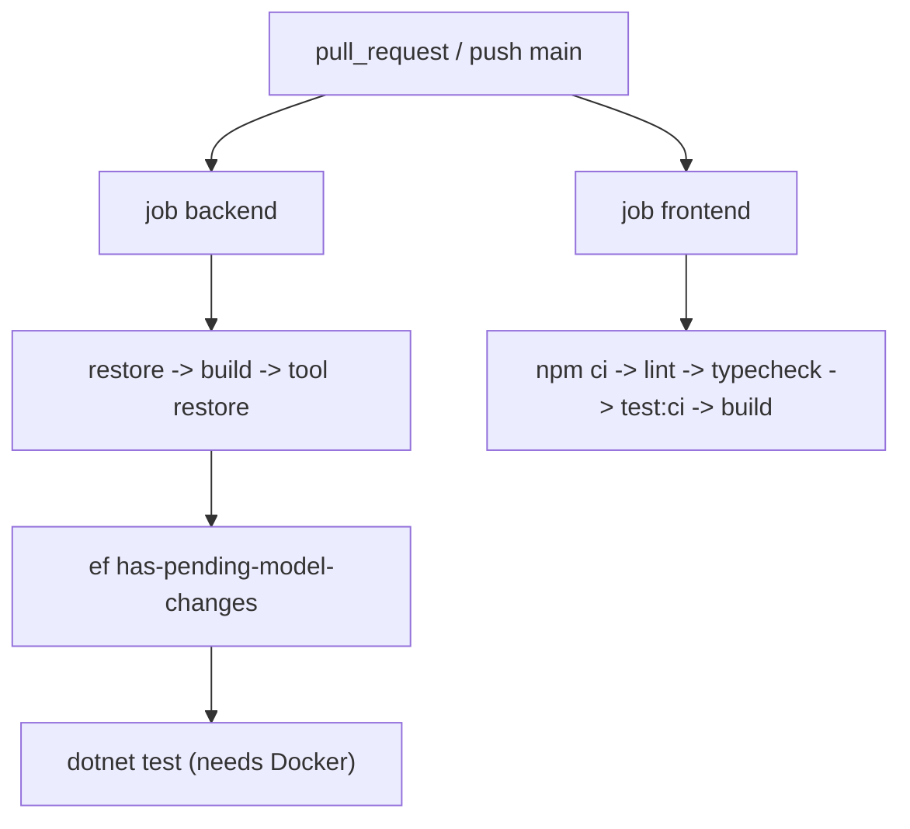

# .github/workflows/ci.yml

## Purpose

Main continuous-integration workflow: builds and tests the backend and the frontend on every pull request and on pushes to `main`.

## Where It Fits

GitHub Actions workflow. Uses `global.json`, `TutoringCentre.slnx`, `.config/dotnet-tools.json`, `frontend/package-lock.json`. The README says `main` is protected and requires these checks (branch protection itself is a GitHub setting and cannot be verified from the repo).

## Walkthrough

**Triggers (lines 3-5):** `pull_request` and `push` to `main`. **`concurrency`:** group `ci-${{ github.ref }}`, `cancel-in-progress: true` - a newer push to the same branch/PR cancels the older run. **`permissions: contents: read`** - least privilege.

**Job `backend`** (ubuntu-latest):
1. `actions/checkout@v6`.
2. `actions/setup-dotnet@v5` with `global-json-file: global.json` - installs the pinned SDK.
3. `dotnet restore TutoringCentre.slnx`.
4. `dotnet build ... --no-restore -c Release`.
5. `dotnet tool restore` - installs `dotnet-ef`.
6. 'Check for model changes without a migration' - env `ConnectionStrings__Postgres: Host=localhost;Database=ci;Username=ci;Password=ci` (comment: design-time comparison needs a valid-looking string but never connects); runs `dotnet ef migrations has-pending-model-changes --project src/TutoringCentre.Infrastructure --startup-project src/TutoringCentre.Api --no-build --configuration Release`. Fails if the EF model differs from `AppDbContextModelSnapshot`.
7. `dotnet test TutoringCentre.slnx --no-build -c Release` - all five test projects, including architecture tests. The Infrastructure/Api tests start PostgreSQL via Testcontainers, which requires a Docker daemon on the runner (GitHub-hosted Ubuntu runners provide one; that is platform knowledge, not shown in this file).

**Job `frontend`** (`defaults.run.working-directory: frontend`): checkout; `actions/setup-node@v6` with `node-version: lts/*`, `cache: npm`, `cache-dependency-path: frontend/package-lock.json`; `npm ci`; `npm run lint`; `npm run typecheck`; `npm run test:ci`; `npm run build`.
The two jobs run in parallel and are independent.

## Concepts Used

### Continuous Integration

#### What it means

CI runs automated build, test and analysis on every change in a clean machine so that regressions are caught before merge. Workflows are YAML files describing jobs (parallel units) made of steps.

(Full tutorial with execution traces: [PROJECT_OVERVIEW.md#11-configuration--environment--deployment](../../../PROJECT_OVERVIEW.md#11-configuration--environment--deployment).)

#### Where it appears in this file

Both jobs.

#### How it works here

GitHub starts a fresh VM per job, runs the steps in order and stops at the first failing step.

#### Why it matters here

Every change proves it builds, passes tests, has migrations for model changes, and satisfies lint/type rules before merging.

## Data and Control Flow

## Configuration and Environment

Environment: `ConnectionStrings__Postgres` (step 6 only; fake value, double underscore = `:` in .NET environment-variable configuration). No repository secrets are used in this workflow.

## Gotchas and Issues

The backend job has no coverage upload and no `dotnet format`/style check. `nuget` restore is not cached. Version tags (`@v6`, `@v5`) float within the major.

## Related Files

- [`global.json`](../../global.json.md)
- [`.config/dotnet-tools.json`](../../.config/dotnet-tools.json.md)
- [`TutoringCentre.slnx`](../../TutoringCentre.slnx.md)
- [`frontend/package.json`](../../frontend/package.json.md)
- [`.github/workflows/codeql.yml`](codeql.yml.md)
- `src/TutoringCentre.Infrastructure/Persistence/Migrations/AppDbContextModelSnapshot.cs` (generated / lockfile / media: no separate explanation, see INDEX)
