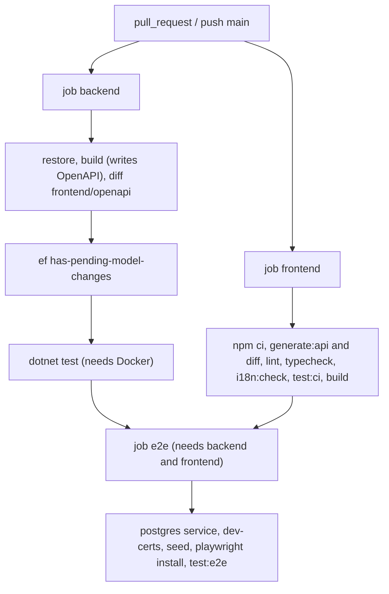

# .github/workflows/ci.yml

## Purpose

Main continuous-integration workflow: builds and tests the backend and the frontend, then runs the Playwright end-to-end journeys, on every pull request and on pushes to `main`.

## Where It Fits

GitHub Actions workflow. Uses `global.json`, `TutoringCentre.slnx`, `.config/dotnet-tools.json`, `frontend/package-lock.json`, the committed `frontend/openapi/TutoringCentre.Api.json` and `frontend/src/api/generated/`. The README says `main` is protected and requires these checks (branch protection itself is a GitHub setting and cannot be verified from the repo).

## Walkthrough

**Triggers (3-6):** `pull_request` and `push` to `main`. **`concurrency`:** group `ci-${{ github.ref }}`, `cancel-in-progress: true`. **`permissions: contents: read`**.

**Job `backend`** (ubuntu-latest): checkout (`actions/checkout@v6`); `actions/setup-dotnet@v5` with `global-json-file`; `dotnet restore TutoringCentre.slnx`; `dotnet build ... --no-restore -c Release` - the Api build also *generates* the OpenAPI document into `frontend/openapi`; new step **'OpenAPI document is up to date'** (35-36): `git diff --exit-code -- frontend/openapi` fails if the build changed the committed document; `dotnet tool restore`; 'Check for model changes without a migration' (`dotnet ef migrations has-pending-model-changes ...` with a fake connection string); `dotnet test TutoringCentre.slnx --no-build -c Release` (needs Docker for Testcontainers).

**Job `frontend`** (`working-directory: frontend`): checkout; `actions/setup-node@v6` (`lts/*`, npm cache); `npm ci`; new **'Generated API client is up to date'** (74-78; the step also runs the generator in `frontend`): `npm run generate:api` then `git diff --exit-code -- src/api/generated`; `npm run lint`; `npm run typecheck`; new **'Translation keys match (en/ar)'** (line 86, `npm run i18n:check`); `npm run test:ci`; `npm run build`.

**Job `e2e`** (new, 95-167): `needs: [backend, frontend]`. A `services.postgres` container (`postgres:17`, `POSTGRES_DB tutoring`, `POSTGRES_USER tutoring_dev`, `POSTGRES_PASSWORD ci-only-throwaway-password`, port 5432, `pg_isready` health check). Job `env`: `ConnectionStrings__Postgres` for that database, `Seed__Password` and `SEED_PASSWORD` both set to a CI-only throwaway seed password (comments: not real credentials; two names because .NET configuration reads `Seed__Password` while the Playwright spec reads `SEED_PASSWORD`). Steps: checkout; setup .NET; setup Node; `dotnet tool restore`; `dotnet dev-certs https` (comment: generate the HTTPS development certificate up front to avoid a first-run race; no `--trust` because that needs an interactive keychain prompt and the dev-server proxy uses `secure: false`); 'Seed the database (centres and staff)' = `dotnet run --project src/TutoringCentre.Api -- seed`; `npm ci`; `npx playwright install --with-deps chromium`; 'Run the E2E auth journeys' = `npm run test:e2e`; on failure `actions/upload-artifact@v4` uploads `frontend/playwright-report/` for 7 days.

## Concepts Used

### Continuous Integration

#### What it means

CI runs automated build, test and analysis on every change in a clean machine so that regressions are caught before merge. Workflows are YAML files describing jobs (parallel units) made of steps.

(Full tutorial with execution traces: [PROJECT_OVERVIEW2.md#11-configuration--environment--deployment](../../../PROJECT_OVERVIEW2.md#11-configuration--environment--deployment).)

#### Where it appears in this file

Three jobs and three 'is it committed' checks.

#### How it works here

Lines 35-36, 74-78, job `e2e` (95-167).

#### Why it matters here

Generated artefacts (OpenAPI, client) cannot silently drift from the code; the e2e job proves the whole stack once per PR.

### End-to-end testing with Playwright

#### What it means

An end-to-end test drives a real browser against a real running system (here the real API, real PostgreSQL and the Vite dev server) and clicks through a user journey. It is slow but catches wiring problems no unit test can.

(Full tutorial with execution traces: [PROJECT_OVERVIEW2.md#635-end-to-end-testing-with-playwright](../../../PROJECT_OVERVIEW2.md#635-end-to-end-testing-with-playwright).)

#### Where it appears in this file

E2E job.

#### How it works here

`e2e` job.

#### Why it matters here

Runs real Chromium against the real API and PostgreSQL after both other jobs pass.

### Secrets and configuration layering

#### What it means

Configuration comes from layered sources (JSON files, user-secrets, environment variables, command line) where later layers override earlier ones. Secrets must stay out of git: this repo keeps the connection string out of `appsettings.json`, reads it from user-secrets or an environment variable, and scans history with gitleaks.

(Full tutorial with execution traces: [PROJECT_OVERVIEW2.md#11-configuration--environment--deployment](../../../PROJECT_OVERVIEW2.md#11-configuration--environment--deployment).)

#### Where it appears in this file

Throwaway credentials in CI.

#### How it works here

`POSTGRES_PASSWORD`, `Seed__Password`, `SEED_PASSWORD`.

#### Why it matters here

They are explicitly labelled CI-only in comments; the database service never leaves the job.

### Contract-first generated API client

#### What it means

The API publishes a machine-readable contract (OpenAPI). A generator turns it into typed client code, so a changed endpoint shape becomes a compile error in the frontend instead of a runtime bug; CI fails if the committed contract or generated code is stale.

(Full tutorial with execution traces: [PROJECT_OVERVIEW2.md#631-contract-first-api-client-generation](../../../PROJECT_OVERVIEW2.md#631-contract-first-api-client-generation).)

#### Where it appears in this file

Staleness checks.

#### How it works here

Two `git diff --exit-code` steps.

#### Why it matters here

A changed endpoint that is not regenerated and committed breaks the build.

## Data and Control Flow

## Configuration and Environment

Environment: `ConnectionStrings__Postgres` (fake in the backend EF step, a real service-container string in `e2e`), `Seed__Password`, `SEED_PASSWORD`, `POSTGRES_*` for the service container (double underscore = `:` in .NET environment-variable configuration). No repository secrets are used.

## Gotchas and Issues

The backend job has no coverage upload and no `dotnet format` check. NuGet restore is not cached. Version tags (`@v6`, `@v5`, `@v4`) float within the major. The `e2e` job installs Chromium on every run (no browser cache).

## Related Files

- [`global.json`](../../global.json.md)
- [`.config/dotnet-tools.json`](../../.config/dotnet-tools.json.md)
- [`TutoringCentre.slnx`](../../TutoringCentre.slnx.md)
- [`frontend/package.json`](../../frontend/package.json.md)
- [`.github/workflows/codeql.yml`](codeql.yml.md)
- `src/TutoringCentre.Infrastructure/Persistence/Migrations/AppDbContextModelSnapshot.cs` (generated / lockfile / media: no separate explanation, see INDEX)
- [`frontend/playwright.config.ts`](../../frontend/playwright.config.ts.md)
- [`frontend/orval.config.ts`](../../frontend/orval.config.ts.md)
- [`frontend/scripts/check-i18n-keys.mjs`](../../frontend/scripts/check-i18n-keys.mjs.md)
