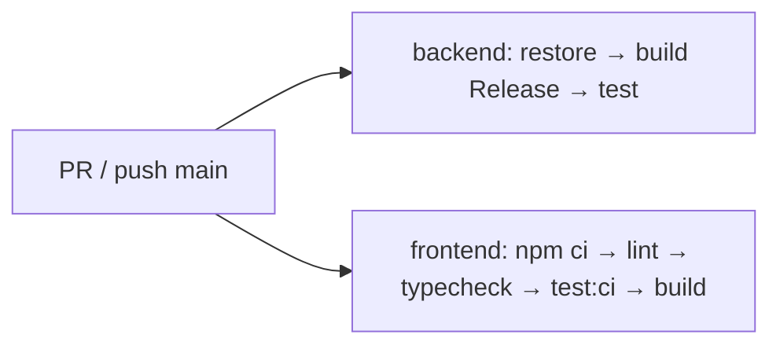

# .github/workflows/ci.yml

## Purpose
The main CI workflow. It builds and tests the backend (including architecture tests) and lints, type-checks, tests and builds the frontend on every pull request and every push to `main`.

## Where it fits
CI/CD. It uses `global.json`, `TutoringCentre.slnx`, `frontend/package-lock.json` and the `frontend/package.json` scripts. `README.md:3` shows its badge, and `README.md:98` presents it as a merge gate.

## Walkthrough
- **Lines 3–6, triggers:** `pull_request` (any branch) and `push` to `main`.
- **Lines 9–11, concurrency:** `group: ci-${{ github.ref }}` with `cancel-in-progress: true`, so a newer push cancels the outdated run.
- **Lines 13–14:** `permissions: contents: read` (least privilege).
- **Job `backend` (lines 17–36), ubuntu-latest:**
  1. checkout@v6.
  2. setup-dotnet@v5 from `global.json`.
  3. `dotnet restore TutoringCentre.slnx`.
  4. `dotnet build --no-restore -c Release`.
  5. `dotnet test --no-build -c Release`.
- **Job `frontend` (lines 38–68)**, with `working-directory: frontend`:
  1. checkout.
  2. setup-node@v6 with `lts/*` and the npm cache keyed on `frontend/package-lock.json`.
  3. `npm ci`.
  4. `npm run lint`.
  5. `npm run typecheck`.
  6. `npm run test:ci`.
  7. `npm run build`.

## Concepts used
- **Concurrency groups** cancel superseded runs.
- **Least-privilege `GITHUB_TOKEN` permissions.**
- **`npm ci`** installs exactly what the lockfile says.

## Data and control flow

## Configuration and environment
No secrets used.

## Gotchas and issues
- Node `lts/*` floats; the README asks for ≥ 22.12.
- No `prettier --check` step, and 9 files are currently unformatted.
- No coverage upload, even though `coverlet.collector` is referenced.
- No database service, so readiness success and real-DB behaviour are never tested in CI.
- ESLint warnings (2 today) don't fail the job.

## Related files
- [codeql.yml](codeql.yml.md)
- [secret-scan.yml](secret-scan.yml.md)
- [global.json](../../global.json.md)
- [frontend/package.json](../../frontend/package.json.md)
