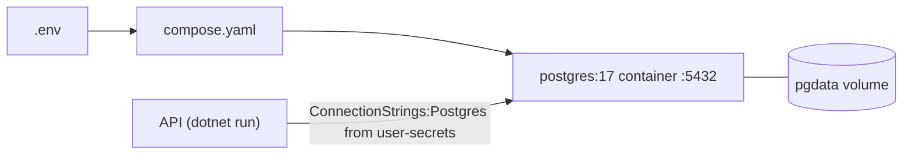

# compose.yaml

## Purpose

Defines the only container this project uses: a local PostgreSQL 17 database for development.

## Where It Fits

Run with `docker compose up -d` (README step 2). Reads `.env`. The API in Development connects to it using the connection string stored in user-secrets. Test projects do **not** use this container; they start their own with Testcontainers.

## Walkthrough

- `services.postgres.image: postgres:17` - official image, major version 17.
- `environment` - `POSTGRES_DB`, `POSTGRES_USER` substituted from `.env`; `POSTGRES_PASSWORD: ${POSTGRES_PASSWORD:?set POSTGRES_PASSWORD in .env}` - the `:?` form aborts Compose with that message when the variable is unset or empty.
- `ports: "5432:5432"` - host port 5432 -> container 5432. A PostgreSQL already listening on 5432 would clash.
- `volumes: pgdata:/var/lib/postgresql/data` - named volume holds the data directory; survives `docker compose down`, deleted by `down -v` (README: 'To reset the database completely').
- `healthcheck` - `pg_isready -U <user> -d <db>` every 5 s, 5 s timeout, 5 retries; `docker compose ps` shows `(healthy)` when ready.
- Top-level `volumes: pgdata:` declares the named volume.
There is no network section (default project network), no restart policy, no application container.

## Concepts Used

### Docker and Docker Compose

#### What it means

A container runs a program in an isolated filesystem from an *image*. Compose describes one or more containers (ports, environment, volumes, healthchecks) in YAML so a dev environment starts with one command. A *named volume* persists data beyond the container's life.

(Full tutorial with execution traces: [PROJECT_OVERVIEW.md#11-configuration--environment--deployment](../PROJECT_OVERVIEW.md#11-configuration--environment--deployment).)

#### Where it appears in this file

Whole file.

#### How it works here

Compose creates a default network, the named volume, then the container; the healthcheck runs inside the container periodically.

#### Why it matters here

Gives every developer an identical database without installing PostgreSQL.

## Data and Control Flow

## Configuration and Environment

Variables used: `POSTGRES_DB`, `POSTGRES_USER`, `POSTGRES_PASSWORD`. Port 5432. Volume `pgdata`.

## Gotchas and Issues

The image tag floats within major 17. Port is published on all host interfaces by default (`5432:5432` without `127.0.0.1:` binding) - fine for a laptop, worth knowing on shared networks (interpretation of Docker's default binding; not visible in the repo).

## Related Files

- [`.env.example`](.env.example.md)
- [`README.md`](README.md.md)
- [`tests/TutoringCentre.Infrastructure.Tests/Fixtures/PostgresFixture.cs`](tests/TutoringCentre.Infrastructure.Tests/Fixtures/PostgresFixture.cs.md)
