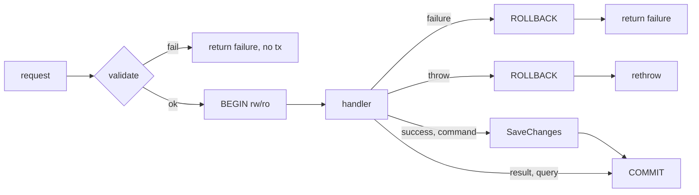

# docs/architecture/overview.md

## Purpose
The project's **rules for failures** (Result values vs exceptions) and the **design of the Dispatcher** pipelines. It is effectively the specification behind `Result`, `Error`, `ErrorKind` and `Dispatcher`.

## Where it fits
Design documentation. Implemented by `src/TutoringCentre.Domain/Common/{Result,Error,ErrorKind}.cs` and `src/TutoringCentre.Application/Common/Cqrs/Dispatcher.cs`. Tested via `docs/notes/pipeline-cases.md` and `DispatcherTests.cs`. Referenced by `later.md:8`.

## Walkthrough
- **Lines 3–23, failures:**
  - Rule (line 5): expected business outcomes are `Result` failures; bugs and infrastructure faults are exceptions, handled once globally.
  - Table (lines 7–15): Validation (`centre.slug_invalid`), NotFound (Week 2), Conflict (duplicate slug, Day 9), Rule (full group, Month 3), Forbidden (non-system actor creating a centre, Week 2), plus bugs and infrastructure faults as exceptions.
  - Kinds are a closed set; each maps to one HTTP status (Day 11).
  - Codes are `<feature>.<reason>`, a public contract.
  - Messages are for developers; users see translated text.
  - Safety: no stack traces, SQL, paths or secrets in codes or messages.
- **Lines 25–48, dispatcher design:**
  - An ASCII diagram of both pipelines.
  - Validation runs before BEGIN, so no DB work happens for invalid input.
  - The transaction wraps the whole handler because of `FOR UPDATE` locks and RLS tenant setting.
  - A throwing query handler causes rollback and rethrow.
  - Only the command pipeline calls SaveChanges, once.
  - Tenant and permission checks go after validation and before BEGIN (Month 2); idempotency comes in Month 6.

## Concepts used
- **Result pattern vs exceptions.**
- **Error codes as an API contract.**
- **Transaction-per-request.**
- **Read-only transactions.**
- **Row-level security.**

## Data and control flow

## Configuration and environment
None.

## Gotchas and issues
- Line 37 says queries "COMMIT → return result". The implementation matches, and also commits when the query handler returns a *failure* Result. That is consistent with the diagram, but worth knowing.

## Related files
- [Dispatcher.cs](../../src/TutoringCentre.Application/Common/Cqrs/Dispatcher.cs.md)
- [Result.cs](../../src/TutoringCentre.Domain/Common/Result.cs.md)
- [Error.cs](../../src/TutoringCentre.Domain/Common/Error.cs.md)
- [pipeline-cases.md](../notes/pipeline-cases.md.md)
