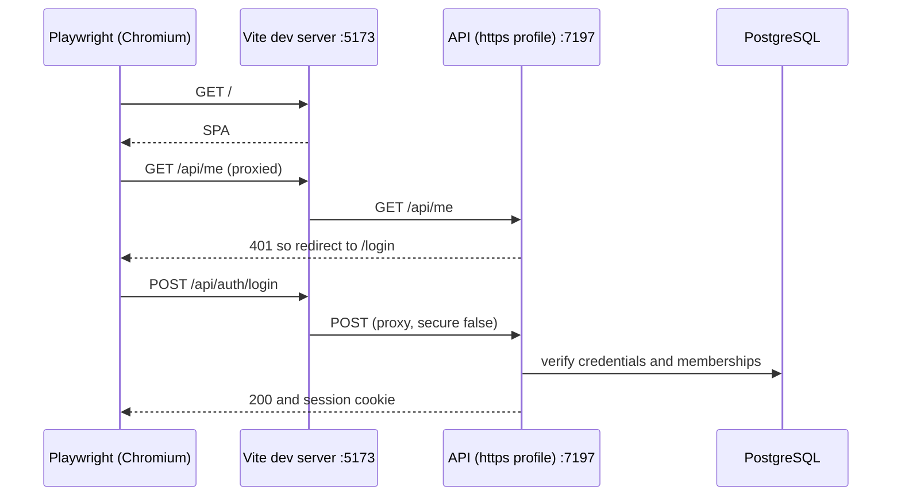

# frontend/e2e/auth.spec.ts

## Purpose

Playwright end-to-end tests of the three authentication journeys against the real API, real PostgreSQL and the Vite dev server.

## Where It Fits

frontend/e2e (outside `src`, so Vitest and the app bundle ignore it: `vite.config.ts` excludes `e2e/**`; `tsconfig.node.json` includes `e2e`). Run by `npm run test:e2e` and by the CI job `e2e` in `.github/workflows/ci.yml`. Configured by `playwright.config.ts`.

## Walkthrough

Top (3-8): the password is read from `process.env.SEED_PASSWORD ?? ""`; if empty the module throws `SEED_PASSWORD must be set...` - the seeded development password is never written in the repository (comment: CI supplies a throwaway, a developer sets their own). Helper `signIn(page, email)` (10-16): goes to `/` (so the guard must redirect to `/login`), asserts the heading `Sign in`, fills `Email` and `Password` by label, clicks `Sign in`.

Tests:
1. `owner: sign in, dashboard, Arabic RTL, logout` (18-32): after signing in as `owner@nile.test` expects heading `Welcome, Nile Owner` and the text `Nile Tutoring Centre`; opens the user menu (button named `Nile Owner`), clicks the language button `العربية`, asserts `<html dir="rtl">`, clicks menu item `تسجيل الخروج`, and expects the Arabic login heading `تسجيل الدخول`. The comment notes the language switcher is a plain button inside the menu, so switching language does not close the menu.
2. `teacher: centre picker, header reflects the choice, switch centre` (34-48): `teacher@both.test` lands on `Choose a centre`; picks `Maadi Learning Hub`; sees the dashboard for that centre; opens the menu, `Switch centre`, picks `Nile Tutoring Centre`.
3. `a wrong password shows the generic error and stays on /login` (50-59): alert text exactly `Incorrect email or password.`, URL matches `/login`.

## Concepts Used

### End-to-end testing with Playwright

#### What it means

An end-to-end test drives a real browser against a real running system (here the real API, real PostgreSQL and the Vite dev server) and clicks through a user journey. It is slow but catches wiring problems no unit test can.

(Full tutorial with execution traces: [PROJECT_OVERVIEW2.md#635-end-to-end-testing-with-playwright](../../../PROJECT_OVERVIEW2.md#635-end-to-end-testing-with-playwright).)

#### Where it appears in this file

The whole file.

#### How it works here

`import { type Page, expect, test } from "@playwright/test"`; tests use accessible roles and labels (`getByRole`, `getByLabel`), not CSS selectors.

#### Why it matters here

These tests cross every layer at once: browser, Vite proxy, HTTPS API, cookies, CSRF, database, RTL switching.

### Secrets and configuration layering

#### What it means

Configuration comes from layered sources (JSON files, user-secrets, environment variables, command line) where later layers override earlier ones. Secrets must stay out of git: this repo keeps the connection string out of `appsettings.json`, reads it from user-secrets or an environment variable, and scans history with gitleaks.

(Full tutorial with execution traces: [PROJECT_OVERVIEW2.md#11-configuration--environment--deployment](../../../PROJECT_OVERVIEW2.md#11-configuration--environment--deployment).)

#### Where it appears in this file

Password from the environment.

#### How it works here

Lines 3-8.

#### Why it matters here

The suite refuses to run without `SEED_PASSWORD`, so no password is committed; the value must equal the API's `Seed:Password` used to seed users.

### Internationalisation (i18next) and RTL layout

#### What it means

i18n moves all user-visible text into per-language resource files looked up by key. Arabic is right-to-left, so direction is set on the document and layout uses logical CSS properties (`start`/`end`) that flip automatically.

(Full tutorial with execution traces: [PROJECT_OVERVIEW2.md#634-internationalisation-and-right-to-left-layout](../../../PROJECT_OVERVIEW2.md#634-internationalisation-and-right-to-left-layout).)

#### Where it appears in this file

Arabic and RTL assertions.

#### How it works here

Lines 27-31.

#### Why it matters here

Verifies `dir="rtl"` on the document and translated strings end to end, which unit tests only approximate.

### Frontend route guards, session state and global 401 handling

#### What it means

A *route guard* decides, before a page renders, whether the user may see it (here by reading the session query and redirecting). It only shapes the UI; the API remains the security boundary. A *global 401 handler* reacts to any request that finds the session gone.

(Full tutorial with execution traces: [PROJECT_OVERVIEW2.md#632-frontend-sessions-route-guards-and-global-401-handling](../../../PROJECT_OVERVIEW2.md#632-frontend-sessions-route-guards-and-global-401-handling).)

#### Where it appears in this file

Redirect from `/` to `/login` and `/select-centre`.

#### How it works here

Lines 11-12 and 37.

#### Why it matters here

Proves the route guards plus the session cookie work together in a real browser.

## Data and Control Flow

## Configuration and Environment

`SEED_PASSWORD` (required). Base URL `http://localhost:5173` and the web servers come from `playwright.config.ts`.

## Gotchas and Issues

The tests assume the database was seeded (users `owner@nile.test`, `teacher@both.test`, centres `Nile Tutoring Centre`, `Maadi Learning Hub`) with the same password; the CI job seeds it before running. The three tests run `fullyParallel` per the config but share one database; none changes data other than session state.

## Related Files

- [`frontend/playwright.config.ts`](../playwright.config.ts.md)
- [`.github/workflows/ci.yml`](../../.github/workflows/ci.yml.md)
- [`frontend/src/routes/login.tsx`](../src/routes/login.tsx.md)
- [`frontend/src/routes/select-centre.tsx`](../src/routes/select-centre.tsx.md)
- [`frontend/src/features/shell/AppShell.tsx`](../src/features/shell/AppShell.tsx.md)
- [`src/TutoringCentre.Api/Cli/SeedCommand.cs`](../../src/TutoringCentre.Api/Cli/SeedCommand.cs.md)
