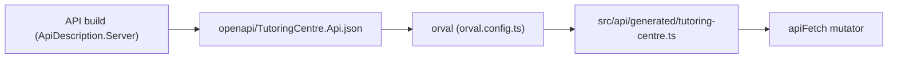

# frontend/orval.config.ts

## Purpose

Configuration of Orval, the tool that generates the typed React Query client from the API's OpenAPI document.

## Where It Fits

frontend root. Run by `npm run generate:api`; CI re-runs it and fails if the committed `src/api/generated/tutoring-centre.ts` differs. Input is `openapi/TutoringCentre.Api.json` (generated by the API build). Included by `tsconfig.node.json`.

## Walkthrough

`defineConfig({ tutoringCentre: { input, output } })`. Input target `./openapi/TutoringCentre.Api.json`. Output: `client: "react-query"` (generates `useQuery`/`useMutation` hooks and plain functions), `httpClient: "fetch"`, `mode: "single"` (one file), `target: "./src/api/generated/tutoring-centre.ts"`, `clean: true` (deletes stale output). `override.mutator = { path: "./src/api/apiFetch.ts", name: "apiFetch" }` - every generated request calls `apiFetch`, which is the only place HTTP errors become `ApiError` and where CSRF is attached. `override.fetch.includeHttpResponseReturnType: false` - because `apiFetch` returns the parsed body, generated function types describe the body only (not `{ data, status, headers }`).

## Concepts Used

### Contract-first generated API client

#### What it means

The API publishes a machine-readable contract (OpenAPI). A generator turns it into typed client code, so a changed endpoint shape becomes a compile error in the frontend instead of a runtime bug; CI fails if the committed contract or generated code is stale.

(Full tutorial with execution traces: [PROJECT_OVERVIEW2.md#631-contract-first-api-client-generation](../../PROJECT_OVERVIEW2.md#631-contract-first-api-client-generation).)

#### Where it appears in this file

The generator configuration.

#### How it works here

Lines 5-18.

#### Why it matters here

Turns the committed OpenAPI contract into typed client code, so frontend and backend cannot silently drift.

### Server state with TanStack Query

#### What it means

Server state (data owned by the API) needs caching, refetching, retry and loading/error flags. `useQuery` subscribes a component to a cache entry addressed by a *query key*, runs the `queryFn`, and re-renders the component when the entry changes.

(Full tutorial with execution traces: [PROJECT_OVERVIEW2.md#617-frontend-concepts-react-server-state-and-routing](../../PROJECT_OVERVIEW2.md#617-frontend-concepts-react-server-state-and-routing).)

#### Where it appears in this file

`client: "react-query"`.

#### How it works here

Line 7.

#### Why it matters here

Generated hooks such as `useGetSystemInfo`, `useLogin`, `useGetMe` are TanStack Query hooks.

## Data and Control Flow

## Configuration and Environment

None at runtime. Paths are relative to `frontend/`.

## Gotchas and Issues

The generated file is excluded from ESLint and Prettier (`eslint.config.js`, `.prettierignore`) because it is overwritten by the tool.

## Related Files

- `frontend/openapi/TutoringCentre.Api.json` (generated / lockfile / media: no separate explanation, see INDEX)
- `frontend/src/api/generated/tutoring-centre.ts` (generated / lockfile / media: no separate explanation, see INDEX)
- [`frontend/src/api/apiFetch.ts`](src/api/apiFetch.ts.md)
- [`frontend/package.json`](package.json.md)
- [`.github/workflows/ci.yml`](../.github/workflows/ci.yml.md)
