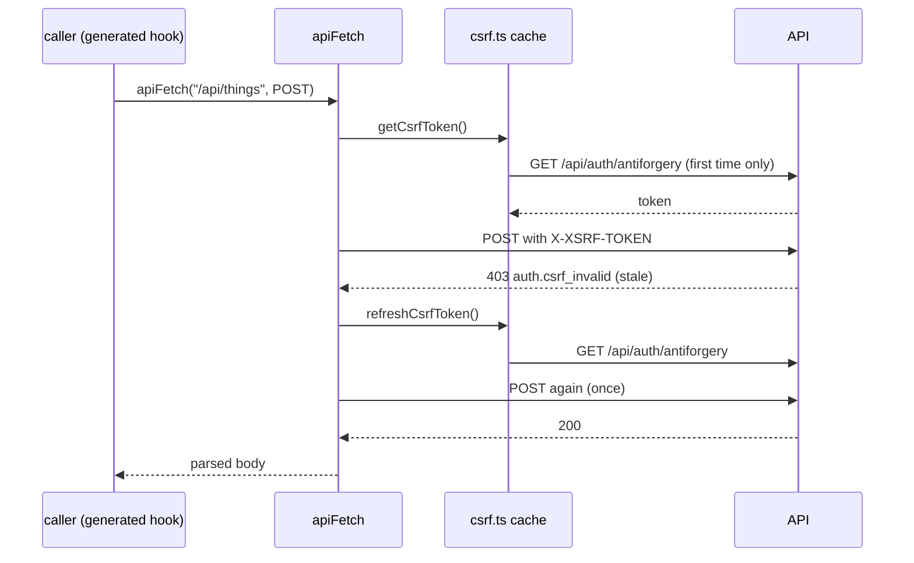

# frontend/src/api/apiFetch.ts

## Purpose

The only function that talks to the API: wraps `fetch`, attaches the CSRF header to unsafe methods, retries once on a stale token, and turns every failure into a typed `ApiError`.

## Where It Fits

frontend/src/api. It is the Orval `mutator` (see `orval.config.ts`), so every generated client call goes through it. Depends on `csrf.ts` (token cache), `errors.ts` (types) and `problemDetails.ts` (type guard). Consumed by generated hooks, `asApiError` callers in features and routes, and `queryClient.ts`.

## Walkthrough

- `CsrfHeaderName = "X-XSRF-TOKEN"` (5); `SessionChangingPaths = {"/api/auth/login","/api/auth/logout","/api/session/centre"}` (8) - the token is bound to the signed-in user, so these three requests invalidate it.
- `class ApiRequestError extends Error implements ApiError` (14-34): copies `kind`, `code`, `status` and (only when defined) `fieldErrors`, `correlationId`; extends `Error` so the lint rule `only-throw-error` is satisfied.
- `kindFromStatus(status)` (37-54): 400 validation, 401 unauthenticated, 403 forbidden, 404 notFound, 409 conflict, 422 rule, default unexpected - the backend table in `ResultHttpExtensions` mirrored in one place.
- `toApiError(body, status)` (57-75): a Problem Details body gives `{ kind, code: body.code ?? "http.<status>", message: body.detail ?? body.title, status, fieldErrors?, correlationId? }`; anything else is `unexpected` with the fixed message `The server returned an unexpected response.`
- `asApiError(error)` (78-89): returns the error if it is an `ApiRequestError`, else a generic `client.unexpected` error with status 0.
- `readBody` (91-102): reads text; empty -> `undefined`; JSON parse failure -> `undefined`.
- `isCsrfError` (104-106): `ApiRequestError` with status 403 and code `auth.csrf_invalid`.
- `buildHeaders(init, attachCsrfToken)` (108-121): copies headers; sets `Accept: application/json` if absent; sets `Content-Type: application/json` when there is a body and none was given; when asked, sets `X-XSRF-TOKEN` from `getCsrfToken()`.
- `sendOnce` (123-148): `fetch(url, { credentials: "same-origin", ...init, headers })`; a thrown fetch error becomes `network.unreachable` (status 0); 204 returns `undefined`; a JSON body on success is cast to `T`; otherwise throws `ApiRequestError(toApiError(body, status))`.
- `apiFetch<T>(url, init)` (158-179): `isUnsafe = method is not GET/HEAD`; sends once; if it throws, the request was unsafe and the error is a CSRF error, it calls `refreshCsrfToken()` and sends exactly one more time (a second failure is thrown as is); after success of an unsafe request to one of the `SessionChangingPaths` it calls `void refreshCsrfToken()` (fire-and-forget).

## Concepts Used

### CSRF protection with antiforgery tokens

#### What it means

Because browsers attach cookies automatically, a malicious *other* site can make the victim's browser send a state-changing request. CSRF protection adds a second, explicit proof that the request came from the application's own script: a token that must be sent in a header, which a foreign site cannot read or set.

(Full tutorial with execution traces: [PROJECT_OVERVIEW2.md#625-csrf-protection-double-submit-antiforgery-tokens](../../../../PROJECT_OVERVIEW2.md#625-csrf-protection-double-submit-antiforgery-tokens).)

#### Where it appears in this file

Attaching and healing the token.

#### How it works here

Lines 116-118, 154-156 (comment), 164-176.

#### Why it matters here

Every state-changing request carries the header the server's endpoint filter demands; a token that went stale after login/logout is replaced and the request is repeated once, invisibly to the caller.

### Problem Details (RFC 9457) and centralised error handling

#### What it means

Problem Details is a standard JSON error shape (`title`, `status`, `detail`, extensions) served as `application/problem+json`. Centralising error writing in one place keeps every error response uniform and prevents leaking internals.

(Full tutorial with execution traces: [PROJECT_OVERVIEW2.md#612-http-problem-details-and-error-handling](../../../../PROJECT_OVERVIEW2.md#612-http-problem-details-and-error-handling).)

#### Where it appears in this file

Parsing Problem Details.

#### How it works here

`toApiError` (57-75) and `kindFromStatus` (37-54).

#### Why it matters here

The backend always answers failures as Problem Details with a stable `code`; the UI branches on `code`/`kind`, never on message text.

### The Result pattern (failures as values)

#### What it means

Expected business failures (invalid input, duplicate, not allowed) are returned as ordinary values - a `Result` holding either a value or an `Error` - instead of thrown. Exceptions are reserved for bugs and infrastructure faults. The caller's code must look at the result, so the failure path cannot be forgotten, and no exception-handling cost or hidden control flow is involved.

(Full tutorial with execution traces: [PROJECT_OVERVIEW2.md#64-the-result-pattern-failures-as-values](../../../../PROJECT_OVERVIEW2.md#64-the-result-pattern-failures-as-values).)

#### Where it appears in this file

Failure as a typed value on the client.

#### How it works here

`ApiRequestError implements ApiError`.

#### Why it matters here

Components `catch` an unknown value and call `asApiError` to get the structured error - the client-side mirror of the backend `Result`/`Error`.

### Contract-first generated API client

#### What it means

The API publishes a machine-readable contract (OpenAPI). A generator turns it into typed client code, so a changed endpoint shape becomes a compile error in the frontend instead of a runtime bug; CI fails if the committed contract or generated code is stale.

(Full tutorial with execution traces: [PROJECT_OVERVIEW2.md#631-contract-first-api-client-generation](../../../../PROJECT_OVERVIEW2.md#631-contract-first-api-client-generation).)

#### Where it appears in this file

Mutator for generated code.

#### How it works here

Signature `apiFetch<T>(url, init)` matches what Orval calls.

#### Why it matters here

One choke point for headers, errors and CSRF for every generated hook.

### async/await and cancellation

#### What it means

`async`/`await` lets a method wait for I/O (database, network) without blocking a thread: the method returns a `Task`, and execution resumes after the awaited operation completes. A `CancellationToken` is a cooperative signal (for example, the HTTP request was aborted) passed down so work can stop early.

(Full tutorial with execution traces: [PROJECT_OVERVIEW2.md#63-cqrs-and-the-hand-written-dispatcher](../../../../PROJECT_OVERVIEW2.md#63-cqrs-and-the-hand-written-dispatcher).)

#### Where it appears in this file

`async` functions and promise handling.

#### How it works here

`void refreshCsrfToken()` at line 175; `await` elsewhere.

#### Why it matters here

`void` marks an intentionally unawaited promise (lint rule) - the refresh happens in the background and `getCsrfToken` will await the pending promise.

## Data and Control Flow

## Configuration and Environment

`credentials: "same-origin"` so cookies travel only to the same origin (the Vite origin in development, proxied to the API).

## Gotchas and Issues

A `GET` is never retried. A retry only happens for a CSRF error on an unsafe request, so a login that fails with 401 is not retried. Success bodies are *trusted* to match the contract (`body as T`); a contract violation would not be caught here.

## Related Files

- [`frontend/src/api/csrf.ts`](csrf.ts.md)
- [`frontend/src/api/errors.ts`](errors.ts.md)
- [`frontend/src/api/problemDetails.ts`](problemDetails.ts.md)
- [`frontend/src/api/apiFetch.test.ts`](apiFetch.test.ts.md)
- `frontend/src/api/generated/tutoring-centre.ts` (generated / lockfile / media: no separate explanation, see INDEX)
- [`frontend/orval.config.ts`](../../orval.config.ts.md)
- [`src/TutoringCentre.Api/Http/ResultHttpExtensions.cs`](../../../src/TutoringCentre.Api/Http/ResultHttpExtensions.cs.md)
