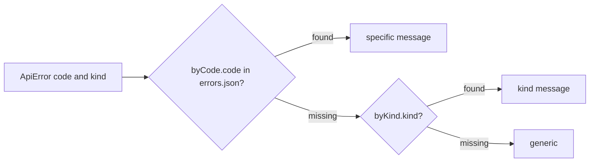

# frontend/src/api/errorMessages.ts

## Purpose

Turns an `ApiError` into user-facing text in the current language via i18next, with a three-level fallback.

## Where It Fits

frontend/src/api. Used by `showApiError.ts`, `SystemInfoCard.tsx` and `routes/login.tsx`; tested by `errorMessages.test.ts`. Reads the `errors` namespace from `src/i18n/locales/{en,ar}/errors.json`.

## Walkthrough

`Namespace = "errors"` (4). `messageFor(error)` (7-19): (1) `i18next.t("byCode.<error.code>", { ns, defaultValue: "" })` - non-empty wins; (2) else `byKind.<error.kind>`; (3) else `t("generic")`. Because the key contains dots (`centre.slug_invalid`) and i18next uses dots as nested-key separators, the JSON is nested (`byCode.centre.slug_invalid`). The language is whatever i18next currently uses, so there is no `lang` parameter any more.

## Concepts Used

### Internationalisation (i18next) and RTL layout

#### What it means

i18n moves all user-visible text into per-language resource files looked up by key. Arabic is right-to-left, so direction is set on the document and layout uses logical CSS properties (`start`/`end`) that flip automatically.

(Full tutorial with execution traces: [PROJECT_OVERVIEW2.md#634-internationalisation-and-right-to-left-layout](../../../../PROJECT_OVERVIEW2.md#634-internationalisation-and-right-to-left-layout).)

#### Where it appears in this file

Lookup by code, then kind, then generic.

#### How it works here

Lines 7-19.

#### Why it matters here

The backend owns stable codes; the frontend owns wording and language. A missing code degrades to a kind-level sentence, not a blank.

### Problem Details (RFC 9457) and centralised error handling

#### What it means

Problem Details is a standard JSON error shape (`title`, `status`, `detail`, extensions) served as `application/problem+json`. Centralising error writing in one place keeps every error response uniform and prevents leaking internals.

(Full tutorial with execution traces: [PROJECT_OVERVIEW2.md#612-http-problem-details-and-error-handling](../../../../PROJECT_OVERVIEW2.md#612-http-problem-details-and-error-handling).)

#### Where it appears in this file

Stable `code` as the translation key.

#### How it works here

`byCode.${error.code}`.

#### Why it matters here

Wording can change without touching the backend.

## Data and Control Flow

## Configuration and Environment

None. The file reads no environment variables and declares no configuration keys, URLs, ports or credentials.

## Gotchas and Issues

The `errors.json` `byCode` list contains the validation and `centre.*` codes only; auth codes (`auth.invalid_credentials`, `auth.rate_limited`, `auth.csrf_invalid`, `tenant.no_membership`) have no `byCode` entry, so they fall back to `byKind` (the login page handles the first two itself with its own `auth` namespace strings).

## Related Files

- [`frontend/src/api/errors.ts`](errors.ts.md)
- [`frontend/src/api/errorMessages.test.ts`](errorMessages.test.ts.md)
- [`frontend/src/i18n/index.ts`](../i18n/index.ts.md)
- [`frontend/src/i18n/locales/en/errors.json`](../i18n/locales/en/errors.json.md)
- [`frontend/src/i18n/locales/ar/errors.json`](../i18n/locales/ar/errors.json.md)
