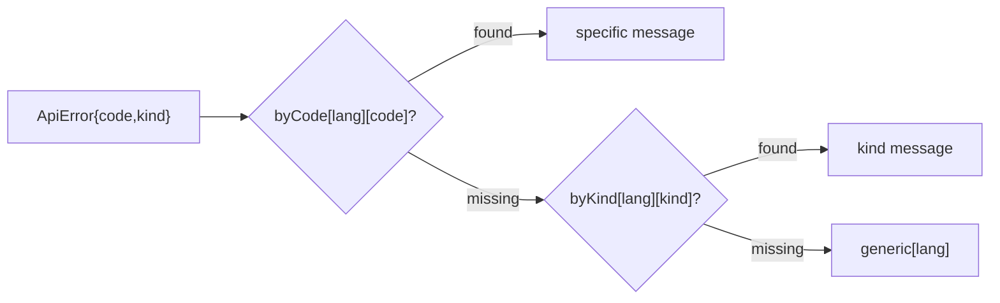

# frontend/src/api/errorMessages.ts

## Purpose

Turns an `ApiError` into user-facing text in English or Arabic using a three-level fallback.

## Where It Fits

frontend/src/api. Tested by `errorMessages.test.ts`; **not called by any component yet**.

## Walkthrough

Types `Lang = "en" | "ar"` and `Dictionary = Partial<Record<string,string>>`. Dictionaries: `byCode` (en/ar) for `validation.failed`, `centre.name_required`, `centre.name_too_long`, `centre.slug_invalid`, `centre.time_zone_invalid`, `centre.slug_taken`, `centre.create_forbidden` (matching backend codes); `byKind` for validation/notFound/conflict/rule/forbidden/unexpected; `generic`. `messageFor(error, lang)` = `byCode[lang][error.code] ?? byKind[lang][error.kind] ?? generic[lang]` - most specific wins (nullish coalescing). Comment: backend owns stable codes, frontend owns wording and language; Arabic strings are placeholders until i18n files (Day 17). `noUncheckedIndexedAccess` makes the lookups `string | undefined`, which is why `??` is required.

## Concepts Used

### Strict TypeScript and type-aware linting

#### What it means

TypeScript checks types at build time; `strict` and extra flags such as `noUncheckedIndexedAccess` make unsafe patterns compile errors. Type-aware ESLint rules use the compiler's type information to catch more bugs.

(Full tutorial with execution traces: [PROJECT_OVERVIEW.md#617-frontend-concepts-react-server-state-and-routing](../../../../PROJECT_OVERVIEW.md#617-frontend-concepts-react-server-state-and-routing).)

#### Where it appears in this file

`Partial<Record<...>>` + `??`.

#### How it works here

Dictionaries and `messageFor`.

#### Why it matters here

Type system forces handling missing keys.

### Problem Details (RFC 9457) and centralised error handling

#### What it means

Problem Details is a standard JSON error shape (`title`, `status`, `detail`, extensions) served as `application/problem+json`. Centralising error writing in one place keeps every error response uniform and prevents leaking internals.

(Full tutorial with execution traces: [PROJECT_OVERVIEW.md#612-http-problem-details-and-error-handling](../../../../PROJECT_OVERVIEW.md#612-http-problem-details-and-error-handling).)

#### Where it appears in this file

Code-to-text translation.

#### How it works here

`byCode`.

#### Why it matters here

Backend never ships user-facing prose.

## Data and Control Flow

## Configuration and Environment

None. The file reads no environment variables and declares no configuration keys, URLs, ports or credentials.

## Gotchas and Issues

Dead code until a form/toast calls it. Codes are duplicated here and in the backend; a renamed backend code silently falls back to the kind message.

## Related Files

- [`frontend/src/api/errors.ts`](errors.ts.md)
- [`frontend/src/api/errorMessages.test.ts`](errorMessages.test.ts.md)
- [`src/TutoringCentre.Domain/Centres/Centre.cs`](../../../src/TutoringCentre.Domain/Centres/Centre.cs.md)
