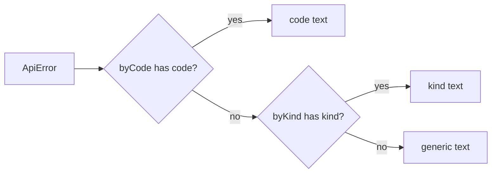

# frontend/src/api/errorMessages.ts

## Purpose
`messageFor(error, lang)` is described as "the one function every form and toast uses to turn an ApiError into user-facing text" (line 51). It looks up a message by **code**, then by **kind**, then falls back to a generic message, in English or Arabic. The backend owns the codes; the frontend owns wording and language (line 7).

## Where it fits
Shared `src/api/` layer. It consumes `ApiError`. It translates the codes produced by `Centre.Create` and `Dispatcher.ValidateAsync`. Tested by `errorMessages.test.ts`. **Not yet called by any UI.**

## Walkthrough
- **Line 3:** `export type Lang = "en" | "ar"`.
- **Line 5:** `type Dictionary = Partial<Record<string, string>>`. `Partial` makes lookups return `string | undefined`, which suits `noUncheckedIndexedAccess`.
- **Lines 9–25, `byCode`:** en and ar texts for `validation.failed`, `centre.name_required`, `centre.name_too_long`, `centre.slug_invalid` ("web address…") and `centre.time_zone_invalid`. The comment says the Arabic strings are placeholders until Day 17 (i18n files).
- **Lines 27–44, `byKind`:** one message per `ErrorKind`, including `unexpected`.
- **Lines 46–49:** `generic` fallback per language.
- **Lines 52–54:** `byCode[lang][error.code] ?? byKind[lang][error.kind] ?? generic[lang]`.

## Concepts used
- **Code-based translation:** stable codes decouple backend messages from UI wording.
- **Nullish-coalescing fallback chain.**

## Data and control flow

## Configuration and environment
None.

## Gotchas and issues
- **The name limit is duplicated:** "120" is hard-coded in the text, mirroring `Centre.NameMaxLength`.
- **To be replaced:** the inline dictionaries go when i18next arrives (Day 17).

## Related files
- [errors.ts](errors.ts.md)
- [errorMessages.test.ts](errorMessages.test.ts.md)
- [Centre.cs](../../../src/TutoringCentre.Domain/Centres/Centre.cs.md)
