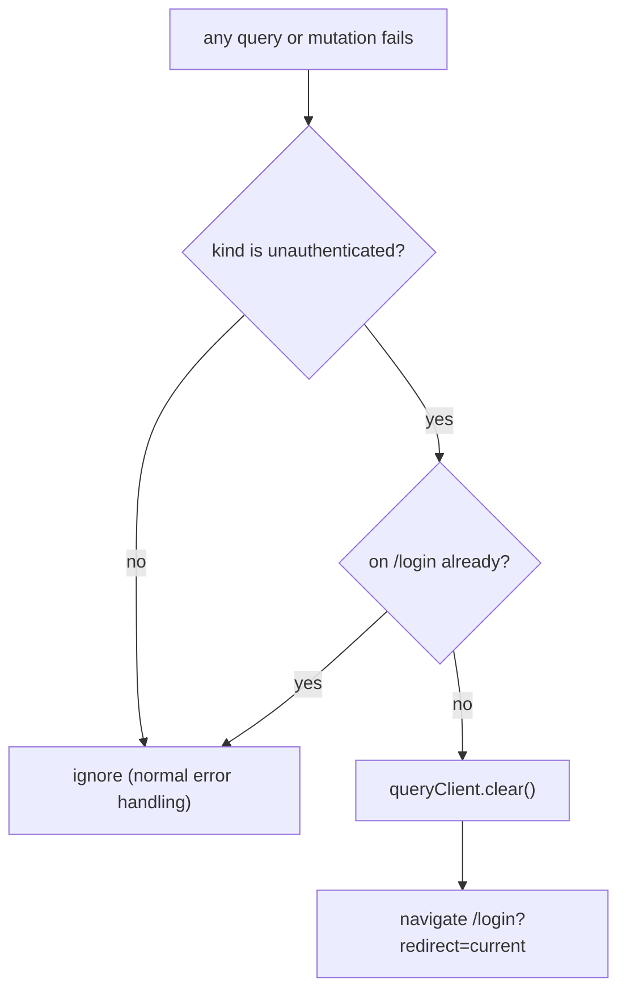

# frontend/src/app/queryClient.ts

## Purpose

Creates the shared TanStack Query client with project-wide defaults and global handling of expired sessions.

## Where It Fits

frontend/src/app. `queryClient` (the exported instance) is imported by `main.tsx`; `createAppQueryClient` by `test/renderRouter.tsx`; `setLoginRedirect` by both. Depends on `asApiError` and the generated `getLoginMutationKey`.

## Walkthrough

`loginRedirect` (7) is a module variable set once through `setLoginRedirect` (9-11). `loginMutationKey = getLoginMutationKey()` (13) and `isLoginMutation` (15-17) compare mutation keys by JSON so the login mutation can be excluded. `createAppQueryClient()` (28-71): `self` holder object so error handlers defined before the client exists can reach it (30-31); `handleSessionExpiry(error)` (33-44): ignore errors whose `asApiError(error).kind !== "unauthenticated"`; ignore when `window.location.pathname === "/login"` (no redirect loop); otherwise `self.client?.clear()` and `loginRedirect?.(pathname + search)`. The client (46-67): default queries `retry: 1`, `staleTime: 30_000`; `queryCache.onError` calls `handleSessionExpiry`; `mutationCache.onError` skips the login mutation (a wrong password is an expected 401) and otherwise calls `handleSessionExpiry`. `export const queryClient = createAppQueryClient()` (74). The doc comment: a session can end server-side at any time (revocation), so *any* request can come back unauthenticated; the login mutation and the `me` query handle 401 themselves (the session query resolves to `null`, it never throws).

## Concepts Used

### Frontend route guards, session state and global 401 handling

#### What it means

A *route guard* decides, before a page renders, whether the user may see it (here by reading the session query and redirecting). It only shapes the UI; the API remains the security boundary. A *global 401 handler* reacts to any request that finds the session gone.

(Full tutorial with execution traces: [PROJECT_OVERVIEW2.md#632-frontend-sessions-route-guards-and-global-401-handling](../../../../PROJECT_OVERVIEW2.md#632-frontend-sessions-route-guards-and-global-401-handling).)

#### Where it appears in this file

Global 401 handling.

#### How it works here

Lines 33-44 and 53-66.

#### Why it matters here

One place turns 'the server says we are not signed in' into: clear all cached data and go to `/login?redirect=<current page>`.

### Server state with TanStack Query

#### What it means

Server state (data owned by the API) needs caching, refetching, retry and loading/error flags. `useQuery` subscribes a component to a cache entry addressed by a *query key*, runs the `queryFn`, and re-renders the component when the entry changes.

(Full tutorial with execution traces: [PROJECT_OVERVIEW2.md#617-frontend-concepts-react-server-state-and-routing](../../../../PROJECT_OVERVIEW2.md#617-frontend-concepts-react-server-state-and-routing).)

#### Where it appears in this file

Default options and cache callbacks.

#### How it works here

Lines 46-67.

#### Why it matters here

`QueryCache`/`MutationCache` `onError` run for every query/mutation in the app.

### React components, props, state and re-rendering

#### What it means

A component is a function returning UI from props and state. When state a component depends on changes, React calls the function again (a re-render) and updates only the DOM that differs.

(Full tutorial with execution traces: [PROJECT_OVERVIEW2.md#617-frontend-concepts-react-server-state-and-routing](../../../../PROJECT_OVERVIEW2.md#617-frontend-concepts-react-server-state-and-routing).)

#### Where it appears in this file

Why a factory.

#### How it works here

Doc comment 25-27.

#### Why it matters here

Tests get a fresh client with the real expiry wiring instead of a reimplementation.

## Data and Control Flow

## Configuration and Environment

None. The file reads no environment variables and declares no configuration keys, URLs, ports or credentials.

## Gotchas and Issues

The login mutation is excluded by comparing JSON of its mutation key. The `me` query never throws on 401 (`meQueryOptions`), so an expired session found by the guard goes through the guard's own redirect instead.

## Related Files

- [`frontend/src/main.tsx`](../main.tsx.md)
- [`frontend/src/api/apiFetch.ts`](../api/apiFetch.ts.md)
- [`frontend/src/features/session/meQueryOptions.ts`](../features/session/meQueryOptions.ts.md)
- [`frontend/src/test/renderRouter.tsx`](../test/renderRouter.tsx.md)
- `frontend/src/api/generated/tutoring-centre.ts` (generated / lockfile / media: no separate explanation, see INDEX)
