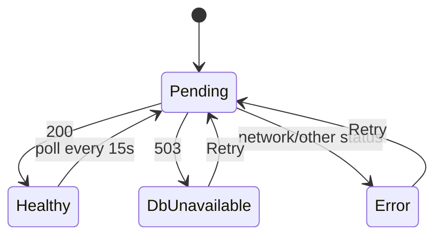

# frontend/src/features/status/StatusCard.tsx

## Purpose

Renders the API status in four states: loading, cannot reach API, database unavailable, healthy.

## Where It Fits

frontend/src/features/status. Used by `routes/index.tsx`. Depends on `useReadiness` and the shadcn `Alert`, `Button`, `Card`, `Skeleton` components.

## Walkthrough

`readiness = useReadiness()`; `retry = () => { void readiness.refetch(); }` (`void` marks the promise as intentionally unawaited - a lint rule requirement). Branches in order:
1. `isPending` (14) -> `
` with two `Skeleton`s.
2. `isError` (23) -> destructive `Alert` 'Cannot reach the API' with a Retry `Button`.
3. `readiness.data.state === "unavailable"` (37) -> amber `Alert` 'API is running but the database is unavailable', 'Start PostgreSQL, then try again.', Retry.
4. otherwise -> `Card` with a green dot, 'Healthy', 'API and database are reachable', and 'Last checked at {checkedAt.toLocaleTimeString()}'.
After the first two early returns TypeScript narrows `readiness.data` to defined (the query result is a discriminated union). Re-render: when the query state changes (refetch result, Retry click), the observer notifies React which re-runs this function; a new `checkedAt` changes the text.

## Concepts Used

### React components, props, state and re-rendering

#### What it means

A component is a function returning UI from props and state. When state a component depends on changes, React calls the function again (a re-render) and updates only the DOM that differs.

(Full tutorial with execution traces: [PROJECT_OVERVIEW.md#617-frontend-concepts-react-server-state-and-routing](../../../../../PROJECT_OVERVIEW.md#617-frontend-concepts-react-server-state-and-routing).)

#### Where it appears in this file

Conditional rendering by state.

#### How it works here

Four returns.

#### Why it matters here

Every query state renders something (README rule).

### Server state with TanStack Query

#### What it means

Server state (data owned by the API) needs caching, refetching, retry and loading/error flags. `useQuery` subscribes a component to a cache entry addressed by a *query key*, runs the `queryFn`, and re-renders the component when the entry changes.

(Full tutorial with execution traces: [PROJECT_OVERVIEW.md#617-frontend-concepts-react-server-state-and-routing](../../../../../PROJECT_OVERVIEW.md#617-frontend-concepts-react-server-state-and-routing).)

#### Where it appears in this file

Reading query flags.

#### How it works here

`isPending`, `isError`, `data`.

#### Why it matters here

UI is a pure function of query state.

### Tailwind, shadcn/ui and variants

#### What it means

Tailwind composes styles from small utility classes. shadcn/ui copies component source into your repo; `cva` (class-variance-authority) maps variant props like `variant="outline"` to class strings.

(Full tutorial with execution traces: [PROJECT_OVERVIEW.md#617-frontend-concepts-react-server-state-and-routing](../../../../../PROJECT_OVERVIEW.md#617-frontend-concepts-react-server-state-and-routing).)

#### Where it appears in this file

shadcn components + utility classes.

#### How it works here

`Alert`, `Card`, classes like `w-full max-w-md`.

#### Why it matters here

Consistent look.

## Data and Control Flow

## Configuration and Environment

None. The file reads no environment variables and declares no configuration keys, URLs, ports or credentials.

## Gotchas and Issues

Accessible: `role="status"`, `aria-hidden` on the decorative dot. Text is English-only and hard-coded (i18n planned).

## Related Files

- [`frontend/src/features/status/useReadiness.ts`](useReadiness.ts.md)
- [`frontend/src/features/status/StatusCard.test.tsx`](StatusCard.test.tsx.md)
- [`frontend/src/components/ui/alert.tsx`](../../components/ui/alert.tsx.md)
- [`frontend/src/components/ui/card.tsx`](../../components/ui/card.tsx.md)
- [`frontend/src/components/ui/button.tsx`](../../components/ui/button.tsx.md)
- [`frontend/src/components/ui/skeleton.tsx`](../../components/ui/skeleton.tsx.md)
