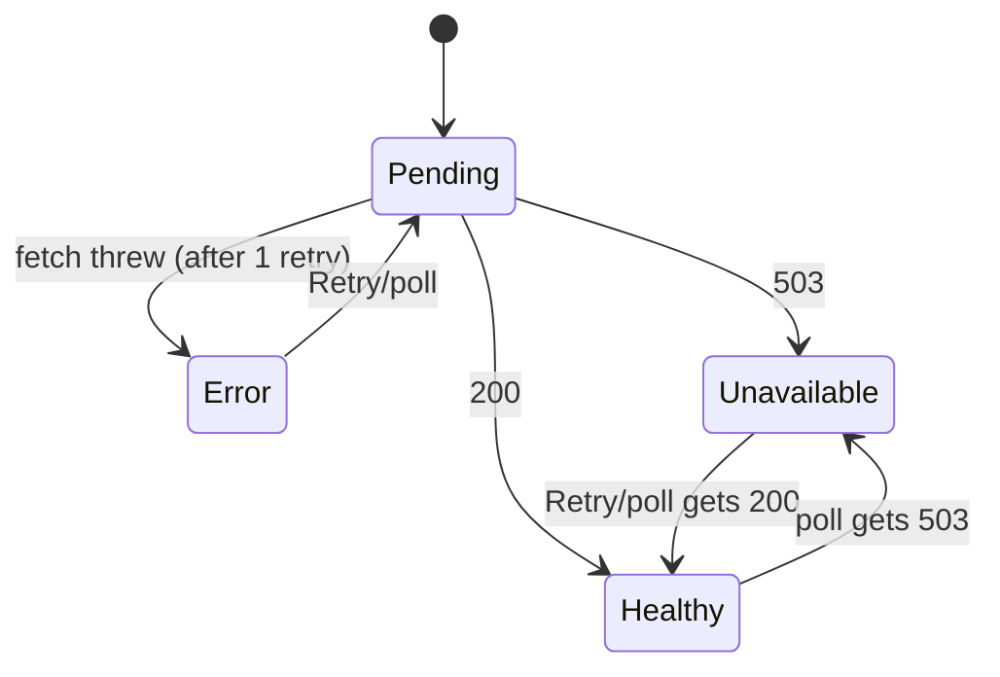

# frontend/src/features/status/StatusCard.tsx

## Purpose
The only feature UI: it renders the API and database readiness in four mutually exclusive states (loading, API unreachable, database unavailable, healthy), with a Retry button in both failure states.

## Where it fits
Feature layer. Rendered by `src/routes/index.tsx`. It uses `useReadiness` and the UI primitives `Alert`, `Button`, `Card` and `Skeleton`. Tested by `StatusCard.test.tsx`.

## Walkthrough
- **Line 8:** `const readiness = useReadiness();`
- **Lines 10–12:** `retry = () => { void readiness.refetch(); }`. `void` marks the promise as intentionally not awaited, which the type-aware no-floating-promises rule requires.
- **Lines 14–21, `isPending`:** a `
` with two `Skeleton`s.
- **Lines 23–35, `isError`:** destructive `Alert`: "Cannot reach the API", "The API did not respond…", and Retry.
- **Lines 37–49, `data.state === "unavailable"`:** an `Alert` with amber classes: "API is running but the database is unavailable", "Start PostgreSQL, then try again.", and Retry.
- **Lines 51–64, healthy:**
  - a `Card` with a green dot (`aria-hidden`);
  - the title "Healthy";
  - the description "API and database are reachable";
  - "Last checked at {checkedAt.toLocaleTimeString()}".

## Concepts used
- **Early-return rendering by query state.** TanStack v5's `isPending` / `isError` narrow `data` to defined in the remaining branches, so no `!` is needed.
- **Accessibility:** `role="status"` for loading, `role="alert"` via `Alert`, decorative dot hidden from assistive tech.
- **Logical CSS** in feature code: `max-w-md`, `gap-2`, `mt-3`, all direction-neutral.

## Data and control flow

## Configuration and environment
None.

## Gotchas and issues
- **Hard-coded English strings** (i18n is planned for Day 17).
- **Error persists during a background refetch.** When a refetch fails after a success, TanStack keeps the previous `data` and sets `isError`. The `isError` check comes first, so the error state shows (expected).
- **No in-flight indication.** There's no indicator during refetch; `isFetching` isn't used.
- **The time format follows the browser locale.**

## Related files
- [useReadiness.ts](useReadiness.ts.md)
- [StatusCard.test.tsx](StatusCard.test.tsx.md)
- [alert.tsx](../../components/ui/alert.tsx.md)
- [card.tsx](../../components/ui/card.tsx.md)
- [routes/index.tsx](../../routes/index.tsx.md)
