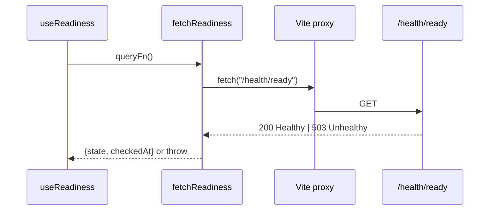

# frontend/src/features/status/api.ts

## Purpose

The only network call in the frontend: asks `/health/ready` and maps the status code to a typed result.

## Where It Fits

frontend/src/features/status. Called by `useReadiness.ts` as the `queryFn`. Hits the API through the Vite proxy (dev).

## Walkthrough

`type ReadinessStatus = { state: "healthy" | "unavailable"; checkedAt: Date }`. `fetchReadiness()` (11-): `await fetch("/health/ready")` - a *relative* URL (README rule: never an absolute API URL). Status 200 -> `{state:"healthy", checkedAt:new Date()}`; 503 -> `{state:"unavailable", ...}`; any other status -> `throw new Error("Unexpected readiness status N.")`. A network failure makes `fetch` reject. Principle: an answer the API gives (503 = dependency down) is data; no trustworthy answer is an error. The body text (`Healthy`/`Unhealthy`) is never read.

## Concepts Used

### async/await and cancellation

#### What it means

`async`/`await` lets a method wait for I/O (database, network) without blocking a thread: the method returns a `Task`, and execution resumes after the awaited operation completes. A `CancellationToken` is a cooperative signal (for example, the HTTP request was aborted) passed down so work can stop early.

(Full tutorial with execution traces: [PROJECT_OVERVIEW.md#63-cqrs-and-the-hand-written-dispatcher](../../../../../PROJECT_OVERVIEW.md#63-cqrs-and-the-hand-written-dispatcher).)

#### Where it appears in this file

`async/await` + `fetch`.

#### How it works here

`fetchReadiness`.

#### Why it matters here

Returns a Promise the query library awaits.

### Server state with TanStack Query

#### What it means

Server state (data owned by the API) needs caching, refetching, retry and loading/error flags. `useQuery` subscribes a component to a cache entry addressed by a *query key*, runs the `queryFn`, and re-renders the component when the entry changes.

(Full tutorial with execution traces: [PROJECT_OVERVIEW.md#617-frontend-concepts-react-server-state-and-routing](../../../../../PROJECT_OVERVIEW.md#617-frontend-concepts-react-server-state-and-routing).)

#### Where it appears in this file

`queryFn` contract.

#### How it works here

Throwing vs returning.

#### Why it matters here

Thrown error -> `isError`; returned value -> `data`.

## Data and Control Flow

## Configuration and Environment

URL `/health/ready` (relative).

## Gotchas and Issues

`checkedAt` is the client's clock, not the server's.

## Related Files

- [`frontend/src/features/status/useReadiness.ts`](useReadiness.ts.md)
- [`frontend/src/features/status/StatusCard.tsx`](StatusCard.tsx.md)
- [`src/TutoringCentre.Api/Program.cs`](../../../../src/TutoringCentre.Api/Program.cs.md)
- [`frontend/vite.config.ts`](../../../vite.config.ts.md)
