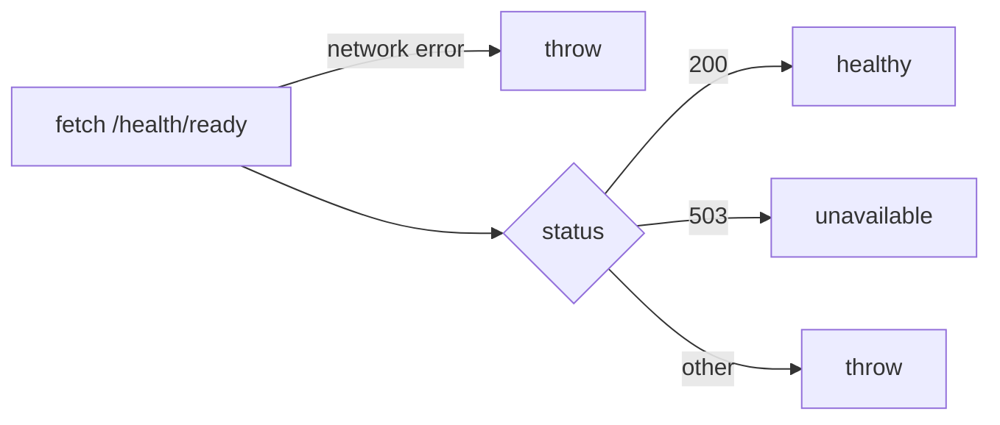

# frontend/src/features/status/api.ts

## Purpose
The status feature's only network code. `fetchReadiness()` calls `GET /health/ready` and turns the answer into a `ReadinessStatus`:
- **200** → `healthy`;
- **503** → `unavailable` (API up, database down);
- **any other status or a network failure** → **throw**, because "the API itself can't be trusted or reached" (lines 6–10).

## Where it fits
Feature layer, `features/status`. Called only by `useReadiness.ts`. The URL is relative, proxied to the API by `vite.config.ts`. The contract is in `frontend/README.md:26-32`. The server side is `Program.cs:33-36` plus the Infrastructure health check.

## Walkthrough
- **Lines 1–4:** `type ReadinessStatus = { state: "healthy" | "unavailable"; checkedAt: Date }`.
- **Line 12:** `await fetch("/health/ready")`. This rejects (throws) on network errors.
- **Lines 14–20:** 200 or 503 map to a state, with `checkedAt: new Date()`.
- **Line 22:** `throw new Error(\`Unexpected readiness status ${String(response.status)}.\`)`. `String(...)` is used because the strict lint config forbids number interpolation.

## Concepts used
- **Modelled errors:** an expected dependency outage (503) is *data*; an unexpected response is an *exception*. This lets the UI show two different messages.
- **Relative URLs plus a dev proxy.**

## Data and control flow

## Configuration and environment
None.

## Gotchas and issues
- **The response body is ignored.** Only the status code is used; the README contract mentions `Healthy` and `Unhealthy` bodies.
- **The abort signal is ignored.** TanStack Query passes an `AbortSignal` to `queryFn`, but it isn't forwarded to `fetch`, so polls aren't cancelled on unmount.
- **`checkedAt` is the client time** when the response arrived.

## Related files
- [useReadiness.ts](useReadiness.ts.md)
- [StatusCard.tsx](StatusCard.tsx.md)
- [vite.config.ts](../../../vite.config.ts.md)
- [Program.cs](../../../../src/TutoringCentre.Api/Program.cs.md)
