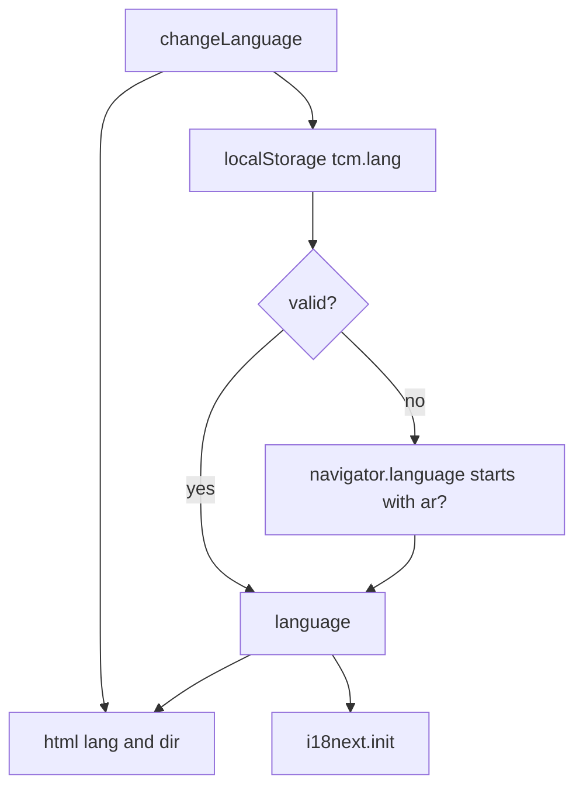

# frontend/src/i18n/index.ts

## Purpose

Initialises i18next: bundled English and Arabic resources, ICU message format, language detection, and synchronisation of `<html lang dir>` and `localStorage`.

## Where It Fits

frontend/src/i18n. Imported for side effects by `main.tsx` and `test/setup.ts`; its default export is used by `errorMessages.ts` and `LanguageSwitcher.test.tsx`. Reads ten JSON resource files.

## Walkthrough

- Imports the five namespaces for each language (4-13). `StorageKey = "tcm.lang"` (15).
- `detectInitialLanguage()` (23-35): stored value if it is `ar` or `en` (inside `try/catch` because `localStorage` can throw in private browsing); otherwise `navigator.language` starting with `ar` -> `ar`, else `en`.
- `applyDocumentDirection(language)` (38-45): sets `document.documentElement.lang` and `.dir` (`rtl` for `ar`, else `ltr`) - skipped when `document` does not exist.
- Module run (47-48): detect, apply.
- `i18next.use(ICU).use(initReactI18next).init({...})` (55-68): `resources` for `en` and `ar` with namespaces `common, status, errors, auth, shell`; `lng: initialLanguage`; `fallbackLng: "en"`; `defaultNS: "common"`; `interpolation.escapeValue: false` (React already escapes). Comment: bundled at build time, ICU single-brace placeholders so Arabic's six plural forms can be expressed later.
- `i18next.on("languageChanged", ...)` (70-77): re-applies direction and stores the choice (best effort).

## Concepts Used

### Internationalisation (i18next) and RTL layout

#### What it means

i18n moves all user-visible text into per-language resource files looked up by key. Arabic is right-to-left, so direction is set on the document and layout uses logical CSS properties (`start`/`end`) that flip automatically.

(Full tutorial with execution traces: [PROJECT_OVERVIEW2.md#634-internationalisation-and-right-to-left-layout](../../../../PROJECT_OVERVIEW2.md#634-internationalisation-and-right-to-left-layout).)

#### Where it appears in this file

Whole file.

#### How it works here

Resources, detection, direction sync.

#### Why it matters here

One module owns language state; components only call `changeLanguage` and read translations.

### Secrets and configuration layering

#### What it means

Configuration comes from layered sources (JSON files, user-secrets, environment variables, command line) where later layers override earlier ones. Secrets must stay out of git: this repo keeps the connection string out of `appsettings.json`, reads it from user-secrets or an environment variable, and scans history with gitleaks.

(Full tutorial with execution traces: [PROJECT_OVERVIEW2.md#11-configuration--environment--deployment](../../../../PROJECT_OVERVIEW2.md#11-configuration--environment--deployment).)

#### Where it appears in this file

What goes into `localStorage`.

#### How it works here

Comment at line 22.

#### Why it matters here

Only the language preference; never tokens or personal data.

### Vite dev server, bundling and proxy

#### What it means

Vite serves source modules during development and bundles for production. Its dev proxy forwards chosen paths (`/api`, `/health`) to another server so the browser sees one origin and no CORS configuration is needed.

(Full tutorial with execution traces: [PROJECT_OVERVIEW2.md#617-frontend-concepts-react-server-state-and-routing](../../../../PROJECT_OVERVIEW2.md#617-frontend-concepts-react-server-state-and-routing).)

#### Where it appears in this file

Bundled JSON imports.

#### How it works here

Lines 4-13.

#### Why it matters here

Vite bundles the JSON files into the app, so there is no runtime request for translations.

## Data and Control Flow

## Configuration and Environment

`localStorage` key `tcm.lang`; browser language as fallback.

## Gotchas and Issues

Language is detected once at import. `fallbackLng: "en"` hides missing Arabic keys, which is why `scripts/check-i18n-keys.mjs` exists.

## Related Files

- [`frontend/src/i18n/locales/en/auth.json`](locales/en/auth.json.md)
- [`frontend/src/features/language/LanguageSwitcher.tsx`](../features/language/LanguageSwitcher.tsx.md)
- [`frontend/src/main.tsx`](../main.tsx.md)
- [`frontend/src/test/setup.ts`](../test/setup.ts.md)
- [`frontend/scripts/check-i18n-keys.mjs`](../../scripts/check-i18n-keys.mjs.md)
