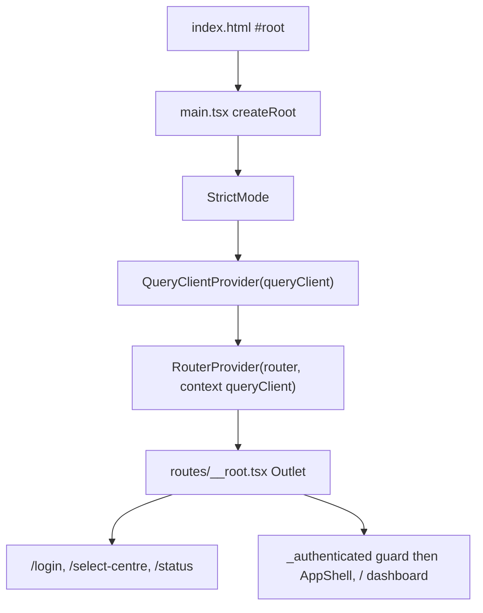

# frontend/src/main.tsx

## Purpose

Frontend entry point: creates the router with the shared query client in its context, wires the session-expiry redirect, imports i18n and mounts the React tree.

## Where It Fits

frontend/src root. Loaded by `index.html`. Depends on `app/queryClient.ts`, the generated `routeTree.gen.ts`, `i18n/index.ts` and `index.css`.

## Walkthrough

`createRouter({ routeTree, context: { queryClient } })` (10) - the context is what route `beforeLoad` functions read (`RouterContext` in `__root.tsx`). `setLoginRedirect(target => void router.navigate({ to: "/login", search: { redirect: target } }))` (12-14) connects the query client's global 401 handler to the router. `declare module "@tanstack/react-router" { interface Register { router: typeof router } }` (17-21) - module augmentation so `Link`/navigation are type-checked against real routes. `document.getElementById("root")`; if null `throw new Error(...)` (24-26). `createRoot(rootElement).render(...)` (28-34): `<StrictMode><QueryClientProvider client={queryClient}><RouterProvider router={router} /></QueryClientProvider></StrictMode>`. Side-effect imports `./i18n` and `./index.css` (7-8): `./i18n` initialises i18next (and sets `<html lang dir>`) before the first render.

## Concepts Used

### React components, props, state and re-rendering

#### What it means

A component is a function returning UI from props and state. When state a component depends on changes, React calls the function again (a re-render) and updates only the DOM that differs.

(Full tutorial with execution traces: [PROJECT_OVERVIEW2.md#617-frontend-concepts-react-server-state-and-routing](../../../PROJECT_OVERVIEW2.md#617-frontend-concepts-react-server-state-and-routing).)

#### Where it appears in this file

Mounting the tree.

#### How it works here

Lines 28-34.

#### Why it matters here

`StrictMode` double-invokes certain functions in development to expose side effects; `QueryClientProvider` shares the cache through context.

### File-based routing with TanStack Router

#### What it means

A router maps URLs to components. In file-based routing a Vite plugin scans `src/routes/` and generates a route tree file, so adding a file adds a route with type-safe links.

(Full tutorial with execution traces: [PROJECT_OVERVIEW2.md#617-frontend-concepts-react-server-state-and-routing](../../../PROJECT_OVERVIEW2.md#617-frontend-concepts-react-server-state-and-routing).)

#### Where it appears in this file

Router with context and registered types.

#### How it works here

Lines 10-21.

#### Why it matters here

Guards need the query client; registering the router type gives type-safe links.

### Frontend route guards, session state and global 401 handling

#### What it means

A *route guard* decides, before a page renders, whether the user may see it (here by reading the session query and redirecting). It only shapes the UI; the API remains the security boundary. A *global 401 handler* reacts to any request that finds the session gone.

(Full tutorial with execution traces: [PROJECT_OVERVIEW2.md#632-frontend-sessions-route-guards-and-global-401-handling](../../../PROJECT_OVERVIEW2.md#632-frontend-sessions-route-guards-and-global-401-handling).)

#### Where it appears in this file

Session-expiry redirect wiring.

#### How it works here

Lines 12-14.

#### Why it matters here

Late binding: the query client exists before the router, so the redirect callback is injected after the router is created.

### Internationalisation (i18next) and RTL layout

#### What it means

i18n moves all user-visible text into per-language resource files looked up by key. Arabic is right-to-left, so direction is set on the document and layout uses logical CSS properties (`start`/`end`) that flip automatically.

(Full tutorial with execution traces: [PROJECT_OVERVIEW2.md#634-internationalisation-and-right-to-left-layout](../../../PROJECT_OVERVIEW2.md#634-internationalisation-and-right-to-left-layout).)

#### Where it appears in this file

Initialisation by import.

#### How it works here

Line 7.

#### Why it matters here

Importing the module runs `i18next.init` and sets direction before the first paint of React content.

## Data and Control Flow

## Configuration and Environment

None. The file reads no environment variables and declares no configuration keys, URLs, ports or credentials.

## Gotchas and Issues

No bugs or surprises found while reading this file.

## Related Files

- [`frontend/src/app/queryClient.ts`](app/queryClient.ts.md)
- [`frontend/src/routes/__root.tsx`](routes/__root.tsx.md)
- `frontend/src/routeTree.gen.ts` (generated / lockfile / media: no separate explanation, see INDEX)
- [`frontend/src/i18n/index.ts`](i18n/index.ts.md)
- [`frontend/index.html`](../index.html.md)
- [`frontend/src/test/renderRouter.tsx`](test/renderRouter.tsx.md)
