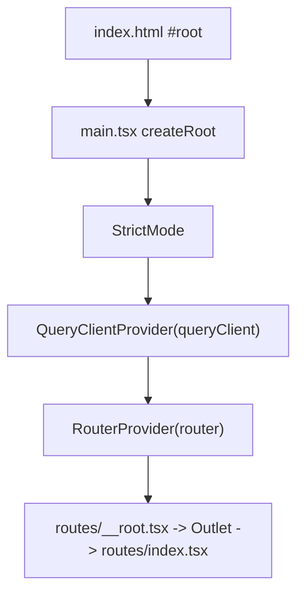

# frontend/src/main.tsx

## Purpose

Frontend entry point: creates the router and mounts the React tree.

## Where It Fits

frontend/src root. Loaded by `index.html`. Depends on `app/queryClient.ts`, the generated `routeTree.gen.ts`, `index.css`.

## Walkthrough

`createRouter({ routeTree })` (9). `declare module "@tanstack/react-router" { interface Register { router: typeof router } }` (11-15) - module augmentation so `Link`/navigation are type-checked against real routes. `document.getElementById("root")`; if null `throw new Error(...)` (20) - no non-null assertion, per the README convention. `createRoot(rootElement).render(...)` (23): `<StrictMode><QueryClientProvider client={queryClient}><RouterProvider router={router} /></QueryClientProvider></StrictMode>`. `StrictMode` double-invokes certain functions in development to expose side effects. `QueryClientProvider` makes the shared `queryClient` available to `useQuery` through React context. `import "./index.css"` pulls in Tailwind.

## Concepts Used

### React components, props, state and re-rendering

#### What it means

A component is a function returning UI from props and state. When state a component depends on changes, React calls the function again (a re-render) and updates only the DOM that differs.

(Full tutorial with execution traces: [PROJECT_OVERVIEW.md#617-frontend-concepts-react-server-state-and-routing](../../../PROJECT_OVERVIEW.md#617-frontend-concepts-react-server-state-and-routing).)

#### Where it appears in this file

Mounting and providers.

#### How it works here

`createRoot(...).render(...)`.

#### Why it matters here

Everything below shares router and query-cache context.

### File-based routing with TanStack Router

#### What it means

A router maps URLs to components. In file-based routing a Vite plugin scans `src/routes/` and generates a route tree file, so adding a file adds a route with type-safe links.

(Full tutorial with execution traces: [PROJECT_OVERVIEW.md#617-frontend-concepts-react-server-state-and-routing](../../../PROJECT_OVERVIEW.md#617-frontend-concepts-react-server-state-and-routing).)

#### Where it appears in this file

Router creation/registration.

#### How it works here

Lines 9-15.

#### Why it matters here

Type-safe navigation.

## Data and Control Flow

## Configuration and Environment

None. The file reads no environment variables and declares no configuration keys, URLs, ports or credentials.

## Gotchas and Issues

No bugs or surprises found while reading this file.

## Related Files

- [`frontend/src/app/queryClient.ts`](app/queryClient.ts.md)
- [`frontend/src/routes/__root.tsx`](routes/__root.tsx.md)
- [`frontend/src/routes/index.tsx`](routes/index.tsx.md)
- `frontend/src/routeTree.gen.ts` (generated / lockfile / media: no separate explanation, see INDEX)
- [`frontend/index.html`](../index.html.md)
