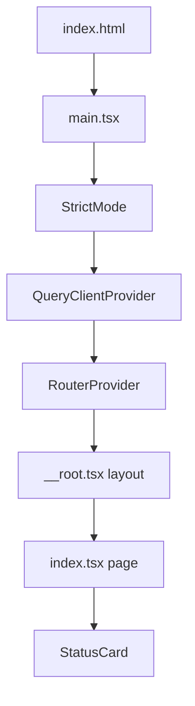

# frontend/src/main.tsx

## Purpose
The SPA bootstrap. It creates the TanStack router from the generated route tree, registers the router type for type-safe navigation, finds `#root`, and renders the app inside `StrictMode` and `QueryClientProvider`. It also imports the global CSS.

## Where it fits
The frontend entry point, loaded by `index.html:11`. It uses `app/queryClient.ts`, `routeTree.gen.ts` (generated from `src/routes/*` by the Vite plugin) and `index.css`.

## Walkthrough
- **Lines 1–7:** imports. Line 7 imports `./index.css` for its side effect.
- **Line 9:** `const router = createRouter({ routeTree });`
- **Lines 12–16:** module augmentation: `declare module "@tanstack/react-router" { interface Register { router: typeof router } }`, so `<Link to>` and `navigate` are type-checked against the actual routes.
- **Lines 18–21:** get `#root`, and throw a descriptive error if it's missing. That satisfies the "no `!`" rule.
- **Lines 23–29:** `createRoot(rootElement).render(<StrictMode><QueryClientProvider client={queryClient}><RouterProvider router={router} /></QueryClientProvider></StrictMode>)`.

## Concepts used
- **React 18+/19 root API** (`createRoot`).
- **StrictMode:** double-invokes effects in development to surface bugs.
- **Context providers.**
- **TypeScript module augmentation.**

## Data and control flow

## Configuration and environment
None.

## Gotchas and issues
- **No error boundary** at the root (TanStack Router has default error components). There are also no router `defaultPendingComponent` or `defaultErrorComponent` settings.

## Related files
- [index.html](../index.html.md)
- [queryClient.ts](app/queryClient.ts.md)
- [routes/__root.tsx](routes/__root.tsx.md)
- [index.css](index.css.md)
