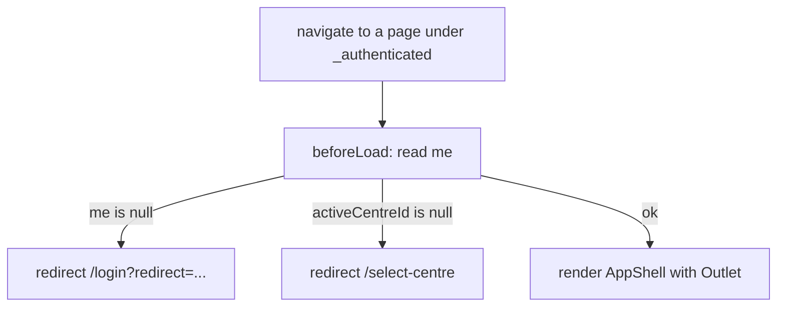

# frontend/src/routes/_authenticated.tsx

## Purpose

The pathless protected layout route: the session guard (`beforeLoad`) and the `AppShell` frame for every page below it.

## Where It Fits

frontend/src/routes. TanStack Router file convention: a leading underscore makes the route pathless (no URL segment). Its children live in `routes/_authenticated/`. Reads `context.queryClient` from `RouterContext` (`__root.tsx`). Tested by `_authenticated.test.tsx`.

## Walkthrough

File header: an ESLint disable for `only-throw-error`, because `throw redirect(...)` is TanStack Router's documented idiom (the router catches the thrown `Response`).

`Route = createFileRoute("/_authenticated")({ beforeLoad, component: AuthenticatedLayout })` (14-27). `beforeLoad({ context, location })` (15-25): `me = await context.queryClient.query({ ...meQueryOptions, staleTime: "static" })` - the session is read through the shared cache and treated as always fresh for this check; if `me === null` -> `throw redirect({ to: "/login", search: { redirect: location.href } })`; if `me.activeCentreId === null` -> `throw redirect({ to: "/select-centre" })`. `AuthenticatedLayout` (29-42): `useSession()`; returns `null` when `me` is null (cannot happen after the guard); else `<AppShell me={me}><Outlet /></AppShell>`.

The doc comment states the key point: the guard decides what the UI shows; it is not a security boundary - the API is (every endpoint answers 401/403 regardless).

## Concepts Used

### Frontend route guards, session state and global 401 handling

#### What it means

A *route guard* decides, before a page renders, whether the user may see it (here by reading the session query and redirecting). It only shapes the UI; the API remains the security boundary. A *global 401 handler* reacts to any request that finds the session gone.

(Full tutorial with execution traces: [PROJECT_OVERVIEW2.md#632-frontend-sessions-route-guards-and-global-401-handling](../../../../PROJECT_OVERVIEW2.md#632-frontend-sessions-route-guards-and-global-401-handling).)

#### Where it appears in this file

Guard and redirect with return URL.

#### How it works here

`beforeLoad` (15-25).

#### Why it matters here

The user is sent to `/login?redirect=<where they wanted to go>` and, after login, back there (the login page validates that redirect).

### File-based routing with TanStack Router

#### What it means

A router maps URLs to components. In file-based routing a Vite plugin scans `src/routes/` and generates a route tree file, so adding a file adds a route with type-safe links.

(Full tutorial with execution traces: [PROJECT_OVERVIEW2.md#617-frontend-concepts-react-server-state-and-routing](../../../../PROJECT_OVERVIEW2.md#617-frontend-concepts-react-server-state-and-routing).)

#### Where it appears in this file

Pathless layout route and thrown redirects.

#### How it works here

File name and `createFileRoute("/_authenticated")`.

#### Why it matters here

One guard protects every page placed under `_authenticated/` without repeating it.

### Authorization by default, the actor pipeline and the tenant gate

#### What it means

A *fallback authorization policy* makes every endpoint require a signed-in user unless it explicitly opts out (fail closed). A single middleware translates the HTTP identity into the application's own `StaffActor`; the *tenant gate* is the one check that decides which centre a session may act in.

(Full tutorial with execution traces: [PROJECT_OVERVIEW2.md#629-authorization-by-default-the-actor-pipeline-and-the-tenant-gate](../../../../PROJECT_OVERVIEW2.md#629-authorization-by-default-the-actor-pipeline-and-the-tenant-gate).)

#### Where it appears in this file

UI guard versus API enforcement.

#### How it works here

Doc comment 8-13.

#### Why it matters here

Even if the guard is bypassed in the browser, each API call is checked by the server's fallback policy and tenant gate.

## Data and Control Flow

## Configuration and Environment

None. The file reads no environment variables and declares no configuration keys, URLs, ports or credentials.

## Gotchas and Issues

The guard reads the cached session with `staleTime: "static"`, so within one browser session it does not re-check the server on each navigation; a revoked session is discovered on the next API call (global 401 handling in `queryClient.ts`).

## Related Files

- [`frontend/src/routes/_authenticated/index.tsx`](_authenticated/index.tsx.md)
- [`frontend/src/routes/_authenticated.test.tsx`](_authenticated.test.tsx.md)
- [`frontend/src/features/shell/AppShell.tsx`](../features/shell/AppShell.tsx.md)
- [`frontend/src/features/session/meQueryOptions.ts`](../features/session/meQueryOptions.ts.md)
- [`frontend/src/routes/__root.tsx`](__root.tsx.md)
- [`frontend/src/app/queryClient.ts`](../app/queryClient.ts.md)
