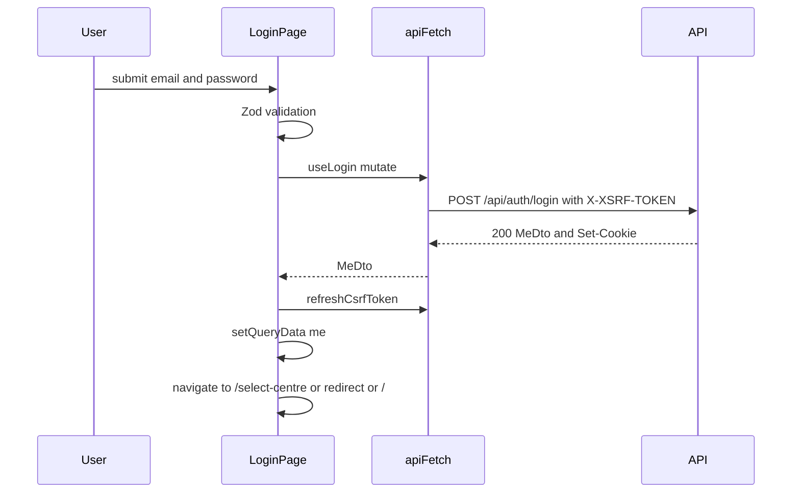

# frontend/src/routes/login.tsx

## Purpose

The `/login` page: a validated email/password form, error handling for credentials and rate limiting, a safe return-URL redirect, and the Hessa brand panel.

## Where It Fits

frontend/src/routes. Public route (no guard). Uses the generated `useLogin`, React Hook Form with a Zod schema, `refreshCsrfToken`, `meQueryOptions`, `LanguageSwitcher`, `HessaLogo`, i18n namespace `auth`. Tested by `login.test.tsx` and the Playwright specs.

## Walkthrough

- `LoginSearch { redirect?: string }` and `Route = createFileRoute("/login")({ validateSearch, component })` (21-30): `validateSearch` keeps `redirect` only when it is a string.
- `loginSchema` (32-35): `email: z.string().min(1, "validation.emailRequired").pipe(z.email("validation.emailInvalid"))`, `password: z.string().min(1, "validation.passwordRequired")` - the messages are *translation keys*. `KnownFields = ["email","password"]`.
- `resolveTarget(me, redirect)` (48-58): if `me.activeCentreId === null` -> `/select-centre`; else if `redirect` starts with `/` and not `//` -> that path; else `/`. The comment: an open `redirect` parameter is never trusted as is (blocks `https://evil.example` and protocol-relative `//host`).
- `LoginPage` (60-228): `useForm({ resolver: zodResolver(loginSchema) })`. `onSubmit` (75-95): clears the banner; `loginMutation.mutateAsync({ data: values })` returns `MeDto`; `await refreshCsrfToken()` (new session, new token); `queryClient.setQueryData(meQueryOptions.queryKey, me)` (the guard will then see the session without another request); `navigate({ href: resolveTarget(me, redirect) })`. On error: `asApiError`; code `auth.invalid_credentials` -> banner `errors.invalidCredentials`; `auth.rate_limited` -> banner `errors.rateLimited`; otherwise `applyFieldErrors` and, if there are no field errors, `messageFor`. Field error text: `server` errors are shown as-is, validation keys are translated with `t(key)`.
- JSX: a two-column layout; left column with `HessaWordmark`, `LanguageSwitcher`, heading, optional destructive `Alert` banner, and the `form` (`noValidate`, labels with `htmlFor`, `autoComplete` `email` / `current-password`, `aria-invalid`, inputs disabled while submitting, submit button with spinner); right column `aside` (hidden below `lg`, `aria-hidden`) with a gradient, brand mark and four feature cards from `PANEL_FEATURES`.

## Concepts Used

### Forms and schema validation (React Hook Form + Zod)

#### What it means

React Hook Form tracks form fields with little re-rendering; Zod describes the valid shape of the data in one schema; a resolver connects them so the form shows field errors before any request is sent. Server-side field errors can be mapped back onto the same fields.

(Full tutorial with execution traces: [PROJECT_OVERVIEW2.md#633-forms-and-validation-with-react-hook-form-and-zod](../../../../PROJECT_OVERVIEW2.md#633-forms-and-validation-with-react-hook-form-and-zod).)

#### Where it appears in this file

React Hook Form + Zod.

#### How it works here

Lines 32-38, 68-73, 138, 157.

#### Why it matters here

Client validation runs before any request; empty submit shows translated errors and sends nothing (tested).

### CSRF protection with antiforgery tokens

#### What it means

Because browsers attach cookies automatically, a malicious *other* site can make the victim's browser send a state-changing request. CSRF protection adds a second, explicit proof that the request came from the application's own script: a token that must be sent in a header, which a foreign site cannot read or set.

(Full tutorial with execution traces: [PROJECT_OVERVIEW2.md#625-csrf-protection-double-submit-antiforgery-tokens](../../../../PROJECT_OVERVIEW2.md#625-csrf-protection-double-submit-antiforgery-tokens).)

#### Where it appears in this file

Token refresh after login.

#### How it works here

Line 79.

#### Why it matters here

Login changes the signed-in user; the cached token must be replaced.

### Frontend route guards, session state and global 401 handling

#### What it means

A *route guard* decides, before a page renders, whether the user may see it (here by reading the session query and redirecting). It only shapes the UI; the API remains the security boundary. A *global 401 handler* reacts to any request that finds the session gone.

(Full tutorial with execution traces: [PROJECT_OVERVIEW2.md#632-frontend-sessions-route-guards-and-global-401-handling](../../../../PROJECT_OVERVIEW2.md#632-frontend-sessions-route-guards-and-global-401-handling).)

#### Where it appears in this file

Safe return URL.

#### How it works here

`resolveTarget` (48-58).

#### Why it matters here

Prevents an open redirect after login.

### Rate limiting, lockout and enumeration resistance

#### What it means

*Rate limiting* caps how many requests one source may make in a time window (stops password spraying from one place). *Lockout* temporarily blocks one account after repeated failures (stops many guesses against one account). *Enumeration resistance* means failure responses (and their timing) reveal nothing about whether an account exists.

(Full tutorial with execution traces: [PROJECT_OVERVIEW2.md#626-rate-limiting-lockout-and-enumeration-resistance](../../../../PROJECT_OVERVIEW2.md#626-rate-limiting-lockout-and-enumeration-resistance).)

#### Where it appears in this file

429 and 401 messages.

#### How it works here

Lines 84-88.

#### Why it matters here

The UI shows one generic message for wrong credentials (no hint whether the account exists) and a separate 'wait a minute' for rate limiting.

### Cookie authentication and server-side sessions

#### What it means

After a successful login the server must remember *who* the browser is on later requests (HTTP itself is stateless). Cookie authentication does that with one cookie that the browser attaches automatically. Here the cookie holds an **encrypted, tamper-proof ticket** (the user's claims); only the server can read or create it, and flags such as `HttpOnly`, `Secure`, `SameSite` and the `__Host-` name prefix limit where and how browsers send it.

(Full tutorial with execution traces: [PROJECT_OVERVIEW2.md#624-cookie-authentication-and-server-side-sessions](../../../../PROJECT_OVERVIEW2.md#624-cookie-authentication-and-server-side-sessions).)

#### Where it appears in this file

Session cookie is invisible to this code.

#### How it works here

No cookie access anywhere.

#### Why it matters here

The cookie is `HttpOnly`; the page only learns the result through the `MeDto` response and later through `/api/me`.

## Data and Control Flow

## Configuration and Environment

None. The file reads no environment variables and declares no configuration keys, URLs, ports or credentials.

## Gotchas and Issues

The gradient colours on the brand panel are hard-coded hex values (not theme tokens). The password is held only in the form state and the request body; it is never logged or stored by this file.

## Related Files

- [`frontend/src/routes/login.test.tsx`](login.test.tsx.md)
- `frontend/src/api/generated/tutoring-centre.ts` (generated / lockfile / media: no separate explanation, see INDEX)
- [`frontend/src/api/csrf.ts`](../api/csrf.ts.md)
- [`frontend/src/api/showApiError.ts`](../api/showApiError.ts.md)
- [`frontend/src/features/session/meQueryOptions.ts`](../features/session/meQueryOptions.ts.md)
- [`frontend/src/components/brand/HessaLogo.tsx`](../components/brand/HessaLogo.tsx.md)
- [`frontend/src/i18n/locales/en/auth.json`](../i18n/locales/en/auth.json.md)
