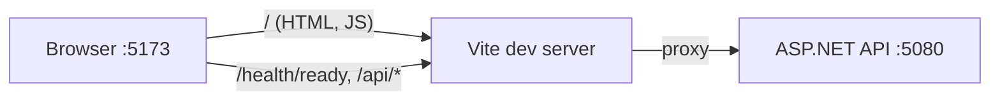

# frontend/vite.config.ts

## Purpose

Vite configuration: plugins, path alias, dev proxy to the API, and Vitest settings.

## Where It Fits

Frontend config used by `npm run dev/build/test`. Depends on TanStack Router plugin, React plugin, Tailwind plugin. References the API's dev port 5080 (`src/TutoringCentre.Api/Properties/launchSettings.json`).

## Walkthrough

- `apiTarget = "http://localhost:5080"` (comment: the API's fixed development URL; the browser only talks to the Vite origin).
- `plugins`: `tanstackRouter({ target: "react", autoCodeSplitting: true })` first (must precede React plugin per its docs; scans `src/routes` and writes `routeTree.gen.ts`, splitting route components into lazy chunks), `react()`, `tailwindcss()`.
- `resolve.alias["@"]` -> `./src` (mirrors tsconfig).
- `server.proxy`: `/api` and `/health` -> `apiTarget`. Dev-only; a production build has no proxy.
- `test`: `environment: "jsdom"`, `setupFiles: ["./src/test/setup.ts"]`.
The first line `/// <reference types="vitest/config" />` augments Vite's config type with the `test` key.

## Concepts Used

### Vite dev server, bundling and proxy

#### What it means

Vite serves source modules during development and bundles for production. Its dev proxy forwards chosen paths (`/api`, `/health`) to another server so the browser sees one origin and no CORS configuration is needed.

(Full tutorial with execution traces: [PROJECT_OVERVIEW.md#617-frontend-concepts-react-server-state-and-routing](../../PROJECT_OVERVIEW.md#617-frontend-concepts-react-server-state-and-routing).)

#### Where it appears in this file

Dev proxy.

#### How it works here

`server.proxy`.

#### Why it matters here

Browser sees one origin, so no CORS config exists in the API.

### File-based routing with TanStack Router

#### What it means

A router maps URLs to components. In file-based routing a Vite plugin scans `src/routes/` and generates a route tree file, so adding a file adds a route with type-safe links.

(Full tutorial with execution traces: [PROJECT_OVERVIEW.md#617-frontend-concepts-react-server-state-and-routing](../../PROJECT_OVERVIEW.md#617-frontend-concepts-react-server-state-and-routing).)

#### Where it appears in this file

Router plugin.

#### How it works here

`tanstackRouter(...)`.

#### Why it matters here

Generates the route tree at dev/build time.

## Data and Control Flow

## Configuration and Environment

Port 5080 (API target); Vite's default dev port 5173 is not configured here (default).

## Gotchas and Issues

Proxy exists only in dev; production same-origin serving is planned but not implemented in the API.

## Related Files

- [`frontend/src/features/status/api.ts`](src/features/status/api.ts.md)
- [`src/TutoringCentre.Api/Properties/launchSettings.json`](../src/TutoringCentre.Api/Properties/launchSettings.json.md)
- [`frontend/package.json`](package.json.md)
- [`frontend/src/test/setup.ts`](src/test/setup.ts.md)
