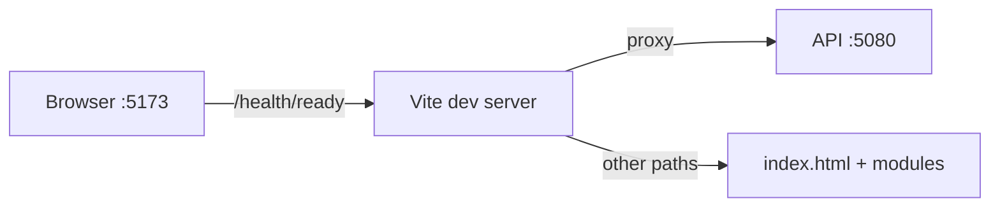

# frontend/vite.config.ts

## Purpose
The Vite (and Vitest) configuration:
- plugins: TanStack Router codegen, React, Tailwind;
- the `@` alias;
- the **dev proxy** that forwards `/api` and `/health` to the API on `http://localhost:5080`;
- the test environment (jsdom plus a setup file).

## Where it fits
Frontend tooling, used by `npm run dev`, `build`, `preview` and `test`. The proxy makes the browser talk only to the Vite origin, matching ADR 0002's same-origin design. The test settings load `src/test/setup.ts`.

## Walkthrough
- **Line 1:** `/// <reference types="vitest/config" />`, which adds types for the `test` key.
- **Line 9:** `const apiTarget = "http://localhost:5080"`. The comment calls it "The API's fixed development URL (Task 3.1)".
- **Lines 12–17, plugins:**
  - `tanstackRouter({ target: "react", autoCodeSplitting: true })` must come before `react()`. It watches `src/routes/` and generates `src/routeTree.gen.ts`. `autoCodeSplitting` lazy-loads route components; that's why the build has a separate `routes-*.js` chunk.
  - `react()`
  - `tailwindcss()`
- **Lines 18–22:** alias `@` → `./src`.
- **Lines 23–28:** `server.proxy` for `/api` and `/health` → `apiTarget`.
- **Lines 29–32:** `test.environment: "jsdom"`, `setupFiles: ["./src/test/setup.ts"]`. Globals are not enabled.

## Concepts used
- **Dev-server proxy:** avoids CORS in development.
- **File-based routing codegen.**
- **Route-level code splitting.**

## Data and control flow

## Configuration and environment
- The API URL is hard-coded, with no env var.
- The proxy only applies to `vite dev`. `vite preview` gets no `preview.proxy` config, so API calls from a previewed build would hit the preview server itself.

## Gotchas and issues
- **The proxy only matches the `http` launch profile.** The API's `https` launch profile uses different ports.
- **`vite preview` has no proxy configured.**
- **No `changeOrigin` option.** It isn't needed for localhost.

## Related files
- [launchSettings.json](../src/TutoringCentre.Api/Properties/launchSettings.json.md)
- [features/status/api.ts](src/features/status/api.ts.md)
- [src/test/setup.ts](src/test/setup.ts.md)
- [main.tsx](src/main.tsx.md)
