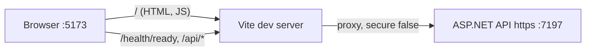

# frontend/vite.config.ts

## Purpose

Vite configuration: plugins, path alias, dev proxy to the HTTPS API, and Vitest settings.

## Where It Fits

Frontend config used by `npm run dev/build/test` and by Playwright (which passes `API_TARGET`). Depends on the TanStack Router, React and Tailwind plugins. References the API's `https` launch profile (`src/TutoringCentre.Api/Properties/launchSettings.json`).

## Walkthrough

- imports `configDefaults, defineConfig` from `vitest/config` (the old `/// <reference types="vitest/config" />` line was removed; importing `defineConfig` from `vitest/config` makes the `test` key type-check).
- `apiTarget = process.env.API_TARGET ?? "https://localhost:7197"` (111). Comment: the browser talks only to the Vite origin; since the cookies are `Secure` + `__Host-` the dev API must run on its `https` profile; overridable so Playwright can pass its own URL. (The comment on lines 109-110 says Playwright starts the API on its plain-http profile; `playwright.config.ts` actually uses the `https` profile and explains why, so that comment is out of date.)
- `plugins`: `tanstackRouter({ target: "react", autoCodeSplitting: true, routeFileIgnorePattern: "\\.test\\.tsx$" })` first (117) - the ignore pattern stops component tests that sit beside routes (`routes/login.test.tsx`) being treated as routes; then `react()`, `tailwindcss()`.
- `resolve.alias["@"]` -> `./src`.
- `server.proxy` (126-133): `/api` and `/health` -> `apiTarget` with `secure: false` (comment: Node's TLS stack does not read the OS trust store, so it does not trust the `dotnet dev-certs` self-signed certificate). Dev only.
- `test` (134-139): `environment: "jsdom"`, `setupFiles: ["./src/test/setup.ts"]`, `exclude: [...configDefaults.exclude, "e2e/**"]` so Vitest does not run Playwright specs.

## Concepts Used

### Vite dev server, bundling and proxy

#### What it means

Vite serves source modules during development and bundles for production. Its dev proxy forwards chosen paths (`/api`, `/health`) to another server so the browser sees one origin and no CORS configuration is needed.

(Full tutorial with execution traces: [PROJECT_OVERVIEW2.md#617-frontend-concepts-react-server-state-and-routing](../../PROJECT_OVERVIEW2.md#617-frontend-concepts-react-server-state-and-routing).)

#### Where it appears in this file

Proxy, aliases and test configuration.

#### How it works here

Lines 111-139.

#### Why it matters here

The proxy makes browser requests same-origin, which the cookie design requires.

### File-based routing with TanStack Router

#### What it means

A router maps URLs to components. In file-based routing a Vite plugin scans `src/routes/` and generates a route tree file, so adding a file adds a route with type-safe links.

(Full tutorial with execution traces: [PROJECT_OVERVIEW2.md#617-frontend-concepts-react-server-state-and-routing](../../PROJECT_OVERVIEW2.md#617-frontend-concepts-react-server-state-and-routing).)

#### Where it appears in this file

Router plugin options.

#### How it works here

Line 117.

#### Why it matters here

`autoCodeSplitting` splits route components into lazy chunks; the ignore pattern keeps tests out of the route tree.

### Cookie authentication and server-side sessions

#### What it means

After a successful login the server must remember *who* the browser is on later requests (HTTP itself is stateless). Cookie authentication does that with one cookie that the browser attaches automatically. Here the cookie holds an **encrypted, tamper-proof ticket** (the user's claims); only the server can read or create it, and flags such as `HttpOnly`, `Secure`, `SameSite` and the `__Host-` name prefix limit where and how browsers send it.

(Full tutorial with execution traces: [PROJECT_OVERVIEW2.md#624-cookie-authentication-and-server-side-sessions](../../PROJECT_OVERVIEW2.md#624-cookie-authentication-and-server-side-sessions).)

#### Where it appears in this file

HTTPS dev proxy.

#### How it works here

Lines 106-111, 128-131.

#### Why it matters here

`Secure`/`__Host-` cookies only work over HTTPS, so the dev server proxies to the HTTPS API and tolerates its self-signed certificate.

## Data and Control Flow

## Configuration and Environment

`API_TARGET` (optional; default `https://localhost:7197`); Vite's default dev port 5173 is not configured here.

## Gotchas and Issues

Proxy exists only in dev; production same-origin serving is planned but not implemented in the API. The stale comment about the plain-http profile (see above) could mislead a reader.

## Related Files

- [`frontend/src/features/status/api.ts`](src/features/status/api.ts.md)
- [`src/TutoringCentre.Api/Properties/launchSettings.json`](../src/TutoringCentre.Api/Properties/launchSettings.json.md)
- [`frontend/package.json`](package.json.md)
- [`frontend/src/test/setup.ts`](src/test/setup.ts.md)
- [`frontend/playwright.config.ts`](playwright.config.ts.md)
