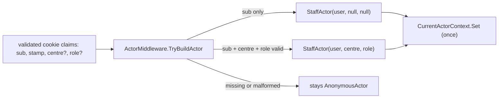

# src/TutoringCentre.Api/Auth/ActorMiddleware.cs

## Purpose

The single translation point from HTTP identity (session cookie claims) to Application identity (`StaffActor`).

## Where It Fits

Api/Auth, `internal`. Registered at `Program.cs:100`, after `UseAuthentication` and before `UseAuthorization`. Depends on `CurrentActorContext`, `SessionClaimNames`, `StaffActor`, `StaffRole`.

## Walkthrough

`InvokeAsync(HttpContext, CurrentActorContext, ILogger<ActorMiddleware>)` (17-27): if `context.User.Identity?.IsAuthenticated == true` and `TryBuildActor` succeeds, `currentActor.Set(staffActor)`; then `await next(context)`. The extra parameters are resolved from the request scope by the framework (middleware `InvokeAsync` parameters are injected per request - framework behaviour).
`TryBuildActor` (29-60): reads claim `sub` (user id; must parse as a Guid, else log `Malformed session: missing or invalid user id claim` and return false -> request stays anonymous); reads `centre` and `role`; neither present -> `StaffActor(userId, null, null)`; both present and parseable (`Guid.TryParse`, `Enum.TryParse<StaffRole>`) -> `StaffActor(userId, centreId, role)`; any other combination (one claim without the other, or garbage) -> warning log and false (stays anonymous, so authorization then rejects it rather than trusting a partially read session).
`[LoggerMessage]` source-generated log methods (62-66), hence `partial`.

## Concepts Used

### Authorization by default, the actor pipeline and the tenant gate

#### What it means

A *fallback authorization policy* makes every endpoint require a signed-in user unless it explicitly opts out (fail closed). A single middleware translates the HTTP identity into the application's own `StaffActor`; the *tenant gate* is the one check that decides which centre a session may act in.

(Full tutorial with execution traces: [PROJECT_OVERVIEW2.md#629-authorization-by-default-the-actor-pipeline-and-the-tenant-gate](../../../../PROJECT_OVERVIEW2.md#629-authorization-by-default-the-actor-pipeline-and-the-tenant-gate).)

#### Where it appears in this file

The middleware.

#### How it works here

Whole class.

#### Why it matters here

'No handler and no other endpoint reads claims' - this is the only claims-to-actor bridge.

### Actor and tenancy groundwork

#### What it means

An *actor* is who executes a use case; a *tenant* is one customer's isolated data slice (here a Centre). The actor is supplied by trusted edge code, never by request data.

(Full tutorial with execution traces: [PROJECT_OVERVIEW2.md#611-the-actor-model-and-the-tenancy-groundwork](../../../../PROJECT_OVERVIEW2.md#611-the-actor-model-and-the-tenancy-groundwork).)

#### Where it appears in this file

`StaffActor` construction.

#### How it works here

Lines 45, 54.

#### Why it matters here

Handlers see a typed actor, never cookies.

### Middleware and the request pipeline

#### What it means

Middleware components form a chain; each receives the request, may act before calling `next`, and may act again after it returns. Order is behaviour: a component only sees what earlier components set up and only wraps what comes after it.

(Full tutorial with execution traces: [PROJECT_OVERVIEW2.md#8-routing-and-middleware](../../../../PROJECT_OVERVIEW2.md#8-routing-and-middleware).)

#### Where it appears in this file

Placement.

#### How it works here

`Program.cs:99-101`.

#### Why it matters here

After authentication (needs `context.User`), before authorization.

## Data and Control Flow

## Configuration and Environment

Claim names `sub`, `centre`, `role` (`SessionClaimNames`).

## Gotchas and Issues

`CurrentActorContext.Set` throws if called twice - this middleware is the only caller on the HTTP path; login uses `Reauthenticate` instead. Anonymous requests never reach `Set`, so the context keeps its default `AnonymousActor`.

## Related Files

- [`src/TutoringCentre.Api/Auth/SessionClaims.cs`](SessionClaims.cs.md)
- [`src/TutoringCentre.Application/Common/Security/CurrentActorContext.cs`](../../TutoringCentre.Application/Common/Security/CurrentActorContext.cs.md)
- [`src/TutoringCentre.Application/Common/Security/Actor.cs`](../../TutoringCentre.Application/Common/Security/Actor.cs.md)
- [`src/TutoringCentre.Api/Program.cs`](../Program.cs.md)
