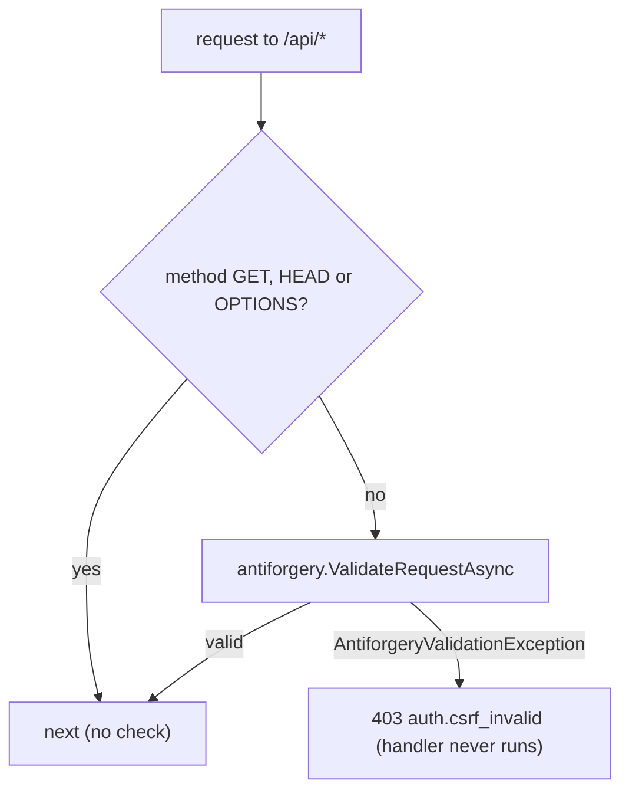

# src/TutoringCentre.Api/Auth/AntiforgeryEndpointFilter.cs

## Purpose

Endpoint filter applied once to the whole `/api` group that requires a valid antiforgery token on every unsafe request, login included.

## Where It Fits

Api/Auth, `internal`. Attached at `Program.cs:120` with `AddEndpointFilter<AntiforgeryEndpointFilter>()`. Depends on `IAntiforgery` (framework) and `ProblemResult` via `Error.Forbidden(...).ToProblemResult()`.

## Walkthrough

`IEndpointFilter.InvokeAsync(EndpointFilterInvocationContext, EndpointFilterDelegate next)` (19-41): safe methods (`GET`, `HEAD`, `OPTIONS`, in a case-insensitive `HashSet` at line 17) pass straight to `next`. For every other method it calls `antiforgery.ValidateRequestAsync(httpContext)`; an `AntiforgeryValidationException` returns `Error.Forbidden("auth.csrf_invalid", ...)` as Problem Details (403) - the endpoint handler never runs, so there are no side effects (comment line 36). Doc: minimal APIs only validate antiforgery automatically for form-bound endpoints; this JSON API needs the explicit check.

## Concepts Used

### CSRF protection with antiforgery tokens

#### What it means

Because browsers attach cookies automatically, a malicious *other* site can make the victim's browser send a state-changing request. CSRF protection adds a second, explicit proof that the request came from the application's own script: a token that must be sent in a header, which a foreign site cannot read or set.

(Full tutorial with execution traces: [PROJECT_OVERVIEW2.md#625-csrf-protection-double-submit-antiforgery-tokens](../../../../PROJECT_OVERVIEW2.md#625-csrf-protection-double-submit-antiforgery-tokens).)

#### Where it appears in this file

The filter.

#### How it works here

Whole class.

#### Why it matters here

Mandatory protection with no per-endpoint attribute to forget.

### Middleware and the request pipeline

#### What it means

Middleware components form a chain; each receives the request, may act before calling `next`, and may act again after it returns. Order is behaviour: a component only sees what earlier components set up and only wraps what comes after it.

(Full tutorial with execution traces: [PROJECT_OVERVIEW2.md#8-routing-and-middleware](../../../../PROJECT_OVERVIEW2.md#8-routing-and-middleware).)

#### Where it appears in this file

Endpoint filter vs middleware.

#### How it works here

`IEndpointFilter`.

#### Why it matters here

It runs as part of endpoint execution (after routing, authorization and rate limiting), immediately before the handler.

## Data and Control Flow

## Configuration and Environment

Header name comes from `AntiforgerySetup.HeaderName` (`X-XSRF-TOKEN`).

## Gotchas and Issues

Anything mapped on `app` (not on the `/api` group) is outside this protection - currently health checks, the OpenAPI document and the fallbacks, all safe methods or anonymous reads.

## Related Files

- [`src/TutoringCentre.Api/Auth/AntiforgerySetup.cs`](AntiforgerySetup.cs.md)
- [`src/TutoringCentre.Api/Auth/AuthEndpoints.cs`](AuthEndpoints.cs.md)
- [`tests/TutoringCentre.Api.Tests/Auth/SecurityTests.cs`](../../../tests/TutoringCentre.Api.Tests/Auth/SecurityTests.cs.md)
- [`src/TutoringCentre.Api/Program.cs`](../Program.cs.md)
