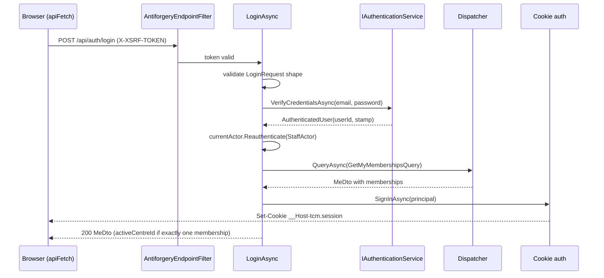

# src/TutoringCentre.Api/Auth/AuthEndpoints.cs

## Purpose

Maps the five session endpoints (antiforgery, login, logout, me, select centre) as thin transport around Application calls.

## Where It Fits

Api/Auth. Mapped on the `/api` group by `Program.cs:122` (`api.MapAuthEndpoints()`). Uses `IAuthenticationService`, `Dispatcher`, `CurrentActorContext`, `SessionPrincipalFactory`, `SessionClaimNames`, `LoginRequestValidator`, `RequestValidation`. Architecture rules forbid it from touching Infrastructure or Identity types.

## Walkthrough

Route table (`MapAuthEndpoints`, 22-61): `GET /api/auth/antiforgery` (anonymous), `POST /api/auth/login` (`RequireRateLimiting("login")`, anonymous), `POST /api/auth/logout` (authenticated by the fallback policy - the explicit cast on line 45 forces the `Delegate` overload so `.Produces` works), `GET /api/me`, `POST /api/session/centre`.
- **`GetAntiforgeryTokenAsync`** (63-71): `antiforgery.GetAndStoreTokens(httpContext)` writes the cookie half on the response and returns the request token; the response gets `Cache-Control: no-store`; body is `AntiforgeryTokenResponse(token)`.
- **`LoginAsync`** (73-118): (1) validate with `LoginRequestValidator` -> `validation.failed` 400; (2) `authenticationService.VerifyCredentialsAsync` -> failure becomes problem+json (`auth.invalid_credentials` 401); (3) `currentActor.Reauthenticate(new StaffActor(userId, null, null))` (97); (4) `dispatcher.QueryAsync<GetMyMembershipsQuery, MeDto>` (99); (5) exactly one membership -> auto-select it (106); (6) `SessionPrincipalFactory.Create(...)` then `httpContext.SignInAsync(CookieAuthenticationDefaults.AuthenticationScheme, principal)` (114) - after the read, so a failed login never leaves a cookie; (7) respond with `me with { ActiveCentreId, ActiveRole }` (116).
- **`LogoutAsync`** (120-124): `SignOutAsync`; 204.
- **`GetMeAsync`** (126-130): dispatches `GetMyMembershipsQuery`; `ToHttpResult`.
- **`SelectCentreAsync`** (132-156): dispatches `GetActiveMembershipQuery(request.CentreId)`; on failure returns the Problem Details and leaves the cookie untouched; on success rebuilds the principal with the *same* user id (from the actor) and the *same* security stamp (read from the current cookie claims, never from the request) plus the new centre and role, `SignInAsync`, 204.

## Concepts Used

### Minimal APIs, routing and route groups

#### What it means

Minimal APIs map a URL pattern and HTTP verb straight to a delegate (`MapGet("/x", handler)`). The framework binds delegate parameters from DI (services), the route, query, body or `CancellationToken`. A *route group* shares a prefix and metadata across endpoints.

(Full tutorial with execution traces: [PROJECT_OVERVIEW2.md#612-http-problem-details-and-error-handling](../../../../PROJECT_OVERVIEW2.md#612-http-problem-details-and-error-handling).)

#### Where it appears in this file

Endpoint mapping.

#### How it works here

`MapAuthEndpoints`.

#### Why it matters here

Declarative metadata (`Produces`, `WithName`) also feeds the OpenAPI document that the frontend client is generated from.

### Cookie authentication and server-side sessions

#### What it means

After a successful login the server must remember *who* the browser is on later requests (HTTP itself is stateless). Cookie authentication does that with one cookie that the browser attaches automatically. Here the cookie holds an **encrypted, tamper-proof ticket** (the user's claims); only the server can read or create it, and flags such as `HttpOnly`, `Secure`, `SameSite` and the `__Host-` name prefix limit where and how browsers send it.

(Full tutorial with execution traces: [PROJECT_OVERVIEW2.md#624-cookie-authentication-and-server-side-sessions](../../../../PROJECT_OVERVIEW2.md#624-cookie-authentication-and-server-side-sessions).)

#### Where it appears in this file

`SignInAsync` / `SignOutAsync`.

#### How it works here

Lines 114, 153, 122.

#### Why it matters here

The only places a session cookie is issued or cleared.

### Authorization by default, the actor pipeline and the tenant gate

#### What it means

A *fallback authorization policy* makes every endpoint require a signed-in user unless it explicitly opts out (fail closed). A single middleware translates the HTTP identity into the application's own `StaffActor`; the *tenant gate* is the one check that decides which centre a session may act in.

(Full tutorial with execution traces: [PROJECT_OVERVIEW2.md#629-authorization-by-default-the-actor-pipeline-and-the-tenant-gate](../../../../PROJECT_OVERVIEW2.md#629-authorization-by-default-the-actor-pipeline-and-the-tenant-gate).)

#### Where it appears in this file

Tenant gate + actor.

#### How it works here

`SelectCentreAsync`, `Reauthenticate`.

#### Why it matters here

A centre id enters a session only after `GetActiveMembershipQuery` succeeds.

### CSRF protection with antiforgery tokens

#### What it means

Because browsers attach cookies automatically, a malicious *other* site can make the victim's browser send a state-changing request. CSRF protection adds a second, explicit proof that the request came from the application's own script: a token that must be sent in a header, which a foreign site cannot read or set.

(Full tutorial with execution traces: [PROJECT_OVERVIEW2.md#625-csrf-protection-double-submit-antiforgery-tokens](../../../../PROJECT_OVERVIEW2.md#625-csrf-protection-double-submit-antiforgery-tokens).)

#### Where it appears in this file

Antiforgery token issue.

#### How it works here

`GetAntiforgeryTokenAsync`.

#### Why it matters here

Bootstraps the CSRF token before any session exists.

### CQRS and the dispatcher pipeline

#### What it means

CQRS separates *commands* (intent to change state) from *queries* (read-only questions). A *handler* executes exactly one command or query. A *dispatcher* is the single entry point that finds the handler and wraps shared steps (validation, transaction, logging) around it, so every use case behaves the same way regardless of who calls it (web endpoint, CLI, future bot).

(Full tutorial with execution traces: [PROJECT_OVERVIEW2.md#63-cqrs-and-the-hand-written-dispatcher](../../../../PROJECT_OVERVIEW2.md#63-cqrs-and-the-hand-written-dispatcher).)

#### Where it appears in this file

Reads through the dispatcher.

#### How it works here

Lines 99, 128, 139.

#### Why it matters here

Membership reads run in read-only transactions like every query; credential verification deliberately does not (see 6.24).

## Data and Control Flow

## Configuration and Environment

Cookie scheme `CookieAuthenticationDefaults.AuthenticationScheme`; rate-limit policy name `login`.

## Gotchas and Issues

Login is not a CQRS command (ADR 0005): credential checking writes through `UserManager` (failed-attempt counter, lockout) outside the dispatcher's transaction. A user with several memberships is intentionally left with no centre until `POST /api/session/centre`.

## Related Files

- [`src/TutoringCentre.Api/Auth/AuthenticationSetup.cs`](AuthenticationSetup.cs.md)
- [`src/TutoringCentre.Api/Auth/SessionClaims.cs`](SessionClaims.cs.md)
- [`src/TutoringCentre.Api/Auth/LoginRequest.cs`](LoginRequest.cs.md)
- [`src/TutoringCentre.Api/Auth/RequestValidation.cs`](RequestValidation.cs.md)
- [`src/TutoringCentre.Api/Auth/SelectCentreRequest.cs`](SelectCentreRequest.cs.md)
- [`src/TutoringCentre.Api/Auth/LoginRateLimiting.cs`](LoginRateLimiting.cs.md)
- [`src/TutoringCentre.Api/Auth/AntiforgeryEndpointFilter.cs`](AntiforgeryEndpointFilter.cs.md)
- [`src/TutoringCentre.Application/Common/Security/IAuthenticationService.cs`](../../TutoringCentre.Application/Common/Security/IAuthenticationService.cs.md)
- [`src/TutoringCentre.Application/Identity/Queries/GetMyMemberships/GetMyMembershipsHandler.cs`](../../TutoringCentre.Application/Identity/Queries/GetMyMemberships/GetMyMembershipsHandler.cs.md)
- [`src/TutoringCentre.Application/Identity/Queries/GetActiveMembership/GetActiveMembershipHandler.cs`](../../TutoringCentre.Application/Identity/Queries/GetActiveMembership/GetActiveMembershipHandler.cs.md)
- [`tests/TutoringCentre.Api.Tests/Auth/LoginFlowTests.cs`](../../../tests/TutoringCentre.Api.Tests/Auth/LoginFlowTests.cs.md)
