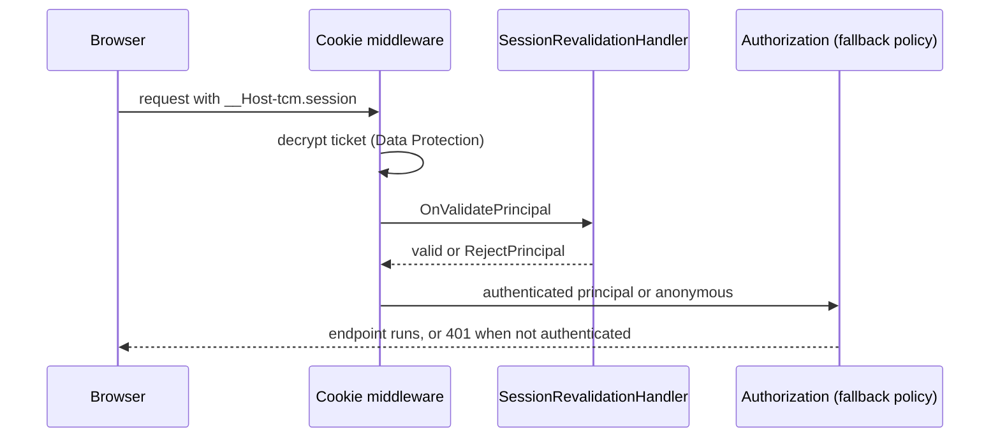

# src/TutoringCentre.Api/Auth/AuthenticationSetup.cs

## Purpose

Registers cookie authentication, the fail-closed authorization fallback policy, the session-validation cache/options and Data Protection for the Api.

## Where It Fits

Api/Auth. Called by `Program.cs:47` (`AddApiAuthentication`). Wires `SessionRevalidationHandler` into the cookie events, reads `SessionValidationOptions` from configuration, and underpins `ActorMiddleware` and the endpoint filters.

## Walkthrough

`AddApiAuthentication(this IServiceCollection)` (15-62):
- `AddAuthentication(CookieAuthenticationDefaults.AuthenticationScheme).AddCookie(options => ...)` (19-47). Cookie settings (verified in the code): name `__Host-tcm.session` (24); `HttpOnly = true` (25); `SecurePolicy = Always` (26); `SameSite = Lax` (27); `Path = "/"` (28) - the `__Host-` prefix requires Secure, Path `/` and no Domain, otherwise the browser rejects the cookie (comment line 23); `ExpireTimeSpan = 8 hours` (30) with `SlidingExpiration = true` (31).
- `Events.OnValidatePrincipal = SessionRevalidationHandler.ValidateAsync` (35): runs after the cookie is decrypted on every authenticated request (see section 6.27).
- `OnRedirectToLogin` -> plain `401`, `OnRedirectToAccessDenied` -> plain `403` (36-45). Cookie auth normally *redirects* browsers to a login page; this is a JSON API behind an SPA, so it answers with a status code and `UseStatusCodePages` (Program.cs:97) turns the empty status into Problem Details.
- `AddAuthorization(options => options.FallbackPolicy = new AuthorizationPolicyBuilder().RequireAuthenticatedUser().Build())` (50-53): every endpoint requires a signed-in user unless it opts out with `.AllowAnonymous()` (fail closed).
- `AddMemoryCache()` (55) for the revalidation cache; `AddOptions<SessionValidationOptions>().BindConfiguration("SessionValidation")` (56); `AddDataProtection().SetApplicationName("TutoringCentre")` (59) - the cookie ticket is encrypted with Data Protection keys. Comment: local key ring in Development (framework default), persisted keys are Month 2.

## Concepts Used

### Cookie authentication and server-side sessions

#### What it means

After a successful login the server must remember *who* the browser is on later requests (HTTP itself is stateless). Cookie authentication does that with one cookie that the browser attaches automatically. Here the cookie holds an **encrypted, tamper-proof ticket** (the user's claims); only the server can read or create it, and flags such as `HttpOnly`, `Secure`, `SameSite` and the `__Host-` name prefix limit where and how browsers send it.

(Full tutorial with execution traces: [PROJECT_OVERVIEW2.md#624-cookie-authentication-and-server-side-sessions](../../../../PROJECT_OVERVIEW2.md#624-cookie-authentication-and-server-side-sessions).)

#### Where it appears in this file

The whole method.

#### How it works here

`AddCookie` options at lines 21-47.

#### Why it matters here

This is where the session cookie's name, flags and lifetime are defined - the single source of truth the tests assert (`LoginFlowTests`, `SecurityTests`).

### Authorization by default, the actor pipeline and the tenant gate

#### What it means

A *fallback authorization policy* makes every endpoint require a signed-in user unless it explicitly opts out (fail closed). A single middleware translates the HTTP identity into the application's own `StaffActor`; the *tenant gate* is the one check that decides which centre a session may act in.

(Full tutorial with execution traces: [PROJECT_OVERVIEW2.md#629-authorization-by-default-the-actor-pipeline-and-the-tenant-gate](../../../../PROJECT_OVERVIEW2.md#629-authorization-by-default-the-actor-pipeline-and-the-tenant-gate).)

#### Where it appears in this file

`FallbackPolicy`.

#### How it works here

Lines 50-53.

#### Why it matters here

A new endpoint is protected the moment it is mapped; `SecurityTests.EndpointWithNoAuthorizationAttribute_Returns401ByDefault` proves it.

### Options pattern and ValidateOnStart

#### What it means

The options pattern binds configuration into a typed class and can validate it. `ValidateOnStart` runs that validation when the host starts, so a bad configuration stops the app immediately instead of failing on first use.

(Full tutorial with execution traces: [PROJECT_OVERVIEW2.md#614-options-validation-and-health-checks](../../../../PROJECT_OVERVIEW2.md#614-options-validation-and-health-checks).)

#### Where it appears in this file

Options binding.

#### How it works here

Line 56.

#### Why it matters here

Cache duration is configuration, not a constant.

### Secrets and configuration layering

#### What it means

Configuration comes from layered sources (JSON files, user-secrets, environment variables, command line) where later layers override earlier ones. Secrets must stay out of git: this repo keeps the connection string out of `appsettings.json`, reads it from user-secrets or an environment variable, and scans history with gitleaks.

(Full tutorial with execution traces: [PROJECT_OVERVIEW2.md#11-configuration--environment--deployment](../../../../PROJECT_OVERVIEW2.md#11-configuration--environment--deployment).)

#### Where it appears in this file

Data Protection key ring.

#### How it works here

Line 59.

#### Why it matters here

The encryption keys for cookies; today a local ring, so a restart or second instance cannot read old cookies (documented limitation).

## Data and Control Flow

## Configuration and Environment

Cookie `__Host-tcm.session` (8 h sliding). Configuration key `SessionValidation:CacheDuration` (bound at line 56). Data Protection application name `TutoringCentre`.

## Gotchas and Issues

The 8-hour expiry lives in the protected ticket; whether the browser keeps the cookie after it closes depends on the `IsPersistent` flag of the sign-in call (`AuthEndpoints` uses the default, i.e. not persistent - framework behaviour, so the cookie is normally a browser-session cookie). Without persisted Data Protection keys every API restart invalidates all sessions (stated in `docs/architecture/authentication.md`).

## Related Files

- [`src/TutoringCentre.Api/Auth/SessionRevalidationHandler.cs`](SessionRevalidationHandler.cs.md)
- [`src/TutoringCentre.Api/Auth/SessionValidationOptions.cs`](SessionValidationOptions.cs.md)
- [`src/TutoringCentre.Api/Auth/ActorMiddleware.cs`](ActorMiddleware.cs.md)
- [`src/TutoringCentre.Api/Program.cs`](../Program.cs.md)
- [`docs/architecture/authentication.md`](../../../docs/architecture/authentication.md.md)
- [`docs/adr/0005-cookie-authentication.md`](../../../docs/adr/0005-cookie-authentication.md.md)
