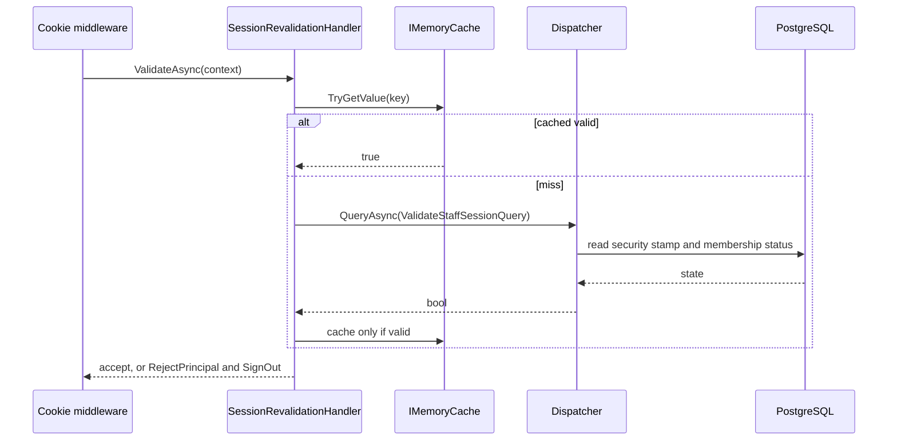

# src/TutoringCentre.Api/Auth/SessionRevalidationHandler.cs

## Purpose

Re-checks a validated cookie's claims against the database so revoked access or a changed security stamp ends the session; valid results are cached briefly, invalid ones never.

## Where It Fits

Api/Auth, `internal static`. Wired as `OnValidatePrincipal` in `AuthenticationSetup`. Calls `Dispatcher.QueryAsync<ValidateStaffSessionQuery,bool>`; reads `IMemoryCache` and `SessionValidationOptions`.

## Walkthrough

`ValidateAsync(CookieValidatePrincipalContext)` (20-58): read `sub` and `stamp`; missing/invalid -> `RejectAsync` (24-30). Parse optional `centre` (32-34). Resolve `IMemoryCache`, options and build the key `("session-valid", userId, stamp, centreId)` (39). On cache miss: resolve `Dispatcher` from the request services and run `ValidateStaffSessionQuery(userId, stamp, centreId)` with `RequestAborted` (43-45); `isValid = result.IsSuccess && result.Value`; **cache only when valid and `CacheDuration > 0`** (48-51). If not valid -> `RejectAsync` (54-57).
`RejectAsync` (60-65): `context.RejectPrincipal()` and `SignOutAsync(...)` so the stale cookie is deleted.
Doc: runs before an actor exists, hence the query takes the user id explicitly.

## Concepts Used

### Session revalidation and revocation

#### What it means

A self-contained cookie cannot be cancelled by itself. Revalidation re-checks the cookie's claims against the database on requests (here via a *security stamp* and the active membership), so a changed password or revoked access ends the session; a short cache bounds the database cost.

(Full tutorial with execution traces: [PROJECT_OVERVIEW2.md#627-session-revalidation-and-revocation](../../../../PROJECT_OVERVIEW2.md#627-session-revalidation-and-revocation).)

#### Where it appears in this file

Per-request re-check.

#### How it works here

Lines 20-58.

#### Why it matters here

Revocation within the cache window (default 60 s).

### CQRS and the dispatcher pipeline

#### What it means

CQRS separates *commands* (intent to change state) from *queries* (read-only questions). A *handler* executes exactly one command or query. A *dispatcher* is the single entry point that finds the handler and wraps shared steps (validation, transaction, logging) around it, so every use case behaves the same way regardless of who calls it (web endpoint, CLI, future bot).

(Full tutorial with execution traces: [PROJECT_OVERVIEW2.md#63-cqrs-and-the-hand-written-dispatcher](../../../../PROJECT_OVERVIEW2.md#63-cqrs-and-the-hand-written-dispatcher).)

#### Where it appears in this file

Dispatcher use outside an endpoint.

#### How it works here

Lines 43-45.

#### Why it matters here

The session check is itself a read-only query, in a read-only transaction.

### Service lifetimes (singleton, scoped, transient)

#### What it means

Lifetime says how long a container-built instance lives. *Singleton*: one for the whole application. *Scoped*: one per scope; in ASP.NET one scope = one HTTP request, and code can create its own scope (as the seed command does). *Transient*: a new instance on every resolution. A longer-lived service must not hold a shorter-lived one (a "captive dependency"), which `ValidateScopes` detects.

(Full tutorial with execution traces: [PROJECT_OVERVIEW2.md#62-dependency-injection-lifetimes-and-scanning](../../../../PROJECT_OVERVIEW2.md#62-dependency-injection-lifetimes-and-scanning).)

#### Where it appears in this file

Resolving scoped services from `RequestServices`.

#### How it works here

Lines 36-43.

#### Why it matters here

Runs inside the request scope, so the dispatcher gets that request's DbContext.

## Data and Control Flow

## Configuration and Environment

Configuration key `SessionValidation:CacheDuration` (default 60 s; zero disables caching, used by the test host).

## Gotchas and Issues

The cache key includes the stamp and centre, so a new stamp or a different centre misses the cache automatically. Invalid results are never cached, so revocation is not masked. The memory cache is per process (framework default).

## Related Files

- [`src/TutoringCentre.Api/Auth/AuthenticationSetup.cs`](AuthenticationSetup.cs.md)
- [`src/TutoringCentre.Api/Auth/SessionValidationOptions.cs`](SessionValidationOptions.cs.md)
- [`src/TutoringCentre.Application/Identity/Queries/ValidateStaffSession/ValidateStaffSessionHandler.cs`](../../TutoringCentre.Application/Identity/Queries/ValidateStaffSession/ValidateStaffSessionHandler.cs.md)
- [`tests/TutoringCentre.Api.Tests/Auth/SecurityTests.cs`](../../../tests/TutoringCentre.Api.Tests/Auth/SecurityTests.cs.md)
