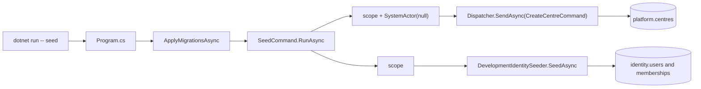

# src/TutoringCentre.Api/Cli/SeedCommand.cs

## Purpose

The `seed` command: creates two demo centres through the dispatcher as the system actor, then seeds the development staff accounts and memberships.

## Where It Fits

Api/Cli, `public static`. Called by `Program.cs:76` and by `SeedCommandTests`, `LoginFlowTests`, `SecurityTests`. Depends on `CurrentActorContext`, `Dispatcher`, `CreateCentreCommand`, `SystemActor` and (since the identity work) `DevelopmentIdentitySeeder` from Infrastructure - allowed because the `Cli` namespace is exempt from the 'only Program references Infrastructure' rule.

## Walkthrough

Static array `Centres` (15-19): `Nile Tutoring Centre / nile-centre / Africa/Cairo / Ar` and `Maadi Learning Hub / maadi-hub / Africa/Cairo / En`. `RunAsync(IServiceProvider)` (30-80): obtains a logger; **centres loop** (37-61): for each centre a new async scope (40) with its own `CurrentActorContext`, `UnitOfWork` and `DbContext`; `Set(new SystemActor(null))` (41); `SendAsync<CreateCentreCommand,CreateCentreResult>` (44). Success -> info 'created'; `centre.slug_taken` -> info 'already exists' (idempotent); anything else -> error log and `exitCode = 1` (59). **Staff step** (63-77): another scope; resolves `DevelopmentIdentitySeeder` and calls `SeedAsync(CancellationToken.None)`; success logs `staff accounts and memberships are up to date`, failure logs the error code and sets `exitCode = 1`. Returns the exit code (79). The seeder reads `Seed:Password`; the result of the seed is 2 centres, 5 users and 6 memberships (one inactive), which `SeedCommandTests.RunAsync_CalledTwice_CreatesExactlyTheStaffSetIdempotently` asserts.

## Concepts Used

### CQRS and the dispatcher pipeline

#### What it means

CQRS separates *commands* (intent to change state) from *queries* (read-only questions). A *handler* executes exactly one command or query. A *dispatcher* is the single entry point that finds the handler and wraps shared steps (validation, transaction, logging) around it, so every use case behaves the same way regardless of who calls it (web endpoint, CLI, future bot).

(Full tutorial with execution traces: [PROJECT_OVERVIEW2.md#63-cqrs-and-the-hand-written-dispatcher](../../../../PROJECT_OVERVIEW2.md#63-cqrs-and-the-hand-written-dispatcher).)

#### Where it appears in this file

Centres go through the dispatcher.

#### How it works here

Lines 40-46.

#### Why it matters here

A CLI is just another client of the Application layer.

### Service lifetimes (singleton, scoped, transient)

#### What it means

Lifetime says how long a container-built instance lives. *Singleton*: one for the whole application. *Scoped*: one per scope; in ASP.NET one scope = one HTTP request, and code can create its own scope (as the seed command does). *Transient*: a new instance on every resolution. A longer-lived service must not hold a shorter-lived one (a "captive dependency"), which `ValidateScopes` detects.

(Full tutorial with execution traces: [PROJECT_OVERVIEW2.md#62-dependency-injection-lifetimes-and-scanning](../../../../PROJECT_OVERVIEW2.md#62-dependency-injection-lifetimes-and-scanning).)

#### Where it appears in this file

One scope per unit of work.

#### How it works here

Lines 40 and 63.

#### Why it matters here

Scoped services (actor, unit of work, DbContext) are per scope.

### Actor and tenancy groundwork

#### What it means

An *actor* is who executes a use case; a *tenant* is one customer's isolated data slice (here a Centre). The actor is supplied by trusted edge code, never by request data.

(Full tutorial with execution traces: [PROJECT_OVERVIEW2.md#611-the-actor-model-and-the-tenancy-groundwork](../../../../PROJECT_OVERVIEW2.md#611-the-actor-model-and-the-tenancy-groundwork).)

#### Where it appears in this file

System actor for centre creation.

#### How it works here

Line 41.

#### Why it matters here

Satisfies `CreateCentreHandler`'s authorization (only `SystemActor` may create centres).

### Identity and membership modelling

#### What it means

*Identity* is the part of a system that stores users, credentials and lockout state. *Membership* models which user may act in which centre in which role. Keeping role on the membership (not on the user) lets one person be an owner in one centre and a teacher in another.

(Full tutorial with execution traces: [PROJECT_OVERVIEW2.md#628-identity-and-membership-modelling](../../../../PROJECT_OVERVIEW2.md#628-identity-and-membership-modelling).)

#### Where it appears in this file

Staff seeding is not a command.

#### How it works here

Lines 63-77.

#### Why it matters here

The seeder talks to `UserManager` and `AppDbContext` directly because it is a development tool, not a use case (see `DevelopmentIdentitySeeder`).

## Data and Control Flow

## Configuration and Environment

Same connection string as the app, plus `Seed:Password` (required by the seeder; supply it with user-secrets or the environment variable `Seed__Password`).

## Gotchas and Issues

Exit code 1 is returned only for non-`slug_taken` centre failures and for a failed staff seed; exceptions (database down) propagate and crash the process with a non-zero exit code by the runtime's default behaviour (not coded here). The step order matters: the staff seed needs the centres to exist for its memberships.

## Related Files

- [`src/TutoringCentre.Api/Program.cs`](../Program.cs.md)
- [`src/TutoringCentre.Application/Centres/Commands/CreateCentre/CreateCentreHandler.cs`](../../TutoringCentre.Application/Centres/Commands/CreateCentre/CreateCentreHandler.cs.md)
- [`src/TutoringCentre.Infrastructure/Identity/DevelopmentIdentitySeeder.cs`](../../TutoringCentre.Infrastructure/Identity/DevelopmentIdentitySeeder.cs.md)
- [`tests/TutoringCentre.Api.Tests/Cli/SeedCommandTests.cs`](../../../tests/TutoringCentre.Api.Tests/Cli/SeedCommandTests.cs.md)
