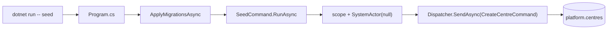

# src/TutoringCentre.Api/Cli/SeedCommand.cs

## Purpose

The `seed` command: creates two demo centres by sending `CreateCentreCommand` through the dispatcher as the system actor.

## Where It Fits

Api/Cli, `public static`. Called by `Program.cs:51` and `SeedCommandTests`. Depends on `CurrentActorContext`, `Dispatcher`, `CreateCentreCommand`, `SystemActor`.

## Walkthrough

Static array `Centres` (13-17): `Nile Tutoring Centre / nile-centre / Africa/Cairo / Ar` and `Maadi Learning Hub / maadi-hub / Africa/Cairo / En`. `RunAsync(IServiceProvider)` (29-62): gets an `ILoggerFactory` logger; for each centre: `await using var scope = services.CreateAsyncScope()` (39) - own `CurrentActorContext`, `UnitOfWork`, `DbContext`; `Set(new SystemActor(null))` (40); resolve `Dispatcher`; `SendAsync<CreateCentreCommand,CreateCentreResult>` (43). Success -> info 'created'; `centre.slug_taken` -> info 'already exists' (idempotent); other -> error log and `exitCode = 1` (58). Returns the exit code. Doc: 'A CLI is just another client of the Application layer.'

## Concepts Used

### CQRS and the dispatcher pipeline

#### What it means

CQRS separates *commands* (intent to change state) from *queries* (read-only questions). A *handler* executes exactly one command or query. A *dispatcher* is the single entry point that finds the handler and wraps shared steps (validation, transaction, logging) around it, so every use case behaves the same way regardless of who calls it (web endpoint, CLI, future bot).

(Full tutorial with execution traces: [PROJECT_OVERVIEW.md#63-cqrs-and-the-hand-written-dispatcher](../../../../PROJECT_OVERVIEW.md#63-cqrs-and-the-hand-written-dispatcher).)

#### Where it appears in this file

Dispatch from a non-HTTP client.

#### How it works here

Line 43.

#### Why it matters here

Shows front doors share use cases.

### Service lifetimes (singleton, scoped, transient)

#### What it means

Lifetime says how long a container-built instance lives. *Singleton*: one for the whole application. *Scoped*: one per scope; in ASP.NET one scope = one HTTP request, and code can create its own scope (as the seed command does). *Transient*: a new instance on every resolution. A longer-lived service must not hold a shorter-lived one (a "captive dependency"), which `ValidateScopes` detects.

(Full tutorial with execution traces: [PROJECT_OVERVIEW.md#62-dependency-injection-lifetimes-and-scanning](../../../../PROJECT_OVERVIEW.md#62-dependency-injection-lifetimes-and-scanning).)

#### Where it appears in this file

One scope per command.

#### How it works here

Line 39.

#### Why it matters here

Fresh actor/DbContext/transaction each time.

### Actor and tenancy groundwork

#### What it means

An *actor* is who executes a use case; a *tenant* is one customer's isolated data slice (here a Centre). The actor is supplied by trusted edge code, never by request data.

(Full tutorial with execution traces: [PROJECT_OVERVIEW.md#611-the-actor-model-and-the-tenancy-groundwork](../../../../PROJECT_OVERVIEW.md#611-the-actor-model-and-the-tenancy-groundwork).)

#### Where it appears in this file

SystemActor.

#### How it works here

Line 40.

#### Why it matters here

Satisfies `CreateCentreHandler`'s authorization.

## Data and Control Flow

## Configuration and Environment

Uses the same connection string as the app; no extra variables.

## Gotchas and Issues

Exit code 1 is returned only for non-`slug_taken` failures; exceptions (database down) propagate and crash the process with a non-zero code by the runtime's default behaviour (not coded here).

## Related Files

- [`src/TutoringCentre.Api/Program.cs`](../Program.cs.md)
- [`src/TutoringCentre.Application/Centres/Commands/CreateCentre/CreateCentreHandler.cs`](../../TutoringCentre.Application/Centres/Commands/CreateCentre/CreateCentreHandler.cs.md)
- [`tests/TutoringCentre.Api.Tests/Cli/SeedCommandTests.cs`](../../../tests/TutoringCentre.Api.Tests/Cli/SeedCommandTests.cs.md)
