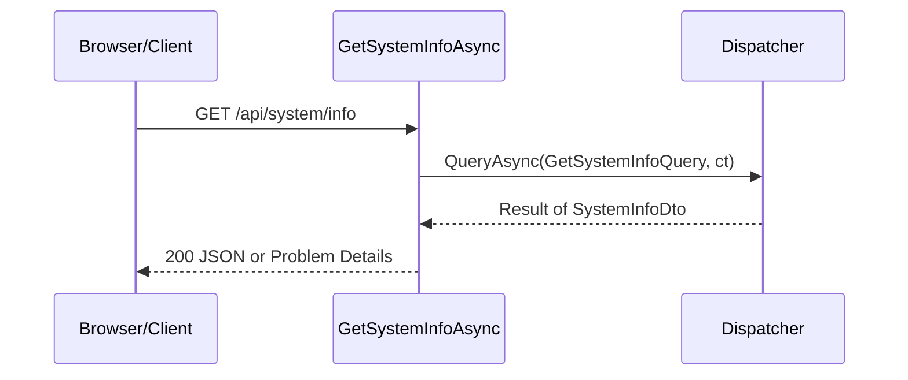

# src/TutoringCentre.Api/Endpoints/PlatformEndpoints.cs

## Purpose

Maps `GET /api/system/info`, the only product endpoint, as bind -> dispatch -> map with no logic.

## Where It Fits

Api/Endpoints. Called by `Program.cs:85` on the `/api` route group. Depends on `Dispatcher`, `GetSystemInfoQuery`, `SystemInfoDto`, `ResultHttpExtensions`.

## Walkthrough

`MapPlatformEndpoints(this RouteGroupBuilder api)` (15-19): `api.MapGet("/system/info", GetSystemInfoAsync).WithName("GetSystemInfo").Produces<SystemInfoDto>().ProducesProblem(500).AllowAnonymous()`. Handler `GetSystemInfoAsync(Dispatcher dispatcher, CancellationToken ct)` (24): `await dispatcher.QueryAsync<GetSystemInfoQuery,SystemInfoDto>(new GetSystemInfoQuery(), ct)` then `result.ToHttpResult(dto => Results.Ok(dto))`. The framework injects `dispatcher` from the request scope and binds `ct` to `HttpContext.RequestAborted`. `.Produces` metadata feeds API descriptions; `.AllowAnonymous()` records intent but, with no authorization middleware, has no runtime effect.

## Concepts Used

### Minimal APIs, routing and route groups

#### What it means

Minimal APIs map a URL pattern and HTTP verb straight to a delegate (`MapGet("/x", handler)`). The framework binds delegate parameters from DI (services), the route, query, body or `CancellationToken`. A *route group* shares a prefix and metadata across endpoints.

(Full tutorial with execution traces: [PROJECT_OVERVIEW.md#612-http-problem-details-and-error-handling](../../../../PROJECT_OVERVIEW.md#612-http-problem-details-and-error-handling).)

#### Where it appears in this file

`MapGet` + route group.

#### How it works here

Lines 15-19.

#### Why it matters here

Endpoint shape.

### CQRS and the dispatcher pipeline

#### What it means

CQRS separates *commands* (intent to change state) from *queries* (read-only questions). A *handler* executes exactly one command or query. A *dispatcher* is the single entry point that finds the handler and wraps shared steps (validation, transaction, logging) around it, so every use case behaves the same way regardless of who calls it (web endpoint, CLI, future bot).

(Full tutorial with execution traces: [PROJECT_OVERVIEW.md#63-cqrs-and-the-hand-written-dispatcher](../../../../PROJECT_OVERVIEW.md#63-cqrs-and-the-hand-written-dispatcher).)

#### Where it appears in this file

Dispatch.

#### How it works here

Line 24-26.

#### Why it matters here

Thin edge.

### Problem Details (RFC 9457) and centralised error handling

#### What it means

Problem Details is a standard JSON error shape (`title`, `status`, `detail`, extensions) served as `application/problem+json`. Centralising error writing in one place keeps every error response uniform and prevents leaking internals.

(Full tutorial with execution traces: [PROJECT_OVERVIEW.md#612-http-problem-details-and-error-handling](../../../../PROJECT_OVERVIEW.md#612-http-problem-details-and-error-handling).)

#### Where it appears in this file

`ToHttpResult`.

#### How it works here

Return statement.

#### Why it matters here

Uniform success/failure mapping.

### async/await and cancellation

#### What it means

`async`/`await` lets a method wait for I/O (database, network) without blocking a thread: the method returns a `Task`, and execution resumes after the awaited operation completes. A `CancellationToken` is a cooperative signal (for example, the HTTP request was aborted) passed down so work can stop early.

(Full tutorial with execution traces: [PROJECT_OVERVIEW.md#63-cqrs-and-the-hand-written-dispatcher](../../../../PROJECT_OVERVIEW.md#63-cqrs-and-the-hand-written-dispatcher).)

#### Where it appears in this file

`CancellationToken ct`.

#### How it works here

Handler parameter.

#### Why it matters here

Cancelling the HTTP request cancels database work.

## Data and Control Flow

## Configuration and Environment

None. The file reads no environment variables and declares no configuration keys, URLs, ports or credentials.

## Gotchas and Issues

No frontend code calls this endpoint yet (only an MSW mock).

## Related Files

- [`src/TutoringCentre.Api/Program.cs`](../Program.cs.md)
- [`src/TutoringCentre.Application/Platform/Queries/GetSystemInfo/GetSystemInfoHandler.cs`](../../TutoringCentre.Application/Platform/Queries/GetSystemInfo/GetSystemInfoHandler.cs.md)
- [`src/TutoringCentre.Api/Http/ResultHttpExtensions.cs`](../Http/ResultHttpExtensions.cs.md)
