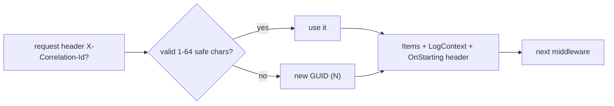

# src/TutoringCentre.Api/Http/CorrelationIdMiddleware.cs

## Purpose

Gives every request a validated correlation ID, exposes it in the response header and in every log line.

## Where It Fits

Api/Http, `internal`. Registered first in `Program.cs:86`. Provides the value `ProblemResult` reads from `HttpContext.Items`.

## Walkthrough

Convention-based middleware: constructor `(RequestDelegate next)`, method `InvokeAsync(HttpContext)`. `HeaderName = "X-Correlation-Id"` (14), `MaxLength = 64` (15). Steps (17-37): read the request header (21); `IsValid(supplied)` (39) requires length 1-64 and every character ASCII letter/digit or `.`/`_`/`-`; otherwise `Guid.NewGuid().ToString("N")` (32 hex chars) (22); store in `context.Items[HttpContextKeys.CorrelationId]`; register `context.Response.OnStarting(...)` (27) which writes the header when the response begins (comment: the exception handler clears the response before writing a 500, so an immediate write would be lost); `using (LogContext.PushProperty("CorrelationId", id)) await next(context)` (33) so all log lines inside carry it. Rationale in the doc comment: an unvalidated header written to logs could inject fake lines or huge values.

## Concepts Used

### Middleware and the request pipeline

#### What it means

Middleware components form a chain; each receives the request, may act before calling `next`, and may act again after it returns. Order is behaviour: a component only sees what earlier components set up and only wraps what comes after it.

(Full tutorial with execution traces: [PROJECT_OVERVIEW2.md#8-routing-and-middleware](../../../../PROJECT_OVERVIEW2.md#8-routing-and-middleware).)

#### Where it appears in this file

Wrapping `next`.

#### How it works here

`await next(context)` inside `using`.

#### Why it matters here

Property is scoped to the request's downstream work.

### Structured logging, Serilog and correlation IDs

#### What it means

Structured logging records a message *template* plus named properties, so logs are queryable by field. A *correlation ID* is attached to every log line and response of one request so they can be matched. *Destructuring* lets Serilog log an object's properties; a policy can mask sensitive ones.

(Full tutorial with execution traces: [PROJECT_OVERVIEW2.md#613-structured-logging-correlation-ids-and-redaction](../../../../PROJECT_OVERVIEW2.md#613-structured-logging-correlation-ids-and-redaction).)

#### Where it appears in this file

`LogContext.PushProperty`.

#### How it works here

Line 33.

#### Why it matters here

Every log event carries `CorrelationId`.

### async/await and cancellation

#### What it means

`async`/`await` lets a method wait for I/O (database, network) without blocking a thread: the method returns a `Task`, and execution resumes after the awaited operation completes. A `CancellationToken` is a cooperative signal (for example, the HTTP request was aborted) passed down so work can stop early.

(Full tutorial with execution traces: [PROJECT_OVERVIEW2.md#63-cqrs-and-the-hand-written-dispatcher](../../../../PROJECT_OVERVIEW2.md#63-cqrs-and-the-hand-written-dispatcher).)

#### Where it appears in this file

`OnStarting` callback.

#### How it works here

Line 27.

#### Why it matters here

Header is added at the last moment, surviving response resets.

## Data and Control Flow

## Configuration and Environment

Header name `X-Correlation-Id`.

## Gotchas and Issues

A valid client-supplied ID is trusted as-is (not unique).

## Related Files

- [`src/TutoringCentre.Api/Http/ProblemResult.cs`](ProblemResult.cs.md)
- [`src/TutoringCentre.Api/Http/HttpContextKeys.cs`](HttpContextKeys.cs.md)
- [`tests/TutoringCentre.Api.Tests/Http/CorrelationIdTests.cs`](../../../tests/TutoringCentre.Api.Tests/Http/CorrelationIdTests.cs.md)
- [`src/TutoringCentre.Api/Program.cs`](../Program.cs.md)
