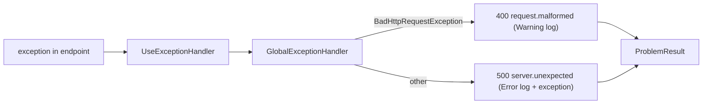

# src/TutoringCentre.Api/Http/GlobalExceptionHandler.cs

## Purpose

The single place unexpected exceptions are logged and converted into Problem Details responses without leaking internals.

## Where It Fits

Api/Http, `internal sealed partial`. Registered in `ProblemDetailsSetup`; invoked by `UseExceptionHandler()` in `Program.cs:71`. Writes through `ProblemResult`.

## Walkthrough

`TryHandleAsync(HttpContext, Exception, CancellationToken)` (14-35): if `exception is BadHttpRequestException` (21) -> `LogMalformedRequest` (Warning, no exception object) and 400 `request.malformed` ('The request could not be read.'); else -> `LogUnexpectedException` (Error, with the exception) and 500 `server.unexpected` ('An unexpected error occurred.'). Builds a `ProblemDetails` with extension `code` (`Create`, 37-41) and executes `new ProblemResult(problem).ExecuteAsync(httpContext)`; returns `true` (handled). The two logging methods are source-generated `[LoggerMessage]` partial methods (44, 47), so the class is `partial`. The response never includes exception text (test plants `hunter2` and `InvalidOperationException` and asserts absence).

## Concepts Used

### Problem Details (RFC 9457) and centralised error handling

#### What it means

Problem Details is a standard JSON error shape (`title`, `status`, `detail`, extensions) served as `application/problem+json`. Centralising error writing in one place keeps every error response uniform and prevents leaking internals.

(Full tutorial with execution traces: [PROJECT_OVERVIEW.md#612-http-problem-details-and-error-handling](../../../../PROJECT_OVERVIEW.md#612-http-problem-details-and-error-handling).)

#### Where it appears in this file

Central exception translation.

#### How it works here

Whole class.

#### Why it matters here

Uniform errors and no information leakage.

### Structured logging, Serilog and correlation IDs

#### What it means

Structured logging records a message *template* plus named properties, so logs are queryable by field. A *correlation ID* is attached to every log line and response of one request so they can be matched. *Destructuring* lets Serilog log an object's properties; a policy can mask sensitive ones.

(Full tutorial with execution traces: [PROJECT_OVERVIEW.md#613-structured-logging-correlation-ids-and-redaction](../../../../PROJECT_OVERVIEW.md#613-structured-logging-correlation-ids-and-redaction).)

#### Where it appears in this file

`[LoggerMessage]`.

#### How it works here

Lines 44-48.

#### Why it matters here

Compile-time log delegates.

### Middleware and the request pipeline

#### What it means

Middleware components form a chain; each receives the request, may act before calling `next`, and may act again after it returns. Order is behaviour: a component only sees what earlier components set up and only wraps what comes after it.

(Full tutorial with execution traces: [PROJECT_OVERVIEW.md#8-routing-and-middleware](../../../../PROJECT_OVERVIEW.md#8-routing-and-middleware).)

#### Where it appears in this file

`IExceptionHandler` via `UseExceptionHandler`.

#### How it works here

Registered in `ProblemDetailsSetup`.

#### Why it matters here

Framework calls handlers in registration order.

## Data and Control Flow

## Configuration and Environment

None. The file reads no environment variables and declares no configuration keys, URLs, ports or credentials.

## Gotchas and Issues

Only `BadHttpRequestException` is classified; other client errors (e.g. `JsonException` outside binding) become 500. A unique-violation `DbUpdateException` also becomes 500 today.

## Related Files

- [`src/TutoringCentre.Api/Http/ProblemResult.cs`](ProblemResult.cs.md)
- [`src/TutoringCentre.Api/Http/ProblemDetailsSetup.cs`](ProblemDetailsSetup.cs.md)
- [`tests/TutoringCentre.Api.Tests/Http/ProblemDetailsTests.cs`](../../../tests/TutoringCentre.Api.Tests/Http/ProblemDetailsTests.cs.md)
- [`src/TutoringCentre.Api/Program.cs`](../Program.cs.md)
