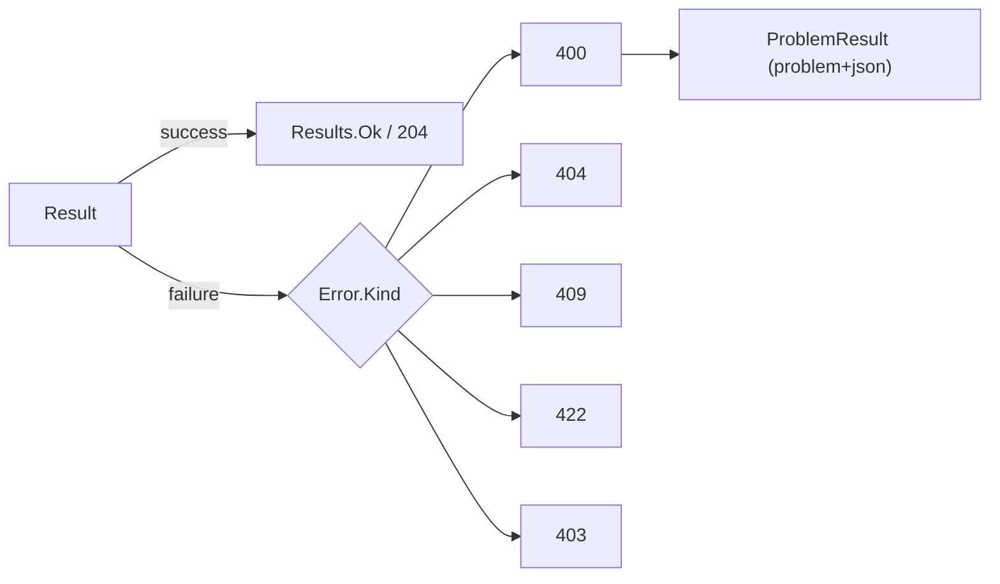

# src/TutoringCentre.Api/Http/ResultHttpExtensions.cs

## Purpose

The only place domain `Result`/`Error` values become HTTP responses.

## Where It Fits

Api/Http, `public static`. Used by `PlatformEndpoints`, `Program.cs` fallback, and test endpoints. Depends on `ProblemResult`, `Error`, `ErrorKind`.

## Walkthrough

`ToHttpResult<T>(this Result<T>, Func<T,IResult> onSuccess)` (13): success -> `onSuccess(result.Value)`; failure -> `result.Error!.ToProblemResult()`. `ToHttpResult(this Result)` (20): success -> `Results.NoContent()` (204). `ToProblemResult(this Error)` (23-43): switch on `ErrorKind` (29-33): Validation 400, NotFound 404, Conflict 409, Rule 422, Forbidden 403, default throws `ArgumentOutOfRangeException`; when `Kind == Validation && Fields != null` builds `ValidationProblemDetails` (adds the `errors` object), else `ProblemDetails`; `Detail = error.Message`; `Extensions["code"] = error.Code`; returns `new ProblemResult(problem)`. Doc comment explains each status's meaning.

## Concepts Used

### The Result pattern (failures as values)

#### What it means

Expected business failures (invalid input, duplicate, not allowed) are returned as ordinary values - a `Result` holding either a value or an `Error` - instead of thrown. Exceptions are reserved for bugs and infrastructure faults. The caller's code must look at the result, so the failure path cannot be forgotten, and no exception-handling cost or hidden control flow is involved.

(Full tutorial with execution traces: [PROJECT_OVERVIEW.md#64-the-result-pattern-failures-as-values](../../../../PROJECT_OVERVIEW.md#64-the-result-pattern-failures-as-values).)

#### Where it appears in this file

Mapping `Result` to HTTP.

#### How it works here

Lines 13-43.

#### Why it matters here

Endpoints never branch on outcome.

### Problem Details (RFC 9457) and centralised error handling

#### What it means

Problem Details is a standard JSON error shape (`title`, `status`, `detail`, extensions) served as `application/problem+json`. Centralising error writing in one place keeps every error response uniform and prevents leaking internals.

(Full tutorial with execution traces: [PROJECT_OVERVIEW.md#612-http-problem-details-and-error-handling](../../../../PROJECT_OVERVIEW.md#612-http-problem-details-and-error-handling).)

#### Where it appears in this file

Problem Details construction.

#### How it works here

Lines 38-43.

#### Why it matters here

Stable `code` and field errors for the frontend.

## Data and Control Flow

## Configuration and Environment

None. The file reads no environment variables and declares no configuration keys, URLs, ports or credentials.

## Gotchas and Issues

Adding an `ErrorKind` without a switch arm throws at runtime for that kind.

## Related Files

- [`src/TutoringCentre.Api/Http/ProblemResult.cs`](ProblemResult.cs.md)
- [`src/TutoringCentre.Domain/Common/Error.cs`](../../TutoringCentre.Domain/Common/Error.cs.md)
- [`src/TutoringCentre.Domain/Common/ErrorKind.cs`](../../TutoringCentre.Domain/Common/ErrorKind.cs.md)
- [`tests/TutoringCentre.Api.Tests/Http/ResultHttpExtensionsTests.cs`](../../../tests/TutoringCentre.Api.Tests/Http/ResultHttpExtensionsTests.cs.md)
