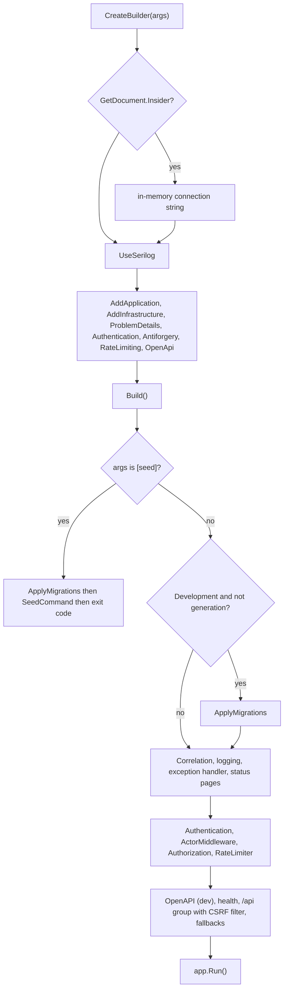

# src/TutoringCentre.Api/Program.cs

## Purpose

Application entry point and composition root: configures logging, services (including authentication, antiforgery, rate limiting and OpenAPI), runs the `seed` CLI mode or builds the HTTP pipeline, and starts the web host.

## Where It Fits

Api root. Calls `AddApplication`, `AddInfrastructure`, `AddApiProblemDetails`, `AddApiAuthentication`, `AddApiAntiforgery`, `AddLoginRateLimiting`, `ApplyMigrationsAsync`, `SeedCommand.RunAsync`, the middleware `CorrelationIdMiddleware` and `ActorMiddleware`, `MapPlatformEndpoints`, `MapAuthEndpoints`, `ResultHttpExtensions.ToProblemResult`. Hosted in tests by `WebApplicationFactory<Program>`. It is one of only two places allowed to reference Infrastructure (the other is the `Cli` namespace; `ApiRuleTests` enforces it).

## Walkthrough

In execution order (line numbers verified):
- 18 `WebApplication.CreateBuilder(args)`.
- 20-30 OpenAPI-generation guard: `isDocumentGeneration = Assembly.GetEntryAssembly()?.GetName().Name == "GetDocument.Insider"`. The build-time OpenAPI generator (`Microsoft.Extensions.ApiDescription.Server`) runs this entry point inside a tool host called `GetDocument.Insider`; startup side effects must not run there, but every endpoint must still be registered. When true, an in-memory configuration entry sets `ConnectionStrings:Postgres = Host=localhost;Database=openapi_generation` to satisfy fail-fast options validation (nothing connects).
- 32-42 `UseSerilog(...)`: `ReadFrom.Configuration`, `ReadFrom.Services`, `Enrich.FromLogContext`, `Destructure.With<SensitiveDataDestructuringPolicy>`, console `RenderedCompactJsonFormatter`; `preserveStaticLogger: true` (concurrent test hosts would otherwise overwrite the global logger).
- 44-49 services: `AddHealthChecks()`, `AddApplication().AddInfrastructure(builder.Configuration)` (45), `AddApiProblemDetails()` (46), `AddApiAuthentication()` (47, cookie scheme + fallback policy + memory cache + Data Protection), `AddApiAntiforgery()` (48), `AddLoginRateLimiting()` (49).
- 51-56 JSON: `UnmappedMemberHandling.Disallow`, camelCase string enums. 60 `RouteHandlerOptions.ThrowOnBadRequest = true`.
- 62-68 `AddOpenApi` with a document transformer that clears `document.Servers` so the committed document is identical on every machine and in CI.
- 70 `Build()`.
- 72-77 CLI mode: `if (args is ["seed"])` -> `ApplyMigrationsAsync()` then `return await SeedCommand.RunAsync(app.Services)`; the web host never starts.
- 79-84 Development only (and not during document generation): auto-migrate.
- Middleware pipeline, in order: 86 `CorrelationIdMiddleware`; 89-94 `UseSerilogRequestLogging` (exception or >= 500 -> Error; `/health` -> Verbose; else Information); 96 `UseExceptionHandler()`; 97 `UseStatusCodePages()`; 99 `UseAuthentication()`; 100 `UseMiddleware<ActorMiddleware>()`; 101 `UseAuthorization()`; 102 `UseRateLimiter()`.
- 104-108 Development only: `app.MapOpenApi().AllowAnonymous()`.
- 110-118 health endpoints, both `.AllowAnonymous()`: `/health` (`Predicate = _ => false`, liveness) and `/health/ready` (tag `ready`).
- 120-122 `var api = app.MapGroup("/api").AddEndpointFilter<AntiforgeryEndpointFilter>();` then `api.MapPlatformEndpoints(); api.MapAuthEndpoints();` - the CSRF filter is attached once to the whole group.
- 124-135 two anonymous fallbacks: `/api/{**path}` -> `route.not_found` (excluded from the OpenAPI document), and a pattern-less fallback with the same answer for unmatched non-API routes (placeholder for Month 2 static file serving). Both exist because the authorization fallback policy would otherwise turn 'no endpoint matched' into 401.
- 137 `app.Run()`; 140 `public partial class Program;` (makes the top-level-statements class visible to tests).

## Concepts Used

### Dependency Injection (DI) and the container

#### What it means

A class that needs a collaborator can create it itself (`new X()`), which hard-wires the choice, or it can *receive* it, usually as a constructor parameter. That second approach is dependency injection. A DI *container* stores *registrations* ("when asked for type A, build type B with lifetime L") and performs *resolution*: it picks a constructor, resolves each parameter recursively, builds the object and caches it according to the lifetime. This is inversion of control: the class no longer decides what it depends on.

(Full tutorial with execution traces: [PROJECT_OVERVIEW2.md#62-dependency-injection-lifetimes-and-scanning](../../../PROJECT_OVERVIEW2.md#62-dependency-injection-lifetimes-and-scanning).)

#### Where it appears in this file

Service registration.

#### How it works here

Lines 44-49 and 62-68.

#### Why it matters here

Each `Add...` call hands one subsystem its registrations; `Program.cs` only lists them.

### Middleware and the request pipeline

#### What it means

Middleware components form a chain; each receives the request, may act before calling `next`, and may act again after it returns. Order is behaviour: a component only sees what earlier components set up and only wraps what comes after it.

(Full tutorial with execution traces: [PROJECT_OVERVIEW2.md#8-routing-and-middleware](../../../PROJECT_OVERVIEW2.md#8-routing-and-middleware).)

#### Where it appears in this file

Pipeline order.

#### How it works here

Lines 86-102.

#### Why it matters here

Authentication must run before `ActorMiddleware` (which reads the authenticated principal), and both before authorization; the rate limiter sits after authorization so rejected anonymous requests are still limited per policy.

### Minimal APIs, routing and route groups

#### What it means

Minimal APIs map a URL pattern and HTTP verb straight to a delegate (`MapGet("/x", handler)`). The framework binds delegate parameters from DI (services), the route, query, body or `CancellationToken`. A *route group* shares a prefix and metadata across endpoints.

(Full tutorial with execution traces: [PROJECT_OVERVIEW2.md#612-http-problem-details-and-error-handling](../../../PROJECT_OVERVIEW2.md#612-http-problem-details-and-error-handling).)

#### Where it appears in this file

Route group with an endpoint filter.

#### How it works here

Lines 120-122.

#### Why it matters here

One filter on the group guards every present and future `/api` endpoint against CSRF.

### Structured logging, Serilog and correlation IDs

#### What it means

Structured logging records a message *template* plus named properties, so logs are queryable by field. A *correlation ID* is attached to every log line and response of one request so they can be matched. *Destructuring* lets Serilog log an object's properties; a policy can mask sensitive ones.

(Full tutorial with execution traces: [PROJECT_OVERVIEW2.md#613-structured-logging-correlation-ids-and-redaction](../../../PROJECT_OVERVIEW2.md#613-structured-logging-correlation-ids-and-redaction).)

#### Where it appears in this file

Serilog host logging.

#### How it works here

Lines 32-42, 89-94.

#### Why it matters here

One structured line per request; health probes demoted to Verbose.

### Health checks: liveness vs readiness

#### What it means

*Liveness* answers "is the process alive?"; *readiness* answers "can it serve traffic (dependencies up)?". Orchestrators restart on liveness failure and stop routing on readiness failure, so the two must not be conflated.

(Full tutorial with execution traces: [PROJECT_OVERVIEW2.md#614-options-validation-and-health-checks](../../../PROJECT_OVERVIEW2.md#614-options-validation-and-health-checks).)

#### Where it appears in this file

Liveness and readiness.

#### How it works here

Lines 110-118.

#### Why it matters here

Anonymous so orchestrators can probe without a session.

### Options pattern and ValidateOnStart

#### What it means

The options pattern binds configuration into a typed class and can validate it. `ValidateOnStart` runs that validation when the host starts, so a bad configuration stops the app immediately instead of failing on first use.

(Full tutorial with execution traces: [PROJECT_OVERVIEW2.md#614-options-validation-and-health-checks](../../../PROJECT_OVERVIEW2.md#614-options-validation-and-health-checks).)

#### Where it appears in this file

Fail-fast configuration.

#### How it works here

Lines 22-30 and `ValidateOnStart` in Infrastructure.

#### Why it matters here

The OpenAPI tool host needs a syntactically valid connection string but never connects.

### Cookie authentication and server-side sessions

#### What it means

After a successful login the server must remember *who* the browser is on later requests (HTTP itself is stateless). Cookie authentication does that with one cookie that the browser attaches automatically. Here the cookie holds an **encrypted, tamper-proof ticket** (the user's claims); only the server can read or create it, and flags such as `HttpOnly`, `Secure`, `SameSite` and the `__Host-` name prefix limit where and how browsers send it.

(Full tutorial with execution traces: [PROJECT_OVERVIEW2.md#624-cookie-authentication-and-server-side-sessions](../../../PROJECT_OVERVIEW2.md#624-cookie-authentication-and-server-side-sessions).)

#### Where it appears in this file

Authentication registration and middleware.

#### How it works here

Lines 47, 99.

#### Why it matters here

Registers the cookie scheme and runs it early so later middleware sees the identity.

### CSRF protection with antiforgery tokens

#### What it means

Because browsers attach cookies automatically, a malicious *other* site can make the victim's browser send a state-changing request. CSRF protection adds a second, explicit proof that the request came from the application's own script: a token that must be sent in a header, which a foreign site cannot read or set.

(Full tutorial with execution traces: [PROJECT_OVERVIEW2.md#625-csrf-protection-double-submit-antiforgery-tokens](../../../PROJECT_OVERVIEW2.md#625-csrf-protection-double-submit-antiforgery-tokens).)

#### Where it appears in this file

Antiforgery registration and filter.

#### How it works here

Lines 48, 120.

#### Why it matters here

Registers the token machinery and attaches the filter to the whole `/api` group.

### Rate limiting, lockout and enumeration resistance

#### What it means

*Rate limiting* caps how many requests one source may make in a time window (stops password spraying from one place). *Lockout* temporarily blocks one account after repeated failures (stops many guesses against one account). *Enumeration resistance* means failure responses (and their timing) reveal nothing about whether an account exists.

(Full tutorial with execution traces: [PROJECT_OVERVIEW2.md#626-rate-limiting-lockout-and-enumeration-resistance](../../../PROJECT_OVERVIEW2.md#626-rate-limiting-lockout-and-enumeration-resistance).)

#### Where it appears in this file

Rate limiter.

#### How it works here

Lines 49, 102.

#### Why it matters here

Registers the `login` policy and enables the limiter middleware.

### OpenAPI document generation

#### What it means

OpenAPI is a JSON description of every endpoint, request and response. ASP.NET Core can build it from the endpoint metadata (`Produces`, `WithName`...), and a build step can write it to a file that is committed and diffed in CI.

(Full tutorial with execution traces: [PROJECT_OVERVIEW2.md#631-contract-first-api-client-generation](../../../PROJECT_OVERVIEW2.md#631-contract-first-api-client-generation).)

#### Where it appears in this file

Document generation.

#### How it works here

Lines 20-30, 62-68, 105-108.

#### Why it matters here

The same endpoint metadata is served in Development at `/openapi/v1.json` and written to `frontend/openapi/TutoringCentre.Api.json` at build time.

## Data and Control Flow

## Configuration and Environment

Configuration keys: `ConnectionStrings:Postgres` (via Infrastructure), the `Serilog` section, `Seed:Password` (read by the seeder in `seed` mode), `SessionValidation:CacheDuration` (bound in `AuthenticationSetup`); `ASPNETCORE_ENVIRONMENT` (from the launch profile in development; `Testing` in the test factory); command-line arg `seed`; URLs from the launch profile (`https://localhost:7197;http://localhost:5245` for the `https` profile).

## Gotchas and Issues

Comments cite 'Month 2' and 'discrepancy D10' from an external plan. There is still no CORS configuration, no HTTPS redirection middleware and no static file serving (the SPA is served by Vite in development). Order matters: moving `UseAuthentication` below `ActorMiddleware` would make every request anonymous to the actor pipeline (see the overview's middleware section). `app.Run()` blocks; only `return 0` follows it.

## Related Files

- [`src/TutoringCentre.Api/Auth/AuthenticationSetup.cs`](Auth/AuthenticationSetup.cs.md)
- [`src/TutoringCentre.Api/Auth/ActorMiddleware.cs`](Auth/ActorMiddleware.cs.md)
- [`src/TutoringCentre.Api/Auth/AntiforgerySetup.cs`](Auth/AntiforgerySetup.cs.md)
- [`src/TutoringCentre.Api/Auth/LoginRateLimiting.cs`](Auth/LoginRateLimiting.cs.md)
- [`src/TutoringCentre.Api/Auth/AuthEndpoints.cs`](Auth/AuthEndpoints.cs.md)
- [`src/TutoringCentre.Api/Endpoints/PlatformEndpoints.cs`](Endpoints/PlatformEndpoints.cs.md)
- [`src/TutoringCentre.Api/Http/CorrelationIdMiddleware.cs`](Http/CorrelationIdMiddleware.cs.md)
- [`src/TutoringCentre.Api/Http/ProblemDetailsSetup.cs`](Http/ProblemDetailsSetup.cs.md)
- [`src/TutoringCentre.Api/Cli/SeedCommand.cs`](Cli/SeedCommand.cs.md)
- [`src/TutoringCentre.Application/DependencyInjection.cs`](../TutoringCentre.Application/DependencyInjection.cs.md)
- [`src/TutoringCentre.Infrastructure/DependencyInjection.cs`](../TutoringCentre.Infrastructure/DependencyInjection.cs.md)
- [`src/TutoringCentre.Api/appsettings.json`](appsettings.json.md)
- [`src/TutoringCentre.Api/TutoringCentre.Api.csproj`](TutoringCentre.Api.csproj.md)
