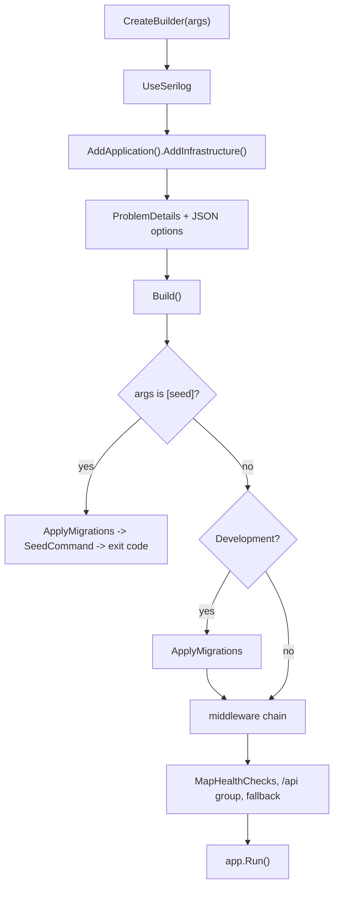

# src/TutoringCentre.Api/Program.cs

## Purpose

Application entry point and composition root: configures logging and services, runs the `seed` CLI mode or builds the HTTP pipeline, and starts the web host.

## Where It Fits

Api root. Calls `AddApplication`, `AddInfrastructure`, `AddApiProblemDetails`, `ApplyMigrationsAsync`, `SeedCommand.RunAsync`, `CorrelationIdMiddleware`, `MapPlatformEndpoints`, `ResultHttpExtensions.ToProblemResult`. Hosted in tests by `WebApplicationFactory<Program>`.

## Walkthrough

In execution order (line numbers):
- 16 `WebApplication.CreateBuilder(args)` - configuration + DI container + host builder.
- 18-28 `UseSerilog(...)`: `ReadFrom.Configuration`, `ReadFrom.Services`, `Enrich.FromLogContext`, `Destructure.With<SensitiveDataDestructuringPolicy>`, console `RenderedCompactJsonFormatter`; `preserveStaticLogger: true` (comment: concurrent test hosts would otherwise overwrite the global logger).
- 30-32 `AddHealthChecks()`, `AddApplication().AddInfrastructure(builder.Configuration)`, `AddApiProblemDetails()`.
- 34-39 JSON: `UnmappedMemberHandling.Disallow` (unknown field -> request.malformed), camelCase string enums.
- 43 `RouteHandlerOptions.ThrowOnBadRequest = true` (otherwise outside Development a bad body gives an empty 400).
- 45 `Build()`.
- 48-52 CLI: `if (args is ["seed"])` -> `ApplyMigrationsAsync()` then `return await SeedCommand.RunAsync(app.Services)`; the web host never starts.
- 56-59 Development only: auto-migrate (comment: never at production startup).
- 61 `CorrelationIdMiddleware`; 64-69 `UseSerilogRequestLogging` with level function (exception or >=500 -> Error; `/health` -> Verbose; else Information); 71 `UseExceptionHandler()`; 72 `UseStatusCodePages()`.
- 74-82 health endpoints: `/health` predicate `_ => false` (liveness), `/health/ready` tag `ready`.
- 84-85 `/api` group + `MapPlatformEndpoints()`; 88-89 fallback `/api/{**path}` -> `route.not_found`, `ExcludeFromDescription()`.
- 91 `app.Run()` (hosted services start; options validation runs); 94 `public partial class Program;`.
Edge cases: environment determines migrations; empty connection string fails startup; the `seed` branch returns an `int` exit code, which is why top-level statements `return` values.

## Concepts Used

### Dependency Injection (DI) and the container

#### What it means

A class that needs a collaborator can create it itself (`new X()`), which hard-wires the choice, or it can *receive* it, usually as a constructor parameter. That second approach is dependency injection. A DI *container* stores *registrations* ("when asked for type A, build type B with lifetime L") and performs *resolution*: it picks a constructor, resolves each parameter recursively, builds the object and caches it according to the lifetime. This is inversion of control: the class no longer decides what it depends on.

(Full tutorial with execution traces: [PROJECT_OVERVIEW.md#62-dependency-injection-lifetimes-and-scanning](../../../PROJECT_OVERVIEW.md#62-dependency-injection-lifetimes-and-scanning).)

#### Where it appears in this file

Composition root.

#### How it works here

Lines 30-32.

#### Why it matters here

Only place that sees all layers.

### Middleware and the request pipeline

#### What it means

Middleware components form a chain; each receives the request, may act before calling `next`, and may act again after it returns. Order is behaviour: a component only sees what earlier components set up and only wraps what comes after it.

(Full tutorial with execution traces: [PROJECT_OVERVIEW.md#8-routing-and-middleware](../../../PROJECT_OVERVIEW.md#8-routing-and-middleware).)

#### Where it appears in this file

Pipeline order.

#### How it works here

Lines 61-72.

#### Why it matters here

Correlation first, exception handler inside request logging.

### Minimal APIs, routing and route groups

#### What it means

Minimal APIs map a URL pattern and HTTP verb straight to a delegate (`MapGet("/x", handler)`). The framework binds delegate parameters from DI (services), the route, query, body or `CancellationToken`. A *route group* shares a prefix and metadata across endpoints.

(Full tutorial with execution traces: [PROJECT_OVERVIEW.md#612-http-problem-details-and-error-handling](../../../PROJECT_OVERVIEW.md#612-http-problem-details-and-error-handling).)

#### Where it appears in this file

Endpoints and groups.

#### How it works here

Lines 74-89.

#### Why it matters here

Routes without controllers.

### Structured logging, Serilog and correlation IDs

#### What it means

Structured logging records a message *template* plus named properties, so logs are queryable by field. A *correlation ID* is attached to every log line and response of one request so they can be matched. *Destructuring* lets Serilog log an object's properties; a policy can mask sensitive ones.

(Full tutorial with execution traces: [PROJECT_OVERVIEW.md#613-structured-logging-correlation-ids-and-redaction](../../../PROJECT_OVERVIEW.md#613-structured-logging-correlation-ids-and-redaction).)

#### Where it appears in this file

Serilog setup.

#### How it works here

Lines 18-28, 64-69.

#### Why it matters here

JSON logs, request line, correlation property.

### Health checks: liveness vs readiness

#### What it means

*Liveness* answers "is the process alive?"; *readiness* answers "can it serve traffic (dependencies up)?". Orchestrators restart on liveness failure and stop routing on readiness failure, so the two must not be conflated.

(Full tutorial with execution traces: [PROJECT_OVERVIEW.md#614-options-validation-and-health-checks](../../../PROJECT_OVERVIEW.md#614-options-validation-and-health-checks).)

#### Where it appears in this file

Two health endpoints.

#### How it works here

Lines 74-82.

#### Why it matters here

Liveness vs readiness.

### Options pattern and ValidateOnStart

#### What it means

The options pattern binds configuration into a typed class and can validate it. `ValidateOnStart` runs that validation when the host starts, so a bad configuration stops the app immediately instead of failing on first use.

(Full tutorial with execution traces: [PROJECT_OVERVIEW.md#614-options-validation-and-health-checks](../../../PROJECT_OVERVIEW.md#614-options-validation-and-health-checks).)

#### Where it appears in this file

`ThrowOnBadRequest`, JSON options.

#### How it works here

Lines 34-43.

#### Why it matters here

Uniform malformed-request behaviour.

## Data and Control Flow

## Configuration and Environment

Reads configuration keys `ConnectionStrings:Postgres` (via Infrastructure) and the `Serilog` section; environment name (`ASPNETCORE_ENVIRONMENT`, from `launchSettings.json` in dev); command-line arg `seed`; URL from launch profile (port 5080).

## Gotchas and Issues

Comments cite 'Month 2' and 'discrepancy D10' from an external plan. No auth, CORS, HTTPS redirection or static files. `app.Run()` blocks; any code after it never runs (only `return 0`).

## Related Files

- [`src/TutoringCentre.Api/Endpoints/PlatformEndpoints.cs`](Endpoints/PlatformEndpoints.cs.md)
- [`src/TutoringCentre.Api/Http/CorrelationIdMiddleware.cs`](Http/CorrelationIdMiddleware.cs.md)
- [`src/TutoringCentre.Api/Http/ProblemDetailsSetup.cs`](Http/ProblemDetailsSetup.cs.md)
- [`src/TutoringCentre.Api/Cli/SeedCommand.cs`](Cli/SeedCommand.cs.md)
- [`src/TutoringCentre.Application/DependencyInjection.cs`](../TutoringCentre.Application/DependencyInjection.cs.md)
- [`src/TutoringCentre.Infrastructure/DependencyInjection.cs`](../TutoringCentre.Infrastructure/DependencyInjection.cs.md)
- [`src/TutoringCentre.Api/appsettings.json`](appsettings.json.md)
