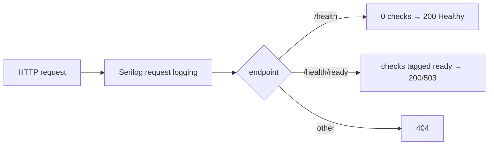

# src/TutoringCentre.Api/Program.cs

## Purpose
The backend entry point and **composition root**. It configures Serilog, registers the health checks and the Application and Infrastructure layers, adds per-request logging, maps the liveness and readiness endpoints, and runs the web host.

## Where it fits
Api layer. It calls `AddApplication()` (`Application/DependencyInjection.cs`) and `AddInfrastructure(...)` (`Infrastructure/DependencyInjection.cs`). Hosted in-process by `tests/TutoringCentre.Api.Tests/Health/HealthEndpointTests.cs` through `WebApplicationFactory<Program>`. The frontend's status page calls `/health/ready` via the Vite proxy.

## Walkthrough
- **Lines 1–6:** usings, including `TutoringCentre.Infrastructure`. This is the only place the Api touches Infrastructure.
- **Line 8:** `WebApplication.CreateBuilder(args)` loads configuration (appsettings, environment overrides, user-secrets in Development, env vars, command line).
- **Lines 10–13, Serilog:**
  - `ReadFrom.Configuration(context.Configuration)` uses the `Serilog` section of `appsettings.json`.
  - `Enrich.FromLogContext()`.
  - `WriteTo.Console(new RenderedCompactJsonFormatter())` writes one JSON object per log event.
- **Line 15:** `AddHealthChecks()`.
- **Line 16:** `AddApplication().AddInfrastructure(builder.Configuration)`.
- **Line 18:** `Build()`.
- **Lines 21–26, `UseSerilogRequestLogging`:** one summary line per request. `GetLevel` returns:
  - **Error** if there was an exception or status ≥ 500;
  - otherwise **Verbose** for paths starting with `/health` (below the Information minimum, so dropped; the comment says probes are noise);
  - otherwise **Information**.
- **Lines 28–31:** `/health` with `Predicate = _ => false` runs no checks, so it's always 200 "Healthy" while the process runs.
- **Lines 33–36:** `/health/ready` with `Predicate = c => c.Tags.Contains("ready")` runs the `postgres` check and returns 200 or 503.
- **Line 38:** `app.Run()`.
- **Line 40:** `public partial class Program;`. Top-level statements generate an `internal` `Program`; this makes it public for `WebApplicationFactory<Program>`.

## Concepts used
- **Minimal hosting model** (top-level statements, `WebApplication`).
- **Composition root.**
- **Middleware pipeline** (request logging, endpoint routing).
- **Health checks, liveness vs readiness.**
- **Structured JSON logging.**

## Data and control flow

## Configuration and environment
| Key | Use |
| --- | --- |
| `Serilog:MinimumLevel` | log levels |
| `ConnectionStrings:Postgres` | read by `AddInfrastructure` |
| `ASPNETCORE_ENVIRONMENT` | from launchSettings; enables user-secrets in Development |

## Gotchas and issues
- **No global exception handler and no Problem Details yet** (Day 11). An unhandled exception gets the framework default: the developer exception page in Development, an empty 500 otherwise. That is standard ASP.NET Core behaviour.
- **No middleware beyond logging.** There is no static-file serving (ADR 0002's same-origin plan), authentication, HTTPS redirection or OpenAPI.
- **No Serilog bootstrap logger.** Errors during host build before `UseSerilog` takes effect aren't captured in JSON.
- **Inert `Logging` section.** The `Logging` section of `appsettings*.json` is ignored once Serilog replaces the providers.
- Nothing enforces "endpoints must not use Infrastructure types". The architecture tests have no rule for the Api (acknowledged in the old `src/.semantic.md:60`).

## Related files
- [Infrastructure DependencyInjection.cs](../TutoringCentre.Infrastructure/DependencyInjection.cs.md)
- [Application DependencyInjection.cs](../TutoringCentre.Application/DependencyInjection.cs.md)
- [appsettings.json](appsettings.json.md)
- [launchSettings.json](Properties/launchSettings.json.md)
- [HealthEndpointTests.cs](../../tests/TutoringCentre.Api.Tests/Health/HealthEndpointTests.cs.md)
- [features/status/api.ts](../../frontend/src/features/status/api.ts.md)
