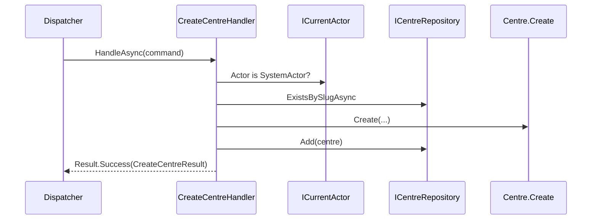

# src/TutoringCentre.Application/Centres/Commands/CreateCentre/CreateCentreHandler.cs

## Purpose

The use case 'create a centre': authorise, check uniqueness, let the domain validate and build the entity, then track it.

## Where It Fits

Application/Centres/Commands/CreateCentre, `internal`. Resolved by `Dispatcher`; depends on `ICurrentActor`, `ICentreRepository`, `Centre.Create`, `Error`, `Result`.

## Walkthrough

Primary-constructor injection (9-10). `HandleAsync` (12-41):
1. **Authorize** (17): `currentActor.Actor is not SystemActor` -> `Error.Forbidden("centre.create_forbidden", ...)`. Runs before any database read.
2. **Uniqueness** (24): `await centres.ExistsBySlugAsync(...)` -> `Error.Conflict("centre.slug_taken", ...)`. Comment: the unique index is the real guarantee under concurrency.
3. **Domain** (31): `Centre.Create(...)`; on failure return its error unchanged (34).
4. **Track** (38): `centres.Add(created.Value)` - no SaveChanges (dispatcher does it).
5. Return `CreateCentreResult(Id, Slug)` (40).
What changes if reordered: moving step 2 before step 1 would leak 'slug exists' to unauthorised callers; calling SaveChanges inside would defeat the single-save rule.

## Concepts Used

### CQRS and the dispatcher pipeline

#### What it means

CQRS separates *commands* (intent to change state) from *queries* (read-only questions). A *handler* executes exactly one command or query. A *dispatcher* is the single entry point that finds the handler and wraps shared steps (validation, transaction, logging) around it, so every use case behaves the same way regardless of who calls it (web endpoint, CLI, future bot).

(Full tutorial with execution traces: [PROJECT_OVERVIEW.md#63-cqrs-and-the-hand-written-dispatcher](../../../../../../PROJECT_OVERVIEW.md#63-cqrs-and-the-hand-written-dispatcher).)

#### Where it appears in this file

Handler.

#### How it works here

Class declaration.

#### Why it matters here

One class = one use case.

### Dependency Injection (DI) and the container

#### What it means

A class that needs a collaborator can create it itself (`new X()`), which hard-wires the choice, or it can *receive* it, usually as a constructor parameter. That second approach is dependency injection. A DI *container* stores *registrations* ("when asked for type A, build type B with lifetime L") and performs *resolution*: it picks a constructor, resolves each parameter recursively, builds the object and caches it according to the lifetime. This is inversion of control: the class no longer decides what it depends on.

(Full tutorial with execution traces: [PROJECT_OVERVIEW.md#62-dependency-injection-lifetimes-and-scanning](../../../../../../PROJECT_OVERVIEW.md#62-dependency-injection-lifetimes-and-scanning).)

#### Where it appears in this file

Constructor injection of `ICurrentActor`, `ICentreRepository`.

#### How it works here

Primary constructor parameters.

#### Why it matters here

Container supplies adapters; tests supply fakes.

### Actor and tenancy groundwork

#### What it means

An *actor* is who executes a use case; a *tenant* is one customer's isolated data slice (here a Centre). The actor is supplied by trusted edge code, never by request data.

(Full tutorial with execution traces: [PROJECT_OVERVIEW.md#611-the-actor-model-and-the-tenancy-groundwork](../../../../../../PROJECT_OVERVIEW.md#611-the-actor-model-and-the-tenancy-groundwork).)

#### Where it appears in this file

Authorization check.

#### How it works here

Line 17.

#### Why it matters here

Only the platform can create tenants.

### Concurrency, TOCTOU and unique indexes

#### What it means

TOCTOU (time of check to time of use): code checks a condition then acts, but another request can change the condition in between. Only the database can make "no two rows share a slug" true, via a unique index; application checks just produce friendlier errors in the common case.

(Full tutorial with execution traces: [PROJECT_OVERVIEW.md#610-concurrency-the-slug-race-and-why-the-unique-index-is-the-real-guarantee](../../../../../../PROJECT_OVERVIEW.md#610-concurrency-the-slug-race-and-why-the-unique-index-is-the-real-guarantee).)

#### Where it appears in this file

Existence check + unique index.

#### How it works here

Lines 23-28.

#### Why it matters here

Friendly error in the common case; DB guarantees the rest.

### The Result pattern (failures as values)

#### What it means

Expected business failures (invalid input, duplicate, not allowed) are returned as ordinary values - a `Result` holding either a value or an `Error` - instead of thrown. Exceptions are reserved for bugs and infrastructure faults. The caller's code must look at the result, so the failure path cannot be forgotten, and no exception-handling cost or hidden control flow is involved.

(Full tutorial with execution traces: [PROJECT_OVERVIEW.md#64-the-result-pattern-failures-as-values](../../../../../../PROJECT_OVERVIEW.md#64-the-result-pattern-failures-as-values).)

#### Where it appears in this file

Result-returning flow.

#### How it works here

All returns.

#### Why it matters here

No exceptions for business outcomes.

## Data and Control Flow

## Configuration and Environment

None. The file reads no environment variables and declares no configuration keys, URLs, ports or credentials.

## Gotchas and Issues

If two requests race, the loser reaches `SaveChanges` and gets a unique-violation exception, not `centre.slug_taken` (planned translation to 409). Comment references 'Day 10' plan.

## Related Files

- [`src/TutoringCentre.Application/Centres/ICentreRepository.cs`](../../ICentreRepository.cs.md)
- [`src/TutoringCentre.Domain/Centres/Centre.cs`](../../../../TutoringCentre.Domain/Centres/Centre.cs.md)
- [`src/TutoringCentre.Application/Common/Security/CurrentActorContext.cs`](../../../Common/Security/CurrentActorContext.cs.md)
- [`tests/TutoringCentre.Application.Tests/Centres/CreateCentreHandlerTests.cs`](../../../../../tests/TutoringCentre.Application.Tests/Centres/CreateCentreHandlerTests.cs.md)
- [`tests/TutoringCentre.Infrastructure.Tests/Centres/CentreSlugRaceTests.cs`](../../../../../tests/TutoringCentre.Infrastructure.Tests/Centres/CentreSlugRaceTests.cs.md)
