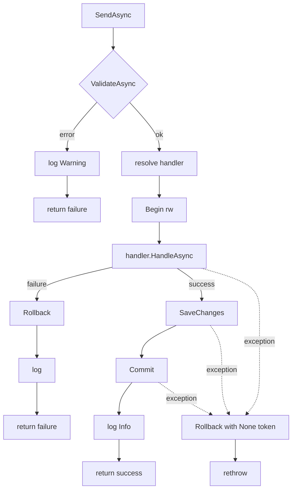

# src/TutoringCentre.Application/Common/Cqrs/Dispatcher.cs

## Purpose
The single entry point for every use case (line 12). It runs two pipelines:
- **commands:** validate → begin read-write transaction → handler → save once → commit; failures and exceptions roll back;
- **queries:** validate → begin read-only transaction → handler → commit; never saves.

It also writes one structured log line per dispatch. This is the project's "hand-written CQRS pipeline" (README line 5), a home-grown alternative to MediatR.

## Where it fits
Application layer, the core orchestrator.
- **Depends on:** `IServiceProvider` (to resolve handlers and validators), `IUnitOfWork` (port implemented by `Infrastructure/Persistence/UnitOfWork.cs`), `ILogger<Dispatcher>`, FluentValidation, `Result`/`Error`.
- **Registered:** scoped, by `Application/DependencyInjection.cs:19`.
- **Callers:** no production code yet. Future Api endpoints, the WhatsApp adapter and job runners will call it. `DispatcherTests.cs` tests it.
- **Spec:** `docs/architecture/overview.md:25-48`, `docs/notes/pipeline-cases.md`.

## Walkthrough
- **Lines 15–16:** constants `"Command"`/`"Query"` for the log's `RequestKind`.
- **Lines 18–30:** the constructor null-guards and stores the three dependencies. The injected `IServiceProvider` is the *scope's* provider, because the Dispatcher itself is scoped. Resolved handlers therefore share the scope's DbContext and actor.
- **Lines 33–74, `SendAsync<TCommand,TResponse>(command, ct) where TCommand : ICommand<TResponse>`:**
  1. **Line 36:** null guard. **Line 37:** `Stopwatch.GetTimestamp()`.
  2. **Lines 39–45:** `ValidateAsync`. On failure it wraps the error in `Result<TResponse>.Failure`, logs it and returns. No transaction is started (case C2).
  3. **Line 47:** `GetRequiredService<ICommandHandler<TCommand,TResponse>>()`. It throws `InvalidOperationException` if no handler is registered, before any transaction.
  4. **Lines 49–51:** placeholder comment for the Month-2 tenant and permission steps (`Forbidden(tenant.not_selected)`).
  5. **Line 52:** `BeginAsync(readOnly: false, ct)`.
  6. **Lines 53–67:** calls the handler.
     - On `IsFailure`: `RollbackAsync(ct)`, log, return (C3).
     - Otherwise: `SaveChangesAsync`, then `CommitAsync`, log, return (C1).
  7. **Lines 68–73:** a bare `catch` around steps 6+ covers handler, save and commit exceptions. It calls `RollbackAsync(CancellationToken.None)`, so rollback still runs when the request was cancelled, then `throw;`, which preserves the stack trace (C4, C5). It does **not** log; the comment defers that to the Day-11 global handler.
- **Lines 77–107, `QueryAsync<TQuery,TResponse>`:** same shape, with these differences:
  - `BeginAsync(readOnly: true)`;
  - `CommitAsync` after the handler regardless of whether the Result succeeded (line 98: "deliberately no save");
  - rollback and rethrow on exception (C6–C8).
- **Lines 109–138, `ValidateAsync<TRequest>`:**
  1. `GetServices<IValidator<TRequest>>()`. With none registered, the request is valid (returns null).
  2. One shared `ValidationContext<TRequest>`. Validators run **sequentially** and all failures are collected.
  3. Failures are grouped by `ToCamelCase(PropertyName)` (ordinal), each group's messages are deduplicated (ordinal), and the result is an ordinal-keyed `Dictionary<string,string[]>`.
  4. Returns `Error.Validation("validation.failed", "One or more fields are invalid.", fields)` (C9).
- **Lines 140–143, `ToCamelCase`:** splits on `.` and lowercases the first character of each segment (`"Address.Street"` → `"address.street"`). Empty segments are kept as-is.
- **Lines 145–152:** suppressions for CA1848 (use `LoggerMessage` delegates) and CA1873 (expensive logging), with justifications: there is a single call site, and the arguments are cheap.
- **Lines 153–169, `LogOutcome`:**
  - Elapsed ms comes from `Stopwatch.GetElapsedTime`.
  - `Outcome` is Success or Failure; `ErrorCode` is the code or `"none"`.
  - Level is Information on success and Warning on failure.
  - Template: `"{RequestKind} {RequestType} completed with {Outcome} ({ErrorCode}) in {ElapsedMs} ms"`.
  - The request object is **never** logged, which keeps PII out of logs.

## Concepts used
- **Mediator / pipeline pattern:** one object routes requests to handlers and applies cross-cutting steps.
- **CQRS:** separate command and query paths with different transaction semantics.
- **Service locator (scoped):** handlers and validators are resolved by generic type at dispatch time. That is acceptable here because the Dispatcher is the composition seam.
- **Unit of Work port:** the transaction is controlled without referencing EF Core.
- **async/await with cancellation**, plus the "rollback with `CancellationToken.None`" idiom.
- **Structured logging:** named placeholders, not interpolation.
- **Generic constraints:** `where TCommand : ICommand<TResponse>` ties a request to its response type.

## Data and control flow

## Configuration and environment
None directly. Log levels come from the Serilog configuration in the Api.

## Gotchas and issues
- **Exception masking.** If `RollbackAsync` in a `catch` block throws (e.g. the connection died), that new exception replaces the original one. Consider `try { await Rollback } catch (Exception rollbackEx) { log; }` before `throw;`.
- **Generic arguments can't be inferred.** Callers must write `SendAsync<TCommand,TResponse>(...)` because C# doesn't infer `TResponse` from a constraint. That makes call sites verbose.
- **Failures inside the transaction aren't logged.** Exceptions are not logged here. Until the Day-11 global handler exists, an exception in a command is only visible in Serilog's request log (status 500).
- **Query failures commit.** A failure Result from a query handler is still committed (harmless for a read-only transaction, but unlike commands).
- **Validator errors don't roll back.** If a validator itself throws, no transaction exists yet, so the exception simply propagates. That is correct.
- **No duplicate-handler check.** If two handlers are registered for one request type, `GetRequiredService` returns the last registration silently.

## Related files
- [ICommand.cs](ICommand.cs.md)
- [ICommandHandler.cs](ICommandHandler.cs.md)
- [IQueryHandler.cs](IQueryHandler.cs.md)
- [HandlerRegistration.cs](HandlerRegistration.cs.md)
- [IUnitOfWork.cs](../Ports/IUnitOfWork.cs.md)
- [UnitOfWork.cs](../../../TutoringCentre.Infrastructure/Persistence/UnitOfWork.cs.md)
- [DispatcherTests.cs](../../../../tests/TutoringCentre.Application.Tests/Cqrs/DispatcherTests.cs.md)
- [overview.md](../../../../docs/architecture/overview.md.md)
