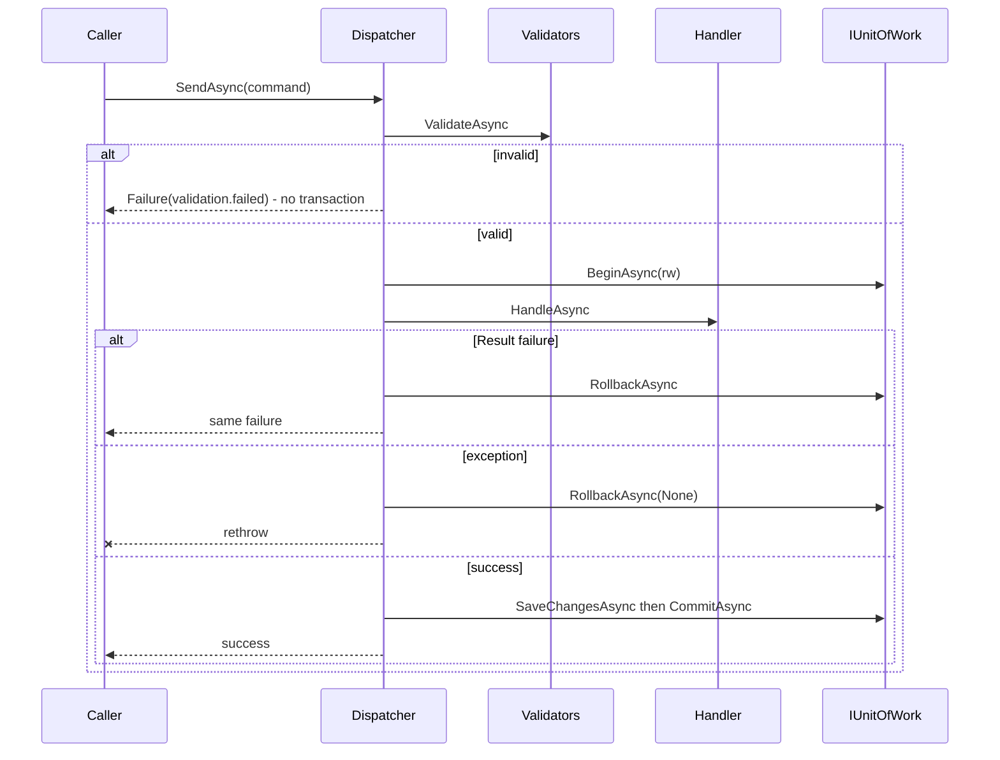

# src/TutoringCentre.Application/Common/Cqrs/Dispatcher.cs

## Purpose

The single entry point for every use case: validates, opens the right kind of transaction, runs the handler, saves once, commits or rolls back, and logs one outcome line.

## Where It Fits

Application/Common/Cqrs, `public sealed`, scoped. Called by `PlatformEndpoints.GetSystemInfoAsync`, `SeedCommand`, test helpers. Depends on `IServiceProvider`, `IUnitOfWork`, `ILogger<Dispatcher>`, FluentValidation `IValidator<>`, `Result`/`Error`.

## Walkthrough

- Constructor (22-30): null-guards services, unit of work, logger.
- **`SendAsync<TCommand,TResponse>`** (33-74): start stopwatch; `ValidateAsync` - failure returns `Result.Failure(validationError)` **before** anything else (no handler resolved, no transaction); `GetRequiredService<ICommandHandler<...>>()` (47); comment marks where Month-2 tenant/permission steps will go; `BeginAsync(readOnly:false)` (52); `try`: `handler.HandleAsync`; if `IsFailure` -> `RollbackAsync` and return the *same* result (58); else `SaveChangesAsync` (63) then `CommitAsync` (64); `catch` -> `RollbackAsync(CancellationToken.None)` (71) and `throw;` (rethrow preserving stack).
- **`QueryAsync<TQuery,TResponse>`** (77-107): same validation; `BeginAsync(readOnly:true)` (94); handler; `CommitAsync` only (98, 'there is deliberately no save'); catch -> rollback + rethrow.
- **`ValidateAsync<TRequest>`** (109-139): `_services.GetServices<IValidator<TRequest>>().ToArray()` (111) - zero or more validators; if none, returns null (valid). Creates one `ValidationContext<TRequest>`, runs each validator, concatenates `ValidationFailure`s. Groups by camel-cased property path, `Distinct` messages, builds `Error.Validation("validation.failed", "One or more fields are invalid.", fields)`.
- **`ToCamelCase`** (141): `"Slug"` -> `"slug"`, `"Address.Street"` -> `"address.street"`.
- **`LogOutcome`** (153-): one structured log line `{RequestKind} {RequestType} completed with {Outcome} ({ErrorCode}) in {ElapsedMs} ms`; `Information` for success, `Warning` for failure; **the request object is never logged**.
Edge cases: exceptions thrown by `CommitAsync` are also caught -> rollback no-op -> rethrow. A missing handler registration throws before any transaction exists. Nested dispatch from a handler fails in `UnitOfWork.BeginAsync` ('Nested units of work are not supported').

## Concepts Used

### CQRS and the dispatcher pipeline

#### What it means

CQRS separates *commands* (intent to change state) from *queries* (read-only questions). A *handler* executes exactly one command or query. A *dispatcher* is the single entry point that finds the handler and wraps shared steps (validation, transaction, logging) around it, so every use case behaves the same way regardless of who calls it (web endpoint, CLI, future bot).

(Full tutorial with execution traces: [PROJECT_OVERVIEW.md#63-cqrs-and-the-hand-written-dispatcher](../../../../../PROJECT_OVERVIEW.md#63-cqrs-and-the-hand-written-dispatcher).)

#### Where it appears in this file

Both pipelines.

#### How it works here

`SendAsync` and `QueryAsync`.

#### Why it matters here

One place guarantees validation + transaction + logging.

### Unit of Work and transactions

#### What it means

A *transaction* makes several database operations all-or-nothing and isolated from concurrent work. A *unit of work* groups the changes of one business operation and commits them together. EF Core's `DbContext` already tracks changes and is a unit of work; the repository adds a small port so the dispatcher can control the transaction without referencing EF.

(Full tutorial with execution traces: [PROJECT_OVERVIEW.md#67-unit-of-work-and-transactions](../../../../../PROJECT_OVERVIEW.md#67-unit-of-work-and-transactions).)

#### Where it appears in this file

`_unitOfWork` calls.

#### How it works here

Lines 52-71 and 94-104.

#### Why it matters here

Dispatcher decides when to begin/save/commit/rollback; the implementation hides EF.

### Two-tier validation

#### What it means

Validation asks whether input is acceptable. Cheap *shape* checks (required, length) can run first without touching business rules or the database; *business invariants* (slug format, time zone must exist) belong to the domain; *database constraints* are a last safety net against rows written by anything else.

(Full tutorial with execution traces: [PROJECT_OVERVIEW.md#65-validation-two-tiers](../../../../../PROJECT_OVERVIEW.md#65-validation-two-tiers).)

#### Where it appears in this file

`ValidateAsync`.

#### How it works here

Lines 109-139.

#### Why it matters here

Shape errors become a uniform `validation.failed` with per-field messages.

### The Result pattern (failures as values)

#### What it means

Expected business failures (invalid input, duplicate, not allowed) are returned as ordinary values - a `Result` holding either a value or an `Error` - instead of thrown. Exceptions are reserved for bugs and infrastructure faults. The caller's code must look at the result, so the failure path cannot be forgotten, and no exception-handling cost or hidden control flow is involved.

(Full tutorial with execution traces: [PROJECT_OVERVIEW.md#64-the-result-pattern-failures-as-values](../../../../../PROJECT_OVERVIEW.md#64-the-result-pattern-failures-as-values).)

#### Where it appears in this file

Returned `Result<TResponse>`.

#### How it works here

All return statements.

#### Why it matters here

Failures travel as values; exceptions are rethrown.

### Dependency Injection (DI) and the container

#### What it means

A class that needs a collaborator can create it itself (`new X()`), which hard-wires the choice, or it can *receive* it, usually as a constructor parameter. That second approach is dependency injection. A DI *container* stores *registrations* ("when asked for type A, build type B with lifetime L") and performs *resolution*: it picks a constructor, resolves each parameter recursively, builds the object and caches it according to the lifetime. This is inversion of control: the class no longer decides what it depends on.

(Full tutorial with execution traces: [PROJECT_OVERVIEW.md#62-dependency-injection-lifetimes-and-scanning](../../../../../PROJECT_OVERVIEW.md#62-dependency-injection-lifetimes-and-scanning).)

#### Where it appears in this file

Service-locator use of `IServiceProvider`.

#### How it works here

`_services.GetRequiredService` (47, 91) and `GetServices` (111).

#### Why it matters here

Handler types are generic and only known at call time; a contained use of the service-locator pattern.

### async/await and cancellation

#### What it means

`async`/`await` lets a method wait for I/O (database, network) without blocking a thread: the method returns a `Task`, and execution resumes after the awaited operation completes. A `CancellationToken` is a cooperative signal (for example, the HTTP request was aborted) passed down so work can stop early.

(Full tutorial with execution traces: [PROJECT_OVERVIEW.md#63-cqrs-and-the-hand-written-dispatcher](../../../../../PROJECT_OVERVIEW.md#63-cqrs-and-the-hand-written-dispatcher).)

#### Where it appears in this file

`CancellationToken.None` on rollback.

#### How it works here

Lines 71 and 104.

#### Why it matters here

Rollback must run even if the request was cancelled.

### Structured logging, Serilog and correlation IDs

#### What it means

Structured logging records a message *template* plus named properties, so logs are queryable by field. A *correlation ID* is attached to every log line and response of one request so they can be matched. *Destructuring* lets Serilog log an object's properties; a policy can mask sensitive ones.

(Full tutorial with execution traces: [PROJECT_OVERVIEW.md#613-structured-logging-correlation-ids-and-redaction](../../../../../PROJECT_OVERVIEW.md#613-structured-logging-correlation-ids-and-redaction).)

#### Where it appears in this file

`LogOutcome` with message template.

#### How it works here

Lines 153-170.

#### Why it matters here

Searchable structured line per use case without leaking request data.

## Data and Control Flow

## Configuration and Environment

None. The file reads no environment variables and declares no configuration keys, URLs, ports or credentials.

## Gotchas and Issues

Tenant/permission steps are comments only (not implemented). Two `[SuppressMessage]` attributes silence logger analyzers with written justifications. `ValidateAsync` runs validators sequentially and shares one `ValidationContext`.

## Related Files

- [`src/TutoringCentre.Application/Common/Cqrs/HandlerRegistration.cs`](HandlerRegistration.cs.md)
- [`src/TutoringCentre.Application/Common/Ports/IUnitOfWork.cs`](../Ports/IUnitOfWork.cs.md)
- [`src/TutoringCentre.Infrastructure/Persistence/UnitOfWork.cs`](../../../TutoringCentre.Infrastructure/Persistence/UnitOfWork.cs.md)
- [`tests/TutoringCentre.Application.Tests/Cqrs/DispatcherTests.cs`](../../../../tests/TutoringCentre.Application.Tests/Cqrs/DispatcherTests.cs.md)
- [`docs/notes/pipeline-cases.md`](../../../../docs/notes/pipeline-cases.md.md)
- [`docs/architecture/overview.md`](../../../../docs/architecture/overview.md.md)
- [`src/TutoringCentre.Api/Endpoints/PlatformEndpoints.cs`](../../../TutoringCentre.Api/Endpoints/PlatformEndpoints.cs.md)
