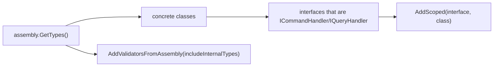

# src/TutoringCentre.Application/Common/Cqrs/HandlerRegistration.cs

## Purpose

Reflection scan that registers every command/query handler and validator in the Application assembly.

## Where It Fits

Application/Common/Cqrs, `internal static`. Called only by `AddApplication`. Depends on `ICommandHandler<,>`, `IQueryHandler<,>`, FluentValidation's `AddValidatorsFromAssembly`.

## Walkthrough

`AddCqrsHandlers(this IServiceCollection, Assembly)` (10-30):
- null guards; `assembly.GetTypes()` filtered to concrete classes (`IsClass`, not abstract, not generic definition) (13-17).
- For each type and each interface satisfying `IsHandlerInterface` (a generic type whose definition is `ICommandHandler<,>` or `IQueryHandler<,>`; lines 32-35), `services.AddScoped(handlerInterface, implementation)` (24). Comment: scoped to match the scoped DbContext and actor.
- `services.AddValidatorsFromAssembly(assembly, includeInternalTypes: true)` (28) - validators are `internal`, so the flag is needed.
Example result: `ICommandHandler<CreateCentreCommand, CreateCentreResult>` -> `CreateCentreHandler`; `IValidator<CreateCentreCommand>` -> `CreateCentreValidator`; `IQueryHandler<GetSystemInfoQuery, SystemInfoDto>` -> `GetSystemInfoHandler`.
What if wrong: a handler registered with a longer lifetime than its dependencies would be a captive dependency (scoped chosen to avoid this).

## Concepts Used

### Assembly scanning and reflection

#### What it means

*Reflection* lets code inspect types at runtime (`assembly.GetTypes()`, `type.GetInterfaces()`). *Assembly scanning* uses it to find classes implementing a given interface and register them automatically, so adding a new handler needs no registration line.

(Full tutorial with execution traces: [PROJECT_OVERVIEW2.md#62-dependency-injection-lifetimes-and-scanning](../../../../../PROJECT_OVERVIEW2.md#62-dependency-injection-lifetimes-and-scanning).)

#### Where it appears in this file

The scan loop.

#### How it works here

Lines 13-26.

#### Why it matters here

Open/closed: add a handler class, get a registration.

### Dependency Injection (DI) and the container

#### What it means

A class that needs a collaborator can create it itself (`new X()`), which hard-wires the choice, or it can *receive* it, usually as a constructor parameter. That second approach is dependency injection. A DI *container* stores *registrations* ("when asked for type A, build type B with lifetime L") and performs *resolution*: it picks a constructor, resolves each parameter recursively, builds the object and caches it according to the lifetime. This is inversion of control: the class no longer decides what it depends on.

(Full tutorial with execution traces: [PROJECT_OVERVIEW2.md#62-dependency-injection-lifetimes-and-scanning](../../../../../PROJECT_OVERVIEW2.md#62-dependency-injection-lifetimes-and-scanning).)

#### Where it appears in this file

`AddScoped(Type, Type)`.

#### How it works here

Line 24.

#### Why it matters here

Non-generic overload because both types are only known at runtime.

### Service lifetimes (singleton, scoped, transient)

#### What it means

Lifetime says how long a container-built instance lives. *Singleton*: one for the whole application. *Scoped*: one per scope; in ASP.NET one scope = one HTTP request, and code can create its own scope (as the seed command does). *Transient*: a new instance on every resolution. A longer-lived service must not hold a shorter-lived one (a "captive dependency"), which `ValidateScopes` detects.

(Full tutorial with execution traces: [PROJECT_OVERVIEW2.md#62-dependency-injection-lifetimes-and-scanning](../../../../../PROJECT_OVERVIEW2.md#62-dependency-injection-lifetimes-and-scanning).)

#### Where it appears in this file

Scoped handlers.

#### How it works here

Line 24 comment.

#### Why it matters here

Handlers get the request's `AppDbContext` and actor.

## Data and Control Flow

## Configuration and Environment

None. The file reads no environment variables and declares no configuration keys, URLs, ports or credentials.

## Gotchas and Issues

A class implementing the same closed interface twice (impossible) or two handlers for one command would silently override each other. Test-only handlers in other assemblies are not scanned; tests register them manually.

## Related Files

- [`src/TutoringCentre.Application/DependencyInjection.cs`](../../DependencyInjection.cs.md)
- [`src/TutoringCentre.Application/Common/Cqrs/ICommandHandler.cs`](ICommandHandler.cs.md)
- [`src/TutoringCentre.Application/Common/Cqrs/IQueryHandler.cs`](IQueryHandler.cs.md)
- [`src/TutoringCentre.Application/Centres/Commands/CreateCentre/CreateCentreValidator.cs`](../../Centres/Commands/CreateCentre/CreateCentreValidator.cs.md)
