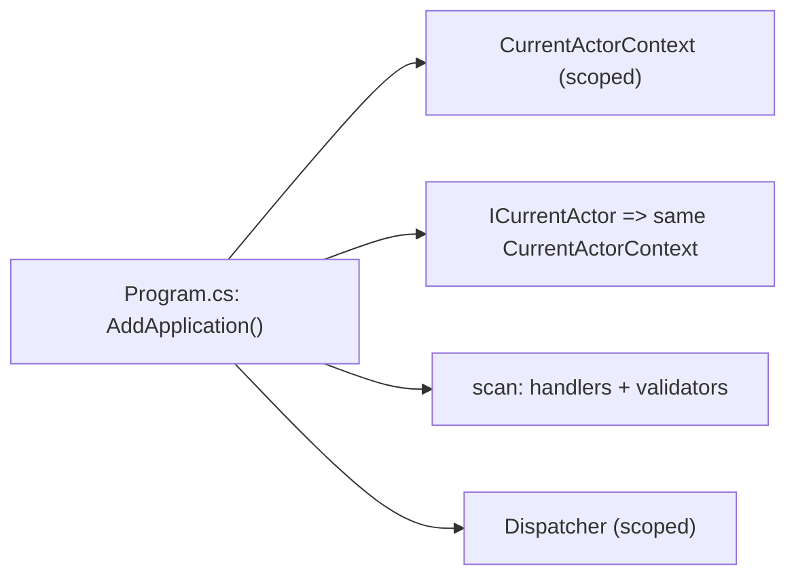

# src/TutoringCentre.Application/DependencyInjection.cs

## Purpose

The Application layer's registration entry point: `AddApplication`, called once from `Program.cs`.

## Where It Fits

Application root. Called by `src/TutoringCentre.Api/Program.cs:31` and `tests/.../PostgresFixture.CreateServiceProvider`. Depends on `CurrentActorContext`, `ICurrentActor`, `HandlerRegistration.AddCqrsHandlers`, `Dispatcher`.

## Walkthrough

`AddApplication(this IServiceCollection services)` (10-22):
1. `services.AddScoped<CurrentActorContext>()` (15).
2. `services.AddScoped<ICurrentActor>(provider => provider.GetRequiredService<CurrentActorContext>())` (16) - a *factory registration*: asking for `ICurrentActor` returns the **same** scoped `CurrentActorContext`. Edge code can `Set` the actor; handlers only see the read-only interface.
3. `services.AddCqrsHandlers(typeof(AssemblyMarker).Assembly)` (18) - reflection scan for handlers + validators.
4. `services.AddScoped<Dispatcher>()` (19) - concrete class, scoped.
Returns `services` for chaining (`AddApplication().AddInfrastructure(...)`).
If step 2 were `AddScoped<ICurrentActor, CurrentActorContext>()`, handlers would get a *different* instance than the one the edge code had `Set`, always anonymous.

## Concepts Used

### Dependency Injection (DI) and the container

#### What it means

A class that needs a collaborator can create it itself (`new X()`), which hard-wires the choice, or it can *receive* it, usually as a constructor parameter. That second approach is dependency injection. A DI *container* stores *registrations* ("when asked for type A, build type B with lifetime L") and performs *resolution*: it picks a constructor, resolves each parameter recursively, builds the object and caches it according to the lifetime. This is inversion of control: the class no longer decides what it depends on.

(Full tutorial with execution traces: [PROJECT_OVERVIEW.md#62-dependency-injection-lifetimes-and-scanning](../../../PROJECT_OVERVIEW.md#62-dependency-injection-lifetimes-and-scanning).)

#### Where it appears in this file

The four registrations.

#### How it works here

Lines 15-19.

#### Why it matters here

Defines what the container can build for the Application layer.

### Service lifetimes (singleton, scoped, transient)

#### What it means

Lifetime says how long a container-built instance lives. *Singleton*: one for the whole application. *Scoped*: one per scope; in ASP.NET one scope = one HTTP request, and code can create its own scope (as the seed command does). *Transient*: a new instance on every resolution. A longer-lived service must not hold a shorter-lived one (a "captive dependency"), which `ValidateScopes` detects.

(Full tutorial with execution traces: [PROJECT_OVERVIEW.md#62-dependency-injection-lifetimes-and-scanning](../../../PROJECT_OVERVIEW.md#62-dependency-injection-lifetimes-and-scanning).)

#### Where it appears in this file

All scoped.

#### How it works here

`AddScoped` x4 here plus scoped handlers from the scan.

#### Why it matters here

The actor and the shared scoped `AppDbContext` live and die with one request or job.

### Assembly scanning and reflection

#### What it means

*Reflection* lets code inspect types at runtime (`assembly.GetTypes()`, `type.GetInterfaces()`). *Assembly scanning* uses it to find classes implementing a given interface and register them automatically, so adding a new handler needs no registration line.

(Full tutorial with execution traces: [PROJECT_OVERVIEW.md#62-dependency-injection-lifetimes-and-scanning](../../../PROJECT_OVERVIEW.md#62-dependency-injection-lifetimes-and-scanning).)

#### Where it appears in this file

`AddCqrsHandlers` call.

#### How it works here

Line 18.

#### Why it matters here

No per-handler registration.

## Data and Control Flow

## Configuration and Environment

None. The file reads no environment variables and declares no configuration keys, URLs, ports or credentials.

## Gotchas and Issues

Handlers/validators are registered at `AddApplication` time by reflection; a handler class that is `abstract`, generic or does not implement a *closed* handler interface is skipped silently.

## Related Files

- [`src/TutoringCentre.Application/Common/Cqrs/HandlerRegistration.cs`](Common/Cqrs/HandlerRegistration.cs.md)
- [`src/TutoringCentre.Application/Common/Cqrs/Dispatcher.cs`](Common/Cqrs/Dispatcher.cs.md)
- [`src/TutoringCentre.Application/Common/Security/CurrentActorContext.cs`](Common/Security/CurrentActorContext.cs.md)
- [`src/TutoringCentre.Api/Program.cs`](../TutoringCentre.Api/Program.cs.md)
- [`src/TutoringCentre.Infrastructure/DependencyInjection.cs`](../TutoringCentre.Infrastructure/DependencyInjection.cs.md)
